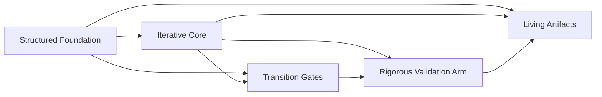

# The Need for a Hybrid Development Framework

## The Evolving Landscape of Product Development

Modern product development unfolds within a uniquely challenging context. The archetype of a “product” has expanded beyond discrete software releases or monolithic hardware increments into complex, integrated systems that fuse hardware, software, firmware, mechanical components, and networked functionality. These products are crafted by multidisciplinary teams working in an environment characterized by accelerating technological change, heightened regulatory scrutiny, escalating customer expectations, and globalized supply chains of unprecedented complexity.

Across the landscape, organizations must contend with a set of escalating pressures. Product complexity migrates ever upwards: what was formerly the domain of distinct engineering silos—mechanical, electrical, embedded software, cloud—now demands persistent cross-disciplinary collaboration. Hardware increasingly becomes software-defined, firmware is updated in field-programmable devices, and cloud-native services knit together pervasive connectivity, data, and control. Agile start-ups delivering direct-to-customer solutions, as well as established enterprises orchestrating regulated systems-of-systems, face relentless time-to-market and quality pressures. The imperative to continuously deliver business value, while managing systemic risk and regulatory obligations, is universal.

Significantly, these escalating demands are not dispersed evenly across the organization or product lifecycle. Instead, they manifest as tightly coupled, often conflicting constraints at every stage—from up-front architectural decisions and requirements traceability, through rapid iteration and continuous deployment, to system integration, security and safety validation, and product acceptance. Each discipline carries its own lead times, data models, processes, and technical debt, creating a highly entangled value stream. The result is a persistent tension between adaptability and discipline, velocity and robustness, local expediency and holistic coherence.

## Product Complexity and Multi-Disciplinary Integration

The defining characteristic of contemporary engineering programs is their multi-disciplinary character. The boundaries between hardware, firmware, software, and mechanical systems are increasingly porous, requiring both workflow integration (how work is planned, executed, and validated) and technical integration (interface definitions, data flows, requirement allocation) across domains. Emerging architectures such as cyber-physical systems, integrated IoT platforms, and connected medical devices exemplify this convergence. Each subsystem must deliver specific capabilities, but also interoperate seamlessly within the larger context.

Managing this complexity in practice means contending with heterogeneous toolchains, artifact repositories, and configuration management systems. Artifact lifecycle management—requirements, architecture, designs, test suites, compliance matrices, variant models—must support cross-domain traceability while accommodating discipline-specific rigor and workflows (e.g., ECAD/MCAD for hardware, source control and CI for software, PLM for overall product configuration). This complexity is compounded by the reality of hardware lead times, supply chain variability, and physical integration windows; a defect or change detected late in the lifecycle may ripple downstream, multiplying rework costs and delaying value delivery.

The impact on engineering teams is both technical and organizational. Coordination across domain boundaries is frequently undermined by incompatible nomenclatures, asynchronous planning cycles, and misaligned incentives. Integration defects and requirements mismatches can escape detection until late-stage integration or system V&V, creating cascading failures that threaten project budgets and undermine customer trust.

## Regulatory and Compliance Pressures

For many sectors—healthcare, automotive, aerospace, energy, industrial automation—adherence to regulatory and compliance standards is not merely a “best practice” but a market requirement. These standards (such as ISO 13485, ISO 26262, IEC 61508, DO-178C, FDA QSR, GDPR, among others) articulate explicit demands for requirements traceability, risk management, verification and validation, and evidence-driven documentation throughout the product lifecycle.

In this context, the cost of inadequate process rigor is high: noncompliance may result in failed audits, product recalls, reputational damage, or even loss of license to operate. Moreover, regulatory landscapes are dynamic; organizations may need to respond to evolving data privacy rules, cybersecurity mandates, or sector-specific guidance without halting product flow.

However, the traditional interpretation of these standards—often rooted in document-centric, heavily staged lifecycles—can threaten adaptability, stifle innovation, and erode delivery momentum. This tension between the need for traceable, auditable, and repeatable processes, and the desire to iterate and respond to change, is felt acutely across regulated industries.

## The Limitations of Waterfall and Traditional Models

Historically, the engineering response to complexity and risk has been to enforce up-front planning, staged reviews, and controlled, sequential handoffs—the so-called “waterfall” model. Its structured nature, typified by formal requirements capture, design phases, implementation, integration, verification, and acceptance, is rooted in the desire for predictability and systemic traceability. Artifacts produced at each phase are treated as stage-gates; only with formal acceptance does work progress to the next stage.

This paradigm offers certain strengths. Waterfall models force team alignment on early vision, foster comprehensive documentation, and provide a clear audit trail—critical for regulatory compliance. They support rigorous system-level architectures and requirements traceability, enabling disciplined management of risk and scope.

However, in the context of integrated, multidisciplinary, fast-paced product development, these same strengths become liabilities. Significant weaknesses emerge:

- Sequential processes struggle to absorb new information as requirements shift or technology evolves. Feedback from hardware prototypes or in-field software updates arrives too late to be actionable.
- Up-front artifact completeness assumptions are regularly violated by the realities of discovery-driven engineering. Attempting to “freeze” requirements or designs before substantial prototyping often results in costly, late-stage rework.
- Documentation, while vital, becomes stale and sclerotic without integrated mechanisms for evolution alongside implementation.
- Cross-domain dependencies and integration complexities mean that early, interdependent decisions may seldom reflect the lived reality at time of system integration.

Furthermore, the high cost of change built into waterfall models (late requirement changes necessitate expensive replanning and rework) tends to incentivize risk-averse behavior, local optimization, and “throw it over the wall” interactions between teams. This impairs the ability of organizations to course-correct in response to technical discoveries, market shifts, or regulatory evolution.

## The Shortcomings of Pure Agile in Integrated Systems

The advent of Agile—a response to the rigidity and “big batch” failings of traditional models—introduced a different set of principles: iterative delivery, empowered teams, fast feedback loops, and minimal working increments. Methods such as Scrum, Kanban, and XP have proven transformative for software-dominated contexts, enabling increased responsiveness, improved flow, and rapid customer feedback.

Yet, when applied to complex, multi-disciplinary product development, undiluted Agile models frequently underperform. Several mechanism-based limitations arise:

- **Granularity and Synchronization:** Agile is predicated on the ability to decompose value into incremental slices, delivering usable features in small batches. In systems where hardware, firmware, and software are deeply interdependent, boundaries between “potentially shippable increments” are blurred. Hardware prototypes may require long lead times; integration points are spaced weeks or months apart, not days. Rapid iteration at the software layer is constrained by the slower pace of physical components.
  
- **Traceability and Compliance:** Agile’s de-emphasis on formal documentation is ill-suited to regulated environments. Merely relying on “working software over comprehensive documentation” neglects the evidentiary requirements that underpin compliance and certification. Tracking requirement-to-test-to-code traceability (as mandated by many standards) is seldom a strength of base Agile approaches.
  
- **Architecture and System Evolution:** Many Agile methods champion emergent architecture—delaying major architectural decisions until the “last responsible moment”. In integrated engineering, the cost of late architectural change is high: interface definitions, component selections, or physical constraints often must be defined early to underpin all downstream development. Purely emergent design can devolve into fragmented architectures, technical debt, and brittle systems.

- **Cross-Functional Alignment:** Agile’s canonical practice is to organize teams around customer value streams, favoring autonomy and rapid delivery. In practice, however, full-stack cross-discipline teams are rare; hardware, firmware, and software specialists typically coordinate across team boundaries. Operating at scale, alignment, dependency management, and artifact integration require forms of governance beyond a sprint backlog or daily standup.

- **Risk Management:** Agile risk management tends to be incremental, embedded in iteration planning and review. Many system-level risks—cybersecurity exposure, regulatory noncompliance, safety—require explicit attention, longitudinal tracking, and formal review cycles. Purely Agile models lack mechanisms for risk-driven architectural or process adaptation.

The result is predictable: without supplementary practices, Agile-in-name-only initiatives devolve into “Scrumfall” (phased waterfall cloaked in Agile ceremonies) or fragile “feature factories” disconnected from system realities. Teams may deliver constant software increments while waiting for hardware or regulatory artifacts to catch up, or struggle to relate user stories to system requirements and architectural doctrine. Organizational cognitive load balloons as teams are forced to maintain bespoke mapping and traceability outside of core workflows.

## Diagram: Contrasting Traditional, Agile, and Integrated Product Reality

To illustrate the misalignment between pure waterfall, pure Agile, and the reality of integrated product development, the following conceptual diagram is presented:

```mermaid
flowchart TB
  A[Upfront Requirements & Design]
  B[Phased Development (Waterfall)]
  C[Iterative Agile Sprints]
  D[Hardware Constraints/Lead Times]
  E[Integrated Product Reality]
  F[System Integration & V&V]
  G[Compliance & Documentation]
  
  A -->|Waterfall Approach| B
  A -->|Agile Approach| C
  D --> E
  C --> E
  B --> E
  E --> F
  E --> G
```

Here, both waterfall and Agile approaches feed into the integrated reality, which must reconcile hardware constraints, system integration and V&V, and compliance/delivery needs.

## Escalating Customer Expectations and Business Pressures

Simultaneously, market dynamics have evolved. Customers expect continuous improvement and rapid feature delivery, often through over-the-air updates and service enhancements, even for products with significant hardware components. The boundaries between physical deliverable and digital service are increasingly fluid; software-defined products mean that user value evolves throughout the deployed lifecycle.

Business models must handle increasing solution complexity (e.g., hardware-as-a-service, field upgradeability, cloud orchestration) and heightened competition from digital-native entrants. High velocity and robust quality can no longer be considered trade-offs; both are prerequisites for survival and differentiation. The mismatch between business need for rapid, flexible delivery and traditional development cadences has spawned the “dual track” phenomena—simultaneous internal development of hardware and related software, governed in different ways but forced to integrate operationally and technically.

Practically, this means that, at any given time, teams must balance:

- The need for structured, up-front architectural and requirements discipline (to manage complexity and enable effective integration), and
- The necessity of rapid iteration and uncertainty reduction (to deliver value, learn, and adapt in real time).

This dynamic is particularly acute for organizations operating under investor scrutiny, tight margins, or strict compliance regimes. Failure to deliver sustained value and pace, while maintaining systemic robustness and evidence-based accountability, directly threatens business outcomes.

## The Imperative for a Hybrid Framework

In response, leading engineering organizations increasingly recognize the necessity of a hybrid framework—one that moves beyond the binary of “waterfall vs. Agile” to synthesize the strengths of both, while addressing their respective weaknesses. The essential requirements for such a model may be characterized as follows:

- **Operational Discipline Without Bureaucracy:** The framework must preserve the traceability, up-front rigor, and stakeholder alignment of traditional systems engineering, while shedding unnecessary ceremony, rigidity, and “analysis paralysis”.

- **Adaptive Iteration With Structural Integrity:** Iterative, feedback-driven development must occur within explicit architectural guardrails and domain interfaces. Early risk reduction and prototyping are incentivized, but without sacrificing system-level coherence.

- **Continuous Verification and Compliance Enablement:** Compliance and traceability are treated as first-class product artifacts, evolving in lockstep with design and implementation via versioned, living documentation—rather than as compliance “bolts-on” at the end.

- **Integrated Artifact and Dependency Management:** The full lifecycle of requirements, architecture, test, risk, and compliance artifacts is orchestrated as code—across hardware, software, and mechanical domains—via scalable, automated workflows.

- **Outcome-Driven Organizational Alignment:** Teams are empowered but interconnected, organized to sustain flow, minimize cognitive overload, and optimize for holistic value creation, not just local throughput.

These requirements find expression in regulatory guidance (such as FDA’s Case for Quality, ISO 15288 for systems lifecycle management, and IEC 62304 for medical device software), as well as in the emergent “best of breed” practices of digitally transformed organizations. However, effective operationalization necessitates a consciously architected, context-sensitive model—one that actively reconciles inherent tensions through transparent decision-making, lean governance, and a culture of continuous improvement.

## Conceptual Overview of Cornerstone

Cornerstone arises from this context as a philosophy and framework designed to meet the multidimensional demands of contemporary product engineering. It is not a deterministic process or a fixed set of tools, but a scalable, tailorable system for integrated product development—anchored in outcome orientation, architectural discipline, and adaptive, iterative delivery.

The core of Cornerstone, as established in preceding sections, is the fusion of:

- Upfront systems thinking—structured requirements capture, architectural definition, and proactively designed verification/validation strategies;
- Continuous, Agile-influenced iteration—regular increments of value delivery, rapid prototyping, and fast feedback loops, all informed by living artefacts and objective measurement;
- Systematic validation and compliance—integrated, version-controlled documentation and evidence, enabling ongoing traceability and audit readiness without impeding flow;
- Lightweight, intent-driven governance—transition points and cross-team dependencies managed through minimal, data-driven checkpoints, not rigid phase gates;
- People enablement—leadership driven by context, autonomy within architectural and organizational guardrails, and organizational learning linked to operational resilience and sustained innovation.

A key practical differentiator is Cornerstone’s support for “Docs-as-Code” artifact management: all essential deliverables—requirements, architecture, test protocols, risk matrices—are treated as living, version-controlled files, continuously integrated with both software and hardware artifacts, and accessible across the product lifecycle for both engineering and compliance consumption.

## Managing Core Tensions

In operationalizing this hybrid model, Cornerstone does not seek to eliminate all inherent tensions—between adaptability and discipline, autonomy and coherence, velocity and quality, compliance and flow—but rather to systematically reconcile them. This is accomplished through an emphasis on transparent architectural decision-making, minimally sufficient process, and continuous improvement cycles. Decision records (ADRs), version-controlled risk registers, and traceability matrices are maintained as lightweight, living documents, eliminating the distinction between “working artifact” and “compliance artifact.”

Cross-functional collaboration is enabled and expected at all lifecycle stages; integration “gates” are replaced with well-defined, context-dependent transition criteria that ensure readiness without impeding flow. Architectural guardrails are established up front, but are themselves subject to regular, evidence-driven review as learning emerges throughout prototyping and iterative cycles.

## Diagram: Cornerstone’s Hybrid Model in Context

The following diagram represents the integration of structured foundation, iterative development, and validation within the Cornerstone approach:



Here, the structured foundation anchors the project; iterative cycles drive evolution; rigorous validation ensures quality; lightweight transition gates coordinate flow; and all outputs are preserved as living artifacts.

## Practical Realities and Integration Points

From a practical engineering perspective, the adoption and deployment of a hybrid framework such as Cornerstone raises a range of considerations:

- **Artifact Interoperability:** Effective integration demands interoperable artifact management across ECAD/MCAD, requirements tools, source/version control, and PLM. APIs, data exchange protocols (e.g., ReqIF, XMI), and automated converters may be required to enable bidirectional traceability and reporting.

- **Team Structuring:** Organizational structures must minimize crossing boundaries that create friction and delay—stream-aligned and enabling/platform teams are preferred, with clearly defined roles for architecture, ownership, and delivery.

- **Lifecycle and Flow:** Transition points (such as architectural baselining, integrated prototype readiness, or regulatory reviews) are managed as lightweight governance events, focusing on evidence and readiness rather than formal “handovers” or sign-offs.

- **Change and Risk Management:** Features, requirements, tests, and risk mitigations are captured as living records; change is anticipated and managed, not avoided. Engineering teams are equipped to manage both fast-path learning (prototypes, spikes) and formal validation paths in parallel.

- **Compliance Automation:** Compliance artifacts are maintained incrementally (“shift-left” compliance), reducing the cost and risk of late-stage audit or rework. Automated documentation pipelines ensure consistency and evidence availability throughout.

- **Lead Time Accommodation:** Hardware and supply chain lead times are explicitly modeled and visualized in planning; design-for-iteration principles—modularization, prototyping, emulation—are employed to protect overall value flow from disruptions in any single stream.

## Conclusion and Reader Expectations

In summary, the myriad pressures and complexities of contemporary integrated product development reveal the inadequacies of both pure waterfall and pure Agile when applied at scale, especially in regulated, multidisciplinary contexts. The conditions of practice demand a consciously architected, hybrid framework capable of reconciling adaptation with discipline, speed with compliance, and autonomy with architectural integrity.

Cornerstone is introduced as such a framework—grounded in deep systems thinking, disciplined architectural practice, outcome-based adaptation, and sustained, cross-disciplinary flow—supported by living documentation and lightweight governance. The chapters that follow will explicate the philosophical and operational tenets of Cornerstone, articulate its lifecycle model, and offer practical guidance for its implementation and tailoring within diverse engineering environments.

As you proceed, expect to be challenged both in the technical and organizational dimensions, and to engage with a model that recognizes complexity as an enduring reality—one best addressed through integrated thinking, streamlined process, and a relentless focus on value.