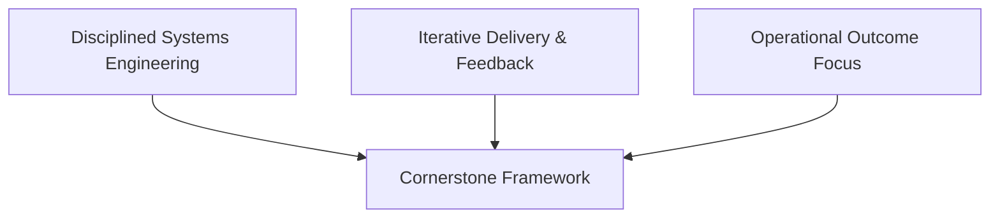
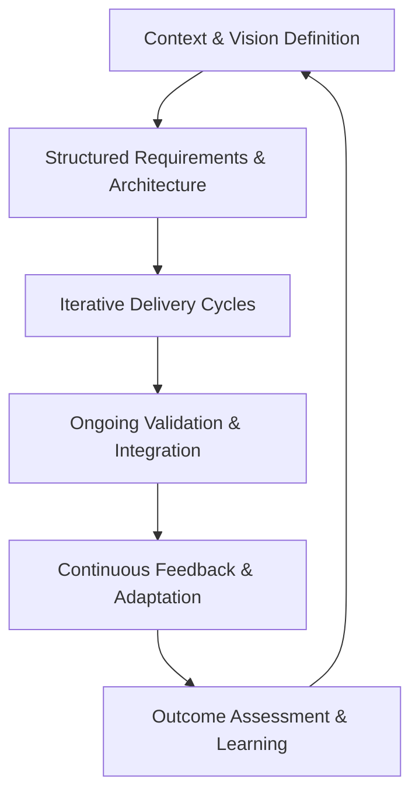

# The Rationale for a Hybrid Framework: Defining Cornerstone

## The Complexity of Modern Product Development

In the contemporary landscape, product development is rarely a matter of isolated software or discrete hardware. Instead, it is a continuous negotiation among rapidly evolving technologies, intersecting domains, and surging market and regulatory expectations. Organizations are called to deliver integrated products, where software, firmware, hardware, and often mechanical subsystems converge within a single, cohesive solution. The resulting environment is one of unprecedented complexity—a distinctive confluence of domain constraints, lifecycle mismatches, traceability mandates, and relentless pressure for both speed and quality.

Traditional development models, such as the Waterfall and V-model paradigms (as typified by IEEE 12207 and ISO/IEC/IEEE 15288), emphasize upfront discipline, traceability, and extensive verification. These methods excel in predictable, safety-critical, or highly regulated settings where failure is costly and requirements are known or at least stable. Their rigor provides excellence in managing change and risk—at the cost, however, of slow feedback, late integration, and a brittle response to emergent discovery. Conversely, modern Agile frameworks—Scrum, Kanban, XP, SAFe—prioritize ongoing collaboration, short feedback loops, and iterative value delivery. Agile methodologies are highly effective for rapidly evolving software products and dynamic, customer-centric solution spaces. But they can falter in multi-domain environments, where physical systems introduce nontrivial lead times, where changes cascade across interfaces, and where compliance demands formal evidencing at every step.

Increasingly, organizational success hinges on a capacity to synthesize these approaches—achieving a disciplined, yet inherently adaptive workflow that is not encumbered by the excesses of either extreme. This demands rethinking process architecture, role clarity, artifact management, and leadership itself. Cornerstone is conceived precisely in this context: neither a strict methodology nor a loose set of “best practices,” but a systematically engineered hybrid. Its role is to enable consistently high performance and resilience in teams tasked with building integrated, cross-discipline products under real-world constraints.

## Cornerstone: A Pragmatic Hybrid Definition

Cornerstone is defined as a delivery framework—a holistic system of philosophy, practices, and artifacts—that fuses the foundational rigor of traditional systems engineering with the adaptivity and speed of Agile and Lean disciplines. Its purpose is to orchestrate integrated product development in environments where simple mechanical transposition of established frameworks leads to friction, inefficiency, or outright failure. 

At its core, Cornerstone is not a prescriptive methodology, but a pragmatic, tailorable architecture for organizing work, defining and tracking requirements, managing risk, and driving to outcome in high-complexity domains. Its design is rooted in several organizing principles: context-driven leadership, modular and transparent architectural thinking, lightweight but consistent process discipline, iterative and adaptive value realization, and continuous traceability through living artifacts.

### The Pillars of the Hybrid Approach

Cornerstone’s hybrid identity emerges from deliberate reconciliation of the strengths and inherent limitations of both ends of the process spectrum. From classical systems engineering, it inherits robust domain modeling, traceability matrices, layered architectures (such as C4), and structured lifecycle models. From Agile and Lean, it borrows the engine of iterative delivery, rapid feedback, empowered and autonomous teams, and ongoing refinement of both products and methods.

This fusion is not implemented as a static compromise, but as a continuously tunable balance. For instance, rigorous requirements analysis and architecture definition provide a structured launch point, but they are not one-way gates. Instead, they become living artifacts, iteratively refined and tightly coupled with ongoing development activity. Similarly, ongoing sprints or kanban flows are not isolated islands of local optimization; they are bounded within an integrative systems context—anchored by clear interfaces, traceability, and risk management. In this way, Cornerstone builds “structural flexibility,” allowing teams to respond to emergent discoveries without sacrificing systemic coherence or regulatory evidencing.

## Conceptual Architecture of Cornerstone

At the architectural level, Cornerstone organizes product development as an integrated system of processes, artifacts, and feedback mechanisms. Conceptually, it can be visualized as the intersection of three foundational domains: disciplined systems engineering, iterative delivery, and operational outcome focus.

This triad underpins all practical Cornerstone implementations. Disciplined systems engineering supplies the foundation—structured requirements, architectural clarity, modularity, risk and interface management, and compliance scaffolding. Iterative delivery ensures a continuous flow of value, rapid integration, and the ability to learn and adapt. Operational outcome focus keeps product teams aligned to real customer and stakeholder needs, emphasizing value over volume, resilience over throughput, and organizational learning over process dogma.

### Living Artifacts and Traceability

A defining feature of Cornerstone is its treatment of artifacts: requirements, architectural decisions, risk registers, verification records, and design documentation cease to be static deliverables frozen at project milestones. Instead, these artifacts are managed as “living” entities—version-controlled, incrementally updated, and woven into the same continuous integration and review processes that govern source code. This Docs-as-Code philosophy ensures that knowledge, evidence, and intent are always synchronized with system reality, supporting traceability for both engineering and compliance without manual rework or wasteful bureaucracy.

This unified approach to artifact management closes critical gaps in traditional methodologies, where documentation often lags behind reality, and in typical Agile approaches, where documentation risks becoming ephemeral or insufficiently rigorous for regulated environments.

### Systemic Value Flow

Underlying Cornerstone is a relentless emphasis on value-stream alignment—both organizationally and technically. Teams are composed and oriented around whole value streams, not arbitrary functional silos. This ensures maximal cognitive and communication flow, manages handoff risk, and supports end-to-end ownership: from business intent, through system decomposition and integration, to final validation. Architecturally, modularity and decoupling are the rule, enabling parallelization of work without loss of systemic integrity.

Importantly, Cornerstone takes conscious account of constraints unique to integrated products: hardware-lead times, resource dependencies, multi-stage validation, and the necessity of staged or virtualized integration. Teams learn to distinguish between architectural coupling (interface contracts, shared risk) and temporal coupling (synchronized delivery cadences), and adapt both process and structure to support robust, cross-domain delivery.

## The Philosophical Foundations of Cornerstone

Cornerstone’s conceptual model is not simply an amalgam of known frameworks but is informed by deeper convictions—and engineered trade-offs—about how high-performance product organizations must operate.

### Lead with Context, Not Control

At the heart of Cornerstone is a leadership philosophy that recognizes the futility of attempting direct, micro-level control in complex, cross-functional environments. Instead, effective leaders define context—purpose, constraints, priorities, and intended outcomes—then act as enablers. This enables decentralized decision-making, accelerates flow, and preserves coherence without reliance on rigid, top-down enforcement. Psychological safety, autonomy, and blameless learning are not afterthoughts but strategic enablers of technical and organizational resilience.

### Architectural Thinking and Technical Discipline

Cornerstone emphasizes architectural discipline beyond surface-level modeling. It adopts architectural practices—modularity, simplicity, and explicit contracts—not as dogma but as active tools to control complexity, facilitate change, and maintain systemic integrity. Critical architectural decisions are documented as living records (e.g., Architectural Decision Records, or ADRs), enabling transparency and the capacity to trace change. Technical debt is managed as a first-class engineering concern, not merely deferred or ignored.

Crucially, architectural responsibility is not monopolized by a single role or team. Instead, it is distributed, with technical leaders facilitating, not dictating, system evolution. This ensures that architectural health is sustained in the sweep of iterative delivery, rather than periodically “reset” by isolated redesigns or corrective projects.

### Process Rigor Without Bureaucracy

Cornerstone deliberately seeks the minimum process needed for clarity and traceability. All process elements—whether requirements management, decision reviews, or compliance evidence—are integrated with normal workflows and managed as living artifacts. The intent is not to minimize process at the expense of control, but to eliminate wasteful bureaucracy and ensure consistency. The outcome is a lean but robust process backbone, adaptable to domain needs—regulated or not—without devolving into process theater.

### Teams as Systems: Organizing for Flow

Central to Cornerstone’s operational philosophy is an explicit view of teams as systems. The organization is structured to manage cognitive load and maximize communication effectiveness, aligning teams around value streams, architectural subsystems, or enabling services as needed. Conway’s Law—a key driver of system architecture—becomes not a passive constraint but an active design consideration in both team formation and technical decomposition. This supports both local autonomy and overall system coherence, minimizing the trade-off between speed and sustainability.

### Outcome Orientation and Continuous Learning

Finally, Cornerstone retains as a persistent thread an outcome-over-output focus. Product delivery is measured by realized value—customer success, business outcomes, regulatory fit, and system resilience—rather than simple volume of features or throughput. Integrated risk and technical debt management are embedded in standard work, not performed as periodic audits. Continuous improvement is institutionalized, with learning loops—both technical and organizational—explicitly valued and protected.

## Reconciling Tensions in Integrated Delivery

The reality of integrated product environments is a constant negotiation of competing forces. The need for rapid iteration must be reconciled with the long lead times inherent in hardware development. Drive for autonomy confronts the necessity of cross-team and cross-domain coherence, particularly where safety, security, or compliance demands formal evidence and system-level integration. Cost pressures and market opportunity pull against the discipline of technical debt management and validation rigor.

Cornerstone’s hybrid model confronts these tensions by employing lightweight, transparent governance and explicit decision mechanisms—increasing the proportion of energy spent on value creation, reducing the drag of friction at interfaces, and allowing for timely course correction. For instance, transition checkpoints (gates) are designed as readiness assessments, not rigid phase barriers; they permit flexible navigation of lifecycle stages without sacrificing oversight or traceability. Similarly, documentation and compliance activities are “shifted left” and automated where possible, compressing overall feedback cycles while maintaining necessary rigor.

## Expectations and Scope for Practitioners

For teams and organizations exploring Cornerstone, it is essential to understand both its ambitious scope and context-aware boundaries. The framework does not purport to replace existing bodies of knowledge—such as INCOSE SE Handbook, ISO 9001, or the Agile Manifesto—but rather offers a cohesive architecture for hybridization, focused on cross-discipline product development.

Cornerstone is equally applicable across a spectrum of scales and organizational types, from hyper-growth startups grappling with emergent hardware/software products, to established enterprises confronting regulatory, quality, and market pressures. Its principles are tuned for adaptability—allowing for lightweight, balanced, or heavyweight instantiations as demanded by business context, safety requirements, and the maturity of supporting systems.

Practically, practitioners will find that effective implementation relies on disciplined tailoring. A small, software-first product may lean more heavily on Agile cycles, gradually integrating more formal traceability and evidence as complexity or regulatory needs scale. A safety-critical mechatronics product may require rigorous requirements and verification management from inception, layering iterative delivery and adaptive learning without abandoning formal assurance. The hallmark is not blind adoption, but intentional integration—an engineering, not procedural, approach to framework design.

## Integration Points and Practical Realities

Cornerstone’s promise is realized through its integration points—where philosophical commitments translate into tangible workflow, artifact, and organizational practices.

Consider artifact management. Requirements, interface specifications, design documentation, and risk registers are unified through Docs-as-Code, versioned and reviewed alongside source and hardware definition files. This supports both practical traceability needs and the collaboration challenges of distributed, asynchronous teams.

In workflow terms, cross-functional teams routinely attend to both iterative software delivery and hardware subsystem integration, harmonizing rapid feedback with hardware reality through staged prototyping, virtualization, and multi-level simulation. Integration and validation are not performed as distinct, downstream phases, but are incrementally staged alongside development—“shifting left” wherever possible to catch issues early and reduce rework costs.

Organizationally, responsibilities for architecture, product direction, and process stewardship are clear but not static. Role ownership is continuously revisited to match evolving project and business needs, supporting genuine cross-functional accountability.

## The Cornerstone Approach: A Conceptual Model

The interplay between discipline and adaptability, structure and emergence, is encapsulated in the Cornerstone conceptual workflow, visualized in the following simplified flow:

This cycle illustrates the non-linear, continuously improving nature of the framework: context and vision set the strategic and architectural stage, structured requirements and architecture provide a disciplined foundation, iterative delivery drives tangible progress, validation and integration are performed incrementally, and continuous feedback ensures learning and adaptation. The entire system is self-reinforcing, with each cycle anchored to business outcome and system integrity.

## Organizational and Technical Trade-Offs

Implementing a hybrid framework such as Cornerstone entails conscious trade-offs. Increased discipline and traceability can impose overhead if not well-integrated with normal workflows. Excessive focus on autonomy may degrade architectural consistency if guardrails are unclear or unenforced. Conversely, over-engineered process mechanisms may stifle flow and disengage key talent. Hybridization, therefore, is not a panacea but an ongoing exercise in system-level optimization—a challenge suited to the engineering mindset.

Adjacent technical considerations emerge: integrating requirements management tools with code repositories, synchronizing software and hardware development cycles, automating compliance evidence generation, and scaling artifact quality across distributed teams. Failure modes can include documentation drift, fragmentation of accountability, and loss of systemic traceability if tooling or process discipline lapses.

These realities inform the assertion that Cornerstone is a continuously evolving system, not a static prescription. Its success depends on cultural adoption—leadership commitment, psychological safety, and willingness to question—and technical rigor: modular architectures, living artifacts, adaptive planning, and risk-driven decision-making.

## Summary

Cornerstone, as a conceptual framework, emerges from the recognition that modern product organizations must operate within a space where neither pure traditional nor pure Agile frameworks suffice. The demands of integrated, cross-discipline product development—speed, quality, compliance, traceability, and resilient adaptation—can only be met by a disciplined hybridization, rooted in systems thinking, architectural integrity, and outcome focus.

By integrating foundational systems engineering with iterative flow, and by embedding operational learning and documentation as living process, Cornerstone provides a scalable architecture for delivering complex, connected products. The chapters that follow develop these principles into operational mechanisms, lifecycle detail, and practical examples, equipping practitioners and leaders with the tools to balance rigor and agility in the pursuit of genuine product excellence.