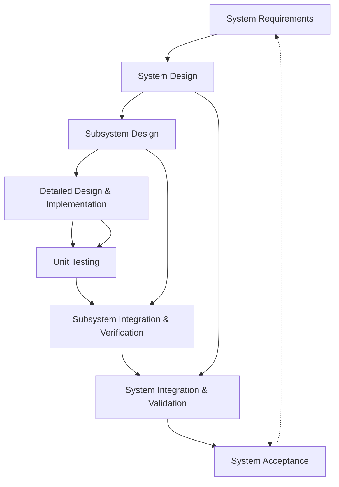

## The Classical V-Model: Discipline and Determinism in System Development

The V-model stands as a foundational framework in systems engineering, representing the archetype of disciplined, phase-oriented product development. Its origins lie in the recognition that complex, safety-critical, and integrated systems require more than iterative “build-and-fix” strategies; they demand structured processes, explicit requirements management, and rigorous traceability from conception to deployment. This section examines the classical V-model in its canonical form, exploring mechanisms, strengths, shortcomings, and the points where its determinism is most challenged—particularly when extended from single-discipline to multidisciplinary, volatile, or rapidly evolving engineering contexts.

### Origins and Structure of the V-Model

The V-model, codified in standards such as VDI 2206 for mechatronic systems and IEEE 12207 for software engineering, represents an evolutionary step beyond traditional Waterfall development. While the Waterfall model emphasizes strict linear progression from requirements through implementation, the V-model organizes the lifecycle into two converging sequences: system decomposition and specification on the left “leg” of the ‘V’, and integration, verification, and validation on the right. The pivot at the bottom of the ‘V’ marks the transition from building isolated components to assembling and evaluating the whole system.

#### Diagrammatic Representation

A classical depiction of the V-model is as follows:

In this model:
- The left arc (A to D) represents progressive decomposition: translating customer needs into formal system requirements, high-level system architecture, sub-system design, and, finally, detailed design and implementation.
- The right arc (E to H) prescribes the process of unit testing, integrating sub-systems, performing system-level validation, and ultimately accepting the integrated product, each phase systematically mapping to its respective specification phase.

### Engineering Discipline: Benefits of the V-Model Approach

The V-model’s strengths lie in its provision of rigor, explicit control, and traceability—qualities indispensable in regulated industries such as aerospace, medical devices, automotive, and critical infrastructure. In these domains, the cost of undetected defects or ambiguous requirements can be catastrophic, incentivizing discipline at every life-cycle stage.

#### Requirements Traceability and Verification

A fundamental advantage of the V-model is its insistence on traceability: each decomposed requirement maps forward to a specific test or verification activity. This necessitates an end-to-end chain—sometimes formalized as a requirements traceability matrix (RTM)—that links every functional and non-functional requirement with corresponding validation and verification (V&V) plans. This approach provides organizational clarity, defines accountability, and enables rigorous compliance auditing.

#### Risk Management and Change Control

Another benefit is the facilitation of early risk management and systematic change control. The up-front, structured specification allows engineering teams to surface feasibility risks and architectural trade-offs early in the lifecycle. Change requests, when they occur, are subject to formal impact analysis, reducing the likelihood of downstream surprises. For domains involving hardware or regulatory constraints, where changes can entail substantial delay and expense, this up-front discipline is often non-negotiable.

#### Formal Interface Management

The explicit progression through system, subsystem, and component-level design fosters careful definition of interfaces between modules. This mitigates siloed assumptions and uncoordinated changes—pitfalls particularly acute in hardware-firmware-software composites.

### Where the V-Model Excels: Suitability and Fit-for-Purpose

In system environments characterized by well-understood problem domains, slow-changing requirements, and heavy regulatory oversight, the V-model is unmatched. Typical application areas include:

- **Safety-Critical Systems:** Certification bodies (e.g., DO-178C for avionics, IEC 62304 for medical software) often mandate clear traceability between requirements, implementation, and tests. The V-model natively supports this mapping, easing certification evidence preparation.
- **Domain Stability:** When requirements volatility is low and life-cycles are measured in years, up-front investment in specification and design yields long-term dividends.
- **Component-Based Hardware:** The physicality of hardware (tooling, fabrication, test rig construction) often demands detailed planning and staged verification, as rectifying late-stage errors can be materially costly.

In such contexts, the ceremonial nature of the V-model delivers predictability, constrained risk, and operational assurance—qualities prized above sheer velocity or incremental adaptability.

### Determinism Under Strain: V-Model Failure Modes in Practice

However, the same qualities that make the V-model powerful—its linearity, predictability, and up-front control—become pronounced liabilities as soon as contextual realities diverge from those ideal conditions.

#### Requirements Volatility and Emergent Understanding

The V-model presupposes that requirements can be fully, accurately, and stably captured at an early stage. In reality, complex engineering projects—especially those integrating software and firmware—often confront evolving user needs, emergent technology constraints, or competitive market changes. Attempting to “freeze” requirements prematurely can lead to significant rework, technical debt, or misalignment with customer value.

The downstream impact is a brittle lifecycle: late-breaking requirement changes necessitate expensive “change control” procedures, with ripple effects extending through architecture, test planning, and documentation. The ceremony intended for risk containment instead amplifies inertia, sometimes resulting in products that ship “on specification” but out of step with user realities.

#### Cross-Disciplinary Lifecycle Mismatches

As products increasingly span software, firmware, electronics, and mechanical disciplines, organizational tempo becomes a critical complication. Hardware subsystems, governed by longer lead times and manufacturing cycles, thrive on front-loaded planning. By contrast, software and firmware, with their short iteration cycles and richer toolchain automation, benefit from rapid feedback, experimentation, and evolutionary refinement.

The V-model treats all subsystems as moving in synchrony, yet in integrated products, the competing “natural cadences” of software and hardware produce significant friction. Software teams pressured to conform to hardware gating may face stifled innovation and opportunity loss; hardware groups subjected to volatile software-driven requirements changes may encounter redesigns, cost overruns, or delays in validation.

#### System Integration: The “Big Bang” Risk

A further vulnerability emerges at the bottom and right leg of the V: system integration. When multiple system elements, developed independently and with limited feedback, are integrated late, emergent behaviors and systemic failures are likely to surface. These “Big Bang” integration moments are notorious sources of cost, schedule disruption, and—most critically—emergent failures undetected by component-level verification. This is exacerbated in complex, cyber-physical systems where untested interactions between layers (mechanical, electrical, software) can create failure modes invisible within siloed test regimes.

#### Feedback Loops and Learning Barriers

The feedback mechanisms of the traditional V-model are primarily gated: lessons and corrections surface at formal review boundaries or at acceptance testing. For fast-evolving markets, this “batch” mode of learning promises neither speed nor resilience. Teams are discouraged from admitting uncertainty (since up-front certainty is assumed) and have few procedural means to course-correct outside the burdensome change control process. In contemporary engineering settings, this increases the risk of building the “wrong thing right”—an outcome particularly punitive in high-opportunity-cost markets.

### Practical Realities: Interfaces with Organizational and Technical Architecture

#### Specification Artifacts and Version Control

Typically, the V-model’s artifacts—requirements specifications, interface control documents (ICDs), validation protocols—exist as discrete, formal documents. In traditional practice, these often reside outside the mainline source control systems, subject to document-centric (rather than code-centric) change management. This approach, while tracing to regulatory needs, hinders real-time collaboration, atomized change, and the sort of distributed, asynchronous engineering found in modern organizations.

#### Toolchain and Documentation Fragmentation

The multiplicity of specialized toolchains (requirements management, PLM, source control, test management) means traceability is often hampered by pseudo-integration: links between tools grow stale, and “truth” is a function of manual synchronization rather than automated continuity. As organizations scale, the cost of maintaining harmony between actual code/bom/assets and their formal representations can dwarf the intended savings from discipline.

#### Governance and Decision Making

V-model projects are typically led by centralized engineering program management, with formal sign-offs and gated reviews (e.g., Preliminary Design Review, Critical Design Review, Verification Review). While this reduces ambiguity, it can concentrate authority away from the domain experts closest to evolving realities, and demote the role of feedback-driven improvement.

### Variations and Adaptations

Recognizing these issues, engineering process frameworks have introduced V-model variants: the “Double V” (incorporating iterative V&V), “W” models (emphasizing prototyping), and the “V+V” model (with parallel validation and verification). In regulated software, standards such as ISO 26262 (automotive) or ARP4754A (aerospace) recalibrate the V-model to accommodate some cycling and recursion. Nevertheless, these modifications rarely solve the fundamental limitation: the original model’s intrinsic linearity and poor adaptability to uncertainty and local innovation cycles.

### Tensions and Trade-Offs in Integrated Product Development

The central dilemma for organizations pursuing integrated products is how to retain the attributes of discipline, traceability, and systemic integration without incurring the overhead and brittleness of phase-gated determinism. The V-model’s “one size fits all” structure, though suited for mechanistic systems, does not account for differing rates of evolution, technological uncertainty, and the varying speed of change across software, electronics, and mechanical domains.

#### Representative Scenario: Firmware in Hardware-Controlled Lifecycles

Consider a firmware subsystem tightly coupled with a hardware platform. The V-model presumes the firmware can be precisely specified and validated in lockstep with hardware milestones. Yet firmware requirements may shift in response to late hardware characterization results, unexpected component substitutions, or changing customer usage patterns uncovered via early prototyping. The rigid V-model either forces adherence to outdated requirements or imposes costly, formal change management for course-corrections—both suboptimal in competitive, dynamic environments.

#### Architectural Drift and Unmanaged Complexity

When teams working under V-model discipline encounter unclear or conflicted requirements late in the process, they may resort to local workarounds or undocumented “shadow changes.” The system-level visibility promised by the V-model is then eroded, replaced by a patchwork of exceptions and rationalizations. Architectural fitness suffers, and traceability becomes, at best, an after-the-fact exercise; at worst, it devolves into bureaucratic fiction.

#### Human Dimension: Motivations and Collaboration

A further, often underestimated constraint is cultural. The V-model’s escalation-based change and review processes emphasize control and risk aversion but can dampen initiative and reduce psychological safety—engineers become reticent to surface new risks or innovations late in the cycle. Cross-functional collaboration, which is essential for integrated products, inhibits when roles and inputs are rigidly sequenced rather than continuously engaged.

### Summary: The Role of the V-Model in Contemporary Product Development

Despite its shortcomings in modern, multidisciplinary contexts, the V-model endures as a touchstone for discipline, process visibility, and contractual rigor. No other model has so effectively systematized the full lifecycle flow from requirements to verification and validation, nor offered such explicit mapping between needs and evidence of value delivered. But the limitations are increasingly pronounced: the model buckles under the demands of rapid iteration, volatile markets, cross-domain integration, and learning-centric cultures. The determinism that once guaranteed quality assurance now impedes adaptability, velocity, and opportunity capture.

In practice, leading engineering organizations no longer apply the V-model in its purest form. Instead, they hybridize its core disciplines—requirement traceability, interface specification, formal integration strategies—with the adaptive, feedback-rich, and people-centric practices of Agile, Lean, and modern systems thinking. It is in this space, navigating the irreducible tensions between upfront rigor and emergent learning, that the rationale for hybrid models such as Cornerstone emerges.

The subsequent sections of this book will analyze how the Cornerstone framework intentionally fuses the strengths of the V-model—traceability, discipline, formal integration—with the pragmatism, adaptability, and continuous learning that modern multidisciplinary product development demands. By confronting the limitations of classical determinism, Cornerstone aims to provide organizations with a framework purpose-built to address the complexity, volatility, and integrated realities of contemporary engineering practice.