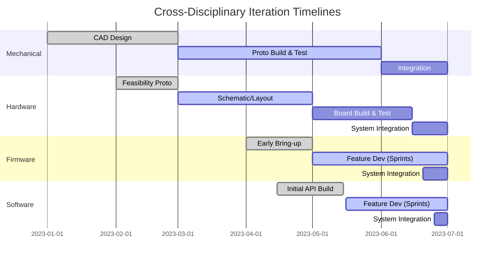

# Agile Approaches in Integrated Product Development: Values, Frameworks, and Practical Limits

## 1. Introduction: Agile and the Complexity of Integrated Systems

Agile methodologies have profoundly influenced the landscape of software engineering and, by extension, other technology domains. Their rise reflects a shift toward flexibility, rapid learning, and customer-centricity—qualities increasingly demanded in an era of technological acceleration and market volatility. Yet, while Agile principles offer compelling tools for coping with change and uncertainty, the practicalities of hardware, regulated, and multidisciplinary engineering projects impose friction. For organizations seeking to deliver complex integrated products, understanding the conceptual foundations, mechanisms, and boundary conditions of Agile is a necessary precursor to constructing or evolving hybrid delivery frameworks such as Cornerstone.

This section critically examines Agile values and frameworks, elucidating their core strengths and the inherent limitations that surface in cross-disciplinary and regulated product development. By clarifying these boundaries, we lay a foundation for deliberate hybridization—retaining Agile’s adaptability where it truly adds value, but integrating it with the rigor, traceability, and architectural discipline necessary for sustainable, systems-level success.

---

## 2. Agile Values and Principles: Foundations and Applicability

### 2.1. The Agile Manifesto: Core Tenets

The **Agile Manifesto** (2001) articulated four foundational value statements and twelve guiding principles—establishing a new philosophy for managing uncertainty and change in software development. At its core, Agile re-orients priorities around individuals and interactions, working solutions, customer collaboration, and responsiveness to change. These values fundamentally challenge the linearity and rigidity of traditional phase-gated models by:

- Prioritizing *outcomes* (working products, satisfied stakeholders) over process conformance;
- Accepting the inevitability of change, embedding mechanisms to accommodate evolving requirements and feedback;
- Emphasizing direct team communication and self-organization over bureaucratic controls.

The principles extend this mindset, advocating for early and frequent delivery of valuable increments, sustainable pace, technical excellence, continuous attention to quality, and reflection-driven adaptation. Notably, these principles are intentionally abstract—encouraging interpretation to context rather than dictating prescriptive process.

### 2.2. Agile in Practice: From Values to Frameworks

The translation of Agile values into concrete engineering practice yields a family of frameworks, each with distinct operational emphases and structures. **Scrum** organizes work into short, iterative *sprints* bounded by clear goals and regular ceremonies (planning, review, retrospective). **Kanban** visualizes flow and constrains work-in-progress (WIP), emphasizing continuous delivery and system constraint management. **Extreme Programming (XP)** centers on engineering discipline and technical practices—such as test-driven development, continuous integration, and collective code ownership—that directly reinforce product quality and change resilience.

All these frameworks share foundational elements: iterative-and-incremental delivery, adaptive planning, and visually managed work queues. The mechanisms and artifacts—user stories, backlogs, acceptance criteria, sprint goals—construct a closed learning loop wherein teams continuously refine outputs toward stakeholder value.

While originally conceived for software, Agile’s influence has extended into hardware and interdisciplinary projects, spawning frameworks and scaling patterns such as **Scaled Agile Framework (SAFe)**, **Large-Scale Scrum (LeSS)**, and hybrid approaches integrating Lean product development or systems engineering overlays. Each adaptation is, by necessity, a negotiation: balancing Agile change-responsiveness with the specific lifecycle, traceability, and compliance needs of the domain.

---

## 3. Strengths of Agile in Contemporary Product Development

### 3.1. Embracing Change and Accelerating Learning

At its most effective, Agile transforms uncertainty from a liability into an asset—by harnessing emergent knowledge gained through rapid, iterative experimentation and feedback. Early and frequent delivery of working increments provides real product validation, not just theoretical confidence. The short cycle times and regular stakeholder engagement inherent to Agile workflows enable teams to detect misunderstanding, misalignment, or changing requirements before they become systemic risks.

For software teams, this adaptivity is especially advantageous: code is malleable, environments virtual, and the cost of late-stage change can be minimized by disciplined DevOps automation. In firmware and embedded systems, a subset of this value remains: as long as target hardware is available or well-abstracted, frequent integration and verification are achievable.

### 3.2. Team Empowerment and Psychological Safety

Agile’s delegation of operational authority to multidisciplinary, cross-functional teams unlocks autonomy, intrinsic motivation, and contextual problem-solving. Team members are empowered to manage their own work (within agreed constraints), drive process improvement, and surface risks or obstacles transparently—creating a culture of blameless learning and high-trust collaboration.

This structure is directly aligned with Cornerstone’s emphasis on *context-driven leadership* and *resilient learning cultures*: reducing the overhead of centralized authority, and fostering the conditions for sustainable, continuous improvement.

### 3.3. Lean Delivery and Waste Avoidance

By “pulling” work in priority order and limiting parallelization (via WIP limits, focus, or cadence), Agile delivery models encourage organizations to reduce waste—manifest as overplanning, unused features, handoff and context-switching costs, and partially completed work. The emphasis on priority-driven backlogs aligns efforts with evolving customer and business priorities, maximizing delivered value within capacity constraints.

When combined with lightweight documentation approaches—such as “just enough” specs, living backlogs, and evolving code artifacts—Agile can reduce the administrative drag that often plagues phase-gated processes without sacrificing necessary rigor.

---

## 4. Applying Agile to Hardware, Regulated, and Integrated Domains: Practical Frictions

Despite its clear successes in software product development, the application of Agile in hardware, systems engineering, or regulated contexts requires careful adaptation. These environments present unique constraints and organizational realities that can render unmodified Agile models insufficient or, in some cases, actively dysfunctional.

### 4.1. Physical and Temporal Constraints of Hardware

Unlike software, hardware systems are inherently constrained by the physical world: materials, manufacturing lead times, third-party supply chains, and the irreducible cost of iteration. The philosophies of rapid experimentation and “fail fast” collide with the reality that building physical prototypes involves significant financial, time, and logistical investments.

For example, teams developing a new circuit board or mechanical assembly cannot “ship working increments” every two weeks in the same sense as software. Iterative learning can be achieved through staged prototyping (breadboarding, 3D printing, simulation), but these cycles are dramatically longer and introduce high sunk costs in each round.

Moreover, late-stage design changes impose exponential penalties in cost and schedule due to interconnected dependencies—often far outpacing the incremental effort to change software or firmware. The result is a velocity asymmetry: while software teams may continue rapid cycles, hardware’s natural tempo is measured in weeks or months, enforcing higher-than-desired phase separation.

### 4.2. Documentation, Traceability, and Regulated Environments

Many product domains—particularly medical devices, automotive, aerospace, and defense—are governed by rigorous standards (e.g., ISO 13485, IEC 62304, DO-178C, IATF 16949, FDA 21 CFR 820) that mandate clear traceability, formal verification, and configuration management. Agile’s advocacy for “just enough” documentation is context-sensitive, but in regulated settings, minimally sufficient is often a high bar. Requirements and architectural decisions must be recorded, systematically linked to implementation and verification activities, and defensible in external audits.

Unmodified Agile frameworks, which deprioritize documentation in favor of conversation and evolving artifacts, may therefore introduce compliance risks unless supplemented by discipline. Agile’s favoring of living backlogs and refactoring must be mapped to traceability matrices, versioned specifications, and documented rationale without reverting fully to heavyweight processes. This is especially acute at scale, where maintaining congruence between high churn backlogs and formally controlled documents (“design history files,” “device master records,” etc.) becomes arduous without robust automation and tool support.

### 4.3. Integration Cadence and Emergent Failure Modes

Integrated product development projects invariably require coordination across multiple disciplines with differing lifecycles and delivery velocities. Software can be released or modified rapidly; hardware, as established, cannot. Firmware often sits awkwardly between them, tightly coupled to hardware interfaces but subject to change and defect cycles more akin to software. Mechanical designs must often serve as the fixed foundation on which all else depends, but their delayed changes have system-wide knock-on effects.

Agile’s presumption of frequent, continuous integration is severely tested in this environment. Integration events—linking hardware prototypes, firmware builds, cloud services, and mechanical assemblies—become synchronisation points that are less frequent and carry higher stakes than those envisioned in canonical Agile. Emergent failures (e.g., mismatched interfaces, thermal issues, EMC non-compliance) may be masked until physical integration, where remediation is far costlier. The result is a need for hybrid models—blending Agile’s incremental learning within each discipline, while instituting “readiness gates” and interface contracts across domains to manage systemic risk.

A conceptual diagram helps illustrate these asynchronous integration dynamics:

This Gantt visualization highlights the staggered, discipline-specific “done” criteria. Mechanical engineering reaches significant milestones before software even begins substantive iteration; integration of all domains occurs at discrete points, with limited opportunities for end-to-end learning prior to these conjunctions.

### 4.4. Scaling Agile: Dependencies, Governance, and Systemic Coherence

Scaling Agile beyond single, co-located teams introduces increased organizational complexity. Frameworks such as SAFe, LeSS, and Nexus attempt to coordinate numerous independent teams toward a common product vision, standardizing cadence, roles, and planning increments. While these frameworks can introduce structure and visibility, their effectiveness in hardware-centric or regulated contexts is sharply limited unless augmented by systems engineering practices—explicit interface control, disciplined architectural decision management, and traceability mechanisms.

Purely Agile scaling often underestimates the “coordination tax” imposed by large, interdependent architectures or supplier ecosystems. Absent clear alignment to value streams, robust configuration management, and lightweight but effective governance, organizations encounter bottlenecks: delayed integrations, requirements mismatches, version sprawl, and duplicated or conflicting work. Thus, practical hybridization—retaining Angular’s team empowerment and adaptivity within a disciplined, traceable engineering envelope—becomes a practical necessity for systemic coherence.

### 4.5. Failure Modes and Cultural Tensions

When Agile is transplanted uncritically into settings with high physical or regulatory complexity, failure modes commonly emerge. These include:

- *Fragmentation*: Teams optimize for local velocity, but neglect systemic integration and architectural alignment; emergent properties (performance, safety, compliance) are not validated until late, if at all.
- *Documentation Debt*: Informal communication dominates; lacking “design contracts” and change histories, teams lose traceability, and regulatory or certification efforts stall or fail.
- *Process Cargo Culting*: Organizations superficially adopt Agile ceremonies and language, but fail to implement the technical infrastructure (CI/CD, automated testing, integrated toolchains) necessary for real feedback and quality assurance.
- *Role/Silo Confusion*: Agile roles (e.g., Product Owner, Scrum Master) may conflict or overlap with established engineering governance structures (systems engineers, project managers, regulatory affairs), leading to tension or duplication.

---

## 5. Addressing the Practical Limits of Agile: The Path to Hybridization

Recognizing these limitations is not a repudiation of Agile, but a call for engineering maturity—selectively integrating the principles and mechanisms that add real value, while incorporating discipline, coherence, and traceability from other models. Three foundational strategies guide this synthesis:

### 5.1. Lifecycle Fusion and Interface Discipline

Effective hybrid frameworks, such as Cornerstone, maintain Agile’s iterative learning loops *within* disciplines (e.g., weekly firmware sprints, ongoing mechanical simulation), but enforce synchronization and interface readiness gates across them. These “integration contracts” define when a given subsystem meets the quality, documentation, and test prerequisites required to participate in risk-acceptable whole-system integration.

The operationalization of these gates is a non-trivial engineering and process design challenge. It may involve incremental System Integration Tests (SIT), interface control documents (ICDs) managed as living artifacts, and version-locked deliverables mapped in configuration management systems. Here, the traceability strengths of the V-model and the dynamism of Agile are harmonized to ensure both learning and systemic discipline.

### 5.2. Augmented Documentation and Living Artifacts

In regulated or complex product domains, hybrid methodologies supplement Agile’s evolving documentation with Docs-as-Code practices—treating requirements, architectural decisions, and even traceability matrices as first-class, version-controlled artifacts. This facilitates rigorous change control, auditability, and cross-domain transparency, without reverting to the static, brittle documents characteristic of classical approaches.

Practically, this may entail storing requirements, specifications, and interface definitions in markdown, reStructuredText, or machine-readable formats within the source code repository; automating traceability matrix generation via build pipelines; and updating design rationale via lightweight Architectural Decision Records (ADRs). As the system evolves, documentation and implementation maintain close and verifiable alignment, supporting ongoing delivery, compliance, and risk management.

### 5.3. Orchestrated Governance

Finally, sustaining agility at scale and across disciplines requires “just enough” governance: lightweight, transparent structures that provide architectural and program-level alignment without constraining initiative or velocity. This may involve codified design authorities for key interfaces, readiness review boards for critical integration events, or federated risk management structures that track and respond to emerging threats across domains.

A hybrid governance model balances the centralized oversight necessary for integrity, quality, and regulatory compliance with the distributed autonomy that drives responsiveness and innovation. In Cornerstone, for example, value streams and team topologies are explicitly aligned to architectural and product boundaries, optimizing for both flow and systemic coherence.

---

## 6. Summary: Toward Deliberate Hybrid Engineering

Agile approaches have delivered transformative benefits in domains amenable to rapid learning, flexible requirements, and short integration cycles. Their core strengths—embracing change, accelerating feedback, empowering teams, avoiding waste—remain potent wherever software-like dynamics prevail. However, as organizations increasingly tackle integrated products blending hardware, software, firmware, and mechanical domains, the pure form of Agile reveals practical and principled limitations.

Regulated environments, physical constraints, and multi-tempo delivery impose boundary conditions for successful adaptation. Documentation, traceability, and architectural discipline are not optional—they are essential for systemic risk containment, certification, and sustainable evolution. The synthesis of Agile dynamism with systems engineering rigor creates a layered, context-optimized foundation for modern product development.

Hybrid frameworks like Cornerstone arise precisely from this reconciliation: fusing continuous iteration and learning with traceable, discipline-enabling structures; empowering people while aligning organizational systems for value flow; and managing living artifacts and risk across every phase of the lifecycle. The next chapters will develop this synthesis in detail, introducing the operational principles and lifecycle mechanisms that define a mature, hybrid delivery framework for contemporary engineering realities.