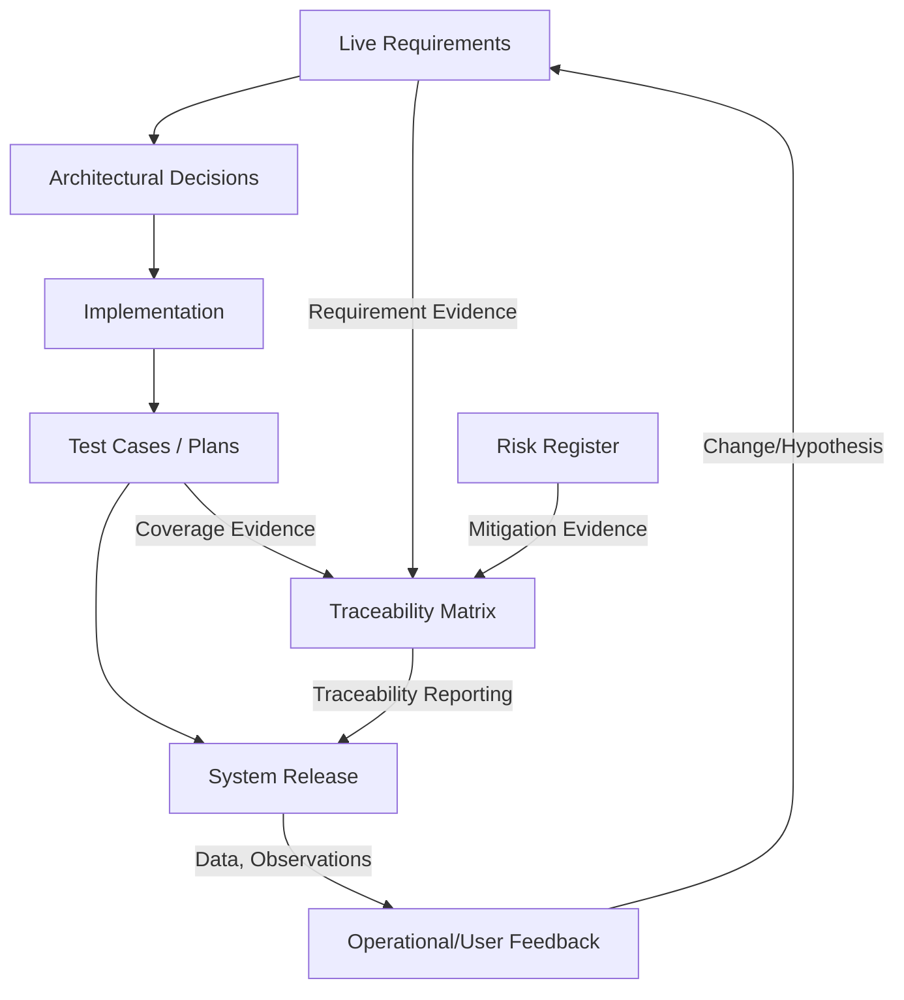

---
## The Necessity of Coexisting Predictability and Adaptability: The Natural Emergence of Hybrid Product Development

The recurring tension between predictability and adaptability is a defining characteristic of contemporary product development, especially for integrated systems that combine software, firmware, hardware, and mechanical components. Each discipline brings unique development tempos, risks, and documentation needs, yet the end product demands coherence, reliability, and traceable conformance to requirements. The classical V-model’s rigor and the adaptive cycles of Agile, when considered in isolation, each fall short of addressing the holistic needs of such complex environments. Through careful examination of their respective strengths and limitations, as well as the practical realities of multidisciplinary workflows, the emergence of hybrid methodologies—such as the Cornerstone Framework—can be understood not as a compromise, but as a logical evolution responding to the demands of modern engineering.

### Predictability and Discipline as Engineering Necessities

Predictability in engineering is not merely a managerial preference; it is an operational necessity in environments where change can yield catastrophic failure or where regulatory oversight is stringent. The V-model provides this discipline by enforcing a one-to-one mapping between requirements and their corresponding verification and validation (V&V) activities. This traceability is essential for managing safety, compliance, and interface stability. In the context of electro-mechanical devices, medical technologies, or aerospace systems, the assurance that every requirement is explicitly linked to a test or analysis phase is non-optional—the cost and risk exposure of late-stage changes are often prohibitive.

The V-model’s decomposition of complex systems into well-defined subsystem interactions reduces ambiguity, facilitates controlled change, and enables a managed escalation from component verification to full system validation. This is particularly salient where physical integration risks are high—for example, where mechanical constraints dictate electronic layout, or where firmware and hardware must obey tightly coupled timing contracts. Here, predictability is more than a scheduling aspiration; it underpins design quality, manufacturability, and safety. Standards such as ISO 26262 (automotive functional safety), IEC 62304 (medical software), and DO-178C (aerospace software) all codify elements of this rigorous, traceable approach, further embedding predictability at the heart of compliance-driven development.

### Adaptability and the Reality of Change

While discipline ensures control, it is adaptability that enables responsiveness to discovery, stakeholder feedback, and external change. In dynamic markets—where user expectations, supply chains, technologies, or regulatory landscapes evolve mid-project—teams that cannot learn and adapt quickly are exposed to obsolescence or failure. Agile methodologies emerged in recognition of this reality, prioritizing frequent feedback, minimal viable increments, and working software as the ultimate proof of progress. Adaptability does not oppose discipline; rather, it seeks to optimize learning and reduce waste by iteratively reducing uncertainty, addressing risks early, and allowing requirements to evolve as understanding deepens.

For software and firmware teams in particular, adaptability is essential. Unlike hardware, software can be changed and deployed with relative ease, making it both a source of agility and a moving target in tightly coupled products. Modern hardware design also increasingly employs adaptable approaches (e.g., rapid prototyping, programmable logic, model-in-the-loop verification), but always under the shadow of physical and supply constraints. Thus, across all disciplines, the cadence of development and the ability to accommodate change must be balanced against the need to avoid rework and integration failure.

The principle of “responding to change over following a plan”—as articulated in the Agile Manifesto—enables organizations to capitalize on emergent technical or market opportunities. It also provides more humane working conditions, replacing the brittle culture of blame for deviations with one of continuous learning. However, without explicit architectural guardrails, traceable documentation, and cross-team alignment, unbridled adaptability can devolve into disorder, risking fragmentation and a loss of systemic integrity.

### The Integration Paradox: Tension as a Source of Hybrid Models

Nowhere is the coexistence of discipline and adaptability more crucial than at the integration boundaries of multidisciplinary products. Late or flawed synchronization between hardware, software, and mechanical elements exposes organizations to the so-called “W-curve” of late integration failure, where defects are amplified and risk remediation becomes exponentially costly. In pure Agile environments, frequent delivery of working software increments does not guarantee system-level readiness if hardware prototypes lag by months or are locked by external dependencies. Equally, strict V-model gating may force hardware teams to adhere to decisions that are invalidated by subsequent software learnings or user discovery.

This integration paradox—where value and risk concentrate at systemic boundaries—creates the impetus for hybrid approaches. Successful product development must navigate several intertwined realities:

1. **Differential Cadence:** Hardware and mechanical design often proceed in longer cycles due to prototyping, manufacturing, and procurement lead times. Software, conversely, can iterate rapidly. Firmware typically sits between these extremes, sharing characteristics of both. Processes must reconcile the disparate tempos, coordinating critical integration points without stalling learning or flow.

2. **Documentation and Traceability:** Regulatory standards demand traceable artifacts—requirements, tests, risk assessments, and decisions—managed as living, versioned documents. Agile practices by default deprioritize comprehensive documentation, focusing instead on working code and minimal process overhead. Hybrid models respond by adopting “docs-as-code” approaches, integrating lightweight, automatically versioned artifacts directly into development workflows, smoothing the compliance-agility gap.

3. **Architecture and Change Readiness:** Systemic architecture cannot be left emergent in complex, safety- or performance-critical domains. However, it must also be resilient to the discovery-driven changes characteristic of iteratively learned requirements or tech spikes. Modern architecture practices—such as the use of Architectural Decision Records (ADRs), interface contracts, and explicit technical debt management—support a “living architecture” that is both explicit and adaptable.

These realities mean that pure models—V-model or Agile—are insufficient when directly applied to modern, multidisciplinary product teams. A hybridized lifecycle, such as envisioned in the Cornerstone Framework, becomes necessary not simply for expediency, but as a structural resolution to the integration paradox.

#### Conceptual View of the Hybrid Lifecycle

The intersection and blending of the V-model’s rigor and Agile’s iterative learning can be visualized as a repeated, feedback-augmented V. In each “meta-iteration,” requirements and architecture are revisited and refined, but always traced forward to corresponding V&V activities—the system is both controlled and adaptive at each lifecycle loop.

```mermaid
flowchart LR
    A[Stakeholder Needs] --> B[Requirements/specs (Iteration N)]
    B --> C[Design & Decomposition (Iteration N)]
    C --> D[Implementation]
    D --> E[Integration & System Testing]
    E --> F[Release/Feedback]
    F --Feedback/Incorporate learnings--> B
    E --Verification/Traceability--> B
```

### Organizational and Workflow Implications

The coexistence of predictability and adaptability imposes both architectural and organizational challenges. Teams must operate semi-autonomously within clear value stream boundaries, enabling local decision-making while preserving systemic coherence. This division aligns naturally with Conway's Law, which observes that the product architecture mirrors the organizational communication structure. In practice, this requires that each team maintains alignment not only to its direct deliverables but also to cross-domain integration points, shared definitions, and interface contracts.

Workflows in hybrid models tend to adopt an “incremental readiness” approach. Instead of gating progress strictly at phase boundaries (as in the traditional V-model), or delivering small increments without system-level assurance (as in pure Agile), teams utilize lightweight readiness gates. These gates often require evidence of integrated learning, risk burn-down, and traceable advancement of documentation, acting as control points that do not unduly impede flow. This approach is especially effective when supported by living artifacts—requirements, interfaces, risk registers, and test plans—that are version-controlled alongside the codebase, reducing the risk of drift between documentation and delivered product.

#### Mechanisms for Maintaining Traceability and Adaptation

Hybrid frameworks embed mechanisms that can simultaneously support predictive control and responsive change. These mechanisms include automated traceability matrices (RTMs) as code, continuous integration pipelines that exercise both software and (where feasible) hardware simulations, and cross-functional risk reviews that adapt mitigation strategies in response to observed reality rather than static plans. Strategic use of surrogate artifacts (e.g., digital twins, hardware-in-the-loop testing, or high-fidelity simulations) helps decouple the pace of software progress from hardware readiness, providing earlier and more actionable integration feedback.

The following diagram illustrates typical artifact and feedback flows in such a hybrid model:



### Trade-offs and Failure Modes in Hybrid Development

Hybrid development models entail their own trade-offs. By blending two philosophies with divergent instincts, teams must consciously manage the risk of process complexity, role ambiguity, and conflicting priorities. One common failure mode arises when the rigor of traceability is diluted in favor of delivery cadence, leading to compliance deficits discovered late in the project. Conversely, over-investment in documentation and gatekeeping can stall feedback and demotivate teams who value autonomy and rapid learning.

Another challenge is synchronization. For example, if software teams accelerate feature delivery without backward-compatible interfaces or discipline in technical decision logging, hardware teams may be trapped by legacy assumptions, leading to costly rework or integration stalls. To avoid this, hybrid approaches emphasize “living” architectural artifacts—ADRs, shared interface definitions, and real-time documentation updates—maintained with the same rigor as source code.

Moreover, poorly integrated readiness gates can slip into redundant or rigid ceremonies, undermining the intended balance between autonomy and alignment. Effective hybrids ensure that such gates are contextually lightweight, evidence-driven, and explicitly linked to outcome and risk, rather than routine compliance.

### The Inevitable Convergence: Industry and Standards Evolution

The increasing complexity of products, together with acceleration in technology development and regulatory scrutiny, is driving industry standards themselves toward hybrid norms. For example, IEC 82304-1 (health software) explicitly accommodates iterative and incremental development within a safety-managed paradigm. Automotive functional safety standards (ISO 26262) allow phased-validation approaches and incremental integration of software and hardware elements, provided that the V&V, risk, and traceability elements are satisfied incrementally. Even in aerospace, model-based systems engineering (MBSE) and incremental certification initiatives reflect a shift from monolithic gatekeeping to cycles of controlled learning and validation.

Organizationally, modern enterprises recognize that high-performing teams require psychological safety, cross-functional empathy, and empowerment—qualities associated with Agile—but these must exist within an environment of clear accountability, documented dependencies, and visible risk management (reflection of systems engineering). Cross-discipline skill sets, “T-shaped” engineers, and platform teams are natural organizational responses to the hybridization imperative. Toolchains are also evolving: integrated ALM/PLM suites provide traceability, artifact versioning, and flexible documentation workflows that serve both compliance and Agile-driven learning.

### Hybrid Methodologies as an Emergent Norm

It is thus neither accidental nor artificial that hybrid methods have become the industry default for integrated product development. Frameworks such as SAFe (Scaled Agile Framework) and LeSS (Large-Scale Scrum) introduce roles, artifacts, and governance structures directly responsive to the needs of large, integrated systems. However, these frameworks often retain legacy elements (fixed increments, prescriptive ceremonies) that must be actively tailored to avoid bureaucracy and preserve value flow.

The Cornerstone Framework emerges from this context as an intentionally hybrid model, structurally embedding both systems engineering discipline and Agile/Lean adaptivity into the workflow DNA. Rather than treating documentation, architecture, or leadership as afterthoughts, it operationalizes these as “living” concerns, managed as first-class artifacts. Predictable, compliant, and robust products are achieved not at the expense of flexibility, but because they are co-developed with continuous learning and change readiness in mind.

### Preparing for the Cornerstone Lifecycle

Understanding the need for coexisting predictability and adaptability clarifies why hybrid approaches are not simply “mix and match” solutions, but necessary and deliberate responses to the real-world demands of integrated product development. Structured discipline and iterative learning are not merely compatible—they are interdependent. Discipline creates the environment in which iteration is safe and rewarded; adaptability ensures that discipline does not ossify in the face of reality.

As the upcoming chapters introduce the full Cornerstone lifecycle, this foundation will recur: every phase, artifact, and role is designed to sustain the dynamic equilibrium between control and flexibility. The result is a model where integrated teams, living documentation, traceable requirements, proactive risk management, and modular architectures coalesce—not as a patchwork of borrowed best practices, but as a coherent system designed for the complexity, pace, and responsibility of modern engineering.

---