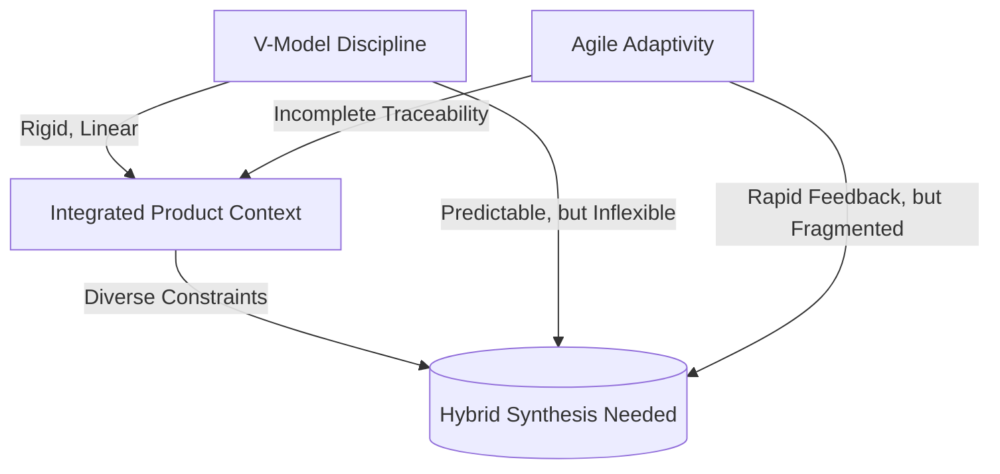

### Why No Single Model Fits All: The Limits of Monolithic Methodologies for Integrated Product Development

#### The Myth of the Universal Methodology

A persistent challenge in engineering management is the search for a single, all-encompassing development methodology—a "universal solvent" capable of orchestrating diverse domains, reconciling rapid change with regulatory discipline, and leading teams to predictable, innovative outcomes. This aspiration is understandable; monolithic frameworks promise clarity, repeatability, and the comfort of standardization. Yet, for integrated product development—spanning software, firmware, hardware, and mechanical engineering—no single approach can consistently reconcile the breadth of needs, constraints, and organizational forces encountered in practice.

The inadequacy of a "one size fits all" model is grounded in fundamental differences inherent to each engineering discipline. Software may thrive on fast feedback and continuous delivery, whereas hardware development is coupled to longer cycles of prototyping, supplier coordination, and physical manufacturability. Regulatory requirements may necessitate explicit traceability and auditable verification activities, while innovation and responsiveness demand freedom to iterate, experiment, and incrementally adapt to emergent learning. The intersection of these concerns produces a context where rigid adherence to a pure methodology—whether traditional, Agile, or Lean—inevitably leads to friction, fragmentation, or the suppression of essential engineering behaviors.

#### The Nature of Integrated Product Complexity

Integrated products are characterized not only by technological multiplicity, but also by tightly coupled lifecycles, cross-domain dependencies, and externally imposed constraints—ranging from safety and regulatory standards (such as ISO 26262 for functional safety or IEC 62304 for medical software), to manufacturing and supply chain realities, to business model and market timing pressures. Each discipline embedded within the integrated team is subject to distinct feedback cadences, failure recovery costs, and mechanisms for managing ambiguity and risk.

For instance, software and firmware teams are able to employ test-driven development, continuous integration, and frequent deployments; burned iterations may be rectified quickly and at low cost. By contrast, hardware errors discovered late in the lifecycle may result in expensive respins, protracted delays, or even sunk costs that cannot be recovered. Mechanical engineering often contends with even longer lead times, interface rigidity, and irreversible decisions with implications for certification and warranty support. The existential demands of each discipline differ not only in tempo but also in the magnitude and reversibility of risk—a reality not addressed by prescriptive process alone.

#### Comparative Limits of Established Methodologies

**Classical Stage-Gate and V-Model Approaches**  
Traditional frameworks such as waterfall, stage-gate, and the classical V-model deliver superior traceability, explicit readiness criteria, and strong alignment with external compliance audits and manufacturing gates. These models create clarity around ownership of specifications, verification activities, and critical decision points. However, they assume linear progression and complete up-front knowledge—conditions rarely satisfied in emergent product work, especially where hardware and software must co-evolve. When requirements shift or design learning invalidates earlier assumptions, changes cascade across artifacts and teams, introducing substantial friction and latency.

**Agile and Lean Frameworks**  
Agile methodologies, conversely, optimize for adaptivity, cross-functional collaboration, and the incremental realization of user value. In their purest form (e.g., Scrum, XP, Kanban), they eschew heavy up-front definition and documentation, enabling teams to respond rapidly to learning and customer feedback. Lean adds a discipline of waste elimination and flow optimization. Yet, challenges emerge when these models encounter regulated environments: traceability becomes an afterthought, compliance evidence is scattered or informal, and hardware or mechanical domains struggle to match the cadence or granularity of software increments. Interfaces between disciplines may devolve into coordination bottlenecks or unowned gaps.

**Scaled Agile and Hybrid Attempts**  
Scaled frameworks, such as SAFe (Scaled Agile Framework), LeSS (Large Scale Scrum), or bespoke hybrid models, attempt to address these limitations by layering system-level artifacts, coordination ceremonies, and shared architectural practices. While offering a degree of improvement, these approaches frequently amplify complexity, increase process drag, or misalign with the underlying constraints of hardware, compliance-driven industries, or organizations of modest scale. Uncritical application of these models can result in transactional overhead and loss of the original benefits promised by agile or systems engineering, creating hybrid "Frankenprocesses" lacking conceptual integrity.

In diagrammatic terms, the limitations and necessary bridges between these models can be represented as follows:

#### Mechanisms of Contextual Fit

The fundamental reason why no single methodology suffices is that real-world integrated product development is a context-driven, multi-constraint optimization problem rather than a fixed sequence of tasks. The challenge is not merely to perform activities, but to synthesize discipline and adaptivity to meet the nuanced needs of moment-to-moment situations.

Workflows must be constructed to align with domain-specific feedback loops, risk tolerances, and compliance expectations—while sustaining clarity of intent and systemic traceability. Functional requirements and design constraints need to be incrementally decomposed, negotiated, and verified across electromechanical and digital boundaries. The documentation and decision-making processes must be living and accessible for regulatory audit, yet responsive enough to remain current with the evolving product. And the architecture—organizational as well as technical—must foster both modular development and integrated testing, bridging the practical realities of disparate delivery speeds.

This context-coupled approach is reflected in international standards such as ISO/IEC/IEEE 15288 (System Life Cycle Processes) and ISO 9001 (Quality Management Systems), both of which emphasize tailoring processes to organizational context, risk, and product domain. However, these standards provide frameworks for principled tailoring, not completed methodologies; local adaptation remains a necessity.

#### Trade-Offs and Emergent Hybridization

The impracticality of universal models leads inevitably to hybrids—not as a compromise or lowest common denominator, but as an emergent response to the challenges of integrated engineering. Effective hybridization is not arbitrary; it must be structured, intentional, and adaptable. It consists of explicit points of synthesis: living documentation artifacts mapped to verification activities; architectural runways balancing refactoring and interface stability; and roles that sustain team autonomy without sacrificing accountability for system properties.

For example, product release readiness may be governed by a risk-driven "gated" review for hardware freeze, coexisting with continuous software integration up to the point of release candidate packaging. Requirements may originate in high-level business objectives, be mapped to system-level features, and then decomposed within cross-functional teams using both user stories and formal requirement artifacts, all with full bidirectional traceability.

Failure modes in hybridization typically arise at weak integration points—where documentation becomes stale, traceability is lost, or feedback cycles desynchronize. To manage these realities, the process architecture must support ongoing synchronization, evidence-based adaptation, and periodic recalibration of assumptions—and this recalibration needs to be systemic rather than ad hoc.

#### Architectural and Organizational Implications

From an architectural perspective, a one-size-fits-all process often encodes assumptions about coupling, team boundary/spanning, and release tempo into its structure. In complex integrated products, these assumptions can obscure necessary seams (interfaces between sub-systems, platforms, or domain boundaries) or hide the true nature of cross-disciplinary dependencies. As Fred Brooks observed in "The Mythical Man-Month," the architecture of a product and the architecture of the organization are deeply intertwined—a principle formalized in Conway's Law.

In practice, excessive standardization leads to local optimization at the expense of system performance. A development process overly optimized for hardware reliability, for example, may stifle software experimentation and inhibit fast feedback. Conversely, methods tuned for software agility may expose the organization to unacceptable quality or compliance risks when applied to safety-critical hardware domains. Only a tailored methodology—hybrid in nature, disciplined in principle, and adaptive in execution—can provide the flexibility required to balance these diverse architectural and organizational imperatives.

#### The Cornerstone Response

Cornerstone arises as a response to this reality—not as yet another universal model, but as a principled hybrid framework capable of absorption, tailoring, and targeted integration. It acknowledges that no singular methodology, however mature or sophisticated, can satisfy all the demands of multidisciplinary product engineering. Instead, it offers a metamodel: a set of stable underlying principles (traceability, architectural thinking, outcome focus) and a flexible operational scaffolding (living documentation, adaptive planning, modular governance) within which discipline and iteration can be composed to fit the organizational and technical context at hand.

By design, Cornerstone provides the language, mechanisms, and heuristics by which teams may synthesize what is durable from legacy process (such as formal verification and compliance discipline) with the learning and flow-optimization native to agile and lean practice. It becomes not a rigid prescription, but an enabling structure, bridging the inevitable gaps that any "one size fits all" methodology must leave unaddressed.