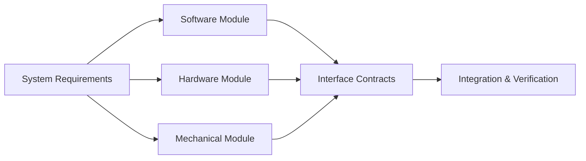
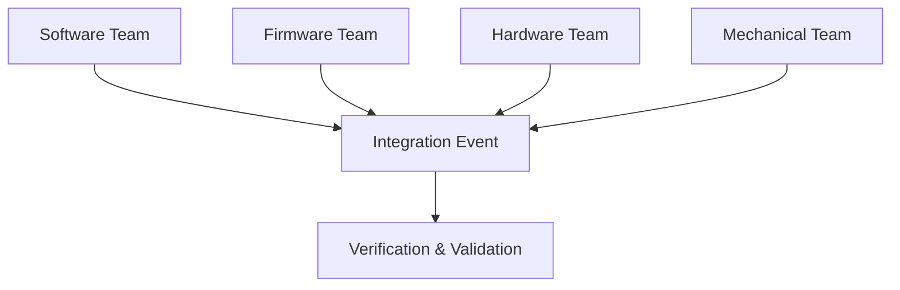

### Structured Benefits Inherited by Cornerstone

#### Introduction: The Foundation of Structured Methods

Contemporary engineering methodologies did not emerge from a vacuum but from decades—often centuries—of hard-won lessons in risk, complexity, and the demands of organizational learning. The Cornerstone framework arises from a critical evaluation of structured approaches, selecting and adapting their most robust benefits to the realities of integrated product development. By examining these inherited advantages systematically, one can understand how Cornerstone maintains regulatory discipline, traceability, and architectural clarity—attributes essential for multi-domain teams contending with both the tangible consequences of hardware error and the pace of digital change.

This section probes the structured underpinnings that Cornerstone incorporates, focusing primarily on those inherited from systems engineering traditions (notably, the V-model), traditional phase-gated delivery, disciplined architectural practices, and the process rigor informed by regulatory environments. Rather than uncritically reproducing the mechanisms of the past, Cornerstone distils their substantive value—embedding predictability, transparency, and system integrity—while avoiding their excess rigidity or delay.

---

#### Requirements Traceability and Flow: The Backbone of Accountability

One of the most significant inheritances from structured systems engineering is the insistence on end-to-end traceability. In complex product ecosystems—where a misinterpreted requirement can propagate across software, firmware, hardware, and mechanical subsystems—the ability to trace every regulatory, user, and technical demand through to its implementation, verification, and validation is non-negotiable. The V-model’s distinctive left-to-right trace—requirements flowdown, specification decomposition, design, and then return up via detailed validation—remains a conceptual anchor within Cornerstone.

What Cornerstone retains, however, is not the static mapping of requirements to artifacts but the dynamic, version-controlled evolution of traceability. Docs-as-Code becomes the mechanism: requirements, risks, and technical decisions are explicit, living entities, updated in tandem with product design. This enables both auditability and adaptability, preserving the rationale and context for key choices even as teams iterate.

Practically, this traceability enforces several benefits:
- **Verification and Qualification Integrity:** At any point, teams must be able to demonstrate that every system-level requirement is decomposed into implementable work, and that tests and reviews genuinely close the loop to original intents.
- **Impact Analysis:** Proposed changes—whether in code, PCB layout, or regulatory environments—can be rapidly analyzed for downstream or upstream consequences, reducing the occurrence of orphaned or invalidated requirements.
- **Continuous Compliance Readiness:** As regulatory and quality audits may occur asynchronously with delivery milestones, Cornerstone provides a perpetual state of compliance documentation—rather than scrambling to reconstruct trace at arbitrary “gates.”
- **Structured Risk Response:** Traceability directly underpins risk management, as potential failure modes (e.g., FMEA outputs, hazards analysis) can be explicitly linked to both mitigations and residual risk acceptance.

As projects scale, the cost of poor traceability becomes prohibitive—manifesting in missed requirements, failed audits, or defective integrations. Cornerstone’s insistence on structured, living traceability—rather than merely iterative requirements gathering—mitigates these sources of organizational fragility.

---

#### Formal Verification and Validation: Embedded in the Lifecycle

A further dimension of structured methodologies is the explicit linkage of development activities to verification (confirmation that the system is built to specification) and validation (confirmation that the specification meets user/business needs). In the V-model, each decomposition step—from requirements to specification to subsystem—has a corresponding verification activity, reinforcing bi-directional visibility and timely defect detection.

Cornerstone adopts these formal mechanisms but makes them continuous and context-responsive, not limited to gated review boards or monolithic qualification events. Verification and validation planning is conducted upfront, but these plans themselves are subject to controlled evolution as the architecture and requirements mature. This hybridizes the static discipline of the V-model with the iterative, risk-driven reality of modern product teams.

Moreover, by embedding verification artifacts and validation protocols as living documents in the development baseline, Cornerstone supports:
- Early detection and mitigation of ambiguity in requirements or design, through in-progress review, simulation, or virtual/hardware-in-the-loop testing.
- Progressive hazard tracking, enabling the team to maintain a “weakest link” view of risk resolution as dependencies or use environments shift.
- Integration of automated and manual test infrastructure for reproducibility, regulatory reporting, and evolution of coverage analytics.

This sustained verification-flow ensures that compliance and quality are not afterthoughts but are built directly into each increment of delivery—as demanded by regulated sectors such as medical, automotive, energy, or aerospace.

---

#### Architectural Discipline: Modularization and Decision Trace

Structured engineering traditions recognize architecture as more than a technical diagram; it is an organizational contract governing boundaries, interfaces, and the evolution of system form. In the absence of explicit architectural discipline, product teams encounter uncontrolled interdependencies, exponential combinatorial risk, and local team optimizations that degrade systemic coherence.

Cornerstone draws directly from the structured specification, modular interface management, and version-controlled baselining of classical systems engineering. It emphasizes:
- **Explicit Modular Boundaries:** Every architectural element (software module, PCB, mechanical subsystem) must have clear responsibilities, explicit contracts, and well-documented interfaces—supporting both parallel development and integration predictability.
- **Architectural Decision Records:** Design choices are recorded, rationalized, and linked to requirements, risk context, and trade studies, enabling future maintainers to reconstruct why the system “is the way it is,” even as teams adapt.
- **Change and Variant Control:** Architectural modularity supports the introduction of feature variants, hardware spins, or software line extensions without “ripple failures” that challenge traceability or compliance.

These structural elements are both technical and organizational. Teams can be mapped to architectural boundaries, with cognitive load and value delivery shaped by the modularization of the product. This approach also supports explicit readiness gates and review events at critical architectural seams.

##### Modular Architecture, Flow, and Integration Points

A simplified illustration of architectural modularity and its role in integration is shown below:

This diagram demonstrates that, while teams work semi-autonomously on modular elements, integration is enforced via explicit contracts and structured verification—preventing uncontrolled divergence.

---

#### Incremental Readiness and Stage Control

Traditional phase-gate delivery and systems engineering models promote the concept of explicit project readiness gates: structured milestones that signify the completion of a life cycle phase (e.g., requirements review, design freeze, technical review, verification complete). These gates serve both as synchronization points—aligning cross-disciplinary efforts—and as opportunities for risk and scope reassessment.

Cornerstone recognizes the value of these disciplined transition gates but reinterprets them as context-scalable, living “readiness” criteria. Rather than monolithic, one-size-fits-all phases, incremental readiness is determined by the risk, complexity, and reversibility of each subsystem or deliverable. Readiness reviews are conducted at multiple levels of granularity, and their stringency is tailored by compliance risk, business context, and product criticality.

This approach yields two salient structured benefits:
- **Synchronized Integration:** Cross-domain development (software, hardware, mechanical) is aligned by shared readiness events, preventing asynchronous progress that undermines integration testing or compliance reporting.
- **Sustained Risk Visibility:** At each readiness review, risk posture (technical, schedule, regulatory) is reevaluated, ensuring that emergent hazards or requirement shifts drive the update of plans—not deferred until postmortem analysis.

Unlike pure agile models, which may defer integration until late in the cycle, Cornerstone maintains the rigor of structured stage control, but distributes it throughout the life cycle to sustain momentum and risk awareness.

---

#### Documentation Rigor and Auditable Artefacts

Engineering disciplines operating in regulated or high-impact environments have long recognized that organizational memory—captured through disciplined, version-controlled documentation—is core to both quality and legal defensibility. The V-model, process standards such as ISO 13485 (medical), IATF 16949 (automotive), and IEC 61508 (functional safety), as well as industry frameworks like INCOSE SE Handbook, all enforce exacting documentation and evidence requirements.

Cornerstone does not dilute these standards; rather, it adapts them to contemporary tooling and collaboration paradigms:
- Documentation is managed “as code,” versioned alongside product artefacts, supporting both formal review and rapid update.
- Structured templates, conventions, and linkage mechanisms allow for both local team autonomy and global process coherence.
- Audit trails are intrinsic, ensuring the provenance of every decision, requirement, test artifact, or risk mitigation.
- Living documentation enables both incremental and holistic review, supporting both the real-time needs of product teams and quarterly/annual external audits.

In practice, this shifts documentation from a “necessary evil” (elaborated only for a review board) to an operational asset, reducing the overhead associated with regulatory rework, knowledge loss through personnel churn, or the hidden risk of undocumented assumptions.

---

#### Risk Management: Continuous and Actionable

No structured method has succeeded where risk management was ad hoc or retrospective. The V-model, for all its formalities, embeds risk assessment during requirements, design, and verification. Similarly, regulatory models demand explicit risk identification, analysis, and documented mitigations, assessed throughout the life cycle.

Cornerstone inherits—and extends—these structured risk management mechanisms:
- **Continuous Risk Assessment:** Risks are tracked as living entities within the product baseline, reviewed at each readiness gate and incrementally as product understanding matures.
- **Cross-Linkage to Requirements and Verification:** Each risk is tied to affected requirements and specific risk controls, verification tests, or architectural decisions—ensuring the lifecycle closure of each hazard or failure mode.
- **Risk-Driven Planning:** Iterations and increments are explicitly prioritized by risk retirement, not just feature delivery. This supports not only regulatory compliance but also robust business risk management (e.g., supply chain, obsolescence, cyber threats).

In operation, this minimizes the classical “bow wave” of deferred risk—where systemic weaknesses are only confronted during release gating or after field failure.

---

#### Embedded Quality and Defect Prevention

Structured delivery approaches operate from the assumption that quality cannot be inspected into a product; it must be designed in and continuously verified. The V-model, through embedded verification steps and formal review events, has historically provided a mechanism for early defect discovery and containment.

Cornerstone both inherits and evolves these mechanisms:
- Verification activities are embedded alongside development tasks, supported by automation wherever feasible (e.g., continuous integration, hardware-in-the-loop, simulation).
- Reviews and code/system audits are made routine and blameless, not punitive or infrequent events. This shifts quality ownership to teams as a systemic property, encouraging the surfacing of ambiguity and error at source.
- Defect prevention and containment analysis (e.g., root cause analysis, process improvement) are not reserved for end-of-phase retrospectives but are part of a learning architecture embedded throughout the lifecycle.

This alignment ensures that product increments are not accumulating “technical interest” (i.e., deferred defects that become costlier to resolve as the product matures) but remain robust, verifiable, and ready to withstand both internal review and market scrutiny.

---

#### Organizational Clarity and Process Discipline

Perhaps the most under-appreciated inheritance from structured delivery is the organizational discipline it brings. By specifying roles, responsibilities, governance boundaries, and escalation paths, structured methodologies create clarity—particularly vital as product teams scale, integrate new suppliers, or operate cross-locationally. This discipline is central not just to delivery, but to sustaining operational safety, decision velocity, and team autonomy within the bounds of systemic coherence.

Cornerstone retains structured governance mechanisms, re-engineered for hybrid operation:
- Program and project roles are delineated, with explicit responsibilities and accountability mapped to both the product architecture and delivery process.
- Decision records, gate reviews, and escalation mechanisms safeguard against unregulated divergence or institutional inertia.
- Modular process boundaries enable local tailoring, but are anchored by a common substrate of process principles, tooling interfaces, and review protocols.

For practitioners, this means that change control, configuration management, supplier integration, and escalation processes are not left to improvisation, but systematically enabled.

---

#### Alignment With Regulatory and Standards Frameworks

Integrated products, especially in regulated industries, cannot choose their process demands freely. Compliance with relevant standards—such as ISO 26262, IEC 62304, AS9100, or company-specific quality management systems—is non-negotiable. Traditional methodologies provide the language and mechanisms for satisfying these constraints, from formal review records to evidence-based signoff.

Cornerstone inherits this standards-alignment through:
- Structured mapping of process artifacts and events to regulatory deliverables, ensuring that process evidence is always at hand.
- Enabling gap analysis as standards or regulatory expectations evolve, with living traceability simplifying remediation.
- Supporting “audit-readiness” at all times, not just at arbitrary project milestones or release events.

Combined with docs-as-code and automated evidence capture (from test runs, code reviews, and design changes), Cornerstone reduces the cost and friction of compliance, directly aligning day-to-day engineering work with mandatory governance.

---

#### Sustaining System-Level Thinking Amidst Team Autonomy

Structured approaches emphasize the perspective that products are systems—composed of interacting, interdependent components, not just a collection of features or user stories. This systems view is vital when managing cross-domain complexities, systemic hazards, and architectural evolvability.

Cornerstone keeps this systems perspective as a continuous thread throughout its lifecycle:
- Requirements, risks, architectures, and verification plans are continuously evaluated at both subsystem and whole-system levels.
- Integration points are engineered not as afterthoughts, but as first-class design events, with feedback and system tests confirming emergent behaviors and unintended interactions.
- System-level trade studies and performance verification are routine, not deferred to handover or end-of-phase integration.

Practiced with discipline, this approach deters the “component myopia” that plagues purely local optimization, ensuring that team autonomy enhances rather than degrades system performance and integration.

---

#### Structured Integration Points: Orchestrating Synchronization Across Domains

A defining principle in structured methodologies is the orchestration of integration points—planned junctures where outputs from disparate domains are brought together for verification, interface validation, and risk assessment. The failure of such coordination results in late-stage surprises, emergent incompatibilities, and disruptive rework.

Cornerstone inherits this concept, but adapts it for hybrid, multi-speed, cross-domain development. Integration points are:
- Defined as explicit, versioned artifacts—anchoring architectural contracts and acceptance criteria.
- Managed through both workflow and tooling, enabling gated builds, deployment pipelines, and coordinated test events.
- Supported by readiness checklists that are tailored by risk profile, domain, and criticality, not simply by schedule.

This enables flexible, risk-driven iteration without yielding to local “velocity” pressures that would undermine systemic integration. It supports the synchronization of distinct cadence domains (such as frequent firmware releases juxtaposed with quarterly hardware board spins).

An illustration of these multi-domain integration points is provided below:

Here, each discipline contributes to an integration event, which is then assessed through verification and validation activities, closing the loop with system requirements.

---

#### Conclusion: Structured Discipline as Enabler, Not Constraint

The Cornerstone framework does not reject the rigor, discipline, and systemic clarity of structured engineering traditions; rather, it synthesizes them—pruning rigidity while enhancing adaptability and continuous learning. The structured benefits inherited by Cornerstone persist as essential scaffolding: traceability, verification linkage, modular architecture, disciplined documentation, explicit risk management, organizational clarity, and system-level thinking. These are not ceremonial holdovers but are actively re-engineered to thrive in hybrid realities.

By embedding these practices in continuous, living artifacts—and synchronizing them to team rhythm and risk cadence—Cornerstone achieves what neither pure V-model nor undisciplined Agile could offer alone: robust, audit-ready, value-responsive product delivery, across the full spectrum of software, firmware, hardware, and mechanical domains. Structured discipline, thus, becomes an enabler of innovation and resilience, not its adversary—a cornerstone, rather than a constraint, for integrated engineering delivery.