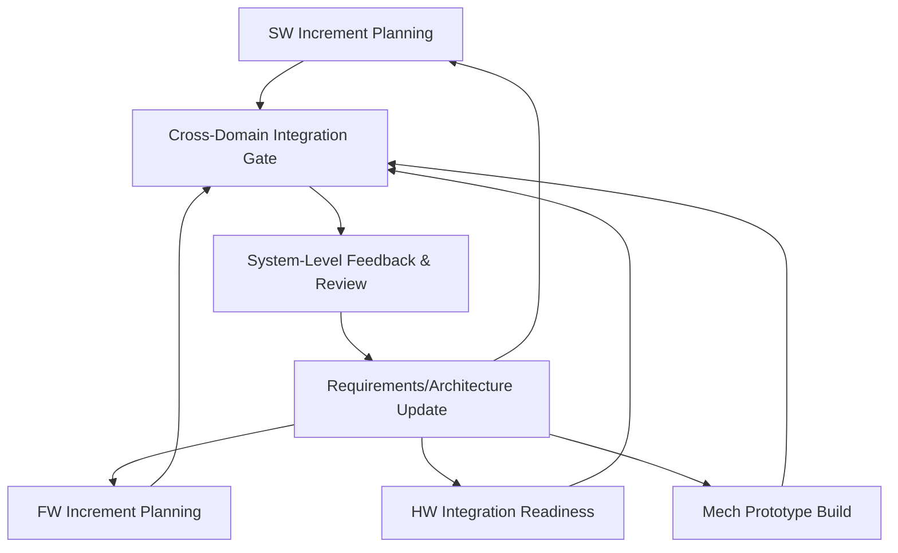

# The Contribution of Agility within the Cornerstone Framework

Agility, as an engineering and organizational paradigm, possesses well-understood virtues and well-known limitations. In conventional software domains, Agile methods have demonstrated the value of early delivery, responsive change management, and risk containment through iteration and empowered teams. Yet in multidisciplinary contexts—where software, firmware, hardware, and mechanical systems are deeply entwined and subject to regulatory or mission-critical constraints—pure Agile approaches rarely prove sufficient. Cornerstone’s hybrid model, therefore, does not simply graft Agile techniques onto traditional structures but reconceptualizes agility as an engine for adaptation, learning, and value focus within a rigorously systematized and traceable environment. Understanding this integration requires a precise account of how agility is operationalized within Cornerstone, its points of alignment and divergence with canonical Agile practices, and the substantive ways in which it advances multidisciplinary product development.

## Agility: Principles and Mechanisms

At its core, agility centers on embracing change, optimizing for learning, and empowering those closest to the technical problem to make informed decisions. Agile frameworks, particularly Scrum, Kanban, and Extreme Programming (XP), encode these values through lightweight ceremonies, short feedback cycles, cross-functional team composition, and relentless prioritization of customer value. Conventional Agile assumes frequent delivery is possible, the cost of change is manageable, and requirements evolve through continuous collaboration.

Within these approaches, iterative delivery serves not merely to decompose work but to generate learning opportunities—surfacing assumptions, exposing integration risk early, and diminishing the probability of catastrophic late-stage failures. Technical practices such as unit testing, continuous integration, and rapid prototyping are essential in realizing this vision. The structure of Agile ceremonies (stand-ups, retrospectives, demos, planning sessions) enforces both regular inspection and the discipline of reevaluation, thus reducing process inertia and feedback delays.

However, such mechanisms—prioritized backlogs, story points, and minimum viable products—are optimized for domains where requirements are negotiable, software change is inexpensive, and regulatory adherence is lightweight or post-facto. In hybrid or hardware-intensive domains, the cadence of work, risk profiles, and integration realities differ materially. The risk is not that agility becomes irrelevant, but that it must be transposed, reframed, and bounded to maximize its benefit without exposing the organization to compliance or systemic failure modes.

## The Role of Agility in Cornerstone

The Cornerstone framework draws upon agility not as a wholesale importation of software-centric practice, but rather as a scalable set of principles and patterns designed to inject resilience, responsiveness, and learning into the fabric of disciplined engineering. This integration proceeds on several axes: iteration, feedback, adaptive planning, risk management, and team empowerment—all underpinned by explicit boundaries established by the broader systems engineering context.

### Iteration Beyond the Backlog

In Cornerstone, iteration is no longer solely the purview of product developers or Scrum teams delivering software increments. Instead, iterative cycles are embedded throughout engineering: requirements definition, architectural decomposition, integration, verification, and validation—all become iterative in character, bounded by explicit gates that coordinate value flow and risk exposure.

In practical terms, this means that hardware breadboards or mechanical prototypes are delivered and evaluated in cycles that align, as closely as constraints allow, with firmware and software increments. Design of Experiments (DOE), architectural prototyping, and simulation-driven exploration are all scheduled to maximize feedback and surface architectural hazards early. Iteration becomes a systemic property, not an idiosyncratic practice of a single discipline.

This cross-domain iteration is formalized in the synchronization points or readiness gates universal to Cornerstone, which are both less rigid and more frequent than traditional V-model milestones. Each gate is informed not just by the completion of upstream artifacts but by critical learning and integration outcomes, bridging the "build-measure-learn" feedback loop with system-level assurance of traceable intent and outcome.

### Responsive Change Management Within Explicit Boundaries

A central tenet of Agile is the welcome embrace of directional change—whether derived from customer feedback, shifting priorities, or emergent technical understanding. In Cornerstone, this adaptability is retained, but tempered by the need for traceability and impact visibility.

Requirements, design decisions, and risks are treated as living artifacts, subject to revision in light of learning. However, changes are managed through structured mechanisms: living documentation, docs-as-code, and explicit architectural boundaries. Each alteration triggers impact assessment, audit trails, and synchronization with dependent domains; this coupling seeks to preserve both adaptability and the systemic coherence required for compliance and integration stability.

Consider, for example, a regulatory requirement changing mid-development. Legacy waterfall approaches might initiate cumbersome change-board processes, introducing latency and technical debt as alterable and fixed artifacts drift apart. Pure Agile might allow rapid change but struggle to maintain synchronized regulatory mapping. Cornerstone's hybrid workflow ensures that requirements changes trigger an explicit, version-controlled cascade through downstream verification activities, architectural decisions, and assurance artifacts. This responsiveness preserves agility's value while operationalizing traceability, assurance, and auditability.

### Teams Empowered for Value and Learning

Cornerstone leverages agility’s commitment to autonomous, cross-functional teams. Product and engineering teams are organized not around subsystems or functionally siloed competencies, but around value streams and architectural modules—aligning cognitive load with deliverable flow. The boundaries of autonomy are governed by the modular, living architecture but within those boundaries, teams are empowered to sequence, prioritize, and innovate through their own iteration.

Agility contributes here by driving decision-making downward, enabling those with the deepest technical and contextual knowledge to resolve ambiguities and optimize trade-offs within architectural constraints. However, organization-level guardrails—roles, escalation paths, and integration events—ensure that distributed autonomy does not devolve into local optimization at the cost of systemic outcomes.

This structure, in effect, allows teams to internalize the “inspect and adapt” ethos. Regular reviews of living artifacts—be they requirements, test cases, interface contracts, or prototypes—are instituted, supporting both compliance and agility. Team retrospectives, traditionally focused on delivery improvement, are expanded to examine documentation completeness, risk status, and architectural soundness—ensuring that process adaptation is broad-based, not parochially software-centric.

### Incremental Risk-Driven Delivery

Agility’s orientation towards continuous delivery of value can appear at odds with safety-critical, regulated, or hardware-intensive environments, where "done" may not be achievable until elaborate test campaigns or external certifications are complete. Cornerstone addresses this by embedding agility within a context of incremental, risk-calibrated value delivery.

Partial solutions—such as subsystem breadboards, emulated environments, or incomplete assemblies—are explicitly recognized as valuable deliverables if they illuminate learning, de-risk integration, or advance compliance demonstration. Verification is planned and executed as a sequence of incrementally growing coverage and depth, with early activities focused on highest-risk areas. This demands clear standards and interfaces for partially complete work, but it enables staged learning and value realization even when final system-level "done" is months away.

In this sense, agility serves as a governor for risk; the highest-uncertainty items are prioritized for early prototyping and integration. Failures, when they occur, are contained and informative rather than deferred and catastrophic. This is particularly vital for attributes that cannot be reliably simulated or estimated, such as physical integration tolerances or emergent electromagnetic compatibility (EMC) behaviors.

#### Mechanisms at the Workflow Level

Within Cornerstone’s workflows, Agile-derived cadences—such as regular planning, review, and demo cycles—are adapted to the needs of cross-disciplinary products. While Scrum sprints may translate unevenly to mechanical release cycles, the regularity of demo-driven integration or board-level architecture reviews ensures that all domains are exposed to systemic forces and ongoing improvement.

Mermaid Diagram: Synchronization of Multi-Domain Iteration in Cornerstone

This diagram illustrates how iteration cadences in software, firmware, hardware, and mechanical domains are each coordinated to feed into synchronized integration gates, enabling system-level review and bidirectional feedback into both requirements and architecture. The cyclical nature preserves learning while ensuring artifacts are evolved in harmony with the broader system goals.

### Living Documentation and Continuous Alignment

Traditional Agile places little emphasis on documentation formality, preferring tacit knowledge and product over artifacts. In domains where audit, safety, and maintainability are paramount, this is an unwise orientation. Cornerstone resolves the tension by fusing the agility of living, version-controlled docs (docs-as-code, model-driven documentation, automated traceability) with the rigor of structured design and assurance artifacts.

By embedding documentation and specification into everyday tools—source control, code review, issue tracking—Cornerstone ensures that Agile iterations are not "invisible" or untraceable. This enables both rapid change and persistent auditability, resolving a key gap in “pure” Agile methodologies. Teams are incentivized to treat documentation not as a static burden but as a living system asset, with quality, traceability, and completeness reviewed as a first-order concern alongside functionality.

## Alignment with and Divergence from Established Agile Practices

### Preserved Virtues

Cornerstone retains the critical strengths of Agile: fast learning through feedback, reduction in waste by early error discovery, team ownership of delivery challenges, and prioritization of value over historical inertia. The focus on flow and elimination of blockages at the team level is deeply consistent with Lean and Kanban thinking, emphasizing the smooth progression of work across value-creating activities with minimized handoffs.

Similarly, Cornerstone’s approach to retrospectives, continuous improvement, and blameless reviews is rooted in Agile’s learning culture. The system builds upon these, extending opportunities for reflective learning beyond code and backlog to encompass architectural error patterns, integration pain points, and cross-domain communication breakdowns.

### Key Divergences: Boundaries, Traceability, and Compliance

Despite these alignments, Cornerstone diverges sharply from Agile orthodoxy in domains where system and process constraints become material. The key differentiating factors are explicit boundaries and non-negotiable traceability requirements. In the coordination of change, for instance, Agile typically tolerates substantial in-flight rework; Cornerstone leverages versioning, branching, and explicit impact analysis to ensure changes are systematically absorbed across domains.

A second divergence lies in the management of compliance, both internal (architectural, quality, safety) and regulatory. While Agile favors “just enough” documentation, Cornerstone determines sufficiency as a function of regulatory standards, organizational risk appetite, and lifecycle maturity—measured using artifacts that are both outcome-oriented and objectively assessed for readiness.

Third, the multidisciplinary nature of Cornerstone’s target environment demands integration points across asynchronous and dissimilar cadences. Pure Agile can struggle when releases, integration test campaigns, and hardware builds cannot be completed in software-like cycles. The hybrid model codifies cross-domain synchronization, managing asynchrony as a design constraint rather than a breakdown.

### Mechanisms for Formalized Feedback Loops

While Agile praxes such as “demo at the end of every sprint” are effective in software due to low transaction costs, hardware and system-level integration events are higher consequence and require greater coordination. Cornerstone introduces formalized integration events—planned, modular, and coordinated—to both synchronize cross-domain effort and validate emergent systemic properties. These may align with, but are not constrained by, typical Agile cycles, and are explicitly linked to readiness gates that control risk exposure and compliance visibility.

## Practical Realities and Engineering Considerations

### Lifecycle Constraints and Asymmetries

In the real world, engineers face non-negotiable lead times for custom silicon, long-cycle regulatory submissions, and organizational overheads that do not compress simply by adopting Agile ceremonies or tools. Systems integration is an inherently staged process: prototypes, engineering builds, and pre-production exist for physical and economic reasons not susceptible to pure iteration.

Cornerstone’s agility is, therefore, inherently context-dependent. Teams must negotiate the balance between cost of change, risk of delay, and availability of representative test environments. Partial integration, virtualization (simulation/hardware-in-the-loop testing), and staged verification are all tools to inject agility where feasible, while respecting hard limits where unavoidable. The “minimum viable increment” is not always a customer-shippable product but may be a de-risked subsystem, integration spike, or regulatory evidence pack.

### Architectural Implications and Trade-Offs

Agility manifests most powerfully when coupled with explicit, modular architectures. Coordination across boundaries—software/firmware APIs, hardware abstraction layers, mechanical interfaces—enables teams to iterate internally while minimizing coupling risk. Weak or implicit boundaries undermine agility by increasing the cost and risk of change propagation; strong and transparent boundaries make iterative value delivery and early integration both feasible and safe.

The demand for disciplined modularization cannot be overstated. For example, an API change in embedded firmware may trigger minor software refactoring but require costly hardware respin if interface stability is not maintained. Cornerstone’s architecture review practices and living interface specifications ensure that agile iteration does not inadvertently propagate instability system-wide.

### Failure Modes and Mitigations

Common integration antipatterns—such as premature optimization, feature branching detached from system baseline, or “agile in name only” ceremonies—pose real risks to Cornerstone adoption. The framework anticipates such failure modes by making readiness and integration gates explicit, instituting system-level test automation where feasible, and encoding verification and validation as first-class entities in the workflow. Autonomy is meaningful only within the context of globally aligned incentives and integration constraints.

Operational redundancy—such as duplicate documentation, misaligned domain priorities, or contradictory interpretations of compliance sufficiency—are addressed by the systemic model of living documentation and single-source-of-truth artifact management. Approach validation is a matter of both individual and collective discipline, underpinned by clear escalation and decision-making pathways.

## Agility as an Enabler, Not an Orthodoxy

Crucially, the role of agility in Cornerstone is not dogmatic. Agile values are distilled, contextualized, and operationalized within the broader edifice of integrated product development—a discipline characterized by uneven tempos, regulatory imperatives, and cross-domain dependencies absent from purely digital engineering. Agility is a lever for maximizing information flow, value discovery, and error containment, but it is always constrained and directed by architectural discipline, verification rigor, and context-sensitive governance.

In the end, Cornerstone’s distinctive approach lies in its recognition that agility is not opposed to discipline, but is itself a form of discipline—a structured approach to navigating uncertainty, managing risk, and maximizing value. By weaving agility’s principles into the lifecycle of multidomain product development, and supplementing them with explicit traceability, modular boundaries, and readiness calibration, Cornerstone realizes the promise of adaptive, resilient, and compliant engineering for contemporary integrated systems.

---

**Summary**: Agility in Cornerstone is not the simple transplantation of Agile techniques, but a principled integration that injects iterative learning, fast feedback, and adaptive delivery into the rigor of systems engineering. Through explicit architectural boundaries, risk-driven iteration, and living documentation, agility and discipline are not at odds but are mutually reinforcing—enabling sustained innovation, compliance, and organizational learning within the complex realities of integrated product development.