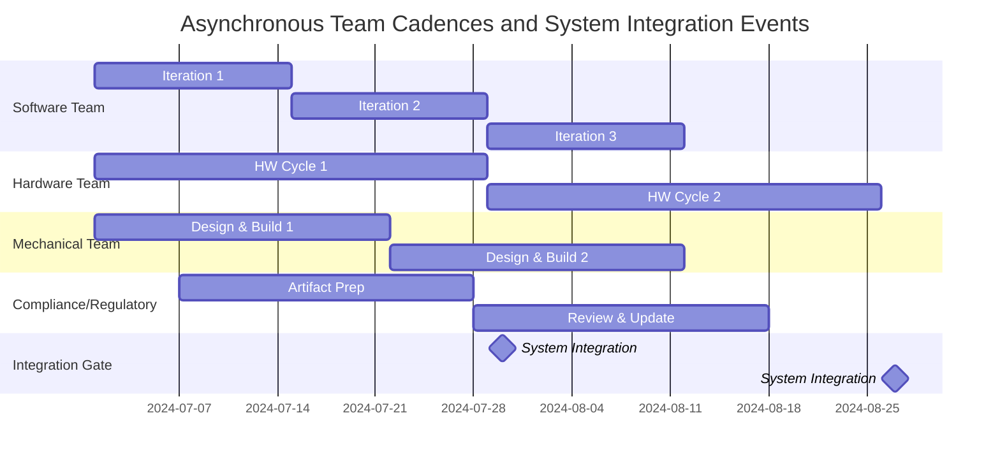

---
### Flexibility Versus Prescriptive Scaling Frameworks in Integrated Product Development

#### Introduction: The Demand for Scalable Coordination

The transformation of engineering and product development over the past two decades has been characterized by ever-increasing product complexity, the integration of diverse technological domains, and intensified expectations for iterative delivery and stakeholder value. As organizations have scaled, the question of how to coordinate large numbers of teams across multiple technology stacks—spanning software, firmware, hardware, mechanical, and even regulatory disciplines—has become a dominant concern. Standardized scaling frameworks emerged, promising structured solutions to orchestration at scale. Yet, as experience in regulated and multidisciplinary environments has grown, so too has recognition of their practical limits and trade-offs.

It is in this context that the Cornerstone framework’s nuanced positioning becomes clear. Cornerstone purposefully balances the flexibility required for adaptive learning and flow in uncertain environments with the discipline necessary for traceability, compliance, and architectural integrity. The interplay between this flexibility and the more prescriptive orientations of established scaling frameworks underpins much of what differentiates Cornerstone in integrated product environments.

#### The Landscape of Prescriptive Scaling Frameworks

Prescriptive scaling frameworks, such as the Scaled Agile Framework (SAFe), Large-Scale Scrum (LeSS), Spotify Model derivatives, and Disciplined Agile Delivery (DAD), have become increasingly influential in large organizations attempting to scale agile delivery. Their roots are largely in software, but their adoption has often extended into multi-disciplinary domains.

Such frameworks formalize roles, ceremonies, backlogs, increment boundaries, and synchronization events, imposing defined structures over multiple teams. For example, SAFe prescribes layered organizational structures (teams, programs, solution trains), PI (Program Increment) planning, architectural runways, and a significant body of guidance for release governance. Similarly, LeSS defines cross-team coordination rules, shared backlogs, and explicit integration points.

Crucially, prescriptive frameworks aim to reduce coordination chaos by standardizing touchpoints, decision flows, and artefact boundaries. In domains where variability is limited and the team-of-teams model can be mapped relatively cleanly onto the product—such as pure-play software—this can support alignment and reduce ambiguity. The workflow often converges on synchronization intervals (e.g., quarterly planning), with an emphasis on uniform metrics and ceremonies.

However, in domains characterized by asynchronous lead times, strong physical dependencies, and the need to manage hardware, software, and regulatory artefacts concurrently, these mechanisms can become sources of rigidity rather than alignment.

#### Cornerstone’s Approach: Adaptation Over Prescription

Cornerstone recognizes that a singular, universally-applied operating rhythm does not respect the inherent variability of modern integrated product development. For instance, software iteration may operate effectively on fortnightly cycles, while hardware build-and-test cycles reflect longer lead times, dependency chains, and supplier interactions shaped by physical realities. Regulatory review cycles may be out of step with either, requiring compliance artefacts at different stages.

Whereas prescriptive frameworks seek to harmonize all teams around uniform cadences and ceremonies, Cornerstone seeks to orchestrate asynchronous domain workstreams through adaptive readiness gates, integration events, and architectural interfaces. Rather than enforcing shared iteration boundaries, Cornerstone aligns work through system-level concerns: interface stability, architectural cohesion, verification traceability, and flow of value.

A key enabler here is the modularization of architectural boundaries. By decomposing systems into modules with well-defined, contractually specified interfaces, domain teams gain autonomy to operate at the cadence best suited to their context, while still converging at integration points that deliver systemic learning and risk reduction. Modularization supports not only technical decoupling, but also organizational agility—teams can plan, iterate, and adapt within their architectural boundary without impacting overall integration readiness, provided their contracts are maintained.

#### Mechanizing Flexibility: Readiness Gates and Integration Events

At the heart of this orchestrated flexibility is the explicit abstraction of readiness gates and formalized integration events. Rather than imposing fixed increments (e.g., program increments spanning all disciplines), Cornerstone allows each team to progress work toward a state of “integration readiness” defined by agreed architectural and compliance criteria. Integration gates serve as focal points for system-level validation, aligning asynchronous streams for meaningful convergence and systemic learning.

This approach reflects practices from classical systems engineering (e.g., V-model stage gates) but refines them through agile learning loops. Work products are continuously advanced toward integration, but the system as a whole synchronizes through integration events, not arbitrary timeboxes. Feedback and risk discovery thus occur both locally within teams and globally at the system level.

Such synchronization is critical for identifying systemic risks, verifying cross-domain assumptions, and assessing the integrated function of partially or fully completed modules. This stands in contrast to the routine “demo” cadence of scaled agile frameworks, which can privilege superficial feature alignment over deep system learning.

##### Mermaid Diagram: Asynchronous Cadences and Integration Gates

The following Mermaid diagram illustrates the staggered cadences of different domain teams converging at periodic system-level integration events—a core pattern in Cornerstone that contrasts with the synchronized increments of prescriptive frameworks:

In this example, domain-specific work progresses on its natural cadence; system integration gates (milestones) synchronize the aggregate progress for holistic checks, learning, and risk mitigation.

#### Limits of Prescription: When Uniformity Hinders Engineering Flow

The constraints of strict scaling models emerge most clearly when considered in the context of multi-domain, regulated, or hardware-anchored product environments. Prescriptive frameworks often assume that backlog-driven development and uniform cadence are universally possible and desirable. However, in reality, lead times for PCB fabrication, regulatory review, or supplier sourcing are not compressible to fit a sprint schedule. Attempting to force such alignment leads to multiple pathologies:

- Teams may “game” system boundaries, deferring integration or faking demoable artifacts for ritualistic progress.
- Critical, non-incremental work—such as DA/DO-178B verification evidence, IPC/JEDEC conformance testing, or medical device risk documentation—may be marginalized in favor of backlog “velocity.”
- Bottlenecks can form at synchronization points, as dependent domains wait for artificially aligned increments, rather than progressing when truly ready.

Cornerstone eschews this uniformity in favor of flow-oriented orchestration. Artifacts, sprint cycles, and readiness criteria are bounded not by arbitrary cadence, but by architectural and compliance contract. Change is permitted—and even encouraged—for teams, but only within the explicit boundaries of system traceability, interface contract, and integration readiness.

#### The Role of Living Documentation and Traceability

A defining feature of Cornerstone that enables this orchestrated flexibility is the commitment to living, automated documentation—artifacted in version-controlled, Docs-as-Code systems. Versioning, traceability, and impact analysis are not afterthoughts; they are the mechanisms by which asynchronous and autonomous work can be made safe, auditable, and compliant.

While prescriptive frameworks often treat documentation as a parallel activity—governed by acceptance criteria or compliance checklists—Cornerstone internalizes it into the development flow. Requirements, architecture contracts, risk assessments, and verification plans are advanced alongside code and prototypes, subjected to the same mechanized integrations and controlled reviews. Changes propagate systematically due to explicit traceability links, allowing teams to operate flexibly while continuously preserving the system-of-record and requisite compliance state.

This practice grants teams autonomy to shape their local workflow—Kanban for hardware, Scrum for software, stage-gate for regulatory—while maintaining collective responsibility for integrated, versioned knowledge. The architectural record is not a periodically updated artifact; it is a living backbone of development that both enables flexibility and sustains compliance.

#### Trade-offs: Flexibility, Complexity, and Coordination Overhead

The embrace of flexibility is not without cost. By eschewing forced uniformity, Cornerstone accepts the burden of increased coordination at integration and architecture boundaries. System engineers, integration leads, and solution architects play a pivotal role in managing dependency risk and ensuring that local autonomy does not erode global system coherence.

Organizations must be prepared for the architectural and organizational investment in interface management, module partitioning, and the sustained discipline required for versioned documentation. Unlike prescriptive frameworks, where recurring ceremonies and artifacts can be enforced top-down, Cornerstone’s approach transfers a greater proportion of responsibility to technical leadership and cross-domain coordination mechanisms.

The risk of local optima—teams moving quickly within their bounded context while neglecting global system requirements—must be actively managed through readiness gates, system-level verification, and explicit risk burn-down mechanisms. The Cornerstone framework prescribes retrospectives and reviews that explicitly consider architectural and integration health, not merely feature progress.

#### Case Contrasts: Coordinating Iteration in Cornerstone Versus Prescriptive Frameworks

A practical example highlights the divergence. Consider an integrated medical device combining embedded firmware, custom PCB assemblies, mobile applications, and regulatory risk management. In a SAFe-oriented organization, all teams might be required to synchronize through a common PI cadence (e.g., 10-week cycles), collocated planning sessions, and backlog-driven objectives.

This approach often results in substantial friction as hardware teams struggle to align fabrication and certification cycles to the software release train, while documentation teams create compliance artifacts tailored to artificial increment deadlines rather than regulatory milestones. As a result, integration events may occur with incomplete or suboptimal fidelity, and technical debt accumulates as teams focus on meeting iteration ceremonies rather than actual system readiness.

Within a Cornerstone implementation, each domain operates on a cycle appropriate to its constraints. PCB prototyping is planned independently, with defined milestones for sample availability and DVT, but with interface requirements and integration plans co-developed and versioned alongside firmware and mobile app requirements. Regulatory specialists integrate with development teams not through sprint ceremonies, but via explicit artifact reviews tied to readiness gates—aligned to actual submission cycles and risk management plans. Integration occurs when all modules reach an agreed state of readiness, supported by versioned documentation demonstrating compliance and architectural conformance.

#### Integration with Broader Enterprise Systems and PLM

Flexibility at the delivery level must be reconciled with broader enterprise-scale controls, particularly Product Lifecycle Management (PLM) systems and requirements management (RM) tools. Prescriptive scaling models often impose rigid mappings between work artifacts and enterprise systems, potentially causing misalignments as not all product domains share uniform structures.

Cornerstone, by comparison, emphasizes artifact traceability at the system-of-record level, with interface connectors (typically APIs or lightweight integrations) ensuring that living documentation and versioned artifacts are synchronized with enterprise systems only at key control points. This reduces manual reconciliation overhead while preserving organizational governance. For regulated environments (e.g., ISO 13485 for medical devices, or FAA DO-178C for avionics software), this supports auditability without burdening teams with bureaucratic artifacts mismatched to their workflow.

#### Failure Modes and Guardrails

Absence of prescription can, if unmanaged, devolve into fragmentation and uncontrolled divergence. Common failure patterns include teams drifting from the compliance baseline, architectural contracts being neglected in the name of local optimization, or asynchronous cycles leading to “integration hell” as uncoordinated modules are forced together late in the lifecycle.

To guard against such failures, Cornerstone frames autonomy within architectural governance, explicit interface contracts, and periodic system retrospectives. Empowered teams are constrained not by process ritual but by the discipline of traceability, readiness gating, and the expectation of contributing to the system-level body of knowledge. Technical leadership addresses coordination not through enforced ceremony, but continuous system learning and architectural review.

#### Summary: Engineering for the Realities of Integrated Product Development

Cornerstone articulates an alternative to prescriptive scaling—one built on the realization that engineering realities in integrated products transcend the uniform cadences and ceremony-based alignment of software-centric frameworks. The demands of asynchronous domain cycles, complex physical dependencies, and compliance requirements necessitate a model that prioritizes flow, learning, and traceability over rigid schedule synchronization.

This is achieved not through abdication of discipline, but through a principled commitment to architectural modularity, integration-readiness, and living documentation. Flexibility, in the Cornerstone philosophy, is operationalized through mechanisms that respect the natural rhythms of each domain while ensuring that integration, risk management, and compliance are never compromised.

Integration events, readiness gates, and automated documentation infrastructure together create a robust, auditable, and adaptable delivery engine—one capable of responding to the true complexities of modern, multidomain product development without succumbing to either chaos or bureaucratic inertia.

In essence, Cornerstone’s distinctive contribution is to offer a model that is consciously flexible, yet never informal; adaptive to uncertainty, yet uncompromising on traceability and integrity; powerful for complex, regulated, and cross-disciplinary products where prescriptive scaling fails to fit. This makes it a reliable foundation for the next generation of integrated engineering organizations.