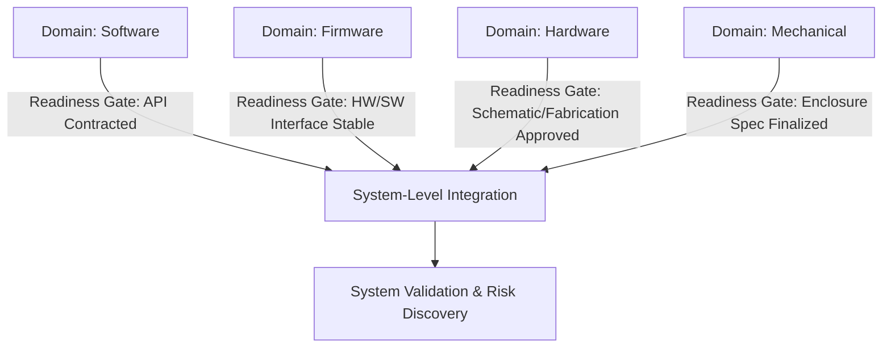

### Why Cornerstone is Uniquely Tuned to Multi-Disciplinary Engineering

#### Introduction

The demands of multi-disciplinary engineering—where software, firmware, hardware, mechanical, and systems engineering converge—necessitate an approach to product development that is neither a simple synthesis of existing methodologies nor merely an incremental evolution of traditional models. Cornerstone’s hybrid framework is not a compound of methodologies, but a deliberate response to the structural, procedural, and cultural challenges inherent in developing integrated, compliance-driven products across asynchronous domains. Its unique value lies in how it operationalizes rigor and agility as mutually reinforcing, rather than mutually exclusive traits, offering a blueprint for sustainable and auditable delivery in environments where software-like flexibility and hardware-bound constraints must coexist. This section examines the core attributes that uniquely position Cornerstone for success in complex multi-disciplinary settings, especially where the orchestration of diverse life cycles, traceability concerns, and continual integration are not optional, but foundational.

#### The False Dichotomy: Rigidity vs. Agility in Multi-Domain Contexts

Historically, engineering organizations confronting multi-disciplinary challenges have faced a forced choice between traditional systems engineering models—typically rooted in the V-model or waterfall lifecycles—and modern Agile/Lean frameworks, most optimally applied to software development. The former excels in rigor, traceability, and regulatory compliance, but often stifles adaptation and learning. The latter promises rapid iteration and team autonomy but can falter in domains prosecuting physical integration, asynchronous dependencies, or stringent documentation requirements. Attempts at direct transplantation of either approach into integrated product domains often exposes critical trade-offs or failure modes: loss of traceability, unaligned subsystem advances, compliance gaps, or late discovery of systemic integration risks.

Prescriptive scaling frameworks (such as Scaled Agile Framework [SAFe], Large-Scale Scrum [LeSS], or Disciplined Agile Delivery [DAD]) attempt to mitigate these issues through templated roles, ceremonies, and synchronized cadences. However, they are fundamentally rooted in software process logic and often impose uniformity where heterogeneity of cadence and discipline are structural necessities. Their extension into hardware or mechanical domains is rarely more than superficial, failing to address the unique lifecycles, asynchronous progression, or compliance rigor expected in regulated environments. To move beyond these limitations, an engineering organization requires an approach that can internalize cross-domain differences and explicitly orchestrate their integration, evolution, and traceability.

#### Cornerstone’s Structural Alignment with Multi-Disciplinary Realities

Cornerstone is designed from first principles to address the structural disconnects and integration points perfusing multi-disciplinary product environments. Unlike frameworks that impose uniformity from the top down, Cornerstone federates autonomy within systematically architected boundaries, reflecting the diverse rhythms, lifecycles, and regulatory burdens of each contributing domain. This is achieved through a blend of explicit architectural contracts, readiness gating, event-driven integration, and living documentation—all underpinned by version-controlled, compliance-ready artifacts.

At the heart of this approach is the concept of modularized architectural contracts, which serve as cross-domain interfaces formalized to support asynchronous development. Each subsystem—be it a microcontroller firmware, a digital PCB, or a mechanical enclosure—advances according to domain-appropriate cadences, so long as it maintains rigorously defined contract obligations. This enables each discipline to operate with a degree of autonomy, avoiding bottlenecks created by domains with slower inherent cycles, while maintaining traceability and aligned systemic progress.

Readiness gates act as dynamic, context-sensitive control points that mediate subsystem integration and progression. These gates are not phase-based checklists, but are contractually tethered to artifact maturity, interface stability, and risk exposure. Integration events pull validated increments into system-level assemblies, providing not only alignment and knowledge dissemination, but a forum for systemic risk discovery that is often missed in locally optimized, discipline-specific workflows.

The practical realities of asynchronous workflows in hardware and mechanical engineering are acknowledged: physical prototyping, design-for-manufacture cycles, and regulatory test campaigns do not map cleanly to regular software sprints or Kanban pull systems. By separating internal domain iteration from event-driven system integration, Cornerstone respects these constraints while continually enabling architectural convergence and compliance traceability. In this model, operational discipline supplants the need for artificially synchronized cadences, and “definition of done” emerges as a traceable, versioned fulfillment of architectural and regulatory obligations, rather than an abstracted team-level closure.

##### Mermaid Diagram: Asynchronous Domain Progression and Integration

This diagram represents the asynchronous advancement of multidisciplinary domains toward integration events governed by readiness gates, culminating in holistic system validation.

#### Beyond Templates: Adaptive Discipline and Architectural Governance

Cornerstone distinguishes itself by embedding adaptive discipline—rather than prescriptive process—as the mechanism for synchronizing multi-disciplinary teams. Rather than enforcing uniform artifacts or ceremonies, system and solution architects establish the critical architectural contracts and interfaces that undergird the product. This formalization is not simply documentation but an active boundary of accountability: changes to one domain’s deliverables trigger explicit traceability, impact analysis, and, where necessary, adaptation of contractual interfaces. This architectural scaffolding prevents local optimization from subverting systemic intent, a common failure mode in both loosely governed Agile adoption and rigid phase-gated models.

Governance in Cornerstone is simultaneously distributed and accountable: technical leadership absorbs the explicit overhead of architectural integrity, integration scheduling, and risk management. This reverses a typical anti-pattern wherein coordination responsibility is diffused across project managers or scrum masters without clear domain or system expertise. Instead, system architects and lead engineers serve as both custodians and facilitators, equipped with authoritative documentation, automated traceability, and continual feedback mechanisms. The result is that product reality remains congruent with product definition, and adaptations at the team level never become silent sources of divergence.

Living documentation—executed via Docs-as-Code principles—is a keystone of this model. Artifacts are version-controlled, subject to automated validation, and aligned with product bills of materials, change records, and regulatory submissions. This enables controlled agility: teams can iterate locally so long as traceability and readiness are maintained, and systemic learning is disseminated via coordinated system retrospectives. Compliance audits, regulatory filings, and lessons-learned exercises become natural byproducts of daily engineering practices rather than disruptive, after-the-fact reconciliations.

#### Traceability and Compliance Without the Bureaucratic Overhead

In regulated or high-assurance fields—medical, automotive, aerospace, and industrial automation, for example—traceability is not optional. Yet, in many organizations, traceability is perceived as a drag on flow: a documentation burden foisted onto engineering by non-engineering stakeholders for the sake of compliance rituals. Cornerstone resolves this dilemma by integrating traceability directly into the engineering workflow, repurposing the friction of compliance into a structural enabler of architectural visibility and risk management.

Automated trace links—unit, subsystem, and system-level—join requirements, design artifacts, verification activities, and released artifacts in a version-controlled ecosystem. Changes are never “fire-and-forget,” but trigger automated checks and explicit downstream reviews. Impact analysis becomes both lightweight and robust, informed by living contracts and architectural boundaries. Importantly, documentation evolves as the product evolves; artifacts are not static or only updated at phase gates, but are intrinsic outputs of ongoing engineering efforts.

PLM (Product Lifecycle Management) and RM (Requirements Management) systems are not engineered as bureaucratic bottlenecks but are treated as event-driven repositories that reflect auditable states at releases, integration events, and major architectural milestones. Change control is therefore evidence-based and appropriately asynchronous: not a blanket gate on agility, but a focused discipline at the points where risk, compliance, or systemic coherence are genuinely at stake. This approach satisfies regulatory and audit requirements while preserving flow and enabling continuous learning.

#### Managing Asynchronous Cadences and Cross-Domain Dependencies

The orchestration of asynchronous progress is a central challenge for integrated engineering. Hardware, software, and mechanical elements typically mature at divergent rates, with dependencies governed not just by schedules but by deep architectural entanglements. Classic Agile assumes a backlog of “ready” features and a relatively uniform team cadence; this premise quickly collapses where a mechanical prototype lead time outstrips a firmware iteration by months, or where hardware test campaigns must align with certification windows.

Cornerstone addresses this by operationalizing contractual interfaces and readiness criteria as the central units of progress, rather than task board tickets or phase milestones. The state of each subsystem is defined informationally—not simply by planned completion, but by explicit fulfillment of interface obligations, verification activities, and architectural check-ins. As a result, progress is tangible, asynchronously materialized, and independently auditable for each discipline.

Integration events function as alignment points rather than rigid deadlines, serving as opportunities for values-based synchronization—identifying cross-domain learning, initiating systemwide risk reviews, and updating architectural direction based on emergent evidence. This contrasts with the drag and uncertainty typical of phase-gate “hand-offs” or the superficial “agile release trains” of scaling frameworks, which frequently force synchronization rather than enabling productive asynchrony. In Cornerstone, the cadence and content of integration are governed by product and architectural need, not ceremony.

#### Risk Management as an Ongoing, Systemic Activity

Integrated engineering programs are exposed to compounded risks not only from domain-specific issues—such as obsolescence in electronic components or safety in mechanical systems—but from unpredictable inter-domain interactions. Traditional approaches often fail to expose these systemic risks until late in the lifecycle, leading to costly late-phase corrections or project-term failures.

By embedding risk discovery within system-level integration events, and ensuring living contracts reflect ongoing realities, Cornerstone brings risk management forward as an explicit, iterative discipline. Verification and validation artifacts are not gated exclusively at major milestones, but are incrementally matured and continually tested against integrated assemblies. Changes, regression failures, and emergent system behaviors are rapidly surfaced and contextualized, encouraging both preventive and adaptive problem solving.

This execution of “risk as a flow discipline”—rather than a periodic audit—distinguishes Cornerstone from both traditional and Agile-derived patterns. Systemic risks are neither buried in phase documentation nor lost in sprint backlogs; they are treated as living, shared responsibilities, visible in the same traceability and documentation infrastructure enabling compliance and architectural learning.

#### Organizational Implications: Team Structures, Leadership, and Accountability

Cornerstone’s approach to team design, leadership, and technical responsibility is equally derived from the practicalities of integrated engineering. Value streams are mapped not according to functional silos or phase-driven work packages, but by coherent architectural modules and system-level flows. Cross-functional teams are structured to have direct ownership of interface-bound subsystems, with sufficient autonomy to adapt and iterate, but explicit accountability to readiness criteria and architectural contracts.

This structure promotes distributed expertise while bounding autonomy within architected domains, minimizing the risk of misaligned “local optima.” Technical leadership is not an administrative function but an active engagement; architects and lead engineers mentor, arbitrate interface changes, and act as curators of systemic risk, artifact traceability, and contract integrity. The burden of coordination thus shifts from non-technical project overhead to technical authorities embedded within the flow of delivery.

Organizational learning is reinforced through system retrospectives—cross-domain engineering reviews that parallel operational retros at the team level but focus on integration, architectural adaptation, and documentation evolution. These events support culture change away from blame assignment and toward systemic adaptation, a necessary evolution for resilient performance in multi-disciplinary environments.

#### Trade-offs, Constraints, and Failure Modes in Practice

Cornerstone’s approach, while uniquely suited to the realities of integrated product delivery, is not without its trade-offs, constraints, or failure risks. The discipline of maintaining living documentation and traceability infrastructure introduces up-front investment, both in tooling and in the skillsets of engineering staff. This demands a realignment of priorities and incentives, particularly in organizations accustomed to treating documentation as a secondary activity, or architectural reviews as a phase-gate afterthought.

The promise of asynchronous cadence is bounded by the reality that certain integration events, especially those involving physical prototypes or regulatory submissions, can become scheduling bottlenecks when not bounded by rigorous readiness criteria or when “definition of done” is allowed to regress to the ambiguous or purely local. If readiness gates devolve into checklist ritual, or if integration events are avoided for fear of discovering systemic risk, the approach risks either waterfall-like drift or the kind of unmanaged chaos seen in amateur Agile adoption.

A crucial constraint is in the effective calibration of readiness and contract fidelity: overspecification can impede productive iteration, while underspecification risks integration drift and lost traceability. Both hardware and software, for example, must negotiate boundary stability: a firmware team waiting indefinitely for hardware interface definition will stall, but premature “locking” of interfaces may miss systemic learning and innovation that arise through ongoing integration and risk discovery.

Successful adoption therefore presupposes not just process compliance but organizational commitment to architectural discipline, investment in traceability, and the maturation of technical leadership. These must be underwritten by sustained attention to organizational learning, and by continuous calibration of the artifact and architectural structures that bind multi-disciplinary teams to shared outcomes.

#### Distinction from Prior Frameworks and Complementarity with Industry Norms

It is important to note that Cornerstone does not invalidate the legacy of existing frameworks, nor does it attempt a wholesale rejection of their principles. Rather, it advances the state of multi-disciplinary product development by harmonizing and governing the best-fit attributes of each:

- **From Systems Engineering**: It retains lifecycle discipline, traceability, and compliance, but emancipates teams from phase-rigid schedules through readiness-driven progression.
- **From Agile/Lean**: It preserves adaptive iteration and empowered, autonomous teams, but enforces architectural alignment and system-wide risk discovery through contract governance and event-driven integration.
- **From Hybrid Frameworks**: It builds upon the intent of models like A-SPICE, agile-systems integration, or medical Agile frameworks (e.g., Agile-Med), but surpasses them by making living documentation and automated traceability first-class, everyday behaviors—rather than exceptional accommodations.
- **From Industry Norms**: By foregrounding event-driven PLM/RM integration, it prevents the institutionalization of bureaucracy and ensures that compliance actions are evidence-based, not merely ceremonial.

In regulated sectors (e.g., ISO 13485 for medical devices, ISO 26262 for automotive, DO-178C for avionics), this approach places organizations on secure footing during development, audit, and post-market phases, without sacrificing flow or innovation.

#### Conclusion: The Cornerstone Advantage in Multi-Disciplinary Engineering

Cornerstone’s unique suitability for multi-disciplinary, integrated product development is rooted in its foundational recognition that software, hardware, firmware, and mechanical domains share a product outcome, but operate with irreducibly distinct constraints, rhythms, and compliance obligations. It is by federating autonomy within architected boundaries, synchronizing via readiness-driven integration, and operationalizing traceability as a tool for both learning and compliance, that Cornerstone transcends the limitations of prior frameworks.

This synthesis enables the disciplined flexibility required by modern engineering: products can evolve responsively, leveraging the strengths of each contributing discipline, yet remain auditable, safe, and reliable at scale. Rather than the false choice between innovation and rigor, or between speed and compliance, Cornerstone aligns them as co-dependent values. In so doing, it provides engineering organizations with a delivery infrastructure capable of sustained performance in the most demanding multi-domain environments.