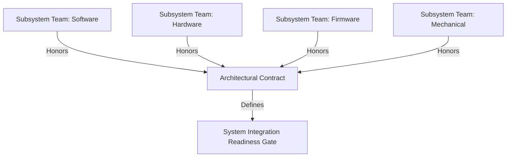

## What Makes Cornerstone Distinct

### Reframing the Methodological Landscape

To understand the distinguishing features of Cornerstone, it is essential to position it within the rich ecosystem of engineering delivery frameworks. The landscape is typically anchored at two poles: on one end, traditional systems engineering practices—including the V-model, stage-gate methodologies, and document-driven compliance regimes—prioritize traceability, risk management, and control, often at the cost of agility and responsiveness. On the other, contemporary approaches such as Agile, Lean, and their scaling permutations (including SAFe and LeSS) favor adaptability, team empowerment, and rapid feedback cycles, but may struggle with traceability, lifecycle discipline, and cross-domain orchestration when generalized beyond software. Hybrid schemes have emerged, but are frequently handicapped by the attempt to merely interleave prescriptive elements from each pole, resulting in brittle or bureaucratic processes ill-suited to modern, regulated, integrated products.

Cornerstone departs from this binary. It eschews both the rigidity of traditional lifecycle management and the laissez-faire adaptation of pure Agile, reconceptualizing delivery as a continuous, governed flow where risk-reducing integration, living documentation, and architectural discipline are intrinsic—not merely layered atop adaptive incrementality. Its distinctiveness arises not through novelty in individual practice, but through the systematic recomposition and operationalization of these practices into a cohesive, dynamic model where autonomy, compliance, and adaptability are coequal, mutually reinforcing forces.

### Systemic Traceability Without Phase Dependency

A foundational distinction lies in Cornerstone’s management of traceability and compliance. Traditional models bind traceability artifacts—requirements, risks, tests, and verification—to rigid phase transitions: exit criteria for requirements definition, design approval, or qualification. This enforces compliance, but at the cost of limiting learning and adaptation until major milestones, making rapid iteration and late-breaking discoveries expensive to incorporate.

By contrast, Cornerstone integrates traceability as a living, continuously maintained asset. Through version-controlled artifacts and docs-as-code practices, requirements, design decisions, risk assessments, and verification evidence evolve in lockstep with iterative delivery. This circumvents the phase gate bottleneck by making traceability an always-current, auditable outcome of daily work, not a separate deliverable. Artifact state and maturity are objectively assessable at any point, enabling readiness gates to function as authentic signals of integration risk and subsystem readiness, not as bureaucratic hurdles. This approach therefore enables compliance in regulated domains (e.g., ISO 26262, IEC 62304, DO-178C) without the high ceremony traditionally associated with them.

### Architectural Contracts and Federated Autonomy

Cornerstone extends autonomy beyond the boundaries permitted by classic systems engineering or scaled Agile models. Instead of enforcing uniform cadences or enforcing synchronization through program increments, as in SAFe, or segregating specialist teams by discipline, Cornerstone leverages federated autonomy. Here, subsystems—software, firmware, hardware, mechanical—advance asynchronously within architected boundaries governed by explicit, testable contracts.

These contracts encapsulate interface requirements, quality attributes, and integration obligations, enabling teams to pursue local flow and learning while guaranteeing systemic coherence. Progress is measured not in terms of synchrony with a global release train or completion of a monolithic phase, but by fulfillment of contractual obligations and readiness for meaningful integration. This promotes real risk retirement: subsystem integration and demonstration serve as tangible milestones of learning and value delivery.

Practically, this requires organizational commitment to robust contract negotiation, disciplined change management, and shared understanding of interface evolution. Failure to maintain the currency and verifiability of these contracts risks integration drift and late-cycle surprises—failure modes endemic to both phase-bound and uncoordinated Agile schemes. Cornerstone’s event-driven system integration points explicitly guard against this by exposing hidden risks and architectural ambiguities early and often.

#### Mermaid Diagram: Federated Autonomy Via Architectural Contracts

### Event-Driven Integration and Risk Management

Another axis of distinction is Cornerstone’s approach to integration and risk discovery. Traditional methodologies rely on pre-planned, phase-based integration—often deferred until later in the lifecycle—while Agile prescribes frequent (often sprint-based) integration, which may not mesh with multi-domain realities such as long hardware lead times or regulatory mandatory checkpoints. Scaling frameworks attempt to synchronize integration through enforced cadences, but in complex engineering environments, such synchronization frequently results in artificial coordination friction, schedule waste, or missed architectural dependencies.

Cornerstone sidesteps these pitfalls through event-driven, risk-focused integration. System-level integration and readiness gates are triggered not by arbitrary time increments or phase completion, but by contractual maturity and risk reduction metrics. This ensures that integration occurs when it delivers maximum knowledge gain, exposes system-level issues, or aligns with critical dependency decisions—not simply to satisfy a schedule. Crucially, integration is a vehicle for organizational learning, providing a safe space to fail early and cheaply, while readiness criteria ensure no major unknowns are papered over or deferred.

This approach also reframes the concept of “definition of done”—in Cornerstone, systemic completeness is never a one-shot event. Instead, the system evolves continuously, with ongoing risk discovery and architectural adaptation baked into the lifecycle. Retrospectives and technical reviews at both domain and system levels are not mere ceremonies, but engines of both compliance and improvement.

### Living Documentation and Automation at Scale

Where most frameworks treat documentation as static—either an up-front requirement or a regulatory afterthought—Cornerstone enshrines the notion of living documentation. Version-controlled, machine-readable documentation is integrated into the team’s continuous delivery workflow, bridging the gap between rapid iteration and traceable compliance. Artifact evolution is automated wherever practical, syncing with PLM and RM systems at event-driven touchpoints rather than by manual, periodic updates. This minimizes overhead and reduces the risk of documentation incompleteness or drift, ensuring that what is built can always be traced to its requirement and risk lineage.

For engineers, this means documentation is both a tool and a product: it supports daily work, informs integration decisions, and remains audit-ready—even as the product evolves. Governance is provided through event-driven triggers for documentation updates, automated reviews, and checkpoints, rather than as periodic, manual compliance efforts or disconnected from the primary development flow.

### Balancing Modularity, Discipline, and Continuous Flow

Perhaps Cornerstone’s greatest distinction lies in its balance of seemingly incompatible forces. Modularized team structures map directly to the product’s architectural decomposition, preserving the agility benefits of decentralized control and direct ownership, while avoiding the “over-specialization” trap. At the same time, discipline is imposed through readiness gates, automated traceability verification, and robust architectural stewardship. This enables continuous, asynchronous flow without sacrificing systemic alignment or compliance.

The practical reality for engineering teams is that this balance is not self-sustaining: it requires up-front investment in enabling infrastructure (e.g., automated documentation, continuous integration capable of handling physical artifacts, robust contract tracking), as well as committed technical leadership to maintain architectural integrity and enforce governance without bureaucracy. The framework’s resilience is thus a function of both its process design and the stewardship capabilities of its practitioners.

### Unique Fit for Integrated, Regulated Product Development

Finally, Cornerstone’s unique suitability for integrated product environments arises from its simultaneous embrace of engineering discipline and adaptive behavior. By rejecting the dichotomy between phase-bound control and unconstrained iteration, it enables complex product organizations to meet tough regulatory requirements, maintain traceability, and foster continual learning—without the productivity losses or risk exposure that typify less specialized frameworks.

The method’s reliance on asynchronous progress gated by contracts and integration events accepts the cadence misalignment between software, hardware, firmware, and mechanical development as a reality, not a problem to be forced into uniform cadence. This positions Cornerstone as uniquely equipped to support highly regulated, high-consequence domains—medical devices, automotive safety systems, aerospace, industrial controls—where both auditability and speed of learning are paramount.

### Synthesis

In summary, Cornerstone’s distinctiveness derives from its systematic, architectural approach to blending traceability, compliance, and agility; from its federated, contract-governed autonomy; from its event-driven, risk-focused integration; and from its deep automation of artifact management and documentation. It neither enforces a singular, inflexible rhythm nor abdicates discipline to enable local autonomy. Rather, it operationalizes sustained flow, learning, and risk management across domains—making it uniquely fit for the demands of modern, integrated product development.