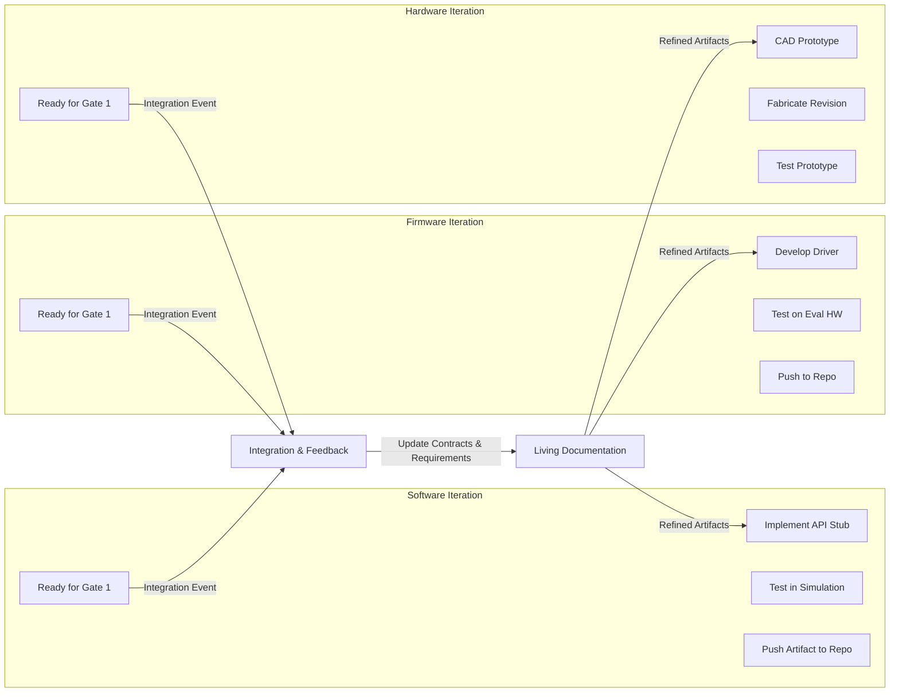
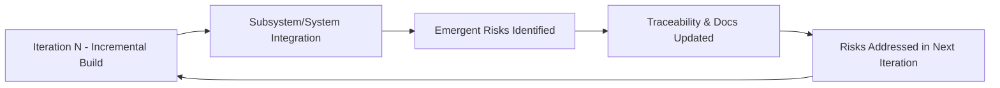

### Iterative Development as the Engine of Cornerstone

#### The Essential Role of Iteration

At the heart of the Cornerstone framework lies a purposeful embrace of iterative development—an approach that saturates not only planning and delivery, but governs the evolution of architecture, risk management, artifact refinement, and system integration. Unlike the pseudo-iterative behavior characterized by superficial Agile adoption in strictly sequential environments, Cornerstone positions iteration as a foundational and continuous driver of clarity, responsiveness, and systemic resilience throughout the product lifecycle.

This foundational commitment to iteration arises from the recognition that, in regulated, cross-discipline engineering initiatives, uncertainty cannot be eliminated solely by upfront specification or exhaustive phase gating. Instead, iteration becomes the principal instrument for actively taming complexity: it decomposes risk over time, exposes unforeseen integration faults, and enables ongoing course-correction as insights emerge. In software-centric fields, the merits of iteration are well-accepted; however, the challenge—and distinction—for Cornerstone is its rigorous adaptation across software, firmware, hardware, and mechatronic systems, where physical constraints and compliance imperatives demand carefully tuned iterative patterns.

#### Evolutionary Architecture: Building for Change

Cornerstone's approach to architectural development presupposes that system and subsystem architectures are never static or fully specified up-front. Instead, architectural design is deliberately evolved in increments, guided by both emergent technical discovery and evolving requirements—while being bounded by explicit contracts and compliance objectives. This evolutionary architecture means that each iteration is an opportunity not only to confirm functional fit, but also to validate architectural assumptions, test integration boundaries, and capture emergent risks.

Within this paradigm, architectural contracts play a decisive role. These contracts—formal specifications of interface, performance, or quality obligations—enable system elements to be developed semi-autonomously, yet remain aligned. Iterations expose weaknesses or ambiguities in these contracts, which are then progressively refined. For example, an early iteration may exercise a draft protocol or pinout between a microcontroller and a sensor. Subsequent refinements, driven by findings during actual system integration events, may provoke contract updates, documentation changes, or hardware modifications. The architectural picture thus crystallizes not by decree, but through sustained, feedback-driven evolution. This contrasts with both classical systems engineering’s inclination toward architectural rigidity and the “just-in-time” architectural minimalism that can undermine system coherence in pure Agile implementations.

#### Continuous Refinement, Not Serial Handoffs

In traditional phase-based models, artifacts—requirements, architectures, verification plans—are often treated as static outputs handed from one domain to the next, fostering brittle boundaries and amplifying integration risk when assumptions diverge. But within Cornerstone, artifact development itself is fundamentally iterative. Requirements, for instance, are actively reviewed and evolved in each iteration as integration events and subsystem demonstrations reveal gaps, ambiguities, or emergent needs. Verification strategies, too, are expanded and recalibrated in lockstep with the actual evolution of software, firmware, hardware, and mechanical builds.

A practical example may be observed in the iterative refinement of a safety-critical requirement for a medical embedded device. During early firmware iterations, simulated input and test harnesses may identify overlooked failure modes or timing constraints, which are then communicated upstream to refine the formal system requirement and its acceptance criteria. Later iterations—with physical hardware available—enable the validation of those requirements in real-world contexts, potentially exposing edge cases poorly captured in simulation. All such learning is immediately reflected in living documentation, enabled by docs-as-code practices, ensuring that traceability and compliance depth are maintained without stalling local development flow. This continuous refinement closes the loop between discovery, action, and documentation, dismantling the phase-based delay that hinders learning and risk reduction in legacy approaches.

#### Aligning Iteration Lengths Across Engineering Domains

One of the most critical and nuanced adaptations in Cornerstone's use of iteration is its decoupling from the presumption of uniform iteration lengths across software, firmware, hardware, and mechanical tracks. Where frameworks like Scrum or SAFe mandate synchronised iterations—typically in two- to four-week intervals—such cadence uniformity often fails in multi-disciplinary efforts where the realities of physical prototyping, manufacturing lead-times, or compliance testing preclude short, time-boxed cycles.

Instead, Cornerstone prescribes the concept of contractually-aligned, but independently-paced, iterations mitigated by readiness gates. These readiness gates do not merely mark administrative milestones, but act as integration checkpoints substantiated by contractual obligations: has the defined interface, protocol, or artifact version achieved the integration-ready status as stipulated? Has the requisite test or simulation been completed and documented to the compliance standard for that domain? Through such gating, asynchronous iterations across teams and disciplines are unified, not by artificial schedule synchrony, but by delivering artifacts or subsystems that meet explicitly defined conditions of readiness.

This approach is both pragmatic and enabling. For example, a mechanical design team may operate on multi-week or multi-month development cycles, due to the duration of prototyping or tooling. Their iteration pace is governed by the complexity and execution time of the relevant physical work. In contrast, the software track may execute much shorter iterations, delivering stub APIs or emulation layers that allow the integration of forthcoming hardware prototypes. As readiness gates are reached in each domain, subsystem integration can be triggered, and cross-domain feedback is catalyzed. This pattern minimizes stand-alone rework, prevents premature dependency lock-in, and maximizes learning from real integration events.

The implications for workflow are significant. Teams can optimize for local flow and domain-appropriate granularity, yet the system-level rhythm remains governed by contractually stipulated integration events—grounded in risk retirement rather than arbitrary cadence. Thus, an organization can realize the benefits of iterative, incremental development not only in software, but in the full sweep of multi-disciplinary product engineering.

#### Mechanisms of Iterative Integration

The mechanics of iteration within Cornerstone extend well beyond simply “building in increments.” Each cycle must culminate in the delivery of a versioned artifact set suitable for meaningful integration—either physical or within simulated contexts. The criteria for what constitutes a minimally viable integration candidate are defined by architectural contracts and readiness gates, rather than the looser conventions of basic Agile practices. For software and firmware, this may mean a defined API stability level or simulation completeness. For hardware, it may be a prototype meeting decoupled interface specifications and basic safety and performance constraints.

Central to this workflow is a robust artifacts management infrastructure. Living documentation, version-controlled source and design repositories, integrated test benches, and continuous integration (CI) pipelines serve not as burdensome process overhead, but as active participants in the iterative loop. CI is extended beyond code to encompass firmware integration on evaluation boards, driving hardware-in-the-loop (HIL) simulations, and automating compliance checks via model-based design and verification tools.

A typical iteration, therefore, is both design- and validation-driven. Each domain delivers increments that are immediately subjected to integration and verification activities, exposing domain-crossing defects at the earliest feasible moment. Where timelines do not permit full physical integration, digital twins, emulation, or simulation stand in, sustaining the risk-driven knowledge flow that is otherwise deferred in traditional gate-based programs.

##### Diagram: Iterative and Asynchronous Integration in Cornerstone

The following Mermaid diagram summarizes the core concept:

This diagram illustrates asynchronous progression of each domain, culminating at an integration event governed by readiness gates. Integration outcomes directly inform living documentation, establishing a self-reinforcing cycle of artifact refinement and knowledge growth.

#### Architectural and Organizational Implications

Embedding iteration as a system-wide norm within Cornerstone imposes both opportunities and demands at organizational and architectural levels.

From an architectural perspective, subsystems and interfaces must be explicitly designed for staged, partial integration. This can mean, for instance, defining multiple stability levels for interfaces (e.g., preliminary, provisional, baseline) and enabling feature or protocol stubs to stand in for unavailable subsystems. Clear dependency mapping—both for logical (API-level) and physical (electrical, mechanical) interfaces—is required. Architectural contracts act as both enablers and constraints, providing the scaffolding for independent iterations while preventing integration drift.

At the organizational level, cross-functional teams gain the autonomy to iterate at the velocity suited to the maturity and constraints of their domain, but are held accountable for inter-team dependencies via readiness gates and integration contracts. Role boundaries also evolve: system architects and integration leaders assume proactive stewardship of iteration quality, integration planning, and risk visibility. Test and verification teams are no longer relegated to end-of-phase activities, but are instead embedded within each iteration, ensuring that compliance-relevant test coverage grows in real time as the system evolves.

These requirements necessitate heightened discipline in artifact versioning, interface document management, and cross-domain communication practices. Organizations must be prepared to invest in integration and test environments that can support asynchronous, artifact-driven integration—such as shared emulation labs, virtual test benches, and PLM/RM tools that are responsive to event-driven rather than phase-driven updates.

#### Dealing with Cross-Domain Constraints and Realities

Despite its strengths, iterative development in a multi-disciplinary environment brings inherent challenges whose mitigation requires systematic discipline. Hardware and mechanical teams, for example, contend with nontrivial lead times, dependency on supplier cycles, and hard constraints in physical prototyping. Firmware teams often face bottlenecks due to incomplete hardware availability, while software may struggle with evolving, ill-defined interfaces as hardware or silicon changes late in development.

Cornerstone meets these realities through several design assumptions and enabling patterns:

1. **Incremental Physical Prototyping**: Hardware teams plan incremental prototyping stages, where early hardware revisions—though incomplete or “ugly”—are sufficient for subsystem and eventual system integration. Techniques such as “breadboarding,” rapid additive manufacturing, and modular board spins become integral.

2. **Simulation, Emulation, and Stubbing**: Simulation frameworks, digital twins, and firmware/hardware stubs are developed parallel to physical components, enabling software and firmware iterations to proceed even as physical artifacts lag. These surrogates are themselves versioned and integrated into the documentation and artifact traceability infrastructure.

3. **Flexible Interface Management**: Interface control documents (ICDs), protocol definitions, and physical pinouts are version-controlled living artifacts. Changes are managed through impact analysis, traceable history, and disciplined contract renegotiation when integration events dictate.

4. **Automated Artifact Synchronization**: Versioned artifacts are synchronized with Product Lifecycle Management (PLM) and Requirements Management (RM) systems automatically at event-driven integration junctions, ensuring that compliance and traceability are maintained without manual overhead or phase-based bottlenecks.

By institutionalizing these practices, Cornerstone transforms cross-domain constraints from causes of delay into opportunities for staged learning, incremental risk retirement, and early exposure of mismatches or defects.

#### Iterative Risk Discovery and Retirement

One of the most strategically significant advantages of iterative development under Cornerstone is in risk management. Rather than deferring risk discovery to end-of-phase system integration—a well-documented cause of cost and schedule overruns—Cornerstone explicitly seeks to uncover, document, and retire risk at each iteration.

Within each domain, incremental verification activities are mapped to key risk categories: requirements risk, technical feasibility, interface compatibility, compliance coverage, system performance, and ergonomic or user factors. Integration events, catalyzed by readiness gates, become focal points for multi-domain risk convergence, where unresolved issues are prioritized for resolution in the next iteration.

Mermaid Diagram: Iterative Risk Retirement Cycle

This cycle anchors risk-driven learning as a continuous loop, rather than a sequence of retrospective fixes. The system evolves toward compliance and value through measured, evidence-based risk reduction, not through hope or schedule-driven optimism.

#### Tailoring Iteration Strategies in Regulated and Safety-Critical Contexts

A further dimension to consider is the influence of regulation and safety-criticality on practical iteration strategy. Medical devices, aerospace systems, and automotive safety components, for example, are subject to regulatory frameworks that dictate traceability, documentation, and evidence standards (e.g., ISO 13485, ISO 26262, DO-178C). Fast unchecked iteration may run afoul of documentation or change management obligations, while overly cautious iteration may eliminate the learning and early risk exposure that iterative development exists to deliver.

Cornerstone resolves this tension by integrating compliance management directly into the iterative workflow. Version control, automated traceability, and artifact-driven documentation ensure that every increment—no matter how small—is audit-ready and mapped to formal requirement baselines. The adoption of a docs-as-code philosophy, with automated reporting and compliance check hooks, allows rapid iteration without sacrificing regulatory posture. Integration events are explicitly designed as compliance checkpoints, with every subsystem increment and integration test traceably linked to requirements and verification matrices.

Moreover, Cornerstone’s modular approach to team and contract alignment ensures that compliance-critical domains can iterate conservatively, maintaining the rigor required by process and regulatory norms, while less burdened tracks (such as application-layer software or user interface design) may operate with higher frequency. The essential outcome is that compliance and agility are delivered as coequal properties of the workflow, rather than either dominating or negating the other.

#### Failure Modes and Mitigation in Iterative Development

No framework is immune to the difficulties of human and technical error. Within Cornerstone, several failure modes are acknowledged and actively guarded against: integration drift due to undisciplined artifact evolution, local optimization at the expense of system readiness, and inability to validate contracts until late in development.

These risks are mitigated through the structure of event-driven integration, architectural contract enforcement, and systemic retrospectives. Automated checks, continuous integration suites that span multiple domains, and architectural stewardship by empowered technical leads ensure that iterations are not atomized silos but interconnected steps toward system-level readiness.

Organizationally, disciplined communication protocols are established so that dependencies and integration status are visible to all stakeholders in real time. Living documentation—always synchronized with the actual state of development—becomes the collaborative ground truth, preventing the accumulation of untracked divergence or design debt.

#### The Cornerstone Iterative Engine: Patterns for Sustained Delivery

In summation, the iterative engine at the core of the Cornerstone framework is defined by four tightly coupled patterns, each an active response to the cross-disciplinary, compliance-heavy contexts for which Cornerstone is designed:

- Architecture is evolved, not prescribed, through contractual alignment, subsystem prototyping, and early integration.
- Artifact evolution is continuous and version-controlled, with documentation, requirements, and verification plans kept as living, compliance-ready assets.
- Iteration lengths and cadences are tuned per domain and synchronized through readiness gates and integration events, never by arbitrary, one-size-fits-all cadence imposition.
- Risk exposure and retirement are evidence-based and iterative, woven into each subsystem increment and system integration, anchoring delivery in measured readiness rather than speculative hope or retrospective audit.

Through its disciplined, risk-centric, and feedback-driven iterative patterns, Cornerstone transcends both the sequential model’s rigidity and the inadequacies of undisciplined Agile. By embracing iterative development as the engine of system evolution—tempered by architectural contracts, integration discipline, and living documentation—Cornerstone delivers not just adaptive responsiveness, but the predictability and rigor required for integrated, regulated product development. The result is a framework in which learning, risk retirement, and cross-domain flow are not intermittent events, but continuous properties, enabling high-quality, compliant delivery at a system scale.