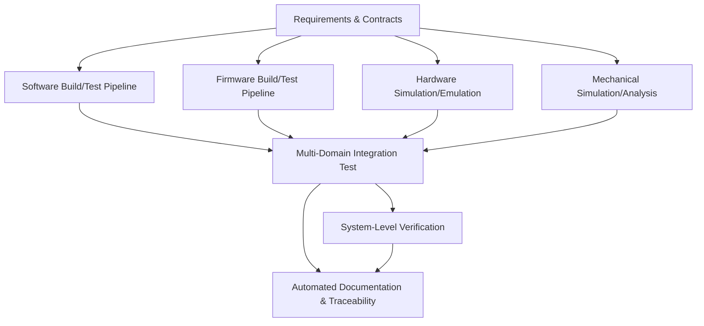
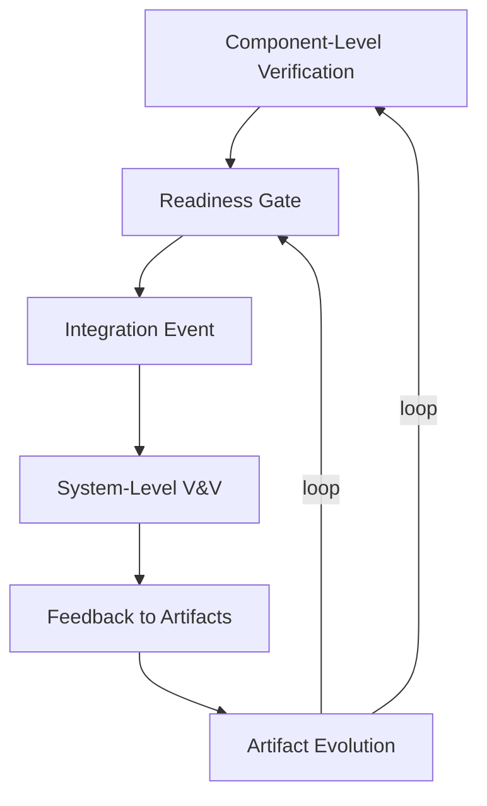

## Shift-Left Verification and Systemic Feedback in Cornerstone

Within multidisciplinary, regulated product development, the interaction between software, firmware, hardware, and mechanical domains amplifies the complexity of verification and validation (V&V). Quality cannot be bolted on at the end of the lifecycle; nor can it be meaningfully established through isolated component checks alone. To achieve the reliability, traceability, and compliance demanded by modern systems, Cornerstone operationalizes the principle of “shift-left” testing, embedding integrated, automated, and event-driven verification throughout the product lifecycle.

### The Imperative for Shift-Left Verification

Traditional development models frequently defer verification and validation activities to terminal phases—often after significant integration efforts have already occurred. In such approaches, the downstream discovery of defects or integration challenges typically results in costly rework, cascading delays, and, most critically, substantial risk exposure. In contrast, “shift-left” verification means introducing and escalating verification activities earlier and more often, to proactively reveal defects, interface mismatches, assumption failures, and integration risks.

Cornerstone embeds shift-left not as an ancillary practice but as a foundational delivery strategy. By systematically advancing verification as far upstream as possible, teams create fast feedback loops that progressively eliminate ambiguity and risk from evolving artifacts. This approach is not limited to software; it extends across domain boundaries—encompassing, for instance, the early testing of hardware logic against virtualized firmware, mechanical subsystem prototyping for fit checks, and verification of requirements traceability as soon as they are digitized.

#### Origins and Standards Context

The “shift-left” concept, well-established in software engineering circles, is increasingly formalized in systems engineering and regulated development. For example, the ISO 26262 automotive standard explicitly calls for early verification of safety requirements, while IEC 62304 in medical device software emphasizes early and ongoing risk control verification. In multi-domain product environments, enabling such proactive verification necessitates robust architecture, modular design, and automation—all of which Cornerstone’s structure directly supports.

### Integrated Verification: Beyond Siloed Testing

A defining feature of Cornerstone is its alignment of verification orchestration with iterative, asynchronous domain rhythms, unifying them through readiness gates and integration events. Within this structure, verification ceases to be a linear, siloed checklist and instead becomes a distributed, living process. The aim is not merely to demonstrate each component’s nominal function, but to build cumulative confidence in systemic fit, performance, and compliance.

#### Verification at Multiple Levels

Verification, within Cornerstone, is not monolithic. It operates across several tiers:
- **Component-Level Verification** involves direct validation of a discrete module—be it a software routine, a circuit board, or a mechanical actuator—against its explicitly specified contract. Automated unit tests, functional simulations, and design rule checks exemplify this mode.
- **Integration-Level Verification** addresses the correctness and performance of assembled subsystems. For instance, testing a board with firmware stubs or exercising electromechanical interfaces within a partially assembled chassis.
- **System-Level Verification and Validation** (V&V) encompasses end-to-end functional, safety, regulatory, and user-scenario checks. At this horizon, the product is validated not only against architecture and requirements, but also against intended use, environmental factors, and compliance obligations.

Each level of verification provides distinct yet overlapping assurance. The Cornerstone framework ensures that discoveries at any tier feed back into upstream artifacts, driving necessary adjustments across requirements, architecture, and test plans.

#### Integrated Automation: The Pipeline as a Systemic Backbone

Achieving early and frequent verification on complex, cross-domain products demands automation. Here, the build/test pipeline becomes more than a convenience; it is an architectural backbone for continuous learning and evidence generation. In Cornerstone, pipelines are constructed not only for software but are intentionally extended to include hardware simulation, firmware builds, hardware-in-the-loop (HIL) testing, and even initial mechanical simulations or tolerance checks.

#### Diagram: Integrated, Multi-Domain Build/Test Pipelines in Cornerstone

*Diagram: Cornerstone’s orchestrated approach to verification. Requirements and contractual artifacts feed automated pipelines across domains, culminating in integrated test execution, system-level V&V, and living documentation for compliance and traceability.*

This integrated pipeline supports the core Cornerstone dynamics:
- All artifacts under version control, with traceability to originating requirements.
- Readiness gates automate admission to higher test levels based on predefined criteria or contract satisfaction.
- Integration events trigger not only technical tests but also documentation and evidence-capture mechanics.
- Every verification step becomes a potential trigger for redesign or refinement upstream.

### Component-Level Verification and Its Limits

At the base of the Cornerstone verification structure lies the component: the smallest independently deliverable unit that can be meaningfully specified, developed, and tested. Component-level verification establishes local correctness, functional intent, and interface compliance. Automated unit and module tests, static code analysis, ECAD rule checks, and mechanical FEA models (at a part or subassembly level) are characteristic mechanisms here.

Component-level verification is crucial for early detection of logic errors, data range violations, electrical or mechanical design faults, and for regression protection against inadvertent changes. These tests are generally automated, run on every change, and form a foundation of local quality. In regulated domains, they also serve to produce detailed, versioned evidence in support of traceability and compliance.

However, by their nature, component-level verification is contextually myopic. It makes strong assumptions about upstream and downstream integration: that prescribed contracts are both necessary and sufficient, and that external preconditions will always be honored. Real systems, conversely, are rarely so accommodating. Interface mismatches, ambiguous requirements, systemic timing or tolerance issues, and emergent behaviors remain silent and undetectable at the component horizon. Thus, while necessary, component-level verification is fundamentally insufficient as a guarantee of product correctness or compliance.

#### Boundary Conditions and Pitfalls

A recurring failure mode in complex organizations is the misattribution of verified component quality to systemic readiness. This “local maxima” effect may yield high coverage or apparent completeness within teams, while leaving critical integration risks or latent requirement ambiguities unresolved. Cornerstone guards against such suboptimization by structurally requiring periodic aggregation and system-level reconciliation—never allowing isolated evidence to stand as sole assurance of fitness.

### Integration and System-Level Verification: The Cornerstone Distinction

The unifying mechanism within Cornerstone is the transition from local, component-centric testing to orchestrated, system-level V&V. This step is not a mere summation of component proofs, but an explicit and architected confrontation with system complexity and emergent behavior.

#### Integration Events as Focal Points

Integration events function as breakout points in the Cornerstone lifecycle: scheduled (or event-triggered) moments when system elements, having independently met their readiness contracts, are combined and exercised in a more complete context. Here, cross-domain, subsystem, and full-system tests are executed, seeking risks and ambiguities that cannot be revealed at lower granularity. Contradictory interpretations of interface specifications, latent environmental sensitivities, resource contention, timing races, and mechanical fit or vibration issues commonly surface during integration-level V&V.

Cornerstone’s contract-driven readiness gates ensure that artifacts reaching integration have passed a minimum standard of verification, reducing churn and the likelihood of preventable failures. However, integration is embraced as inherently uncertain: the purpose is not to “prove” that the system works, but to deliberately expose uncertainty, catalyze organizational learning, and provide systemic feedback into upstream domains.

#### Systemic Feedback and Artifact Evolution

A distinguishing architectural feedback loop within Cornerstone is the mandatory, automated propagation of integration outcomes back into all domain artifacts—requirements, design, tests, and documentation. Failures in integration testing yield not only defect tickets or rework tasks but trigger gated revision cycles upstream. Interface contracts may be renegotiated, requirement ambiguity resolved, or test coverage expanded to close newly discovered gaps.

Living documentation and docs-as-code practices ensure that every integration event—pass or fail—contributes to an evolving, compliant, and audit-ready body of knowledge. This dynamic traceability is non-negotiable in regulated domains, guarding against the atrophy of documentation and decoupling of artifacts from actual product evolution.

#### Diagram: Systemic Feedback in Integration Events

*Diagram: The self-reinforcing feedback loop at the core of Cornerstone’s verification strategy—systemic integration events trigger artifact evolution, ensuring that every learning feeds forward into future cycles.*

### Automation, Traceability, and Evidence

In practice, the granularity and scope of verification absolutely depends on automation—not only to execute tests, but to gather, collate, and version the resulting evidence. Automation pipelines are tightly integrated with artifact management, such that every verification event is uniquely associated with configuration baselines and requirements revisions. This design delivers on several critical regulatory objectives:
- **Traceability:** Every test, its result, and associated artifact lineage is traceable back to contractual requirements, supporting auditability and impact analysis.
- **Repeatability:** Verification events can be re-executed on demand against any historical version, satisfying requirements for regression evidence and root-cause investigations.
- **Living Documentation:** Automated collection and documentation of test results ensures that the body of compliance evidence is always in sync with the state of the system, with obsolete or superseded artifacts archived yet preserved.

#### Orchestration Across Domains

While test automation is mature in software, Cornerstone recognizes and adapts to the unique constraints of hardware, firmware, and mechanical domains. Hardware-in-the-loop test rigs may require capital investment and calendar scheduling; mechanical simulations depend on the availability and fidelity of CAD models and FEA harnesses; firmware may be tested initially on simulators, then migrated to field-programmable targets as boards mature.

Cornerstone’s architecture explicitly supports simulation, stubbing, emulation, and virtual integration as first-class mechanisms to maximize early verification. Where physical artifacts are unavailable, model-based and virtualized tests are standardized—collecting risk reduction evidence well before the first boards or machined parts emerge from the supply chain. In each case, artifacts move towards readiness at domain-specific pace, but always reconverge at integration events in a manner governed by contracts and readiness gates.

#### Trade-offs and Lifecycle Realities

Automation investments must be judged pragmatically against cycle time, criticality, and integration risk. Not all tests can, or should, be automated—particularly in early mechanical prototyping where physical attributes are central. Cornerstone’s governance structures require explicit trade-off documentation: when a particular verification stage is manual-only, risk must be acknowledged and reviewed at the next organizational retrospective. Conversely, automation debt is recorded as a first-class artifact, with scheduled remediation before major integration milestones.

### Organizational and Architectural Implications

#### Federated Pipelines, Centralized Traceability

Cornerstone’s federated organizational pattern—autonomous domain teams operating within coherent architectural contracts—implies that each team may own its own automation stack (CI, simulation rig, CAD analysis toolchain) but outputs are centrally ingested for system-level integration and traceability. Engineering leadership custodianship ensures that contracts are consistently enforced and that pipelines are interoperable at the interfaces.

This approach achieves multiple aims:
- Prevents one-size-fits-all tooling that inevitably frustrates domain specialists.
- Ensures cross-team artifact lineage is unambiguously established through version control, build hashes, and integration event logging.
- Supports cross-domain auditing and regulatory compliance with minimal manual aggregation.

#### Governance Structures: Readiness and Review

Within the Cornerstone lifecycle, not every pipeline result is equal. Readiness gates and formal artifact reviews control the “promotion” of results from local to integration-level evidence. This ensures that only properly baselined, contract-compliant artifacts are introduced at the system test horizon. Gating mechanisms may be encoded directly in automation—the inability to produce a specific test artifact or traceability matrix is a hard block for integration events.

Systemic retrospectives—scheduled alongside major integration cycles—support the continuous improvement of test coverage, automation scope, and root-cause management for verification escapes. Automation metrics, test result trend data, and change impact assessments feed into organizational risk reviews.

### Comparing V-Model Legacy and Cornerstone Practices

It is instructive to consider how Cornerstone’s verification ecosystem converges with and departs from traditional V-model approaches. The V-model, foundational in many regulated domains, prescribes that each development activity be directly mirrored by a corresponding test activity—a mapping well-suited to waterfall-like decompositions.

Cornerstone retains and extends this rigor, but rejects the lock-step, phase-gated rhythm of the traditional V. Instead, verification is made continuous, dynamically synchronized to evolving artifacts and triggered by readiness rather than arbitrary phase completion. System-level V&V ceases to be a discontinuous, late-lifecycle event and instead becomes a recurring, risk-driven integration dynamic.

The value of this approach can be characterized by the following contrasts:
- **Phase Independence:** Verification and validation occur on local artifacts as soon as contractual readiness is established, not only after upstream “handoff.”
- **Evidence Evolution:** Verification evidence is accrued and refined over time, never frozen or considered final until system integration and regulatory review.
- **Learning-Centric:** Integration events deliberately seek learning, not simply confirmation. Discovery of defects is seen not as failure, but as essential progress.
- **Compliance-by-Construction:** Living documentation and automation ensure compliance is never an afterthought or retrofitted; it is an emergent by-product of disciplined process.

### Practical Engineering Considerations

#### Integration Realities and Constraints

In practice, the frequency and granularity of integration-level verification is bounded by several factors:
- **Artifact Availability:** Physical hardware or mechanical parts may be available on a slower cadence than software or firmware images. Simulated artifacts offer partial, but not total, risk coverage.
- **Resource Constraints:** Test equipment, lab time, and people may bottleneck verification throughput, especially for hardware-in-the-loop and system-level physical tests.
- **Change Volatility:** Highly dynamic artifacts, such as early software or prototype hardware, may change faster than system integration pipelines can keep up with. Here, the trade-off between frequent “fail-fast” integration and resource efficiency must be actively managed.

Cornerstone’s asynchronous, contract-driven readiness gates allow for non-blocking progress in faster-moving domains, but never forgo system-level convergence or integration learning. Trade-offs regarding test automation scope, evidence sufficiency, and integration frequency are systematically reviewed at retrospectives and risk evaluations.

#### Failure Modes and Safeguards

Without continual vigilance, several failure modes may emerge:
- **Stale Test Suites:** Tests that lag artifact evolution can breed false security. Cornerstone mandates living, version-controlled test definitions.
- **Obsolete Documentation:** Evidence must automatically trace to the correct artifact version; any manual aggregation or “document hunting” is a source of compliance risk.
- **Integration Surprises:** Overreliance on component-level success may mask emergent risks. Systemic integration events are never skipped, and their frequency increases when risk or change is high.

Savvy engineering organizations use metrics—such as coverage drift, test flakiness rates, integration block rates, and rework cycles—to diagnose and address these risks, with results incorporated into retrospectives and artifact reviews.

### Conclusion: Achieving Predictable Quality and Compliance

Shift-left verification, integrated pipelines, and the disciplined escalation from component to system-level V&V form the backbone of Cornerstone’s delivery assurance. This approach transforms verification and validation from compliance afterthoughts into active, learning-driven, and risk-focused engines of quality. By embedding automation, traceability, and systemic feedback in every lifecycle phase, Cornerstone achieves its core goal: the predictable delivery of high-quality, compliant, and integrated products within the realities of multidisciplinary, regulated development. 

The next chapters will explore how these verification structures interlock with the broader Cornerstone lifecycle, including the cultural imperatives and leadership models required for sustained organizational learning, and the operational mechanisms that ensure living artifacts continue to drive engineering excellence.