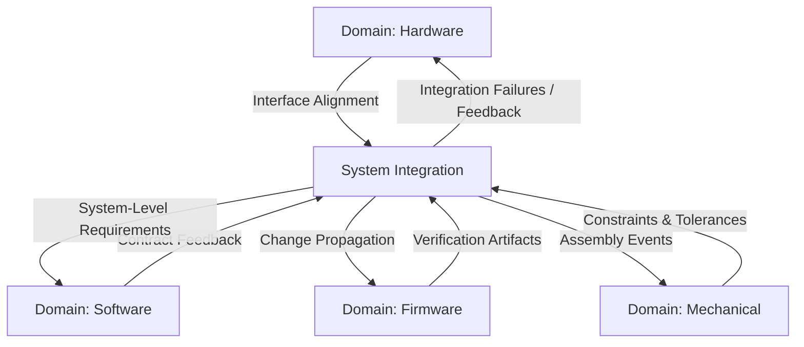
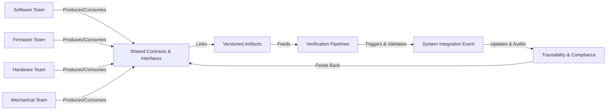

---
### The Role of Multidisciplinary Collaboration in Integrated Product Delivery

#### 1. Foundations of Cross-Domain Convergence

In modern product development, isolated domain silos are a liability. While software, firmware, hardware, and mechanical disciplines maintain their unique bodies of knowledge and delivery methodologies, their artifacts rarely exist in isolation. Instead, they continuously interact—often unpredictably—across the product lifecycle. The movement toward integrated, regulated, and increasingly complex products demands more than traditional handoffs or post-facto integration testing; it demands systemic, purposeful, and well-architected multidisciplinary collaboration.

Cornerstone addresses this imperative by embedding collaboration not as an afterthought, but as a structural principle underpinning every phase of development. Unlike classical development workflows that treat each discipline as largely independent until late-phase integration, the Cornerstone approach is engineered around the reality that technical work products—code, PCBs, firmware binaries, mechanical assemblies, interface specifications—are themselves deeply interdependent. The quality, safety, and compliance of any one element depend on the correctness and timeliness of many others. Thus, collaboration is not simply a team-building exercise; it is fundamental to achieving technical correctness and regulatory confidence.

From requirements engineering through to post-launch maintenance, every major artifact in a Cornerstone project is referenced, verified, and validated in the context of well-defined cross-domain interfaces. Work progresses not as a series of handovers, but through a choreography of synchronous and asynchronous collaborations, all underpinned by rigorous architectural contracts and shared verification assets.

#### 2. Communication Patterns: Synchronization and Flow

At the heart of effective multidisciplinary collaboration are the communication patterns that enable efficient information exchange and alignment. These patterns must overcome both technical and organizational boundaries: diverging lexicons, differing timescales, distinct failure modes, and asynchronous delivery cadences.

In the Cornerstone model, communication is structured along two principal axes: horizontal collaboration—across peer domain teams working concurrently, such as hardware and embedded software; and vertical integration—linking contributors at different levels of the system hierarchy, such as subsystem leads interfacing with component owners.

Horizontal, or cross-domain, communication is provoked by integration triggers: design milestones, artifact readiness, contract changes, or integration events. Such communication is deliberate, contextual, and always grounded in shared architectural language. This architectural common ground—contractual interface definitions, version-controlled specifications, and living documentation—is what enables teams to converse in actionable, traceable terms, reducing the risk of misunderstanding or oversights that might only become visible during costly late integrations.

Vertical communication complements this by ensuring that local decisions (for example, a change to a mechanical constraint) are propagated upstream and downstream, so that system-level architectural intent and component-level realities remain aligned. This propagation happens both directly, via artifact versioning and notification in centralized repositories, and indirectly, via system-level integration events and retrospectives.

Communication in Cornerstone is not left to chance or individual initiative. Instead, it is structured through process mechanisms such as readiness gates, integration events, and automated artifact traceability. The collaborative flow thus becomes predictable, explicit, and auditable.

##### Visualization of Communication Patterns

The following diagram illustrates the continuous exchange between domain teams and the system-level integration function under Cornerstone:

This diagram reflects the bidirectional, event-driven flow of information critical to maintaining technical and process alignment across multiple disciplines.

#### 3. Interface Alignment: The Linchpin of Predictable Integration

Nowhere is the requirement for multidisciplinary collaboration clearer or more technically consequential than at domain interfaces. In integrated systems, an interface may take many forms: a digital protocol boundary between an MCU and a sensor, a physical connector linking a PCB to a chassis, a signal timing diagram spanning an FPGA and external memory, a REST API layering software over hardware abstraction, or even a set of principal mechanical tolerances governing thermal expansion.

The Cornerstone philosophy recognizes interface alignment as both a technical and organizational challenge. Clarity at interfaces is enforced not just by documentation, but by explicit, version-controlled architectural contracts. These contracts—composed in machine-readable as well as human-readable formats—define expectations so that ambiguity is minimized and testability is maximized.

Alignment activities are regular, not exception-driven. At each readiness gate, interfaces are validated to confirm that changes in one discipline do not introduce integration risks for others. For example, a revision to a hardware clock domain or power budget must trigger automated and human review from firmware and mechanical design leads. Automated checks using contract specifications are employed whenever feasible, while formal reviews, virtual integration, and simulation supplement where physical constraints or dependency chains demand human oversight.

Practical realities demand tolerance for local iteration. However, uncontrolled divergence is prevented through “contract fences”—shared, versioned artifacts that must be updated synchronously and gated through review before downstream integration, thus reducing costly rework. This mechanism also supports compliance, as traceable interface specification changes can be audited against associated test and review artifacts.

#### 4. Mechanisms and Tools Supporting Multidisciplinary Collaboration

The mechanics of effective cross-domain coordination in Cornerstone are rooted as much in tooling and infrastructure as they are in process.

Version-controlled repositories underpin all shared technical assets, from requirements to CAD models to source code and build artifacts. Domain-specific automation—software CI pipelines, hardware simulation farms, mechanical FEA batches—are federated but integrated at the system level, producing outputs that can be validated and consumed by other domains.

Docs-as-Code, previously introduced as a pillar of traceability, is central to this collaborative ecosystem. Living documentation—maintained in structured, reviewable formats alongside code, design files, and test suites—enables current, synchronized understanding across domain boundaries. For instance, an architectural change in the firmware abstraction layer automatically propagates context to both hardware designers (via pinout and protocol tables) and software teams (via API references and extension points), all within the same source-managed documentation set.

Integrated traceability matrices link requirements, interface contracts, and verification assets directly to changesets, allowing any engineer to quickly reconstruct the rationale and impact of cross-domain decisions. Automated notification systems, subscription-based change logs, and collaborative platforms further reduce the friction of information flow, making it easier for distributed or asynchronous teams to maintain synchronized understanding.

#### 5. Collaboration in Practice: Workflows, Trade-Offs, and Organizational Realities

While the Cornerstone framework defines structures for collaboration, practical implementation must accommodate significant differences in domain workstyles and constraints. Software often iterates rapidly, producing many builds per day, while hardware and mechanical teams operate on slower cycles, paced by fabrication, procurement, or physical prototyping lead times. Firmware occupies a liminal space—tightly bound to both software and hardware timescales.

This inherent asynchrony breeds both challenges and opportunities. For one, it necessitates careful definition of integration triggers and handoff points. Integration events—systemic moments when new assemblies are constructed and tested—must be scheduled to maximize learning while minimizing unnecessary blocking. In some cases, virtual integration (using digital twins, hardware-in-the-loop simulation, or mock interfaces) is used to decouple software iteration from physical constraints, affording early feedback but requiring discipline to ensure fidelity as real hardware emerges.

Organizationally, multidisciplinary collaboration often rubs up against traditional reporting lines, resource allocation models, or external partnerships (such as off-site manufacturing or specialist sub-contractors). Cornerstone mitigates these frictions by formalizing roles with cross-domain responsibility: system integrators, V&V leads, interface architects, and compliance officers bridge gaps between discipline-specific teams. Governance is enforced via readiness gates and artifact reviews, but it is the everyday reliance on shared assets, tools, and contracts that fosters operational alignment.

A recurring trade-off in true cross-disciplinary work is the tension between local autonomy and systemic alignment. Rapid software innovation, for example, can conflict with the relative inflexibility of pre-fabricated hardware; conversely, hardware simplifications can impose undue burden on software to compensate for missing features or unanticipated limitations. The Cornerstone approach is to expose and mediate these trade-offs early and often, using system-level feedback events, integration testing, and contract renegotiation as controlled release valves. The aim is not to freeze designs prematurely, but to enable rigorously informed adaptation.

#### 6. Failure Modes and Corrective Mechanisms

In cross-domain product development, when collaboration patterns or interface alignment break down, failure modes can propagate rapidly, often with compounding cost or compliance impact. Misaligned electrical interfaces, ambiguous protocol definitions, mechanical interference, or out-of-sync feature dependencies are among the most damaging and frequently encountered technical integration defects.

Within Cornerstone, the primary defense against these failure modes is built around continuous verification (addressed in the previous chapter) and deliberate integration events. Failures at these events are not interpreted as process anomalies, but as essential feedback, triggering root cause analysis, requirements clarification, and—if needed—interface contract renegotiation. Automated regression suites and system-level notifications further ensure that out-of-date or stale artifacts are quickly flagged and remediated.

Additionally, the federated but centrally traceable architecture ensures that no single domain can unilaterally propagate changes past a readiness gate without cross-domain review. This centralization of traceability does not reduce local autonomy, but introduces guardrails that maintain systemic integrity in the face of inevitable, necessary local iteration.

#### 7. Interface Representation Across Development Artifacts

In practice, effective interface alignment requires more than periodic meetings or ad hoc exchanges; it is established and maintained by explicit linkage between development artifacts across domains. Hardware register maps are referenced directly from software header files; mechanical mount constraints are reflected in PCB routing guidelines; timing diagrams for critical signals are formalized and versioned, accessible to all relevant teams.

Mermaid diagrams, sequence models, statecharts, and timing diagrams are used as living documentation, incorporated directly into repository-managed documentation and verification suites. For instance, interface contracts may be represented as both structured JSON schemas (for automated verification) and as human-readable diagrams (for reviews and on-boarding), ensuring accessibility and utility at every level of abstraction.

#### 8. Multidisciplinary Collaboration as a Driver of Quality and Predictability

The practical consequence of sustained, structured multidisciplinary collaboration is the emergence of predictable, audit-ready delivery. By enforcing traceability from requirements to system-level test and continually synchronizing interface definitions, defects that formerly propagated undetected to late phases are surfaced early, remedied in situ, and tracked to closure.

This mechanism supports compliance to both internal engineering standards and external regulatory norms, such as IEC 61508 for functional safety, ISO 26262 for automotive systems, or ISO 13485 for medical devices. Alignment and integration artifacts, version-controlled and continually refreshed, become the raw material for compliance audits and post-market surveillance, fueling a virtuous cycle of quality improvement.

Ultimately, multidisciplinary collaboration within the Cornerstone framework is not an optional layer atop existing delivery models; rather, it is a structural, inseparable foundation. The choreography of communication, architectural contracts, and automated traceability is what transforms the complexity of cross-domain development from a liability into a managed, learnable, and improvable process, central to sustainable engineering excellence.

---

**Summary Diagram: Multidisciplinary Collaboration Structures in Cornerstone**

This diagram visualizes how, under Cornerstone, teams collaborate around shared contracts, artifacts, and automated pipelines, culminating in system-level integration events and continuous compliance feedback—closing the loop for ongoing multidisciplinary engineering improvement.

---