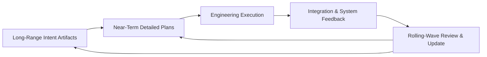
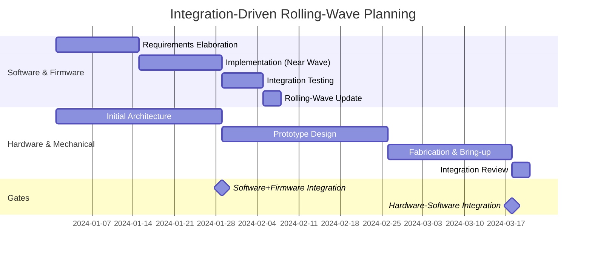

---
### Balancing Long-Range Intent and Tactical Flexibility

#### Introduction: The Paradox of Engineering Predictability

Integrated product development—spanning software, firmware, hardware, and mechanical domains—places unique demands on planning methodology. Traditional engineering disciplines incline toward meticulous, up-front specification to maximize predictability and minimize downstream change. Yet the increasing complexity, regulatory requirements, and rapid technological pace facing modern teams demand the capacity to discover, adapt, and correct course frequently. The foundational Cornerstone principle of “direction with adaptability” emerges: project teams must maintain a coherent, traceable trajectory towards system-level goals while structuring their work for ongoing tactical flexibility. This section presents how long-range intent and short-range re-planning coexist practically within Cornerstone, operationalized through rolling-wave planning, incremental commitment, and continual feedback.

#### The Role of Long-Range Intent

At the center of Cornerstone’s planning philosophy lies the concept of long-range intent. This provides the engineering program with a clear, stable reference against which to align myriad, asynchronous activities. In multi-domain contexts, long-range intent is not limited to a product’s eventual features, but extends to compliance targets, safety requirements, validation milestones, integration moments, and architectural invariants. Its articulation harmonizes the expectations of diverse stakeholders—customers, regulatory bodies, product managers, and engineering teams—around what constitutes “done” at the program and system level.

Long-range intent is instantiated in living artifacts—requirements sets, system architectures, regulatory compliance matrices, and verification plans—all subject to version control and traceability. In practice, this intent forms the “north star” for the product lifecycle, guiding not only initial decomposition and allocation of work, but also the boundaries within which adaptation and prioritization occur. Notably, the intent is not rigidly fixed; disciplined change management ensures that updates are visible, debated, and grounded in reasoned trade-offs.

Organizationally, long-range intent requires deliberate reinforcement: system architects and product owners act as stewards, maintaining alignment via architectural contracts, outcome definitions, and artifact reviews. Periodic “system intent” checkpoints—at minimum at each major system-level integration—affirm that lower-level activities remain consistent with evolving external requirements and internal architectural commitments.

#### The Need for Tactical Flexibility

Despite the best efforts at up-front definition, integrated product development is characterized by irreducible uncertainty and emergent complexity. Design constraints evolve as prototypes are tested, dependencies shift with supply and technology realities, and regulatory interpretations may be clarified or amended. In this environment, rigid adherence to initial plans and architected partitions can lead to sub-optimization, late-phase integration crises, or non-compliance.

Cornerstone recognizes tactical flexibility not merely as a practical necessity, but as a disciplined mechanism for system learning. Teams are empowered—within contractual and architectural boundaries—to iteratively explore solution spaces, validate assumptions, and adjust plans as new information emerges. Flexibility is achieved through several interlinked mechanisms: the allocation of buffer for technical discovery, explicit risk registers with rapid escalation paths, adaptive iteration backlogs, and cross-domain synchronization points at regular cadence or upon integration triggers.

Project charters and contracts necessarily incorporate provisional elements, reserving the right—subject to cross-functional agreement—to redefine details in the face of validated learning. Adaptive planning goes hand in hand with strong traceability: changes are documented, rationales are preserved, and downstream impacts are assessed through event-driven feedback mechanisms.

#### Rolling-Wave Planning: Mechanisms and Implementation

Rather than lock all details at project inception, Cornerstone operationalizes long-range intent and tactical flexibility through rolling-wave planning. This approach supports sustained clarity and adaptability by progressively detailing plans closest to execution (“the near wave”), while maintaining coarser granularity on longer-term elements (“the far wave”). Such an approach aligns particularly well with the asynchronous cadences present in multidisciplinary environments, where software may iterate in weeks, while hardware and mechanical plans unfold in months.

At the outset, the program establishes overarching goals, system architectures, and critical integration or compliance milestones, forming the outer bounds of the “wave.” Within these, near-term work packages are defined in explicit detail: requirements are decomposed, interfaces are specified, and verification assets are identified. As these cycles are completed and more is learned about system dependencies, the subsequent increment is elaborated, drawing on real integration and verification results.

A distinctive feature of rolling-wave planning in a multi-domain context is the separation of timing and readiness. Commitments are made incrementally, gated by contract-driven readiness reviews. Work proceeds on fully defined near-term elements only when upstream prerequisites are satisfied, verified, and traceably agreed across domains. As the wave progresses, lessons learned from ongoing V&V inform subsequent decomposition, risk estimation, and interface definition.

This progression is best visualized as a series of reinforcing feedback loops, in which each domain both informs and is informed by integration progress, with architectural contracts and shared artifacts acting as the mediating structure.

This diagram illustrates that long-range intent and near-term plans feed into engineering execution, which in turn is subject to integration and system-level feedback. Rolling-wave reviews cycle insights back to re-plan both the upcoming near-term activities and, if warranted, the overarching intent.

#### Synchronizing Rolling-Wave Planning Across Domains

A core challenge in rolling-wave planning is the synchronization of domains with fundamentally different development timelines and feedback cycles. Firmware and software teams, operating at rapid iteration cadence, supply continuous integration-ready builds and test automation. In contrast, hardware and mechanical teams contend with longer design and fabrication cycles, greater lead times, and often higher change costs for late discovery.

Within Cornerstone, the rolling-wave is thus not monolithic but federated across domains, coordinated by system integration and readiness gates. System integrators, working with domain leads, orchestrate synchronized planning “waves” keyed to known integration events: for example, a quarterly system integration review triggering the hardware team’s detailed planning wave for PCB layout, while software and firmware extend near-term backlog grooming in alignment with exposed board features and updated register maps.

The minimum necessary cross-domain synchrony is enforced primarily at shared interfaces—physical, logical, firmware, and regulatory—through the concept of integration contracts. Each planning wave, regardless of domain, includes explicit contracts for interface readiness, validation methods, and risk contingencies. When an interface is to be revised, rolling-wave mechanisms govern the propagation of detail: impacts are analyzed, plans updated, and traceability ensured.

The practical implication is a “multi-speed” rolling wave: software and firmware may update their executable increment plans bi-weekly, while hardware plans are detailed monthly. Yet at every integration contract point—physical connectors, register maps, timing constraints—a mutually agreed “wave checkpoint” ensures cross-domain coherence.

#### Balancing Predictability and Discovery

Rolling-wave planning structures do not eliminate the inherent tension between predictability and discovery; rather, they provide a framework for managing it transparently and systematically. Predictability is achieved by anchoring to fixed points: regulatory milestones, architectural invariants, critical system behaviors, and non-negotiable deadlines (such as manufacturing windows or market launches). Discovery is fostered through explicit “discovery work packages”—spikes, prototypes, design-of-experiments tasks—scheduled alongside implementation work and regularly revisited against their outcomes.

The recursive cadence of rolling-wave planning provides controlled windows for incorporation of uncertainty: technical learning from prototypes, failure analysis from integration testing, or emergent regulatory guidance can all be incorporated promptly without destabilizing the overall trajectory. Yet this adaptability is bounded—buffer is limited, deviations are justified and ratified at cross-functional system review events, and program risk remains explicit throughout.

A critical practical consideration is the management of requirements volatility. In Cornerstone, requirements are traceably versioned; rationale for changes is recorded alongside automated or manual impact analyses. Instead of treating changing requirements as project failure, the act of integrating new knowledge is seen as a sign of system health—so long as it is managed within planning wave structures and subjected to readiness gates and traceability norms.

#### Planning Artifacts: Living Documents With Structured Evolution

Rolling-wave planning is enabled and accelerated by rigour in artifact management. All planning documents—requirements, schedules, architectural descriptions, interface contracts, verification plans—exist not as static outputs but as living assets, managed through Docs-as-Code practices and version-controlled repositories. Artifact maturity reflects the planning wave: details increase as they approach execution, while longer-term elements retain placeholder status, with clear demarcation that prevents premature commitment.

Each artifact is explicitly linked to system-level intent, interface contracts, and V&V assets through centralized traceability tooling. This ensures that, as plans evolve, both upstream (e.g., compliance matrices, stakeholder commitments) and downstream (e.g., test cases, implementation checklist) impacts are visible, reviewable, and, where needed, auditable for regulatory purposes.

A key architectural implication is the avoidance of premature freeze or “big design up front” for aspects known to be volatile. Instead, maturity models are adopted: requirements may exist as “exploratory” in early waves, become “provisional” upon positive discovery outcomes, and only advance to “committed” when all cross-domain prerequisites and verification strategies are locked. Automated artifact status reporting—or even gating of releases based on artifact state—can further reinforce the proper sequencing of commitment.

#### Risk and Opportunity Management Through the Planning Wave

Rolling-wave planning enables disciplined risk and opportunity management. Risks are catalogued as explicit items in program risk registers, categorized by likelihood, severity, and cross-domain impact. “Near wave” planning incorporates targeted mitigation actions—design of alternate interfaces, early procurement of long-lead parts, pre-emptive design analysis—reflecting both the best available information and the residual uncertainty present.

Rolling-wave reviews at the close of each integration or planning increment include root-cause analysis of newly surfaced risks, lessons learned from prototype and simulation, and deliberate reevaluation of plan fidelity. As new risks emerge or are closed, they are propagated through the structured plan in subsequent waves, and change controls ensure traceability to affected requirements, contracts, and test assets.

Equally, opportunities—such as new technical approaches, regulatory interpretations, or supply improvements—are incorporated through a similar mechanism: they are evaluated according to system-level value, impact, and readiness for commitment, and only advanced to implementation when aligned with updated long-range intent.

#### Integration Points: Gates, Triggers, and Review Cadence

Critical to the discipline of rolling-wave planning is the management of integration points—moments at which readiness is gated and plans must be reconciled across domains. Integration points are event-driven, typically associated with progress toward system milestones: initial prototype bring-up, hardware-software interface validation, regulatory audit preparation, or field pilot deployment.

At each integration point, readiness is assessed via contract-driven reviews, supported by automated artifact audits and, where necessary, manual review. Any disconnects—mismatched interfaces, incomplete requirements, or test plan deviations—are surfaced as gating conditions, enforcing the correction in the near-term planning wave before further investment is made.

The planning cadence must map to the organizational and technical realities of the product context: faster for highly digital, software-intensive deliverables; slower for capital-intensive hardware domains. Still, the existence and rigor of integration gates remains universal, ensuring the rolling wave does not propagate defective or incomplete artifacts downstream.

The following diagram illustrates the integration of rolling-wave planning with event-driven integration gates across software, firmware, and hardware:

This Gantt-style representation emphasizes the asynchronous, yet coordinated, planning and execution cycles, with gating events (integration reviews) explicitly anchoring the cross-domain rolling wave.

#### Governance and Feedback: Maintaining Alignment

The structured adaptability afforded by rolling-wave planning is reinforced by clear governance mechanisms. Cornerstone places emphasis on recurring system-level feedback events—system integration reviews, architectural contract negotiations, and risk board meetings—at which rolling-wave plans are assessed for ongoing alignment with long-range intent. These events operate not as mere status meetings, but as formal mechanisms to surface emergent system behaviors, validate architectural assumptions, and renegotiate priorities when justifiable by new evidence.

Traceability assets, artifact status dashboards, and automated regression scoring provide the data backbone for these reviews, ensuring discussion is grounded in verifiable project state. Deviations from plan, unanticipated requirement changes, or systemic risks are not penalized punitively, but are instead treated as evidence for re-scoping or realignment within the next planning wave.

This governance structure supports both compliance (through documented decision trails and review records) and engineering learning, incentivizing direct engagement with risk and rapid incorporation of system-level insights.

#### Trade-Offs and Failure Modes: Planning in Practice

Despite its robustness, rolling-wave planning in a multidisciplinary context encounters recurring trade-offs. Over-constraining near-term plans may stall learning or render teams brittle to change; under-specifying upstream intent increases the likelihood of late integration failures and cross-domain disconnects. Resource allocation remains a persistent bottleneck—buffer for discovery and risk mitigation must be balanced against product delivery commitments and market timelines.

Typical failure modes arise when cross-domain planning waves diverge excessively: for instance, when software extends feature scope absent real hardware progress, or when hardware teams resist interface change despite critical feedback from early integration simulation. To mitigate this, Cornerstone’s contract-driven integration gates provide cross-domain “guard rails,” limiting the propagation of disconnects and compelling rapid cross-team negotiation and resolution.

Organizational implications are nontrivial: effective rolling-wave planning mandates role clarity (product/system owners, architects, integrators), robust cross-functional communication, and the willingness to adjust incentives to value system progress over local task completion.

#### Standards, Frameworks, and Alignment With Established Practices

Rolling-wave planning within Cornerstone aligns with elements of several established project management and engineering frameworks, yet adapts them for the unique intersection of regulated, multi-domain product development. The principle borrows from the “progressive elaboration” of PMI’s PMBOK, the incrementally defined program increments of SAFe, and the integration-forward approaches of modern systems engineering standards (e.g., INCOSE SE Handbook). However, Cornerstone privileges rigorous traceability, contract-driven integration, and flexible, federated artifact management, reconciling the demands of compliance (e.g., ISO 26262 for functional safety, IEC 62304 for medical software) with contemporary agile responsiveness.

Documentation and review practices draw from strong Docs-as-Code discipline, supporting living plans and machine-validated artifact readiness. The intentional design of traceable rolling-wave updates ensures that plan evolution remains transparent, justified, and verifiable—essential for both audit and knowledge management over long program horizons.

#### Conclusion: Structured Adaptability as a Cornerstone Principle

The integration of long-range intent with short-range tactical flexibility is not a compromise, but a structural advantage in complex product development programs. Rolling-wave planning provides the discipline to maintain program alignment, system quality, and compliance while not sacrificing the agility needed to learn, discover, and adapt as new technical and organizational knowledge emerges.

Cornerstone’s approach to planning ensures that predictability and discovery are not oppositional, but mutually reinforcing—each planning wave both implements and challenges the intent, with contract-driven gates, traceable artifacts, and system-level feedback ensuring controlled progress. As living evidence of both individual and team learning, the evolving plan becomes an organizational asset, supporting audit, compliance, and, most crucially, the delivery of integrated products that meet real-world needs under demanding, ever-shifting constraints.