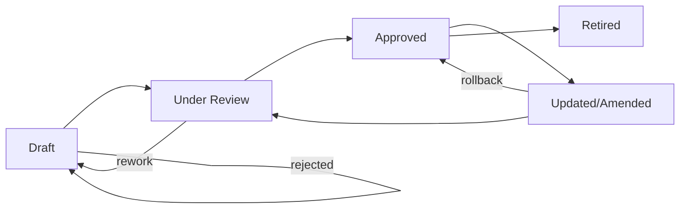
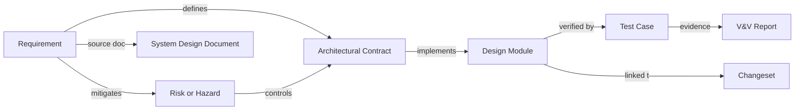

### The Rationale for Docs-as-Code in Integrated Product Environments

For organizations building integrated products spanning software, firmware, hardware, and mechanical engineering, the challenge of managing knowledge and capturing evolving system intent is amplified by asynchronous cadences, diverse artifact types, and stringent compliance demands. Relying on manual, file-based document management or proprietary tools with opaque workflows not only increases the risk of divergence between design and implementation but also hinders effective, auditable handoffs across domains.

Docs-as-Code responds directly to these challenges by embedding documentation practices within the engineering workflow. It treats requirements, architecture descriptions, interface contracts, V&V assets, design decisions, and explanatory text as source artifacts, subject to the same rigor, traceability, and automation as code and models. Because these documents are managed in source control systems (e.g., Git), evolution is inherently auditable: every change carries author, rationale, review history, and linkage to upstream and downstream dependencies.

This approach aligns tightly with regulatory standards such as ISO 26262, IEC 62304, and EN 9100, all of which demand traceability, evidence-driven compliance, and the maintenance of up-to-date artifacts synchronized to the release baseline. By operationalizing Docs-as-Code, Cornerstone centers its documentation practices on first principles: integration, testability, continuous updating, and total traceability.

---

### Living Design Documents: Architecture, Intent, and Continuous Evolution

#### Documents as Living Artifacts

Within Cornerstone, documents are not static entities captured at project inception or gated milestones; they are living artifacts, defined by continuous evolution as the product and its understanding mature. Each artifact—whether a requirements document, interface specification, architecture rationale, or V&V protocol—exists in a source-managed, version-controlled space. The purpose is to ensure that as changes propagate through the system, from high-level intent down to module-level detail, the corresponding documentation is incrementally and automatically updated, reviewed, and validated alongside domain work.

These living artifacts operate within explicit state models—for example, draft/proposed/approved/retired—and carry metadata denoting their maturity, dependency structure, and linkage to system events. The Docs-as-Code workflow natively supports this by using branching and pull requests for major changes, automated review pipelines, and mandatory status flags. Such mechanisms provide a built-in process for peer review, impact analysis, change justification, and rollback, replicating the best practices developed for software source code but extending them to every knowledge asset that underpins product realization.

#### Architectural Contracts and Rationale

A critical class of living document in Cornerstone is the architectural contract. These structured artifacts formally define the interfaces and behavioral expectations between domains (e.g., a firmware register map, software-hardware API, or mechanical mounting interface). Each contract is maintained as machine-readable text (e.g., YAML, JSON, Markdown with embedded schemas), and is versioned and reviewed exactly as code would be. The accompanying rationale—also maintained as Docs-as-Code—details the decisions, trade-offs, and acceptance criteria underpinning each contract, supporting compliance with standards requiring justification and the ability to reconstitute design thinking post hoc.

#### Living Requirements and Traceability

Requirements evolve during product development as system understanding grows and feedback is incorporated. Docs-as-Code enables requirements management as a first-class, living process: every modification is tracked, commented, reviewed, and explicitly linked to downstream designs, tests, and build artifacts. Traceability matrices—whether generated automatically or annotated in-line—link requirements to validated code, test cases, physical assets, and integration results.

This model transforms requirements volatility from a pure risk into an auditable, learnable part of the system lifecycle. When properly implemented, it supports regulatory audits, facilitates impact assessment for proposed changes, and supports adaptive planning by surfacing dependency relationships as soon as new information emerges.

#### Example Artifact Lifecycle

The following diagram illustrates the typical lifecycle and state flow for a living artifact in the Docs-as-Code model:

This diagram embodies the cyclic, evolution-oriented approach to documentation in Cornerstone: an artifact moves between states based on feedback, events, or integration results, enabling continuous improvement while maintaining a verifiable record of its evolution.

---

### Traceability by Construction: Artifacts as Connected Knowledge Graphs

#### Linking Artifacts across Domains

A principal advantage of managing documents as code is the ability to create and maintain robust, machine-readable linkages between artifacts across domains. In traditional engineering environments, creating a traceability matrix involves brittle, manually-maintained spreadsheets or proprietary tools disconnected from daily workflows. In Cornerstone, the trace network is built and validated as an intrinsic part of the development process.

Each artifact—requirement, architectural contract, design module, test case, or change request—encapsulates within its metadata explicit backlinks and forward-links to all related entities. Tools built into the Docs-as-Code ecosystem (e.g., static analysis tools, pre-commit hooks, custom validation scripts) can traverse these links, assert their completeness, detect breakages or outdated associations, and automatically update documentation when such relationships change.

From an engineering perspective, this means impact analysis, audit preparation, root-cause analysis, and gap identification are all supported by source-tracked, queryable, up-to-date traceability. When a requirement changes, all dependent design elements, interface contracts, V&V assets, and deliverables can be enumerated and re-validated with minimal manual effort.

#### Foundations for Regulatory Compliance

Many standards—including DO-178C, ISO 13485, and others—require explicit, bidirectional traceability between requirements, risk controls, design, tests, and evidence. By operationalizing these relationships in source control and enforcing their integrity at every relevant workflow event, Cornerstone’s Docs-as-Code practice enables continuous compliance.

Automated pipelines can generate compliance packages, trace graphs, coverage reports, and change impact documentation on demand. This supports not only regulatory submissions, but also system learning and decision support during routine evolution.

#### Example: Traceability Graph

A high-level representation of interconnected artifacts in Docs-as-Code can be depicted as follows:

This graph illustrates the core relationships essential to traceability and educates engineers on how each artifact participates in the overall compliance and quality assurance structure.

---

### Flow-Oriented Documentation: From Bottleneck to Accelerator

#### Documentation Friction and Team Velocity

Historically, documentation has been perceived as an inhibitor of engineering flow, often relegated to “write-up” phases following code completion or prototyping milestones. This mindset arises in part from the use of heavyweight formats (e.g., monolithic Word documents, PDF compendia) and siloed responsibility models, leading to periods where documentation lags behind implementation or exists as a mere project deliverable, devoid of immediate operational value.

Docs-as-Code in Cornerstone transforms this picture by making documentation a natural part of every commit, merge, or integration event. The same pull request that introduces a design change must update the relevant contract or requirement, with CI/CD pipelines gating progress on the presence and review of up-to-date supporting documentation. The technical meta-work of documentation thus ceases to be an afterthought; instead, it is a seamless, value-driven element of the engineering workflow, enforced by automation and peer review.

#### Supporting Cross-Domain Collaboration and Integration

In integrated product environments, handover and collaboration points between software, firmware, hardware, and mechanical teams are common sources of error due to incomplete, out-of-date, or ambiguous documentation. The Docs-as-Code approach ensures that interface definitions, protocols, and system assumptions are always available in their canonical, up-to-date forms, directly referenced from the repository branches serving as integration baselines. Automated validation (e.g., schema checks, compliance assertions) can detect drift between documentation and implementation at integration points, surfacing actionable feedback immediately.

Moreover, Docs-as-Code supports federated authoring—meaning that multiple domain experts can propose, review, and update artifacts concurrently, with conflict management, branch policies, and merge workflows preserving coherence and auditability. This model aligns with the distributed, asynchronous cadences and domain boundaries common in modern engineering organizations.

---

### Automation, Validation, and Docs-as-Code Toolchains

#### Automated Pipeline Integration

Cornerstone’s automation philosophy extends to documentation by making it a first-class citizen in CI/CD pipelines. Artifacts managed with Docs-as-Code are subject to the same suite of automated checks as code: syntax validation (e.g., Markdown linters, schema validation), style enforcement, completeness checks (e.g., all requirements are traced, all contracts are linked to V&V assets), and even auto-generation of diagrams or tables.

Pipeline mechanisms can gate merges or releases based on the status of living documentation, with standard evidence outputs (e.g., HTML renders, PDFs for compliance submission, changelogs) built automatically from source. This ensures that every integrated change is supported by up-to-date, reviewable, and archivable documentation, drastically reducing the risk of knowledge drift.

#### Testable Documentation and Compliance Evidence

Modern Docs-as-Code platforms support embedding executable elements, such as code snippets, API examples, or test vectors, directly in documentation and validating their correctness as a part of the build process. For example, a hardware register map specification might include reference drivers or simulation stubs executable in CI, while a V&V protocol would reference and even trigger automated test runs as evidence artifacts.

The upshot is that the documentation not only describes the intended function but also demonstrates, in a reproducible and automatically verifiable fashion, that implementation and test assets remain synchronized with stated requirements and assumptions. This deeply supports the “shift-left” verification and feedback model central to Cornerstone.

#### Typical Docs-as-Code Toolchain Architecture

An effective Docs-as-Code stack will often include:

- Source control (e.g., Git) for artifact management and branching.
- Static site generation tools (e.g., MkDocs, Sphinx, Docusaurus) for rich, navigable renderings.
- Doc formatting and schema enforcement (e.g., Markdown, reStructuredText, AsciiDoc, YAML).
- Linting, link-checking, and traceability validation tools.
- CI/CD integration for automated builds, checks, and publication.
- Issue tracking integration for traceable linkage to defects, enhancements, and reviews.

The right combination is context-dependent, but the architectural principle remains: treat documentation as source, integrate with automation, and ensure everything needed for compliance and efficient engineering is present, current, and reviewable at all times.

---

### Trade-offs, Organizational Impact, and Failure Modes

#### Constraints and Adoption Challenges

While the benefits of Docs-as-Code for flow, traceability, and compliance are substantial, several practical constraints influence real-world adoption. Teams heavily invested in legacy document-centric workflows or proprietary requirements tools may face significant migration effort, both in artifact conversion and in upskilling staff. Furthermore, certain stakeholders—such as external auditors, regulatory bodies, or non-technical management—may prefer or require document formats (e.g., PDFs, Excel files) incongruent with pure source-control practices, necessitating automated export mechanisms and view-generation as part of the DaC pipeline.

For hardware and mechanical domains less accustomed to “code-like” workflow tools, cultural adjustment may be required to embrace practices such as pull requests, branched authoring, and integrated review. Investment in cross-domain documentation standards and schema definitions is needed to ensure that artifacts retain enduring meaning as the system matures.

#### Governance and the Role of Documentation Ownership

Cornerstone’s Docs-as-Code practice distributes ownership and stewardship for documentation, embedding it into every engineer’s definition of done. However, disciplined governance is still necessary to ensure that major architectural documents, contracts, and requirements retain clarity and relatability as their complexity grows. System architects, V&V leads, and integration coordinators act not as sole authors, but as stewards—reviewing, merging, and resolving conflicts as the knowledge base evolves. Automated CI checks should be complemented by human domain review, particularly for artifacts whose implications exceed the expressive power of schema validation.

#### Failure Modes

Potential failure modes in Docs-as-Code adoption include:

- Documentation debt arising from unreviewed or incomplete changes merged under deadline pressure.
- Traceability gaps when artifact linkages are omitted or schema violations bypass automation.
- Overly rigid automation blocking progress on nuanced or exceptional cases, causing frustration and process circumvention.
- The proliferation of variants (“forks”) of living documents without adequate governance, especially in organizations with many concurrent programs.

Mitigation strategies center on robust review workflows, traceability dashboards, and scheduled audits—supported by automation but reliant on explicit team discipline. Regular, system-level documentation reviews are critical to identify atrophy, confusion, or “orphaned” knowledge.

---

### Standards Alignment and Interoperability

Cornerstone’s Docs-as-Code approach is proactively aligned with relevant engineering and quality standards. Artifacts are structured to satisfy audit requirements for standards such as ISO 26262 (automotive safety), IEC 62304 (medical device software), EN 9100 (aerospace quality), and ISO 9001 (general quality management). The ability to generate “point-in-time” snapshots of documentation tied to release baselines, complete with trace graphs and evidence artifacts, is essential for compliance. The use of machine-readable formats promotes interoperability between tools, facilitates integration with product lifecycle management (PLM) systems, and eases the burden of change migration across programs.

Furthermore, Docs-as-Code provides a basis for tool-agnostic artifact exchange (e.g., as OpenAPI for interfaces, SysML diagrams encoded as text, or CSV/YAML for trace matrices), enabling collaboration across vendors and supply chains, and supporting digital thread initiatives critical to advanced manufacturing and systems engineering.

---

### Conclusion: Living Documentation as a Cornerstone of Predictable, High-Quality Delivery

Cornerstone embeds documentation as a living, system-integrated artifact, managed and validated through Docs-as-Code practices. This approach is not merely an efficiency improvement or process preference—it is foundational to how integrated engineering organizations manage complexity, synchronize across asynchronous domains, achieve auditability, and institutionalize system learning. By treating all critical knowledge assets—requirements, architecture, contracts, tests—as evolving, automatable source, Cornerstone establishes documentation as both the backbone and the bloodstream of product delivery: essential for flow, essential for compliance, and essential for uniting multi-disciplinary teams in pursuit of predictable, high-quality outcomes.

The practices described here do not abolish documentation effort; rather, they redirect it—transforming documentation from a trailing appendage into a visible, testable driver of progress. In the hybrid, contract-driven, integration-centric world of Cornerstone, living documentation is the mechanism by which intent, evidence, and adaptation cohere into lasting engineering value.