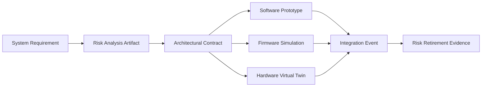

## Principle: Tackling the Highest-Risk Items First

### The Rationale for Risk-First Execution

At the core of the Cornerstone framework is the deliberate prioritization of risk—making the reduction of uncertainty, fragility, and potential failure the first concern of every engineering iteration. This fundamental principle recognizes that in the context of integrated product development, risk is not a peripheral variable to be tracked in documentation or reviewed at milestone gates; rather, it shapes the entire lifecycle and drives the trajectory of technical, organizational, and compliance outcomes. Tackling the highest-risk items first transforms risk management from a reactive, control-oriented activity to a proactive, learning-centric driver of progress and quality.

In multidisciplinary environments—including software, firmware, hardware, and mechanical integration—risk is multidimensional. It encompasses architectural uncertainty, technical feasibility, supply chain fragility, safety and regulatory exposure, and operational complexity. To address this, Cornerstone operationalizes a continuous, evidence-driven risk reduction loop, integrated as both philosophy and workflow, positioning each iteration as an explicit opportunity to validate key assumptions and surface latent failure modes. Progress is measured not solely by quantity of output, but by the reduction of the most critical project-threatening risks.

### Types of Risk in Integrated Product Environments

Effective risk-first execution demands clear definitions—a taxonomy of risk types suited to complex, regulated, integrated product domains. In the context of Cornerstone, the most salient categories include:

- **Technical Risk**: Uncertainty regarding the feasibility of design solutions, often emerging at interfaces between domains (e.g., new communication protocols between hardware and firmware, emerging standards, novel algorithms). Technical risks typically cluster around system-level architectural novelty, integration complexity, or the adoption of unproven technologies.
- **Architectural Uncertainty**: Structural ambiguities or misalignments in system decomposition, interface contracts, data flows, or physical/mechanical packaging. Early design choices—if not interrogated—may lock in exponential later-stage costs or irreversibly constrain compliance and performance.
- **Hardware Supply and Manufacturing Risk**: Exposure to global supply chain instabilities, component obsolescence, variable lead times, and uncertainty in manufacturing maturity. Especially acute in post-pandemic or rapidly evolving silicon and electromechanical supply chains, these risks can invalidate otherwise-sound roadmaps if left untested.
- **Regulatory and Compliance Risk**: Uncertainties related to conformity with industry-specific standards (e.g., ISO 26262, IEC 62304, DO-178C), safety, and cybersecurity requirements. These risks demand early evidence through analysis, simulation, pre-compliance reviews, and engagement with certification authorities.
- **Programmatic and Integration Risk**: Complex dependencies, sequencing constraints, or organizational misalignments—where the timing, sequencing, or completeness of artefacts from one domain impacts the progress or validity of another.

In practice, these risk dimensions are often entangled. For example, a single architectural contract may simultaneously depend on an uncertain protocol implementation, a long-lead hardware component, and the timely interpretation of evolving regulatory guidance.

### Risk-Driven Workflow in the Cornerstone Framework

The commitment to tackling the highest-risk items first is manifest in Cornerstone at every level of planning and execution. This is not an overlay on traditional schedules, but a deliberate structuring of work such that the most critical sources of uncertainty are made visible and testable as early as possible within the constraints of technical readiness and resourcing.

#### Early Risk Identification and Prioritization

Risk-first practice begins with integrated identification: as requirements and architectural contracts are captured (via Docs-as-Code in version control), they are tagged with explicit risk attributes, rationales, and evidence needs. System architects and technical leads, in collaboration with domain experts and V&V personnel, perform structured risk analysis—quantifying impact, likelihood, detectability, and systemic interdependencies. This aligns with established systems engineering frameworks (e.g., INCOSE, ISO 31000) while embedding risk prioritization directly in living artifacts.

Where possible, risk registers and heatmaps are kept as code-managed artifacts—subject to review, branching, and traceable evolution in step with requirements, design, and test assets. Risks themselves become versionable, living entities, linked into the continuous integration pipeline such that their retirement or escalation is a matter of traceable evidence, not subjective status reports.

#### Shaping the Iterative Flow: From Risk to Learning

Once identified, the highest risks directly shape the content and sequence of iteration backlogs, spike investigations, and integration events. In contrast to traditional backlogs—often feature-oriented—Cornerstone mandates that the early shaping of deliverables is driven by a prioritized set of risk validation goals. For example, a sprint or iteration may target the development of a test harness to exercise a protocol in simulated hardware, or the rapid prototyping of a mechanical interface to expose manufacturability risk.

This approach realigns the purpose of early sprints away from “quick wins” or aesthetic progress toward validated learning; deliveries are chosen not for superficial completeness but for their ability to resolve the greatest sources of project-threatening uncertainty. Integration contracts are negotiated around the reduction of risk—gating progress not simply by activity completion, but by the clear demonstration that a class of risk has been retired, reduced, or at minimum, reframed with better evidence and updated contingencies.

#### Federated Risk Flow Across Domains

A critical aspect of risk-first execution in Cornerstone is its federation across asynchronous domain cadences. In a typical integrated product environment, software teams may iterate daily or weekly, while hardware and manufacturing domains operate in cycles dictated by procurement, fabrication, and test infrastructure. 

Cornerstone addresses this by binding risk reduction objectives into architectural contracts and interface assets. Each domain’s work is triggered by, and feeds into, evidence-based milestones that validate the retirement of risk—rather than by arbitrary calendar boundaries or phase gates. For example, a virtualized integration environment (such as a digital twin with simulated hardware) can be assembled in parallel with hardware design, allowing software and firmware to retire technical risks and inform hardware contracts before first-silicon or first-article builds. 

This approach is diagrammed below:

In this structure, risk analysis directly informs the architectural contract, which in turn shapes parallel, domain-specific artefacts. All streams converge on an integration event designed explicitly to generate evidence for risk retirement.

#### Traceability and the Hierarchy of Risk

Cornerstone’s commitment to living traceability transforms the management of risk transitions from identification to evidence-based resolution. Each risk is explicitly linked to one or more contracts, tests, or artifacts in version control. When a risk is validated (retired, accepted, or recharacterized), the evidence is linked in the traceability graph, ensuring both real-time visibility and future audibility (e.g., for regulatory or safety compliance).

This approach is highly compatible with the requirements of standards such as ISO 26262, IEC 61508, or DO-178C, in which hazard and risk analysis, mitigation activity, and evidence linkage are prescribed as central pillars of compliance. In practical terms, this means that the living risk artifact referenced above is not peripheral to the work: it is traversable alongside all requirement, design, test, and integration documentation. Risks may be filtered, queried, and reasoned about as part of routine technical reviews, readiness gates, or certification audits.

### Practical Realities and Trade-offs in Risk-First Execution

The theoretical elegance of risk-first execution in Cornerstone must be reconciled with a number of practical challenges and organizational realities.

#### Balancing Tactical Progress and Strategic Assurance

A focused campaign against top risks delivers clarity and resilience, but can inspire tension with stakeholders measured on feature throughput or milestone completion. While disciplined risk retirement provides sturdy foundations for later development, it may appear to delay visible product increments or glossaries of “finished” features, especially early in lifecycles or customer demonstrations.

To manage this, Cornerstone insists that risk-driven work is not an excuse for academic investigation detached from delivery. Every learning spike, prototype, or integration test is traceably aligned with requirements and architectural contracts. Progress is staged as the building of “fit-for-purpose” evidence—prototypes, simulation results, compliance pre-certifications, or failure reports—rather than unaudited research. The operational rhythm remains that of iterative, contract-bound delivery, with each activity justified by its direct contribution to program risk reduction and overall system viability.

#### Dependencies, Asynchrony, and the Constraints of Physical Realization

Integrated product development is frequently constrained by long-lead hardware, supply chain volatility, and the irreducible ordering of certain fabrication or test events. The risk-first approach does not suspend physical constraints, but it modifies their influence by prioritizing early and parallel creation of virtual integration environments, stubs, shims, and contracts. Where true risk retirement cannot occur until physical artifacts arrive, risk-first practice requires the explicit documentation and management of these “irreducible” risks in the traceability network, ensuring that mitigations—such as alternate sourcing, staged test infrastructure, or design modularity—are developed and tested well in advance.

In practice, this drives the early development of digital twins, simulation harnesses, and highly disciplined interface contracts that allow software, firmware, and mechanical teams to retire much of the technical and architectural risk before—and irrespective of—the arrival of hardware prototypes.

#### The Challenge of Quantification and Residual Risk

Risk assessment is inherently imprecise and subject to bias. The estimation of likelihood, impact, and detectability is improved—but not eliminated—by the structured, artifact-driven process adopted by Cornerstone. Failure modes may be underestimated, especially where organizational incentives reward the green-lighting of progress rather than the surfacing of latent hazards.

Here, the combination of centralized, auditable risk artifacts and the accountability of review gates helps maintain quality. The evidence for risk retirement is itself subject to review; links in the traceability graph can be audited to ensure that risks are not closed on assertion, but with tangible artifacts—test results, prototype demonstrations, independent reviews. Residual risks are called out explicitly and, where necessary, accepted with rationale, supporting informed decision-making and management alignment in line with standards such as ISO 14971 (risk management for medical devices).

### Integration with Lifecycle and Flow in Cornerstone

Risk-first prioritization is not a “phase” but an ongoing practice embedded into every lifecycle stage and artifact. At inception, risk shapes the initial architecture and dictates the early investment in simulation, prototyping, and virtualization. During iterative development, risk-rating of work items directly informs prioritization; the highest-ranked risks continually feed the content of current integration events and gating reviews.

At integration gates and system verification events, risk evidence is a criterion for readiness: integration is blocked for domains or interfaces where the pertinent risks have not yet been retired, where evidence is lacking, or where risk artifacts are not traceable and reviewable. This discipline ensures that the progressive assembly of the system is paced by learning, not assumption.

In post-integration and lifecycle maintenance, Cornerstone keeps risk artifacts alive as vehicles for observing emergent hazards, regressing legacy mitigations, and maintaining compliance. When field data, failure observations, or regulatory changes surface new or previously-residual risks, these are reincorporated into the living risk trace, promptly cycling back into the iterative planning and learning loop.

### Organizational Implications

Adopting a risk-first approach, as mandated in Cornerstone, shapes decision-making across roles, from engineers to leadership. Architects and system engineers are accountable for maintaining a current, reviewable risk registry, with explicit traceability to contracts and integration events; V&V engineers shift their focus from phase-gate reporting to the ongoing delivery of evidence for risk retirement; product owners and program managers translate residual and emergent risks into communication with external stakeholders and customers, managing expectation and aligning incentives.

Organizational learning is institutionalized by making the retirement of risk both a metric of progress and a requirement for celebrating achievement (e.g., a demonstration is only “done” when its dominant risks are visibly retired). Domain leads are expected to reason about integration meetings, investment trade-offs, and staffing allocation not purely in terms of throughput, but in the cadence of risk exposure and retirement.

### Failure Modes and Patterns of Dysfunction

Failure to implement a disciplined, risk-first methodology can manifest in several characteristic dysfunctions, each of which Cornerstone addresses directly:

- **Integration Surprises**: When risk assessment is relegated to perfunctory checklists, the first system-level integration exposes architectural, timing, or resource incompatibilities that were visible in risk analysis but ignored in implementation sequencing.
- **Compliance Late-Failures**: In regulated industries, deferring safety, cybersecurity, or compliance scrutiny until late-stage reviews triggers critical redesign late in the lifecycle, undermining both schedule and quality.
- **Feature-Increment Trap**: Emphasizing early “low-risk” features for demonstration purposes may generate the illusion of progress, while the critical risks—such as supply chain uncertainty, safety requirements, or complex integration—remain unexercised.
- **Traceability Gaps**: When risk mitigation and evidence artifacts are not maintained as living, linked entities, organizations lose the ability to audit decisions, justify trade-offs, or smoothly onboard new project members.

By contrast, when risk-first execution is implemented as artifact-centric, continuous, and evidence-driven practice, Cornerstone enables resilience, learning, and quality to emerge systematically from the cadence of engineering work.

### Risk-First in the Evolution of Architecture

A fundamental architectural implication of risk-first delivery is its effect on system evolution and technical debt. By exposing and retiring uncertainty as early as possible, architectural rigidity, premature commitment, and over-specification are resisted. Evolutionary architecture thrives when risk is the compass; corners are not cut for early velocity, but corners are deliberately cut in high-uncertainty areas to allow robust risk validation and later refinement. This is visible in architectural artifacts themselves: contracts are specified first to the degree necessary for risk retirement, and expanded or stabilized only as delivery cadence, learning, and evidence permit. Design rationale—maintained in artifact traceability—anchors each decision to its risk context, supporting later evolution with contextual integrity.

### Summary: Risk as the Engine of Predictability and Quality

The principle of tackling the highest-risk items first is the linchpin that transforms Cornerstone from a prescriptive process model into a learning system for product engineering. By making risk analysis, transparency, and retirement continuous and artifact-driven, this approach provides discipline in the face of uncertainty, accelerates learning, and safeguards delivery against cascading integration or compliance failure.

This risk-first philosophy enables integrated product teams to move beyond feature-chasing and superficial velocity—positioning learning, evidence, and adaptation as the foundations of reliability and compliance. It aligns with the mandates of modern standards, responds to the realities of multidisciplinary product realization, and delivers a resilient, auditable trajectory toward high-quality, fit-for-purpose products in complex, regulated environments.