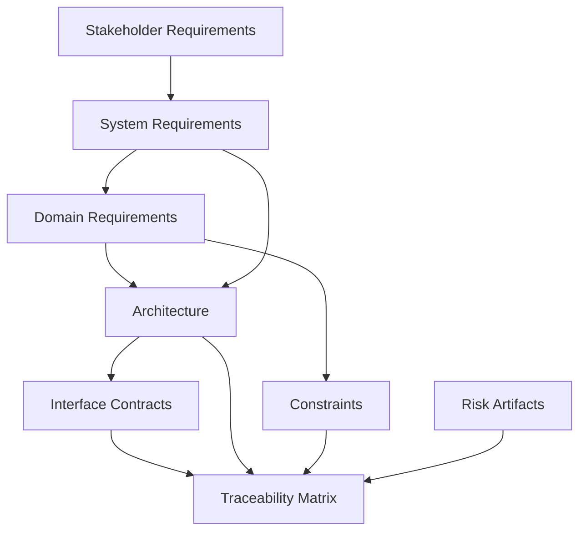

## The Structured Foundation: Early Lifecycle in Cornerstone

### Introduction

The early lifecycle phase in Cornerstone—termed the Structured Foundation—serves as the bedrock upon which sustainable product development is constructed. Far from being a perfunctory prologue, the Structured Foundation orchestrates the deep framing of requirements, architectures, constraints, and traceability that will ultimately govern every downstream development activity. This foundation ensures the alignment of multi-disciplinary teams, manages complexity through explicit artifacts, and establishes the traceable relationships necessary for compliance, risk management, and continuous learning. Understanding the function, structure, and outputs of this phase is critical for engineering organizations aiming to avoid late-stage integration failures, traceability gaps, or brittle responses to change.

### Role and Objectives of the Early Lifecycle: Beyond Documentation

The early phase is not a static waterfall front-end, nor is it a nominal requirements-gathering exercise. Instead, the Structured Foundation encapsulates active problem framing, systemic risk surfacing, architectural boundary establishment, and continuous alignment to business intent, technical feasibility, and regulatory context. Within Cornerstone, this phase is designed to integrate seamlessly with the iterative and validation-centric arms of the delivery lifecycle, but it also maintains a distinct purpose: providing the necessary invariants and structured interfaces that allow for systematic change without jeopardizing product integrity.

This phase achieves several critical objectives:

- **Validating Feasibility and Framing Risk**: Early-stage artifacts validate high-level product feasibility, expose critical risks, and set the stage for risk-driven iteration.
- **Establishing Traceability Networks**: Detailed traceability from requirements through constraints to architectural contracts enables end-to-end flow, future compliance audits, and continuous knowledge evolution.
- **Enabling Structured Multidisciplinary Alignment**: By explicitly representing software, firmware, hardware, and mechanical dependencies, Cornerstone prevents siloed initiation, reinforcing cross-domain engagement.
- **Avoiding Architectural Drift and Entropy**: The Structured Foundation sets the boundaries and contracts that should persist through design evolution, preventing ad hoc divergence.

The value of this phase is realized in its dynamic interplay with later phases: it enables iterative development to proceed safely and flexibly, while safeguarding the organization’s ability to maintain auditability, learn from discoveries, and systematically accommodate change.

### Core Artifacts of the Structured Foundation

#### Requirements Artifacts

Requirements in Cornerstone are not only textual statements of need; they exist as structured, version-controlled artifacts—integrated within the Docs-as-Code paradigm. Each requirement encapsulates clear intent, rationale, acceptance criteria, and traceable relationships to higher-level objectives, user needs, or regulatory demands. Requirements are formulated to be unambiguous yet adaptable, supporting later negotiation and refinement without sacrificing traceability.

Requirements typically span several layers:

- **Stakeholder and System-level Requirements**: These define the external perspective, business objectives, regulatory imperatives, and major user needs.
- **Domain-specific Requirements**: Constraints and objectives arising from specific engineering disciplines (e.g., real-time performance for embedded software, tolerance specifications for mechanical assemblies).
- **Derived and Implied Requirements**: Emergent properties captured explicitly as engineering insights surface, and validated through traceable artifact relationships.

#### Architectural Artifacts

Architecture serves as the structural manifestation of requirements, constraints, and strategic intent. In Cornerstone, architecture is represented as an evolving set of integrated contracts—system overviews, interface definitions, allocated responsibilities, and rationale—managed as first-class, versioned artifacts. Structural boundaries, interface surfaces, and allocation of responsibilities are codified early, but maintained as living models.

Key architectural artifacts include:

- **System Decomposition and Block Diagrams**: Hierarchical breakdowns establishing the main functional and physical domains; cross-domain mappings clarify integration points and partitioning logic.
- **Interface Contracts**: Crisp, versioned specifications of electronic, logical, or mechanical boundaries, enabling independent work while preserving integration safety.
- **Traceability Grids**: Explicit representations linking requirements to architecture, surface to interface, and rationale to realization.

#### Constraints and Design Invariants

Specified constraints—performance, safety, environmental, regulatory—are not passive declarations. In Cornerstone, they are actionable, designed to propagate through traceable links, guiding architectural choices, verification strategies, and prioritization of work. This includes not merely technical boundaries but also process-driven constraints, such as mandated design standards (e.g., ISO 26262, EN 9100) or supply-chain realities. Design invariants solidify critical system properties that must remain stable throughout evolution.

#### Traceability Artifacts

The traceability framework established in the Structured Foundation is multi-dimensional, linking requirements, risks, architectural decisions, constraints, and eventually, V&V activities. These links are not post-hoc exercises, but intrinsic features of the development process, enabled by Docs-as-Code storage, embedded references, and trace validation tooling. Traceability does not only serve compliance; it is the mechanism by which systemic feedback and risk retirement become possible.

Mermaid Diagram: Foundation Artifacts and Relationships

This diagram illustrates the multi-layered, interconnected nature of early artifacts, with traceability bridging requirements, constraints, architectural definitions, and risks.

### Mechanisms for Artifact Creation and Alignment

#### Requirements and Constraint Elicitation

Cornerstone’s requirements elicitation process is rigorously structured, yet iterative. Unlike ad hoc or document-centric approaches, elicitation meetings and workshops are augmented by traceable rationales, version-controlled discussions (e.g., architecturally significant decisions captured via PRs), and explicit stakeholder validation checkpoints. This process leverages domain-specific templates, system state diagrams, and model-based requirement statements to ensure clarity and alignment. The transition from informal needs to structured artifacts is facilitated by automated linting and validation against compliance schemas.

Constraint capture, on the other hand, is expressly proactive. Rather than waiting for constraints to emerge reactively, the foundation process systematically surfaces and encodes all known constraints at the outset, ranging from technical (e.g., bus bandwidth limits) to process (e.g., prototype approval cycles) to regulatory (e.g., safety integrity level demands). Each constraint is treated as a first-class citizen in the artifact hierarchy.

#### Architectural Framing

System architecture in the Structured Foundation is not a speculative exercise; it is bounded by requirements, feasibility investigations, known risks, and traceable rationale. Allocation decisions (e.g., separating hardware vs. firmware responsibilities, determining mechanical packaging boundaries, or allocating safety features) are justified with linked evidence, reducing ambiguity and future impedance mismatches. This phase leverages digital models (system block diagrams, interface definitions, and logical architectures) that are subsequently versioned, reviewed, and refined.

Key aspects include:

- **Cross-domain Reviews**: Deliberate inclusion of discipline experts ensures cross-domain effects—such as electromechanical interfaces or software-hardware-handshake logic—are not deferred or overlooked.
- **Early Integration Models**: Tools such as digital twins and interface simulators enable conceptual integration before artifact realization. Early abstraction testing, HIL scaffolding, and simulation support architecture feasibility.

#### Establishing the Traceability Network

Traceability in Cornerstone is not a separate deliverable but an integrated feature of every artifact. Requirement-attribution tools (e.g., YML/Markdown with embedded reference tags, or requirements markup extensions in Git repositories) facilitate live cross-referencing. Architectural blocks, interface definitions, and constraint files are interlinked: a change in one yields an auditable impact report, allowing risk and dependency assessment during planning and change control.

Docs-as-Code automation ensures the integrity of trace links, supplementing manual stewardship with continuous validation. Automated traceability matrix generation, gap analysis, and compliance reporting (linked to standards such as ISO 26262 Part 8, "Supporting Processes") are cornerstone mechanisms embedded within the artifact management platform.

### Feeding the Iterative Development Core

The Structured Foundation is explicitly designed to serve as the gateway to iterative development. This is not a static handover; it is a continuous feed-forward of structured intent, functional boundaries, risk exposure, and readiness conditions. The primary mechanism by which the foundation empowers development is through gated artifact maturity—versioned contracts, approval checkpoints, and event-driven readiness states.

#### Artifact-Driven Gating

Artifacts generated in the Structured Foundation are not monolithic. Every requirement, architectural model, and constraint is promoted through structured states (draft, ready-for-review, accepted, versioned release), with traceable rationale captured at every transition. Only artifacts meeting defined readiness criteria—e.g., baseline architectural contracts reviewed by all impacted domains—progress into active implementation cycles. This delivers predictability, prevents unverified exploratory work, and ensures the development backlog is shaped by actual product constraints, technical possibilities, and explicit risk posture.

#### Continuous Alignment and Evolution

The Structured Foundation is inherently designed for evolution. As teams uncover discoveries during iteration, feedback heuristics enabled by traceability allow the dynamic refinement of requirements, update of constraints, and negotiated architectural adjustment—without compromising the original intent or compliance stance. The foundation’s artifacts serve as the memory of intent and the substrate for systemic learning, enabling teams to revisit, renegotiate, or validate past decisions as the context evolves.

Furthermore, because all early artifacts are stored as version-controlled, reviewable assets, the knowledge flow from early lifecycle into later phases remains fluid: rationale is never lost, decisions are always traceable, and the cost of change (in terms of required coordination, risk, and documentation impact) can be quantitatively assessed.

### Traceability as a Mechanism for Learning and Risk Control

A defining feature of Cornerstone is the use of traceability not simply for audit purposes, but as an engine of continuous learning. Each artifact generated in the Structured Foundation is an active participant in this knowledge network. The forward and backward links—requirement to constraint, architecture to risk, trace to validation result—not only satisfy compliance regimes, they allow organizational learning to be embedded in the very fabric of the engineering process.

When defects or integration failures eventually emerge, traceability enables fast root-cause identification: artifacts implicated in failures can be analyzed for coverage gaps, rationale misinterpretations, or risk underestimations. Conversely, when regulatory changes or evolving customer demands occur, impact analysis through the traceability network immediately highlights the affected requirements, system blocks, or constraints, accelerating controlled change.

#### Practical Workflow Realities

Implementing robust traceability is not without challenge. Engineers may encounter friction integrating legacy artifacts, dealing with partial or imperfect information, or harmonizing differing documentation conventions across domains. Cornerstone addresses these realities through:

- **Federated Stewardship**: Assigning artifact stewards responsible for maintaining artifact integrity and cross-domain traceability.
- **Toolchain Interoperability**: Adopting format conventions (YAML, Markdown, model exchange standards: SysML/XMI, ReqIF) and conversion scripts to support legacy import and external audit requirements.
- **Continuous Trace Validation**: Utilizing pipeline automation to close traceability gaps at each artifact lifecycle event.

The reality is that traceability, when embedded from inception, ceases to be a burden and becomes a shared asset, supporting engineering agility and quality.

### Supporting Multidisciplinary Delivery

Perhaps most critically, the Structured Foundation serves as the keystone for multidisciplinary product development. By explicitly coordinating the inputs, outputs, and constraints of each engineering domain at inception, Cornerstone ensures that subsequent work is not only technically executable but also aligned to the practice norms, regulatory constraints, and delivery rhythms of each discipline.

#### Interface Contracts and Domain Alignment

Interface contracts—machine-consumable definitions of communication protocols, electrical characteristics, or mechanical fit—provide the decoupling and synchronization required to allow parallel team execution. These contracts are negotiated, versioned, and posted in central repositories, with change control governed by cross-domain review and compliance gating.

The foundational phase also solidifies shared vocabulary, rationalizes cross-domain dependencies, and encodes compliance evidence into the artifact hierarchy. This avoids the pitfalls of “integration phase as risk discovery” by converting interfaces and constraints into proactive alignment mechanisms.

#### Integration Points and Coordination

Integration is no longer a late lifecycle event. Virtual integration—via digital twins, simulator scaffolding, or surrogate hardware—is enabled early, with feedback mechanisms plumbing back to requirements and architectural artifacts. This reduces schedule risk, enables asynchronous development cadences, and surfaces cross-domain impacts before physical or contractual commitments are made.

Multi-team cadence planning, interface test harness development, and common artifact repositories are set up in the foundation, forming the infrastructure that will sustain effective, traceable multi-disciplinary engineering.

### Managing Variability, Trade-offs, and Failure Modes

While the Structured Foundation seeks to solidify and formalize as much as possible, it also must accommodate the irreducible uncertainties and trade-offs inherent in complex product development. Cornerstone’s approach is not to overspecify or freeze the system, but to make variability explicit, traceable, and risk-accounted.

#### Architectural Variants and Flexibility

Where requirements or architecture cannot be fully detailed due to externalities (e.g., pending regulatory clarification, untested technology), Cornerstone mandates the explicit recording of assumptions, architectural options, and known unknowns, each version-controlled and trace-linked. Provisional interfaces or black-box allocations are permitted—with documented risk exposure and a validation plan—provided they retain audit traceability and gating to prevent unqualified integration.

#### Failure Modes in the Early Lifecycle

Risks of over-specification—leading to brittle systems or rework—are mitigated by versioned artifact states and readiness gates, making it possible to incrementally commit only to what is justified and feasible. Conversely, failure to clarify system boundaries, interface contracts, or key constraints in the early phase leads directly to integration failures, system entropy, and compliance exposure downstream. Cornerstone mitigates these risks through artifact-driven process discipline, institutionalized feedback, and federated stewardship.

### Standards Alignment and Compliance

The artifacts and processes within the Structured Foundation are directly aligned with major quality and compliance frameworks. For instance, ISO 26262 and IEC 61508 both mandate demonstrable traceability from requirements through implementation to testing and validation. EN 9100 and IEC 62304 require structured configuration management of requirements and design history. The multi-dimensional artifact network produced in Cornerstone’s foundation natively satisfies these demands, and pipeline automation enables on-demand compliance reporting, configuration baselining, and audit response.

### Conclusion: The Structured Foundation as Enabler

The Structured Foundation phase in Cornerstone establishes more than plans and diagrams; it lays down a living, auditable, continuously evolving architecture for product knowledge, risk, and intent. By integrating rigorous requirements, actionable constraints, robust traceability, and explicit interface management from the outset, it empowers multi-disciplinary teams to work with agility without sacrificing system safety or compliance. Its outputs—versioned, traceable artifacts—form the primary feedstock for iterative development and continuous validation, and its traceability constructs create the scaffolding for organizational learning, continuous alignment, and sustainable delivery.

In this way, the Structured Foundation is not merely precedent to development: it is the catalyst for learning-centered, risk-managed, audit-ready delivery in complex, integrated product environments—a true cornerstone for modern engineering.