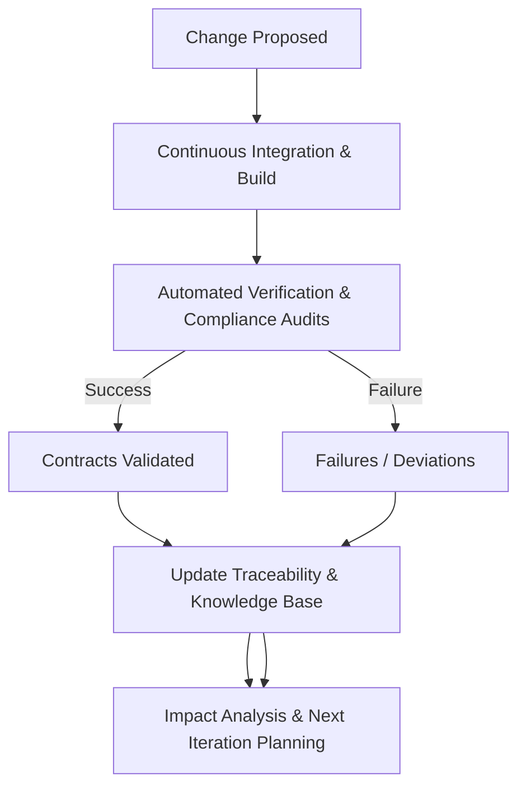

### The Iterative Development Core: Sustaining Flow and Integration in Cornerstone

The heart of Cornerstone is the Iterative Development Core—a disciplined, hybrid execution engine where multidisciplinary product delivery converges. Here, system architectures are realized, requirements decomposed, and design decisions substantiated through build, integration, and component-level verification. This phase is neither monolithic “agile” nor a rigid cascade; rather, it is a managed cycle of short, risk-driven, incremental feedback loops, dynamically synchronized by contracts, traceability, and architectural boundaries established during the Structured Foundation. The iterative core operationalizes systemic learning, sustains architectural integrity amidst change, and ensures continuous compliance and risk mitigation, ultimately preparing artifacts for the Rigorous Validation Arm. 

---

#### 6.x.1 The Role of Iterative Development in the Cornerstone Lifecycle

In complex engineering, especially where software, firmware, hardware, and mechanical elements intersect, the classic dichotomy of linear versus agile execution quickly dissolves. Modern delivery demands the adaptive learning cycles of Lean and Agile, but within a framework that guarantees auditability, regulatory compliance, and system-level coherence. The Iterative Development Core is designed to fulfill these demands. It is a phase—yet also a series of tightly coordinated activities—where teams build, test, integrate, and refine solutions iteratively, but within the envelope of architectural contracts, traceable requirements, and governed change.

In contrast to traditional “waterfall” approaches, rigid hand-offs and static documentation are replaced by continuous artifact evolution. Yet, unlike typical agile streams, unbounded narrative backlogs give way to structured, traceable work inventories—anchored to risk, architecture, and compliance needs, not just user stories. The iterative core therefore promotes autonomy and flow within established boundaries, maintaining alignment with system intent and governance.

---

#### 6.x.2 Iterative Flow as Engine: Synchronization of Disciplines and Feedback Loops

The principal mechanism of the Iterative Development Core is the deliberate, cyclic transformation of intent into validated implementation, mediated through architectural contracts, versioned interfaces, and readiness gates inherited from the Structured Foundation. Each cycle—or iteration—represents a controlled integration window: scope is pulled from continuously evolving, risk-prioritized backlogs, while change is governed by explicit artifact states and traceability.

Within a given iteration, software and firmware increments may be coded and built daily, electronics or mechanics advanced through rapid prototyping, and cross-domain interfaces exercised through co-simulation or hardware-in-the-loop (HIL) environments. These efforts culminate in integrated component or subsystem builds, supported by automated and manual verification tied to versioned contracts. Readiness is not defined by the subjective completion of tasks but by evidence: contracts fulfilled, interfaces validated, compliance and traceability rules passed.

This cyclical process is not strictly time-boxed; its cadence may vary as dictated by technical constraints, domain complexity, or organizational synchrony (e.g., Agile sprints, hardware bring-up cycles, regulatory increments). However, every cycle drives tangible evolution of working product increments, validated artefacts, and updated trace networks.

The iterative engine is depicted in the following Mermaid diagram, illustrating the flow of artifacts and information:

```mermaid
flowchart LR
    Spec[Structured Foundation Artifacts]
    Backlog[Risk-Driven Backlog]
    Plan[Iteration Planning & Readiness Gates]
    Dev[Design & Build Activities]
    Int[Component / Subsystem Integration]
    Verify[Verification & Contract Validation]
    Trace[Traceability Updates & Knowledge Capture]
    Learn[Systemic Feedback & Decision Making]
    Next[Next Iteration or Prepare for Rigorous Validation Arm]

    Spec --> Backlog
    Backlog --> Plan
    Plan --> Dev
    Dev --> Int
    Int --> Verify
    Verify --> Trace
    Trace --> Learn
    Learn --> Next
    Learn --> Backlog
```

This engine maintains the perpetual synchronization of intent, design, and verification across all participating disciplines, while continuously harvesting learning for adaptation and risk retirement.

---

#### 6.x.3 Artifact Evolution and Controlled Change

Artifacts within the Iterative Core are not static deliverables but dynamic, version-controlled entities. Requirements, architectural contracts, interface definitions, code, schematics, and verification assets traverse distinct, well-governed readiness states, enforced by both automated and manual gates. These states—draft, under review, ready-for-integration, released—are encoded in metadata and governed by pipeline automation, human review, and traceability rules.

Change is orchestrated through explicit, traceable mechanisms rather than emergent ad hoc edits. Source control platforms with branching strategies are integral, ensuring domain teams can pursue concurrent work—prototyping, defect investigation, integration—without corrupting released baselines. Merges are subject to both technical (e.g., continuous integration, regression suites) and compliance (e.g., audit trails, review sign-off) requirements. When changes are proposed—be they interface updates, requirement refinements, or bug fixes—impact analysis is conducted automatically by traversing traceability networks, surfacing all potentially affected artifacts and stakeholders.

The artifact’s “source of truth” status undergirds this process. Docs-as-Code governance enforces that documentation, requirements, and test descriptions are first-class artifacts: versioned, reviewable, and synchronized with code and other deliverables. Regulatory and architectural constraints are embedded in artifact lifecycles, so unauthorized or non-compliant change is systematically blocked by pipeline gates. This transparent, traceable approach provides the auditability required by standards such as ISO 26262 (for functional safety in automotive)
and IEC 62304 (for medical software).

---

#### 6.x.4 Dynamic Backlog Management: Risks, Contracts, and Value

Cornerstone’s model subordinates backlog management to risk-driven principles and artifact readiness, not arbitrary feature sequencing or narrative decomposition. The actionable backlog of each team comprises units of work directly traceable to requirements, risks, constraints, architectural contracts, and test coverage gaps. Work is surfaced and prioritized based on:

- *Risk Retirement*: Items that reduce the greatest technical or integration risk are prioritized. E.g., a newly identified integration risk in a cross-domain interface would be scheduled for early investigation and prototyping, even if lower-level features are unfinished.
- *Contract Fulfillment*: Obligations imposed by architectural, regulatory, or verification contracts drive the surfacing of stories or tasks, with traceability links to relevant artifacts.
- *Regulatory and Compliance Needs*: Items required for compliance milestones or audit readiness are elevated in priority—originating directly from traceable compliance rules embedded in the foundational artifacts.

This risk-artifact-contract triad makes the backlog a dynamic, federated entity, not a static list. Change in requirements, contracts, or dependencies automatically propagates to re-prioritize work, enabled by live traceability. This approach minimizes late surprise and ensures that iteration outcomes proceed in lockstep with system-level intent and governance.

---

#### 6.x.5 Continuous Integration, Systemic Verification, and Early Learning

Continuous integration (CI), in Cornerstone, is more than “code merge and build.” It is a federated, cross-domain integration discipline extending to firmware, electronics, mechanics, and system test harnesses. CI pipelines orchestrate the automatic build, integration, and validation of component increments—enforcing contracts, test coverage, and artifact consistency as prerequisites to integration.

Verification is both event-driven and contract-bound. This means every change, artifact readiness gate, or contract completion event triggers verification pipelines—executing tests, static analysis, model checks, or compliance audits as appropriate. Results are not simply pass/fail artifacts: outcomes are published to the traceability network, updating the knowledge base with test status, rationale for decisions (including justified deviations), and cross-references to impacted artifacts.

Early learning is explicitly institutionalized. Integration and test failures deliberately trigger systemic feedback: defect cause analysis is captured as traceable artifact data, influencing not only current iteration planning but also requirement evolution, architecture, and contracts. This role of systemic learning ensures that iterative cycles become self-improving—each failure incident fueling artifact and process quality.

A representative workflow for CI, verification, and feedback in the iterative core is shown below:

---

#### 6.x.6 Multidisciplinary Synchronization and Architectural Governance

Siloed development remains a perennial source of integration risk in complex systems. The Iterative Development Core neutralizes this risk by institutionalizing cross-domain synchronization, anchored by versioned interfaces and shared architectural contracts. Interface architects and V&V leads mediate trade-offs, arbitrate contract disputes, and facilitate handshake points between software, hardware, firmware, and mechanical teams.

This is made possible through both technical (shared version control, federated pipeline triggers, common traceability schema) and organizational means (joint backlog refinement, cross-discipline planning). Architectural governance operates in concert with iteration: proposed changes to interfaces or contracts invoke review forums that cut across domain boundaries, with traceable reasoning and decision outcomes embedded as artifacts. This fosters not only solution quality, but also regulatory defensibility, especially in domains subject to ISO 26262, IEC 61508, or EN 9100.

The implication is that iteration is never a purely local phenomenon. Every significant increment or integration potentially triggers a “coordination pulse”—a deliberate, cross-functional checkpoint to maintain system intent, traceability, and compliance.

---

#### 6.x.7 Proactive Risk Retirement and Failure-Oriented Engineering

The iterative engine is fundamentally risk-focused. Rather than optimizing for feature throughput or incremental “velocity,” iteration sequencing is designed to maximize risk retirement and knowledge acquisition per cycle. High-uncertainty integration, cross-domain interfaces, new technologies, poorly understood requirements, or anticipated compliance bottlenecks are deliberately front-loaded into early iterations as “risk spikes,” following the principles of Lean inadequacy exposure.

Failure is institutionalized as a learning vector, not a mark of poor execution. Defects, integration breakage, or unanticipated contract violations are systematically analyzed and linked as traceable evidence to affected requirements, architecture, and risk registers. This provides leading indicators for broader architectural or process vulnerabilities. It also formalizes the evolutionary nature of design—artifacts are expected to adapt in response to discovered realities, not just planned changes.

This risk-first sequencing also drives important trade-offs. For instance, an early failure in a mechanical-electronic interface may justify a temporary halt on downstream feature increments until the boundary is stabilized, even if other teams are feature-ready. The iterative engine thus provides organizational permission to focus teams and resources on risk convergence, as opposed to linear feature delivery.

---

#### 6.x.8 Bridging the Foundation and Validation—Readiness, Evidence, and Traceability

A defining objective of the Iterative Development Core is the creation of “release candidates”—integrated increments, verified against contracts, and underpinned by auditable traceability that are ready for transition to the Rigorous Validation Arm (e.g., system-level, regulatory, acceptance, or manufacturing validation phases). This requires criteria more substantial than subjective “definition of done”; readiness for validation is established through federated readiness gates encoding architectural, contractual, regulatory, and traceability checks.

At each increment—potentially each iteration—artifacts are “promoted” to validation-ready status only when evidence exists: all contracts fulfilled, traceability maintained, rationale for decisions and deviations explicit, and test coverage demonstrated. For example, in a safety-critical embedded system, a subsystem iteration is not accepted for system validation unless all ISO 26262 evidence is traceable and coverage is above thresholds established in the foundation.

If artifacts fail readiness gates, feedback is immediate and atomic: the cause is trace-linked for triage and rework, and only compliant, ready artifacts proceed. This strict gating approach delivers both regulatory quality and knowledge continuity—nothing is “thrown over the wall” without institutional memory and auditability.

---

#### 6.x.9 Organizational and Workflow Considerations

The operational realities of the Iterative Development Core are deeply influenced by both technical and organizational structures. Teams may be composed of domain specialists—software, hardware, verification, systems engineering—or cross-disciplinary clusters responsible for vertical slices of the system. Effective operation demands tight alignment between responsibility for artifacts, stewardship of traceability, and domain knowledge.

Specialist roles such as interface architects, validation leads, and compliance engineers routinely mediate between local optimization (e.g., rapid prototyping or code spikes) and system-level intent. The federated backlog and traceability infrastructure allow for productive divergence (parallel exploration, rapid prototyping, architectural protospikes) within controlled boundaries. However, unless teams maintain discipline in artifact versioning, pipeline hygiene, and coordination rituals, entropy can quickly threaten system coherence.

Furthermore, practical factors such as lead times (e.g., hardware fabrication), toolchain compatibility, and compliance documentation requirements must be balanced within iteration planning. Bottlenecks—such as late-breaking regulatory discoveries, test infrastructure constraints, or interface ambiguity—are made visible through traceability gaps and readiness gate failures. This transparency supports targeted intervention and resource allocation.

---

#### 6.x.10 Implications, Trade-offs, and Variation in Practice

Cornerstone’s Iterative Development Core is intentionally adaptable across product domains and organizational scales. In fast-moving software streams, iteration cadence may be measured in days, mirroring continuous delivery practices; verification and compliance snapshots are equally rapid. For hardware and integrated systems, iteration may extend to weeks or months, with virtual integration and simulation extending feedback reach. 

Variation is expected and accommodated: disparate disciplines may operate semi-independent cadences, synchronized via contract milestones and integration events. Some teams will require more rigorous pre-integration gating due to regulatory constraints (e.g., medical devices, aerospace, automotive), while others can tolerate more speculative exploration.

Critical trade-offs must be navigated. Aggressive iteration and early integration expose defects but increase churn and require sophisticated test automation and pipeline infrastructure. Conversely, deferred integration reduces early learning but may smooth local productivity. Organizational culture and maturity in artifact management, automation, and risk governance are therefore determinants of both iterative cadence and quality.

Failure modes include:

- *Traceability Erosion*: Lack of discipline in updating trace links or rationales leads to hidden defects, “orphaned” requirements, and audit failures.
- *Integration Drift*: If interface contracts are poorly enforced, subsystems evolve independently, creating late-stage misalignment.
- *Compliance Lags*: Delayed or poorly automated compliance checks can surface regulatory non-conformities only after significant rework cost.
- *Resource Starvation*: Key roles (e.g., V&V, compliance) stretched too thin may bottleneck progress at iteration gates, causing frustrating, unpredictable delays.

Proper stewardship, pipeline automation, and organizational commitment to artifact-centric discipline are required to mitigate these risks.

---

#### 6.x.11 Concluding Synthesis: The Iterative Core as Systemic Engine

The Iterative Development Core is not merely a phase within Cornerstone, but its operational center—a continuous, bounded crucible where learning, risk reduction, and architectural coherence are forged. Through disciplined iteration anchored in contracts, traceability, and readiness gates, multidisciplinary teams can adapt, innovate, and deliver with regulatory assurance. The engine’s strength lies in its balance: autonomy within governance, continuous integration embedded in traceability, risk-driven prioritization within adaptive cadence.

The outputs of this phase are not just improved designs, but a richly interconnected artifact ecosystem—every requirement, decision, and defect woven into an auditable, evolving knowledge graph. This systemic memory propels each increment forward, providing both velocity and resilience. Ultimately, by aligning agile learning with the demands of engineered, regulated systems, the Iterative Development Core sustains the flow, maintains intent, and enables a seamless bridge from foundation to rigorous validation.

---

**Next**: The Rigorous Validation Arm—where product increments, now mature and audit-ready, are subjected to system-level assurance and regulatory scrutiny, completing the Cornerstone lifecycle.