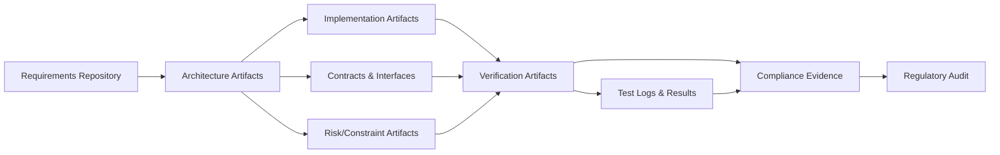
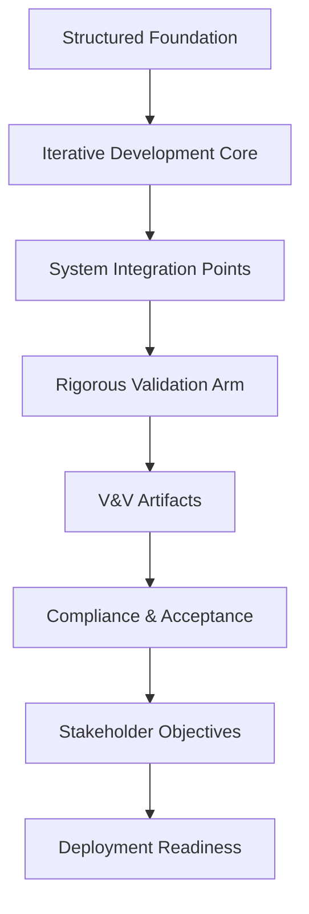

# The Rigorous Validation Arm: System Integration, Verification, and Acceptance

## Introduction: The Closing Arc of Cornerstone

Having constructed a resilient foundation of requirements, architecture, and traceability—and having maintained disciplined, risk-oriented flow through iterative development—product realization in Cornerstone transitions to its most demanding phase: system-level integration, full-system verification, regulatory testing, and acceptance. This is the culmination of the product lifecycle, where multidisciplinary artifacts converge, incremental results are collectively validated, and delivery confidence is definitively established.

This chapter details the Rigorous Validation Arm, describing its lifecycle role, precise integration points, supporting infrastructure, and alignment with compliance and quality objectives. Emphasis is placed on how Cornerstone transforms traditional, sequential handoffs into a continuous, auditable, and federated system integration process—spanning software, firmware, hardware, and mechanical domains. Systemic traceability and artifact versioning remain central, anchoring the assurance narrative essential to regulated and high-consequence environments.

---

## Integration as a Systemic Process

### Beyond the "Big Bang": Continuous, Contract-Driven Integration

Historically, system integration was fraught with risk: a series of late-stage, often monolithic events—sometimes called “big bang integration”—that revealed incompatibilities or architectural weaknesses with little time remaining for remediation. In the Cornerstone paradigm, system integration is redefined as a rolling, contract-governed, continuously auditable process, not a terminal milestone. Integration is planned, rehearsed, and validated throughout the lifecycle, each cycle incrementally strengthening the system’s coherence and verifiability.

This continuous integration is realized through federated pipelines and standardized architectural interfaces, which make integration both a technical and organizational reality. Every artifact—be it mechanical fit, electrical performance, protocol interface, or embedded software behavior—is bound by explicit contracts, versioned within shared repositories, and validated through automated readiness gates.

System integration, therefore, is never a solitary activity; it is the cumulative synthesis of ongoing, cross-domain commitments. This process is formalized through scheduled system integration points—gated by readiness criteria and underpinned by artifact compatibility matrices. These events validate not just the compatibility of subsystems, but also the persistence of intent and rationale encoded during foundational and iterative phases.

### Synchronizing the Multidisciplinary Domain

True system integration in Cornerstone blends domain expertise and federation. Mechanical and hardware assemblies, embedded software, digital logic, and external interfaces must synchronize on timing, semantics, tolerances, and behavioral expectations. This requires:

- Persistent architectural contracts governing version compatibility and interface stability.
- Clear demarcation between emulated (virtual, HIL/SIL) and physical components, ensuring integration rehearsals are representative and uncover latent incompatibilities.
- Multi-domain stewardship—interface architects, integration leads, and V&V specialists arbitrate cross-discipline alignment and manage integration risks and deviations.

Domain-specific integration activities, such as firmware-in-the-loop (FIL), hardware-in-the-loop (HIL), and mechanical mockup integration, are coordinated to validate the interoperability and fitness of each constituent part progressively. These activities are not isolated; rather, their outcomes feed system-level integration readiness, with traceable artifacts surfacing residual risks or confirming risk retirement.

---

## System-Level Verification: Scope, Mechanisms, and Artefactual Rigor

### Convergence of Evidence

Verification at the system level is fundamentally an exercise in evidence convergence. Whereas earlier verification efforts may have validated subsystems or individual interfaces, system-level verification demands that the integrated whole demonstrably satisfies its end-to-end requirements, contractual obligations, and compliance mandates. Traceability, established from the outset, comes to fruition: every requirement, architectural decision, and risk rationale must be traceable to concrete V&V evidence.

These evidentiary links are not mere formality, but practical tools for defect localization, compliance demonstration, and impact assessment. Changes to lower-level artifacts can be rigorously propagated to system-level V&V plans, ensuring completeness and coherency in the face of design evolution.

### Embedded, Automated Verification Pipelines

Cornerstone’s emphasis on continuous verification extends to the system level, leveraging version-controlled test assets and embedded verification within CI/CD. The distinction between development-phase verification and system-level V&V lies in scope, rigor, and independence—system-level tests typically represent formally reviewed, configuration-controlled, and compliance-anchored suites.

Automated pipelines orchestrate:

- **System integration builds**: Underpinned by precise environment management, toolchain versioning, and hardware mapping.
- **End-to-end test execution**: Automated (where feasible), spanning functionality, performance, safety, and robustness.
- **Collection and evaluation of verification artifacts**: Logs, test results, coverage data, and objective evidence are gathered, cryptographically signed or otherwise made audit-proof.
- **Traceability reporting**: Generating compliance matrices and knowledge graph traversals automatically from repository state.

The ability to execute such pipelines across federated, technically heterogeneous domains is a distinctive capability enabled by the artifact-driven, contract-based Cornerstone approach.

---

## Regulatory Testing and Compliance Activities

### Regulatory Traceability in Practice

System-level verification in regulated domains is inseparable from compliance demonstration. Regulatory frameworks such as ISO 26262 (automotive), IEC 61508 (industrial), DO-178C (avionics), and IEC 62304 (medical software) do not simply prescribe abstract process quality; they require explicit, verifiable chains of evidence showing that requirements, architecture, implementation, and verification are tightly linked and traceable.

In practice, this demands:

- **Objective evidence**: Every requirement, constraint, and risk must have associated V&V evidence, agreed upon as sufficient—sometimes through regulatory authority negotiation.
- **Independence of verification**: For critical artifacts, especially in safety or security domains, system-level verification must be performed or witnessed by independent test authorities or designated roles, minimizing confirmation bias.
- **Configuration and variant coverage**: Regulatory assurance often extends beyond nominal operation, requiring evidence for variants, degraded modes, stress scenarios, or environmental extremes.
- **Auditability**: Every step—from requirement change to final test execution—must be replayable and reviewable, both technically (system state snapshots, logs) and procedurally (change control records, rationale trees).

Cornerstone’s federated, repository-driven artifact structure supports regulatory audits natively. Versioned artifacts—requirements, contracts, configurations, test results—are inseparable from their trace, rationale, and implementation. Documentation is living and reconstructed in situ, eliminating the risk of stale, disconnected “compliance packs” and supporting real-time or retrospective audits.

### Living Compliance Matrices and Rationale Webs

A unique feature of Cornerstone’s compliance model is the living compliance matrix. Traditional document-based compliance matrices often degrade quickly, requiring burdensome manual updates or reconciliation. In Cornerstone, traceability is intrinsic, automatically regenerated from the source artifact network, including linkages to rationale and V&V evidence. This produces:

- Up-to-date coverage analyses, highlighting compliance gaps or unverified items.
- Transparent rationale webs, allowing auditors and engineers to understand not just what was verified, but why that approach sufficed under the relevant standard.
- Seamless baseline and variant management—compliance evidence is maintained per configuration item, variant, and release branch, supporting both mass production and bespoke delivery models.

**Diagram 1: Systemic Artifact Traceability and Compliance Evidence Flow**

This diagram illustrates the continuous flow of artifacts from requirements through architecture and implementation, culminating in verification and ultimately compliance evidence—a closed, multi-path loop supporting robust regulatory scrutiny.

---

## Integration Workflow: Practical Realities

### Orchestration and Dependency Management

System-level integration is not a single monolith but a carefully orchestrated set of dependent activities. Hardware readiness may lag software development due to fabrication or lead times; similarly, integration assets (cables, fixtures, simulators) may impose logistical or procurement constraints. These realities necessitate rolling-wave planning, readiness gates, and explicit dependency matrices.

Workflow is often diagrammed as a series of “integration increments”, each gated by predefined contract completions:

- **Virtual Integration**: Prior to physical availability, system builds are validated against high-fidelity models (digital twins, SIL/HIL).
- **Hybrid Integration**: As physical hardware or mechanical components become available, mixed-mode testing exposes emergent integration issues.
- **Full-System Integration**: The complete, physical system is synchronized for final integration, stress, reliability, and performance testing.

Each stage generates system status artifacts—readiness metrics, open integration issues, deviation logs—which are versioned and fed back into the iterative core for remediation or future improvement.

### Failure Modes and Containment

Despite rigorous planning and contract-driven coordination, integration exposes latent defects—interface mismatches, timing or tolerance issues, inadequate simulation fidelity, and unexpected cross-domain interactions. Cornerstone addresses these failure modes through:

- Immediate traceable defect logging linked to requirements, contracts, and affected subsystems.
- Structured root-cause analysis: leveraging the living trace network, impact can be traced bi-directionally, rapidly identifying upstream origin.
- Integrated containment and rollback policies: version-control enables containment of regression and rapid reversion to last-known-good system configurations.
- Feedback into the iterative core: non-compliances and architectural weaknesses discovered during system integration directly inform backlog reprioritization and contract clarification.

Moreover, integration events serve as learning inflection points, surfacing architectural or process gaps that may not be resolvable within the current build but are captured as explicit improvement artifacts—anchoring organizational learning and risk reduction for future programs.

---

## System Acceptance: Outcome Realization and Stakeholder Assurance

### Stakeholder Objectives and Acceptance Criteria

Ultimate system acceptance is established not simply by internal assurance activity, but by satisfying explicit stakeholder objectives—customers, certification authorities, and business sponsors. These are anchored in contractually agreed acceptance criteria, themselves derived from the requirements and constraint artifacts elaborated during foundational work.

Acceptance criteria must be clear, measurable, and demonstrably met through the evidence provided by system-level verification and compliance activities. Where ambiguity remains, acceptance disputes are resolved objectively through the traceable artifact and rationale web—Cornerstone's auditable knowledge base ensures outcome realization is never left to subjective assessment.

### Operational Readiness and Transition to Production

For integrated product development, system acceptance extends to readiness for operational deployment or mass production. This phase verifies:

- Operational performance under real-world conditions.
- Supply chain and configuration control readiness—ensuring product consistency as volume ramps.
- Service, maintenance, and support artifact linkage—the knowledge and documentation to sustain fielded systems.

In regulated domains, final acceptance may also be gated by regulatory authority approval, drawing on the full compliance and traceability chain described above.

---

## Architectural Implications and Organizational Considerations

### Federation, Governance, and Responsibility

The system integration and validation phase challenges organizational interfaces as much as technical ones. Successful realization of the Cornerstone lifecycle requires that:

- Federated teams maintain discipline in version management, readiness gate enforcement, and dependency declaration.
- Specialist roles—system architects, integration engineers, V&V leads—are empowered as stewards and arbitrators, not functionaries, with accountability for artifact fidelity and gap closure.
- Governance structures support rapid escalation and resolution of integration blockers, balancing project velocity with system-level safety and quality imperatives.

Integration and V&V events are accordingly treated as program anchor points, with organizational bandwidth, escalation paths, and conflict resolution mechanisms explicitly allocated.

### Trade-Offs and Real-World Constraints

Practical deployment of system-level validation within Cornerstone is subject to inevitable trade-offs:

- **Realism vs. Schedule**: The fidelity of digital twins, test benches, or emulators approaches, but does not fully substitute, the insights and failure modes uncovered by full-system physical integration. Early detection and progressive rehearsal reduce, but cannot eliminate, late surprises.
- **Scope of Verification**: Comprehensive system-level regression is sometimes infeasible within delivery windows or resource budgets. Risk-based prioritization and sampling strategies must align with regulatory and quality objectives.
- **Complexity of Traceability**: While intrinsic traceability automates much compliance work, there remains an organizational and cognitive overhead to maintaining trace fidelity across disciplines. Dedicated stewardship and mature enabling tools are non-negotiable.
- **Variant Management**: Supporting product lines, configurations, and regional or regulatory variants increases validation workload exponentially unless templated, inheritable artifacts and agile branching strategies are meticulously enforced.
- **Change Control vs. Flexibility**: The closure of the validation arm necessitates strong change control—a tension with the adaptability prized in earlier phases. Late-stage changes must be exception-managed, with risk and impact thoroughly evaluated and signed off.

---

## Cross-Domain Integration: Unifying Software, Firmware, Hardware, and Mechanics

### Interface Stewardship and Integration Readiness

Cornerstone drives cross-domain integration by anchoring readiness to interface contracts and shared definitions of “done.” These contracts encode interface signals, electrical and timing tolerances, data structures, communication semantics, and mechanical form factors. Integration readiness is objectively determined by the synchronized fulfillment of these contracts—not by individual domain velocity.

The interface architect’s role is pivotal: arbitrating contract evolution, policing compatibility across evolving subsystems, and maintaining integrity of the integration backlog. Likewise, federated version control and branching governance prevent the drift or divergence of subsystem artifacts.

### Tooling Federation and Test Asset Interoperability

Full-system integration is operationalized by toolchain interoperability:

- Unified configuration management enables repeatable system builds—including mixed virtual-physical targets—across teams and geographies.
- Cross-domain CI/CD pipelines instantiate system builds combining latest-compatible branches, verifying both backward compatibility and forward integration risk.
- Test asset interoperability: System-level test suites invoke domain-specific drivers, emulators, and simulators, coordinated into integrated test campaigns.

The unification of software, firmware, hardware, and mechanical workflows in shaded, overlapping repositories provides engineers the transparency and responsiveness to address integration blockers early and with precision.

---

## Diagram 2: Cornerstone System Integration Flow

This mermaid diagram summarizes the sequential and feedback-driven nature of Cornerstone, where structured early artifacts flow through iterative development into rigorous system integration, culminating in validation, compliance verification, and, ultimately, stakeholder-aligned deployment.

---

## Conclusion: Assurance, Agility, and Organizational Learning

The Rigorous Validation Arm closes the Cornerstone lifecycle with precision: enforcing systemic traceability, verifying multi-domain integration, institutionalizing objective compliance, and rendering delivery auditable—not through heroics or late-stage triage, but through disciplined, federated practice.

By transforming integration and validation from disruptive, bottlenecked events into continuous, contract-governed workflows, Cornerstone creates an environment where learning is rapid, risk is surfaced early, and compliance emerges as a property of diligent engineering, rather than retrospective reconstruction. This architecture supports modern product development—multidisciplinary, adaptable, and regulation-ready—while anchoring organizational trust and customer assurance in objective, living evidence.

The handover to deployment, production, or operational context is thus not a leap of faith, but a seamless progression: the product delivered is not merely what was intended, but demonstrably what was required, verified, and accepted—with every rationale and trade-off preserved for the next cycle of improvement.