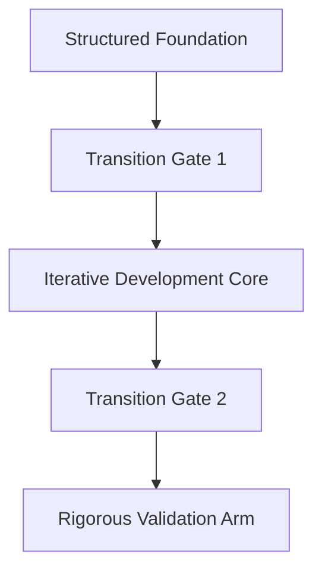

## Transition Gates: Precision Control Without Bureaucratic Drag

Engineering organizations operating at the intersection of multiple disciplines—where embedded software, firmware, electronics, and mechanical assemblies must converge—require a cohesive means to regulate progress, validate integrity, and orchestrate timely flow through the product lifecycle. The challenge is to enact necessary control, traceability, and accountability without succumbing to the inertia and rigidity historically associated with heavy-gate models or “waterfall” adoption of phase reviews. Cornerstone resolves this tension with Transition Gates—namely, Transition Gate 1 and Transition Gate 2—whose explicit roles are to serve as lean, unambiguous inflection points between lifecycle arms, enabling dangerous ambiguity to be surfaced and addressed while maintaining continuous momentum. Unlike prescriptive stage-gate methods, Cornerstone’s gates operate as contractually-defined boundaries, governed by artifact readiness, traceable evidence, and objective assessment, rather than subjective checkpoints or static documentation.

### The Lifecycle Sequence and Purpose of Transition Gates

Cornerstone’s hybrid lifecycle advances through three primary structural arms: the Structured Foundation, the Iterative Development Core, and the Rigorous Validation Arm. Each arm is distinguished by its specific objectives, artifact maturity, and the nature of technical and organizational risk it addresses. The two Transition Gates serve as formal bridges between these arms: Transition Gate 1 marks the progression from foundation to iteration, while Transition Gate 2 signals the transition from evolution to validation and acceptance.

These gates are not mere administrative sign-offs; rather, they are boundary contracts, explicitly articulated in terms of artifact readiness, intent traceability, and risk posture. At each gate, the cohesive state of requirements, architecture, and system intent is examined against a well-defined set of entry and exit criteria, underwritten by living documentation and federated traces. This substantiates technical readiness and ensures that partially converged or ambiguous artifacts do not silently pollute downstream stages. Importantly, the evaluation at each gate leverages automated checks, structured peer review, and explicit feedback loops, thus minimizing process noise while preserving the organizational learning necessary for future refinement.

To clarify the localities of the Transition Gates within the Cornerstone lifecycle, consider the following process diagram:

### Transition Gate 1: From Structured Intent to Iterative Build

Transition Gate 1 constitutes the passage from the Structured Foundation into the realm of disciplined, incrementally-delivered development. Within Cornerstone, the Structured Foundation is defined by the convergence of cross-domain requirements, a system model articulated in architecture and interface contracts, an initial hazard and risk analysis, a first-pass compliance map, and a traceability backbone linking intent to anticipated evidence. The challenge faced by multi-disciplinary teams is that without a clear, enforced readiness boundary, development may proceed on incomplete, unstable, or internally inconsistent artifacts—leading to wasted effort, rework, and subtle propagation of defects.

Transition Gate 1 demands explicit, objective confirmation that foundational artifacts reach a fit-for-purpose threshold suitable for iterative engineering. This means that requirements must be clear, contextually scoped, prioritized, and mapped to architectural features; architectures must specify key interfaces, domain boundaries, and external dependencies; and traceability scaffolding must support continuous update, not periodic audits. However, the gate is not a venue for exhaustive documentation or bureaucratic review. Instead, the criteria are minimal but essential—emphasizing artifact integrity, risk visibility, and intent preservation, all of which are verifiable by automated or federated tools wherever feasible.

The behaviors at Transition Gate 1 are governed by discipline rather than ceremony. For instance, federated requirement repositories can assert unambiguous version control, allowing the transition decision to be automatically documented and auditable. Peer review mechanisms—whether via code, models, or structured requirement workshops—are time-boxed and revert to traceable action items, providing an explicit record but mitigating meeting drag. Objective gating metrics such as architectural completeness or trace coverage may be enforced by pipeline jobs, artifact state assertions, or explicit trace links. Any known ambiguities or residual risks are logged as part of the living backlog, ensuring nothing is tacitly deferred beyond the transition.

The discipline at Transition Gate 1 minimizes downstream defect injection, fosters early cross-team visibility of potential integration challenges, and connects technical intent directly to executable backlogs for the Iterative Development Core. In doing so, it prevents the “foundation drift” that plagues loosely-controlled or ad-hoc development models, while avoiding the paralysis of excessive upfront design.

### Transition Gate 2: From Incremental Build to Validated System

Transition Gate 2 stands at the end of the iterative core, providing an essential control point before the integrated system enters the high-cost, high-scrutiny domain of Rigorous Validation. As feature development, bug-fixing, and incremental verification take place within the iterative arm, artifacts—code, hardware builds, test assets, compliance evidence—evolve at pace. However, unchecked entry into system integration and verification invites substantial risk: incomplete feature sets, unmitigated hazards, or artifact incompatibility at the system boundary grow exponentially more expensive to resolve.

The core function of Transition Gate 2 is to ensure that the assembled increments, when federated, will yield a product that is internally consistent, verifiable, and ready for the holistic verification and acceptance process. The discipline here is anchored in the convergence of requirements, architecture, and evidence across domains. Key questions at this juncture are: *Is the product—with all its interfaces, behaviors, and compliance obligations—sufficiently integrated that system-level verification is meaningful? Are all critical hazards at least plausibly mitigated at the artifact level?* The gate criteria may reference not only functional completeness, but also coverage in risk closure, standards compliance, trace evidence, and baseline configuration control.

Significantly, Transition Gate 2 is distinguished by its role as a high-leverage risk outpost. Where legacy development models might conduct a perfunctory “integration readiness review,” Cornerstone enshrines automated artifact checks, cross-discipline trace audits, and interface contract confirmations into the gate itself. Advanced pipeline tooling can assert that every requirement possessing a “system” allocation is accompanied by explicit verification results. Dependency manifests are cross-checked across disciplines for compatibility, and unresolved compliance items are surfaced rather than deferred.

Yet, Transition Gate 2 is not immune to the realities of engineering iteration or market-driven change. Instead of demanding perfection, it prioritizes explicitness: all known gaps, deviations, or risk acceptances are logged, versioned, and owned in traceable repositories. This places informed, auditable boundaries on residual risks and prevents “silent escapes” that would otherwise undermine safety, performance, or regulatory posture. Consequently, technical debt, change requests, and final integration anomalies are neither hidden nor excused—they are managed transparently, facilitating evidence-based scheduling and stakeholder alignment moving into validation.

### Minimizing Bureaucracy, Maximizing Technical Control

A perennial concern among engineering teams is the specter of gates becoming bureaucratic bottlenecks. In legacy models, stage-gate reviews can devolve into process rituals disconnected from technical objectives—driven by documentation for its own sake and measured by velocity attrition rather than assurance. Cornerstone’s Transition Gates explicitly counter this pathology by binding gate passage only to demonstrable, context-appropriate artifact readiness, never ritualized process compliance.

This anti-bureaucratic design is achieved through several architectural and workflow mechanisms. First, all entry and exit criteria are explicitly tied to living artifacts—requirements, interface models, trace matrices, test evidence—managed in federated, version-controlled repositories. These are inspected, reviewed, and asserted by automated or semi-automated pipelines, which provide immutable audit logs and minimize the prevalence of manual checklisting. Second, governance is distributed: while domain stewards (such as lead systems engineers or chief architects) may formally sign off, the artifact-driven model prevents personalized gatekeeping. Instead, the artifacts themselves must satisfy tool-enforced criteria, radically reducing scope for subjective or politicized decisions.

Further, by embedding cross-functional ownership into the very structure of gate passage—requiring, for instance, that both software and hardware domain leads participate in readiness reviews—Cornerstone ensures that integration, dependency, and compatibility risks are surfaced at the boundary, when recovery is still tractable. Feedback from each gate is captured as structured improvement opportunities, establishing a cycle of progressive refinement rather than repetitive ceremony.

Where deviation from criteria is warranted, the model does not compel binary pass/fail decisions. Instead, traceable exceptions are documented, justified, and assigned clear ownership and mitigation paths—entering the living backlog, rather than being deferred as audit trail footnotes. This flexible, auditable accommodation of real-world tolerance ensures forward momentum while maintaining control and minimizing residual project risk.

### Organizational and Engineering Implications

Practically, the use of two Transition Gates in Cornerstone realigns organizational attention onto tangible progress and collective responsibility. These gates tie team progress to the maturity and integrity of technical artifacts, not compliance with arbitrary sign-off documentation. For engineering projects operating under regulatory constraints or safety standards (such as ISO 26262, IEC 61508, or DO-178C), the gates serve as natural boundary points for configuration baselines, trace package generation, or regulatory reporting, without escalating documentation debt.

Cross-domain teams often experience tension between parallel development velocity and system-wide readiness. The explicit criteria enforced at Transition Gates mitigate the risk of asynchronous artifact maturity—forcing periodic synchronization and enabling rapid defect isolation. Transition Gates therefore function as both technical and organizational anchors within the Cornerstone lifecycle, reinforcing a disciplined yet adaptive flow from abstract intent, to concrete iteration, to objective validation.

### Summary

The Transition Gates in Cornerstone are engineered to strike a precise balance: they arm organizations with critical inflection points for surfacing ambiguity, enforcing artifact integrity, and managing risk, while minimizing administrative overhead and process drag. As contractually-defined boundaries, tied to living artifacts and automated checks, Transition Gate 1 and Transition Gate 2 institutionalize discipline without paralyzing agility, enabling cohesive multi-disciplinary development across integrated product domains. Their design and execution embody Cornerstone’s central proposition: the fusion of structure and adaptability in modern product engineering.