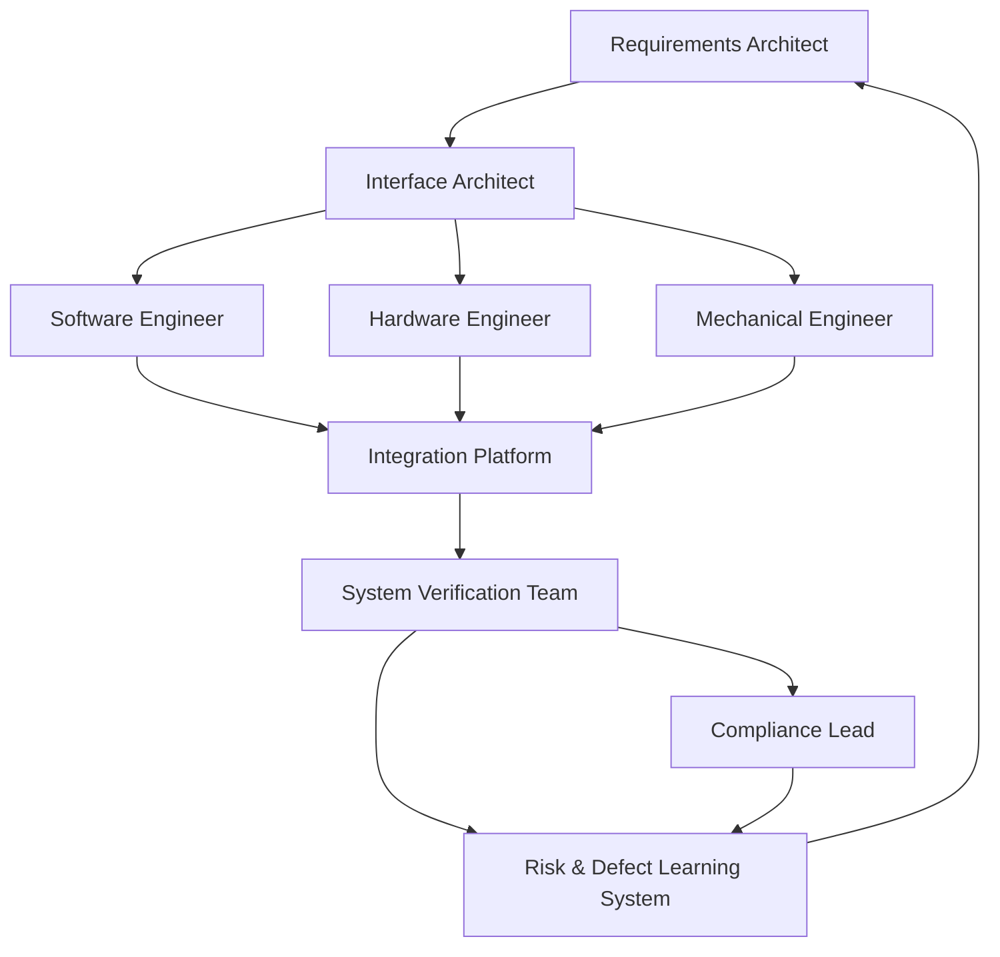

# Cultural and Leadership Foundations for Cornerstone Execution

The successful realization of Cornerstone as a hybrid delivery framework rests as much on its technical scaffolding as on the nuances of team behaviour, communicative clarity, and leadership maturity. At its heart, Cornerstone is an engineered synthesis of disciplined systems thinking and adaptive delivery; its ambitions can be undermined by organizational dysfunctions, misaligned incentives, or brittle silos. Thus, establishing and sustaining the cultural and leadership substrates upon which rigorous, multidisciplinary flow depends is not an optional adjunct—it is the primary enabler of the framework’s intended outcomes.

## Engineering Empowerment: Agency Within Structure

Central to Cornerstone is the systematic federation of responsibility. In practice, this means that engineers and technical leaders across domains—software, firmware, electronics, mechanical, and beyond—are not merely passive executors of prescribed solutions, but stewards of artifact integrity and quality in their spheres. Structured processes, such as architectural contracts and automated baselining, delineate clear constraints and readiness criteria. However, within these explicitly defined bounds, engineers must be trusted and enabled to exercise technical judgment, challenge assumptions, flag ambiguous requirements, and propose remedial architectures or risk mitigations when emergent issues arise.

This model of empowerment is fundamentally bounded; autonomy is not synonymous with algorithmic chaos. The contrast with both rigid command-and-control and laissez-faire agile frameworks is essential. Cornerstone demands that empowerment be contextualized by living contracts and traceability networks: artifact change is always accountable, explained, and reconciled with upstream and downstream dependencies. Most critically, engineers at all levels must internalize an obligation to surface misalignments, incomplete traceability, or risk signals, rather than deferring to ambiguous authority or process inertia.

Empowerment is often constrained by practical factors such as resource allocation, cross-functional bandwidth, and organizational risk appetite. In highly regulated industries, for example, the boundaries of allowable change or exception must be clearly articulated, and processes should support escalation and review without unduly decelerating delivery. When empowerment is structurally coupled with well-governed artifacts, objective metrics, and visible interfaces, teams develop resilience and adaptive capacity without eroding overall system control.

## Psychological Safety: The Prerequisite for Traceable Learning

A disciplined hybrid framework will inevitably produce friction at the interfaces of domain expertise and process discipline. System integration and continuous validation expose error states, uncertainty, and incompatibility with historical candor. In Cornerstone, traceable artifact networks are deliberately designed to make ambiguity, defects, and incomplete information visible and actionable—a core property, not a byproduct.

However, for this continuous surfacing of engineering reality to translate into actionable improvement, teams must operate in an environment defined by psychological safety. Engineers must be able (and expected) to disclose faults, question assumptions, and log traceable exceptions without fear of reprisal or reputational harm. Leadership posture here is critical: leaders and senior technical contributors must model a non-punitive response to error, normalizing the iterative discovery of gaps and failures as essential signals rather than personal shortcomings. In regulated contexts, this posture is further institutionalized through transparent root-cause analysis, encoded learning loops, and strict separation of outcome investigation from individual blame.

This safety extends not only to error disclosure but also to the provision of dissenting technical opinions, especially where domain interactions produce ambiguous requirements or untested integration boundaries. In practical terms, organizations sometimes default to tacit blame assignment, unlogged workaround adoption, or over-commitment to half-understood architectures. The effect is a degradation of traceability and a fossilization of technical debt. By contrast, a culture of psychological safety, when coupled with living artifact networks and automated compliance checks, makes continual learning both visible and inevitable.

A useful abstraction is that of the defect learning loop. In Cornerstone, defect data is not a one-way signal to be rapidly "closed" but an artifact to be iteratively mapped, analyzed, and fed back into requirements and architecture. Psychological safety is thus a practical precondition for maximally effective verification, compliance, and organizational learning.

## Outcome-Driven Leadership: From Delivery Theater to Architectural Stewardship

The Cornerstone philosophy positions leadership not merely as status reporting or resource allocation, but as the measured stewardship of engineering outcomes. In legacy paradigms, leadership may devolve towards "delivery theater"—the illusion of progress advanced through ceremonial process conformance, firefighting, or the rhetorical management of risk. In contrast, Cornerstone leaders focus on the integrity and completeness of living artifacts, architectural alignment, and the objective traceability of outcomes to their governing criteria.

Outcome-driven leadership, in practice, binds accountability to artifacts—not personalities, schedules, or generic “velocity” metrics. Leaders are required to maintain fluency in the evolving artifact landscape, understand the contractual and compliance implications of transitions, and engage proactively in the structured review of readiness gates and defect/risk baselining. Where ambiguity or misalignment emerges, the leadership role is not to dictate a rapid aesthetic solution but to activate the appropriate cross-functional forum—requirements architects, interface stewards, compliance leads—leveraging objective evidence for resolution and subsequent learning capture.

This model of leadership has tangible workflow and organizational consequences. Meeting rhythms trend toward short, structured artifact reviews and focused integration triage, rather than exhaustive status sessions. Decision authority is grounded in technical and cross-domain traceability, not hierarchical seniority. When practical trade-offs—such as schedule compression vs. V&V coverage, or design purity vs. supply chain volatility—must be made, the rationale is always made explicit, documented as a living artifact, and accompanied by codified risk/learning artifacts.

From an architectural vantage, leaders are responsible for maintaining line-of-sight from high-level requirements through to system-level compliance evidence—surfacing, not suppressing, the deltas that emerge when implementing complex, multidisciplinary systems. Leadership success is measured less by the absence of negative signals and more by the rate at which ambiguity and risk are rendered visible, triaged, and incorporated into the organization’s digital memory.

## Cross-Functional Communication Patterns: Federation, Not Fragmentation

Multidisciplinary product development often founders not on technical complexity alone, but from the accumulation of miscommunicated intent, implicit assumptions, and stovepiped decision-making. Cornerstone’s execution model opposes this fragility by promoting explicit federation over functional fragmentation.

Federation, as applied within Cornerstone, refers to the structured yet flexible allocation of decision rights, review responsibilities, and artifact ownership across disciplines. Instead of treating software, hardware, and mechanical teams as isolated service providers, the framework embeds cross-functional review and integration steps at all transition gates and key artifact maturity points. This is most evident in the role of interface architects and variant stewards, who facilitate synchronized traceability mapping, defect triage, and requirement clarification between disciplines, ensuring that no artifact or design change is absorbed unilaterally or without upstream/downstream impact analysis.

Communication, therefore, is intentionally structured: review check-ins are scheduled at points where coupled artifacts are most likely to diverge; documentation is maintained in a docs-as-code format, ensuring artifact discoverability and commentability across toolchains; cross-functional workshops and system integration exercises are treated as rehearsals, not one-off events. These patterns are reinforced by cultural norms: open documentation, blameless review, iterative clarification, and documented trade-offs, all learned and propagated as first-class engineering behaviours.

It is instructive to visualize the dynamic interplay of communication paths underpinning artifact federation:

In this diagram, the requirements architect and interface architect are pivotal connectors, managing bidirectional flows between domain engineers and integration platforms. System verification feeds both compliance and defect learning, completing a closed communication and learning loop. Such federation ensures that information does not dead-end, but recirculates for continuous review and refinement.

Failures of this model typically manifest as artifact drift, untraceable change, or risk information failing to propagate to affected disciplines. The trade-off for structured federation is the need for explicit review protocols, artifact indexing, and role clarity—all of which may challenge legacy organizational comfort zones but yield traceably superior outcomes.

## Mentoring and Embedded Learning: Institutionalizing Growth

A high-performing Cornerstone organization does not treat learning as an episodic, ad-hoc exercise, but as an embedded, artifact-driven process. The challenge in complex, federated engineering ecosystems is not merely individual skill acquisition, but the propagation and instantiation of best practices across generations of engineering teams—especially as product and organizational landscapes evolve.

Mentoring plays a dual role in this context. First, it supports individual and cohort-level onboarding: new engineers rapidly gain fluency in architectural contract patterns, traceability practices, and toolchains, guided by experienced contributors who themselves are teachers of artifact-centric engineering. Second, mentoring drives the transmission of organizational memory—how prior hard-won lessons, regulatory feedback, and systemic integration errors are captured, indexed, and made retrievable for future contingencies. In a docs-as-code environment, codified knowledge is rarely static; mentors maintain, annotate, and refactor living documents, reducing the cognitive distance between “tribal knowledge” and universally accessible engineering assets.

Practically, mentoring in a Cornerstone context is explicit and scheduled. Peer design reviews are normalized, and junior engineers are invited to participate in readiness gate activities, defect root-cause analyses, and compliance mapping sessions. The outcome is twofold: not only does individual capability rise, but so too does the organization’s mastery of its own artifact history and learning backlog.

The resource demands of effective mentoring are non-negligible, especially in delivery-constrained settings, but there are operational mitigations—pair artifact development, rotating review assignments, and leveraging automated documentation toolchains to reduce the marginal cost of learning. The engineering return, in terms of defect reduction, architectural resilience, and delivery adaptability, more than justifies this investment.

## Continuous Improvement: Codified, Audited, and Traceable

Continuous improvement, within the Cornerstone paradigm, is not a rhetorical value but a regulated workflow property. The mechanisms for improvement are designed to be as transparent and auditable as the products themselves; iterations in delivery practice, architectural patterns, or Defect/V&V policy are always artifact-bound and traceably reviewed.

This discipline is enforced through scheduled retrospectives, living improvement backlogs, and explicit traceability to engineering outcomes—compliance metrics, integration defect rates, or transition gate velocity. Each improvement candidate is approached as a hypothesis: documented, justified, piloted with bounded risk, and accepted or reverted based on objective evidence. This mirrors the empirical, data-driven posture underpinning rigorous engineering.

A practical consideration is the throughput of improvement: regulated environments or highly-coupled legacy architectures may permit only a modest cadence of process changes, especially those with compliance or traceability implications. Here, leadership must prioritize and sequence improvements for maximum compound impact, resisting “process churn” while ensuring the system does not fossilize. Change is always explicitly versioned, and rollback paths are defined as living artifacts—mirroring best practices in code and requirements management.

Reinforcing the symmetry between product and process is not a matter of mere philosophy. When organizational processes enjoy the same visibility, reviewability, and rollback as system artifacts, resistance to change reduces and process learning becomes cumulative rather than cyclically lost.

## Synthesis: Culture as a Systemic Enabler

The doctrines of empowerment, psychological safety, outcome-driven leadership, federated communication, mentoring, and continuous improvement are not isolable themes, but properties of a cohesive system. Each supports and stabilizes the others, such that the absence or distortion of one will compromise the integrity of the whole.

Cornerstone’s technical and procedural rigor—its federated artifacts, automated gates, and contract-driven integration—cannot realize their intended outcomes in a culture of silence, authoritarian information flow, or static learning. By deliberately engineering both organizational structure and behavioural expectations to make ambiguity, risk, and learning visible and actionable, Cornerstone positions itself not merely as a delivery framework, but as a system for sustained organizational adaptation.

The trade-offs are clear: investing in culture, leadership, and learning requires ongoing organizational energy, explicit boundary-spanning behaviours, and tolerance for process transparency. The reward, however, is a product development capability that is both auditable and resilient—one in which continuous compliance, learning, and integrated output are not co-incidental, but systemic.

In this way, the cultural and leadership foundations of Cornerstone function not as abstract ideals but as real, architectural pillars—enabling disciplined flexibility and ensuring that technical artefacts and human workflows evolve in alignment across all product domains.