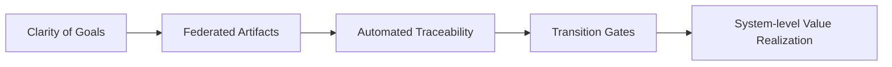

### From Output Metrics to Value: Enabling Clarity and Adaptive Leadership

#### Reframing the Goal: Value over Output

Traditional engineering organizations, especially those operating within regulated, safety-critical, or legacy contexts, are often steered by output-centric paradigms. Here, success is measured by tangible, easily quantifiable markers—velocity, defect counts, test case executions, or release frequency. While such metrics bring visibility, they frequently generate misplaced incentives and do not reliably reflect whether the organization is building the right product at the desired level of quality, usability, or compliance. In multi-disciplinary development—where software, firmware, hardware, and mechanical domains interleave tightly—this focus on output becomes an obstacle, manifesting as local optimizations, siloed velocity, and a decoupling between what is built and the actual value delivered to users, stakeholders, or society.

Cornerstone reorients this measurement philosophy. Its foundation rests on the relentless pursuit of demonstrable value—defined in terms of delivered outcomes, user impact, regulatory admissibility, and long-lived architectural integrity rather than raw productivity. This represents a shift from tallying transient progress artifacts to assessing the completeness, traceability, and fitness-for-purpose of enduring engineering work products—specifications, architectural contracts, source-controlled interface agreements, and validated system behaviors. In this context, output becomes meaningful only to the extent that it advances agreed-upon value hypotheses, reduces uncertainty, or delivers contractually significant functionality with evidence of compliance and readiness.

This reframing permeates governance and day-to-day practicalities. For instance, iteration reviews and transition gates are anchored not around percentage-complete charts or burndown rates, but rather on the achievement of artifact-based acceptance criteria, contract satisfaction, and evidence readiness. Defect counts or lines of code are relegated to secondary or supporting roles, useful for root cause analysis and continuous improvement, but not as proxies for real progress. Value is thus rendered visible and auditable not through volume, but through the demonstrable closure of traceable requirements, interface adherence, and system-level acceptance against regulatory and architectural boundaries.

#### Mechanisms for Value Alignment

Central to operationalizing value-driven engineering is the explicit connection between work in progress and the higher-order goals of the organization. In Cornerstone, this is achieved through federated artifacts and architectural contracts that serve as living proxies for organizational intent. Each artifact—be it a requirements module, a functional architecture, or a test corpus—is versioned, traceable, and stewarded by clearly designated owners who act as custodians of both the artifact’s technical content and its alignment with user, business, and regulatory objectives.

Automated pipelines and federation further reinforce this alignment. System integration steps and verification workflows do not simply check for the presence of deliverables; they interrogate the provenance and sufficiency of evidence, the closure of traceability chains, and the compatibility of cross-domain artifacts at their boundaries. The result is a system in which "done" is no longer a local or subjective state, but one substantiated by clear lineage to value hypotheses and acceptance gates governed by cross-disciplinary criteria.

In practical terms, this requires disciplined application of requirements management (e.g. ISO 15288), architectural decomposition (e.g. SysML, interface contracts), and rigorous V&V evidence. The shift also demands an investment in orchestration infrastructure—the tooling and automation capable of enforcing traceability, automating compliance checks, and surfacing misalignments early. Without this, the risk of reversion to output metrics as a substitute for clarity and value remains high, especially under schedule or resource pressure.

#### Clarity of Goals as an Engineering Enabler

The transition from output orientation to value realization is only possible in an environment where goals are explicit, layered, and readily accessible to every practitioner. This clarity is not a static artifact of initial planning, but a continuously maintained property, underpinned by living documentation and active federation among artifact stewards. In practice, clarity manifests through contractually specified requirements, precise interface definitions, acceptance criteria tied to system context, and purposefully limited ambiguity at system, component, and interface levels.

Within Cornerstone, clarity is institutionalized through federated domain boundaries and artifact-centric communication. Each engineered boundary—be it a function, interface, or module—carries explicit contracts and unambiguous ownership, rendering responsibilities and success criteria well-defined and traceable. This sharpens decision-making, facilitates impact analysis, and greatly reduces the noise and friction associated with cross-functional change.

Ambiguity, when it exists, is surfaced rather than concealed. Transition gates, architectural reviews, and continuous integration checks become venues to expose and resolve misalignments, not by procedural escalation but by bringing discrepancies into federated forums for joint adjudication. This turns clarity from an abstract organizational aspiration into a daily engineering reality—one where every contributor can directly observe the direction of travel, the definition of “done” for each artifact, and the dependencies that connect their work to broader system goals.

#### Diagram: Value Flow in Cornerstone

The following diagram illustrates the federated flow from clarity of goals, through federated artifacts, to value realization governed by transition gates:

This visualizes how the progression from clearly articulated goals percolates through artifact design and federation, undergoing traceability checks and readiness gates, ultimately securing value realization at the system level.

#### Adaptive Leadership in Context

To sustain such a value-orientated, clarity-driven culture, leadership practices within Cornerstone must diverge sharply from traditional delivery management. The archetype of the command-and-control project manager—who measures teams by pacing status and policing process compliance—yields to a model of adaptive leadership. Here, leaders function as stewards of the system’s architectural and organizational fitness: curating artifact integrity, overseeing interface compatibility, and convening cross-functional learning forums.

Adaptive leadership is characterized by several systemic behaviors. Chief among these is the continual sensing and surfacing of uncertainty—whether technical, regulatory, or organizational. Rather than filtering or minimizing risk upward, leaders are incentivized to expose hidden dependencies, cross-domain impacts, and latent ambiguities into federated forums where they can be collectively addressed. This transparency is not risk avoidance, but risk institutionalization: the transformation of risk into controlled, traceable, and auditable knowledge.

Control in this environment is exercised not through rigid stages or detailed work breakdowns, but via outcome contracts: architectural, regulatory, or functional agreements that specify fit-for-purpose technical acceptance. Leaders focus on maintaining the evidentiary and architectural state of the system; their authority is underpinned not by adversarial review, but by the continual enablement of artifact stewards and the championing of domain-boundary responsibility.

Crucially, adaptive leadership is intimately linked with the cadence of the system. As Cornerstone advances through lifecycle arms and transition gates, leadership both curates direction and orchestrates the feedback loops that fuel continuous improvement. The interconnectedness of technical and cultural factors—artifact curation, psychological safety, learning systems—means leadership must dynamically adapt to emergent risk, variable delivery flow, or new architectural discoveries, without destabilizing the integrity of the value chain.

#### Organizational and Architectural Implications

Engineering organizations implementing Cornerstone’s value-first, clarity-centric, and adaptive leadership tenets must address both organizational and technical realities. The decoupling of output and value often meets resistance where legacy metrics are institutionally embedded—be this via reward systems, regulatory reporting imperatives, or contractor deliverables. Addressing these constraints requires deliberate calibration of measurement systems, incentive structures, and process frameworks to reinforce clarity, not only in technical pathways but in governance and communication.

On a practical level, legacy project and resource tracking tools—typically geared for local velocity or task completion—may require augmentation or replacement with artifact- and evidence-oriented management systems. These tools must support the federation of artifacts, track traceability chains, and provide actionable visibility into readiness and risk without overwhelming practitioners with unfiltered data.

Residual ambiguity, especially in early-stage architecture or in domains with fuzzy boundaries (such as cross-disciplinary interfaces), must be systematically managed rather than wished away. Mechanisms such as architectural spikes, living interface contracts, and formal exceptions within transition gates provide the structural discipline to contain and resolve ambiguity before it becomes systemic risk.

Trade-offs emerge in the balance between rigid enforcement of artifact completeness and the need for learning loops. Over-constraining progress via premature or excessive gating can stifle innovation or adaptability; too little discipline, conversely, dissolves traceability and renders systems audit-incoherent. The design of transition criteria, review mechanisms, and feedback channels must thus be tightly aligned with both the sociotechnical maturity of the organization and the volatility of its problem space.

#### Failure Modes and Sustainable Flow

Without rigorous adherence to value- and clarity-driven mechanisms, organizations may experience several recurrent failure modes. These include:

- Proliferation of activity-based reporting, masking the misalignment between delivered work and realized value.
- Reversion to heroics or local optimization, where individuals or subteams maximize easily counted outputs in ways adverse to system-level integration or compliance.
- Fragmentation of goals and communication, undermining artifact federation and traceability.
- Overinvestment in ceremony or documentation-as-ritual, substituting bureaucracy for documented, auditable knowledge.

Sustained flow in Cornerstone is anchored by the continuous availability of evidence—artifact readiness, traceability closure, compliance states—proving value and progress in place of movement or volume. Leadership vigilance is required to keep this flow unblocked; organizational friction, process dead zones, or interface ambiguities must be surfaced candidly and addressed iteratively.

#### Conclusion: Institutionalizing Value and Adaptability

The transformation away from output to value, from ambiguity to clarity, and from command to adaptive leadership is neither accidental nor strictly technical. It requires the systematic institutionalization of federated artifact stewardship, architectural contracts, living documentation, and evidence-governed transition states. In practice, this is only achievable in organizations where leadership embodies architectural stewardship, clarity is rendered actionable and visible across all domains, and practitioners are empowered to own not just the completion of work, but its fitness for purpose in the service of collective, auditable outcomes.

In Cornerstone, value, clarity, and adaptive leadership are thus not abstract aspirations. They are architected features of a resilient engineering culture, operationalized through workflow, tooling, evidence, and federated authority. Only by relentlessly aligning technical practices with these foundations can organizations achieve the twin aims of effective, compliant, and integrated product delivery, while remaining fundamentally adaptable to emergent complexity.