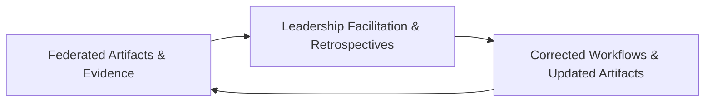

### Developing Leadership Capability for Hybrid Delivery

The adoption of Cornerstone within modern engineering organizations necessitates a deliberate focus on leadership development. Core leadership competencies extend beyond traditional focus areas—such as resource allocation, scheduling, and progress reporting—toward cultivating the hybrid capabilities that underpin federated, artifact-centric, and adaptive product delivery. Within the Cornerstone framework, leaders serve as both architects of technical rigor and stewards of cultural and process continuity, orchestrating the conditions required for sustained clarity, traceability, and value realization. Leadership development therefore becomes a strategic and ongoing initiative at multiple levels of the organization, shaping the collective capacity to operate within Cornerstone’s hybrid paradigm.

#### The Evolution from Activity-Oriented Management to Architectural Stewardship

Conventional models of project and engineering management often emphasize coordination of tasks, time-boxing of deliverables, and quantitative oversight through metrics such as velocity or defect closure rates. Cornerstone, by design, deprioritizes activity-based proxies in favor of system-level, artifact-driven acceptance and architectural contract satisfaction. Accordingly, leadership skills evolve away from process enforcement and toward architectural stewardship: leaders are tasked with curating, refining, and defending the integrity of federated artifacts, governance gates, and contract boundaries.

Architectural stewardship manifests across several dimensions. Leaders must internalize and institutionalize the concepts of contract-driven integration, artifact readiness, and federated documentation—interpreting and translating these domain-agnostic principles to software, firmware, hardware, and mechanical contexts as appropriate. This demands proficiency with traceability frameworks (such as SysML, ReqIF, or DOORS NG for requirements management), an understanding of pipeline automation and regulatory readiness (per ISO 26262, IEC 62304, or DO-178C process evidence), and competency in resolving ambiguity via federated forums. In effect, leaders become custodians of architectural intent, continuously evaluating how artifacts and interfaces encode and deliver on organizational value, compliance, and fitness-for-purpose.

#### Building Empowerment and Psychological Safety

Hybrid delivery places responsibility for artifact quality, traceability closure, and interface rigor squarely with the engineering teams who generate and steward those results. Accordingly, effective leadership attunes to the conditions necessary for empowerment. This is not merely a matter of rhetorical encouragement or devolved responsibility but a systematic creation of boundary conditions in which psychological safety and accountability co-exist.

Empowerment in the Cornerstone context is achieved when engineers possess both the autonomy to drive artifact maturation and the structural support to surface defects, misalignments, or uncertainties without risk of punitive response. Psychological safety is therefore a leadership output: a set of behaviors and organizational norms resulting in the routine surfacing of ambiguity, defects, and dependency, enabling timely architectural correction and learning. Leaders engineer these environments by convening federated retrospectives, institutionalizing feedback loops into pipeline automation, and curating communities of practice around contract, verification, and compliance. Critically, psychological safety is neither static nor universal but must be protected and tuned in response to organizational, project, and team dynamics.

#### Hybrid Delivery Skills and Adaptive Behaviors

Leaders operating in Cornerstone environments must be equipped with hybrid delivery skills. These encompass a spectrum of technical, organizational, and behavioral capabilities unified by a systems-oriented mindset. Some of the most salient hybrid skills are described below.

First, technical literacy across domains is essential—not in the sense of universal expertise within all engineering disciplines, but the capacity to facilitate cross-domain comprehension and articulate implications of system changes at architectural contract boundaries. Second, systems thinking is critical: leaders must reason about artifact evolution, verification closure, and risk surfacing in the context of both federated artifact flows and downstream regulatory or operational constraints.

Adaptive leadership behaviors further require facility with federated communication and living documentation. Leaders curate communication structures in which traceable, versioned artifacts replace ephemeral status reporting. They moderate federated forums—cross-disciplinary, artifact-centric meetings such as contract reconciliation workshops or verification evidence reviews—wherein ambiguity is surfaced, and decisions are documented within the artifact lifecycle, maintaining a resilient record of organizational learning and risk containment.

Mentorship also emerges as a critical leadership behavior within Cornerstone. Unlike traditional mentorship, which may be informally oriented, mentoring in hybrid delivery contexts becomes institutional: leaders cultivate and propagate delivery behaviors, tooling proficiency, and architectural discipline through deliberate pairing, peer review protocols, and the creation of knowledge artifacts. This ensures that hybrid capabilities are distributable, auditable, and reinforced by the federated nature of artifact creation and review.

#### Institutionalizing Continuous Improvement

Leadership capability in the Cornerstone model is inseparable from the discipline of continuous improvement. Cornerstone’s federated artifact flows and automated evidence pipelines serve to rapidly surface misalignments, regressions, and maturity shortfalls. Leaders institutionalize continuous improvement by developing organizational rituals—such as regular artifact quality audits, post-gate incident reviews, and traceability gap analyses—anchored in evidence rather than anecdote.

These feedback mechanisms are not limited to individual performance or localized process correction. Instead, they are architected into the delivery system itself, producing living documentation of improvement experiments, risk mitigations, and lessons learned. This ensures that improvement is both cumulative and diffused across the organizational fabric, reducing the probability of regress to output-based rituals or documentation theater.

The iterative nature of continuous improvement under Cornerstone can be modeled as a closed-loop system. At each cycle, evidence from federated artifacts (e.g., interface contract coverage, verification closure rates, compliance artifacts) forms the input; leadership facilitation and collective retrospection constitute the process; corrected workflows and updated artifacts form the output. This closed feedback loop mitigates organizational drift and institutionalizes resilience to both technical and procedural defects.

This visualizes the cyclical nature of evidence-driven improvement, where each iteration reinforces both artifact maturity and leadership learning.

#### Practical Realities and Trade-Offs

Achieving and sustaining leadership capability for hybrid delivery is not without friction or compromise. There are real organizational pressures—deadlines, regulatory constraints, resource contention—that can complicate the institutionalization of federated rituals or the protection of psychological safety. Leaders must actively counteract regression to output-centric or hero-driven behaviors, particularly under acute delivery pressure.

Organizational inertia may resist federated evidence-gathering or artifact-centric leadership, especially in environments accustomed to ad hoc coordination or undocumented decision pathways. Leadership development initiatives must address these root causes by modeling artifact stewardship at all levels and rewarding behaviors that reinforce traceability, risk surfacing, and collaborative problem-solving.

Furthermore, the necessary investments in automation, documentation infrastructure, and cross-discipline upskilling can draw resources from immediate delivery, requiring leaders to communicate the systemic value of such investments in terms of regulatory readiness, defect prevention, and sustainable flow.

#### Conclusion

Developing leadership capability for hybrid delivery within Cornerstone thus combines architectural stewardship, empowerment, technical-literacy, and continuous improvement into an integrated behavioral system. Leaders at every level act as architects of resilience and stewards of federated artifacts, curating environments in which technical rigor, psychological safety, and adaptive learning together institutionalize value, clarity, and organizational agility across the full product lifecycle.