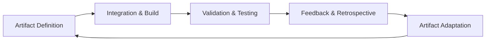

### Continuous Learning, Retrospectives, and Culture Reinforcement in Cornerstone

#### The Engine of Adaptive Capability

At the heart of the Cornerstone framework lies the conviction that sustainable excellence in product development cannot be achieved solely through processes, tools, or individual expertise. Rather, it is the capacity of organizations and teams to learn deliberately and continuously—which underpins adaptive capability. For multidisciplinary engineering organizations balancing the imperatives of compliance, traceability, relentless flow, and architectural integrity, learning must be neither accidental nor occasional. Instead, it is engineered as a core system function, tightly coupled to artifact evolution, workflow adaptation, and cultural reinforcement.

Within this context, continuous learning manifests as a deliberate, systematic approach to surfacing, analyzing, and acting on evidence—be it technical, organizational, or behavioral. Retrospectives and federated feedback loops are not isolated rituals or process endpoints, but primary mechanisms for institutionalizing improvement and driving artifact-centric adaptations. Culture reinforcement, accordingly, is not a matter of slogans or one-off initiatives, but the ongoing structuring and nurturing of context, behaviors, and incentives that make learning and adaptation both possible and expected.

#### Retrospectives as Federated Feedback Mechanisms

Retrospectives in the Cornerstone model transcend the operational focus of traditional agile ceremonies. In a multidisciplinary, federated product environment, retrospectives become engineered forums for structured learning and architectural alignment. These sessions do not merely review individual or team-level practices, but surface inter-artifact ambiguities, interface misalignments, and systemic sources of risk or transaction cost. The architecture of retrospectives thus mimics the federated artifact model of Cornerstone: participants contribute not just their observations, but concrete evidence and artifact-level feedback, contextualizing what is learned within the rigor of the product’s lifecycle and regulatory commitments.

The retrospective process itself is engineered to reinforce both psychological safety and technical accountability. Participants are encouraged—and expected—to expose defects, uncertainties, and integration frictions without risk of punitive consequences. This is not incidental: psychological safety is a prerequisite for surfacing “unknown unknowns,” latent system fragilities, and unspoken dependencies. At the same time, evidence-based retrospectives demand disciplined traceability—do improvement insights map to real artifact changes, updated automation, or clarified interface contracts? The outcome of retrospectives is actionable: not abstract lessons, but hypotheses and workflow experiments bound to federation points in the architecture. Practical improvement is institutionalized when insights result in visible adjustments to requirements, interface definitions, test automation, or validation artifacts, which are themselves subject to future scrutiny.

#### Feedback Loops: Artifact- and Value-Centric

Feedback loops in Cornerstone are structurally distinct from informal communication flows or unstructured handoffs. Instead, they are architected around the status, readiness, and integration quality of federated artifacts—requirements, models, interface contracts, compliance evidence—across the product lifecycle. The value of a feedback loop is evaluated not by its frequency but by its ability to deliver actionable insight that improves artifact fitness, closes traceability gaps, and resolves ambiguity across system and organizational boundaries.

This artifact-centric approach necessitates that feedback is captured, versioned, and traceably linked to both the source artifact and the integrating artifact(s) it affects. For example, feedback from virtual integration testing (e.g., software-in-the-loop or hardware-in-the-loop) must feed directly into requirements refinement or interface contract updates. Feedback on ambiguous requirements must surface in federated forums, leading to clarified specification artifacts and updates to validation cases. Such discipline ensures that feedback closes the loop by producing concrete, inspectable evidence of adaptation or resolution; mere communication is insufficient.

A well-engineered feedback loop incorporates mechanisms for prioritizing what is surfaced—differentiating signal from noise—and for resolving trade-offs. Not every observation or complaint warrants substantive change; feedback is triaged based on risk, regulatory impact, user value, and architectural implications. This triage process itself must be structured and auditable, reinforcing clarity and evidence.

#### Culture Reinforcement: Institutionalizing Learning Behaviors

Institutionalizing learning and adaptation demands cultural reinforcement at every organizational level. In Cornerstone, culture is not conceptualized as an intangible or self-sustaining phenomenon, but rather as the sum of engineered conditions, explicitly designed behaviors, and consistently reinforced incentives that privilege learning, evidence, and adaptation.

Culture reinforcement operates across three complementary dimensions. The first is the construction and maintenance of psychologically safe environments—individuals and teams know, with evidence, that defect surfacing, ambiguity exposure, and the admission of error or knowledge gaps will not invite retaliation or blame. The second dimension is the expectation of empirical learning—engineers and leaders alike are evaluated and rewarded based on their contributions to artifact clarity, traceability, and system-level adaptation. The third is the ongoing curation of collective artifacts—standards, playbooks, compliance guides, and architectural histories—where culture is codified and evolved as a living, versioned body of knowledge.

Practically, this involves both top-down and grassroots action. Leadership models learning behaviors by openly surfacing their own uncertainties and seeking feedback in federated settings. Engineers are incentivized—through recognition and advancement—based on demonstrated stewardship of artifacts and proactive ambiguity resolution. Rituals such as federated retrospectives, artifact reviews, and document sign-off processes are engineered to include explicit moments for reflection and feedback, making learning part of the operational fabric, not a separate activity.

#### Automated Reinforcement and Living Documentation

Automation and living documentation play a direct and reinforcing role in culture. Automated workflows serve as both enablers and auditors of continuous learning: they accelerate feedback, highlight drift from artifact contracts, and systematically capture learning events as part of the traceable history of the system. Similarly, the Docs-as-Code ethos ensures that documentation, clarifications, and architectural learnings are versioned, peer-reviewed, and continuously evolved—never going stale or dissociated from the engineered product. This integrated documentation lifecycle closes the learning loop, ensuring that each iteration of improvement is not only enacted but also memorialized as auditable evidence.

Engineers and leaders alike engage with learning artifacts through both manual participation (e.g., peer review, validation workshops) and automated tooling (e.g., static analysis, compliance checks, integrated documentation updates). This interplay between manual and automated mechanisms ensures that no single point of failure—be it individual memory, siloed documentation, or tool configuration—can undermine the continuity of learning and adaptation.

#### Organizational and Technical Considerations

The commitment to continuous learning, federated feedback, and culture reinforcement in Cornerstone carries distinct organizational and technical implications. On the organizational side, teams must budget explicit time and emotional capital for learning—retrospectives, artifact review, and experimental workflow adjustments must be protected from the pressure of delivery deadlines. Psychological safety, in particular, can be eroded subtly by management behavior, incentive structures, or peer pressure, requiring ongoing vigilance and intervention.

On the technical side, feedback mechanisms and retrospective outputs need to be actionable within the lifecycle management system and traceable to artifacts. This demands integration across tools (e.g., requirements management, PLM, DevOps pipelines) and across organizational boundary conditions (partners, suppliers, regulatory auditors). Traceability frameworks must be robust enough to capture the provenance and impact of feedback or learning events, providing defensible evidence should regulatory or architectural disputes arise.

Trade-offs also abound. Too frequent, shallow retrospectives may lead to cynicism or “ritual fatigue”; too infrequent, and systemic issues fester unaddressed. Similarly, automation of feedback capture versus manual peer review requires calibration: over-automation may surface irrelevant or low-fidelity findings, while under-automation risks leaving defects hidden or unarticulated. The structure and cadence of culture reinforcement activities must fit the complexity and risk profile of the product: safety-critical domains (e.g., automotive, aerospace) warrant more formality and ritualization; digital-native or lower-stakes environments can afford more distributed, lightweight feedback models.

#### Federated Learning in the Artifact Lifecycle

The relationship between organizational learning and artifact evolution in Cornerstone can be visualized as a closed-loop system spanning artifact definition, integration, validation, feedback, and adaptation. This federated learning cycle is not linear but recursive, with each output producing both immediate value (improved artifact fitness) and institutional knowledge (reinforced standards, updated validation approaches):

Each loop iteration corresponds to cross-functional, federated learning—where evidence from integration or validation is consciously reviewed, retrospectively analyzed, and deliberately fed back into the next generation of artifacts. The closed nature of this loop ensures that adaptation is continuous, improvements are institutionalized, and learning is always actionable and anchored in system evidence.

#### Conclusion: Adaptive Resilience as Cultural Infrastructure

Integrated products, subject to disruptive requirements, evolving standards, and architectural complexity, demand more than technical expertise and disciplined process adherence. They require organizations to construct and maintain learning as a cultural and architectural foundation. In the Cornerstone framework, continuous learning, engineered retrospectives, federated feedback loops, and explicit culture reinforcement collectively form the infrastructure of adaptive resilience. Only by institutionalizing these mechanisms—deliberately, visibly, and with technical rigor—can organizations achieve the sustained clarity, traceability, and flow that underpin world-class product development in the modern era.