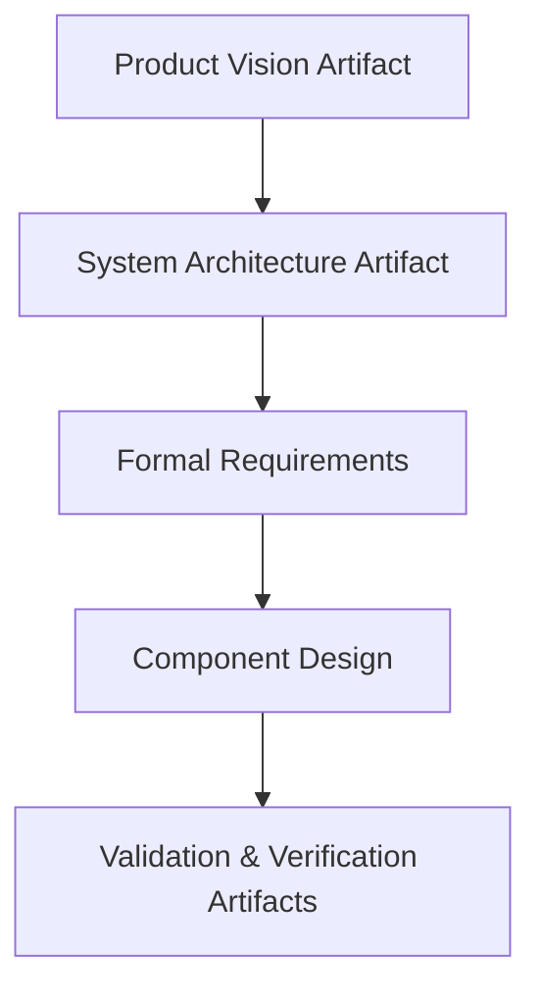
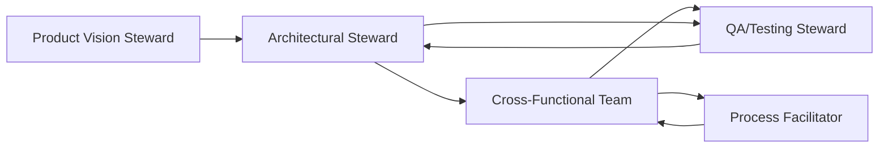

---

# Cornerstone Roles and Functional Touchpoints

The Cornerstone framework orchestrates a federated approach to product development that relies not only on robust process structures and evidence-backed artifacts but also on clearly defined functional roles. These roles are foundational constraints: they safeguard the traceability, accountability, and architectural fitness that underpin Cornerstone’s promise of clarity and adaptive resilience. Importantly, the essential roles described here are not rigid silos; rather, they are functional loci—points of responsibility and expertise—often embodied by individuals who participate dynamically within, across, or between cross-functional teams. This federated, artifact-centric view means that the efficacy of any role is measured by its contributions to artifact integrity and to the coordinated realization of value.

## 1. Product Vision Stewardship

In Cornerstone, product vision is neither a static statement nor a mere business aspiration. It is a living beacon—a disciplined, evolving definition of purpose, boundaries, and value, traceable into requirements and realized artifacts. The role of Product Vision Stewardship, typically led by a Product Owner or Chief Product Architect, is to institutionalize this vision as a federated, versioned artifact. The product vision sits atop the Cornerstone artifact hierarchy, branching into architectural, functional, non-functional, and compliance requirements.

A distinguishing characteristic within the Cornerstone philosophy is that the stewardship of product vision is architecturally bounded. The product leader does not simply “set” vision and dissolve into operational distance; instead, this role is actively responsible for convening and maintaining an explicit value contract with both technical and business stakeholders. This contract is not informal: it is memorialized in living documentation, subject to regular measurement against artifact completeness, stakeholder validation, and readiness gates.

Practically, Product Vision Stewards drive the translation of market or stakeholder needs into actionable and verifiable contracts that are subject to rigorous traceability. For instance, a requirement for safety-critical performance must be preserved in downstream component architectures and validation tests, rather than diluted or lost through functional decomposition or iterative churn. Product Vision Stewards act as systemic integrators, ensuring that value hypotheses are continuously validated through evidence surfaced by artifact evolution and readiness gates. When ambiguity arises—such as the inevitable tension between emerging user demands and regulatory requirements—the product vision role mediates and steers formal change control processes, rather than relying on informal negotiation.

Integration points with other roles are frequent and formalized. Vision stewards work directly with architecture and quality leadership, ensuring boundary integrity and regulatory alignment from inception onwards. This living, federated contract forms the bedrock of traceable, evidence-backed flow through the broader Cornerstone system.

## 2. Architectural Stewardship

Where product vision defines “why” and “for whom,” architectural stewardship answers “how” and “with what boundaries.” In the Cornerstone system, architecture is itself a versioned, federated artifact—a disciplined, contract-driven structure that governs the allowable evolution and integration of system elements. The role of the Architect, or architecture stewardship, is to design and maintain these boundaries, ensure contract integrity, and enable adaptive change within managed constraints.

Cornerstone architects occupy a position of technical custodianship. They are responsible for encoding technical boundaries—interfaces, data contracts, compliance scaffolding—in living, referenceable documentation. Importantly, architectural stewardship is not strictly hierarchical; policy and fitness functions may be distributed or federated to domain-specific architects (e.g., software, systems, hardware, safety). Even so, all architectural decisions must be versioned, linked, and auditable throughout the lifecycle.

A critical point of integration is the formalization of dependency contracts. Architects must discipline the evolution of interfaces such that upstream and downstream artifacts (requirements, test scaffolds, code, physical prototypes) are always bounded by explicit, backward-compatible, or versioned contracts. Each architectural boundary functions simultaneously as a point of innovation and a safeguard against unmanaged drift.

The practical reality of architectural stewardship in Cornerstone is the visibility and traceability of architecture as an artifact upon which other roles—particularly QA/Test, integration, and domain delivery teams—rely. When system elements or boundaries change, these changes must be surfaced through readiness gates and contract validation, not by informal communication or hidden work. Architecture, in Cornerstone, never becomes stale shelfware; it is a living, version-controlled backbone.

Mermaid diagram: Relationship of Product Vision to Architecture and Downstream Artifacts

## 3. Process Facilitation and Federated Integration

Within the federated structure of Cornerstone, process facilitation is elevated from administrative coordination to disciplined boundary management and artifact flow curation. The Process Facilitator, often occupying the role of hybrid-delivery lead, release train engineer, or technical program manager, manages much more than work status or meeting cadence. Their primary function is to maintain the integrity and flow of federated artifacts through the lifecycle, especially at critical transition gates (such as TG1 for architectural maturity and TG2 for integration readiness).

The process facilitator architecturally implements federated communication and evidence-gathering. This role maintains artifact versioning discipline, ensures that lifecycle states are both transparent and auditable, and engineers the mechanisms by which ambiguity, risk, and readiness are surfaced. Rather than focusing solely on scheduling or classic “project management,” the facilitator curates the conditions and forums for artifact-based review, contract validation, and controlled escalation.

Practically, process facilitation in Cornerstone requires fluency in systems engineering practices, regulatory lifecycles, and automation tooling—spanning requirements management, CI/CD, V&V automation, and docs-as-code workflows. Facilitators are accountable for convening federated retrospectives, monitoring artifact completeness and traceability coverage, and driving continuous artifact-centric adaptations. They hold authority to block transitions when evidence is insufficient and act as stewards for procedural integrity, compliance readiness, and flow sustainability.

Integration points for process facilitation are broad and critical. This role provides the connective tissue between product vision, architectural evolution, delivery team operation, and compliance oversight. Effective process facilitation establishes a resilient, adaptive workflow infrastructure where operational risk and lifecycle ambiguity are systematically surfaced, not buried.

## 4. Cross-Functional Teams: Artifact Centricity and Domain Integration

Cornerstone’s treatment of cross-functional teams departs fundamentally from traditional component teams or discipline silos. Here, teams are federated around integrating and evolving artifacts—not tasks or outputs. A cross-functional Cornerstone team comprises engineers, architects, designers, testers, and compliance specialists, all empowered to steward the artifacts and boundaries under their purview. Autonomy is real but never absolute: each team’s work is governed by upstream contracts (from product and architecture), traceability obligations, and readiness gates.

The hallmark of effective Cornerstone teams is the disciplined management of ambiguity and defect surfacing. Teams are structurally compelled to surface gaps, risks, or undisciplined boundary changes—leveraging living artifacts, contract-driven change control, and federated communication. Rather than focusing on activity-based progress (e.g., stories burned down or features claimed as “done”), the team’s impact is measured by artifact completeness, traceability coverage, contract fitness, and readiness for integration and validation.

Coordination is engineered via shared living documentation—specifications, interface contracts, acceptance criteria—versioned and referenced across domain boundaries. When integrating firmware and hardware, for example, teams must converge not only on technical implementation but also on the fitness of interface contracts and validation scaffolds. This mitigates handoff waste and minimizes integration risk by anchoring collaboration in federated artifact evolution, not informal knowledge or “heroic” individual effort.

Failure to enforce artifact discipline or federated boundaries leads directly to system drift, chronic rework, and compliance risk. In contrast, disciplined artifact stewardship enables teams to manage complexity and ambiguity as a core capability—surfacing issues upstream, maintaining architectural fitness, and aligning on value through evidence at every lifecycle stage.

The practical implication is a deliberate shift: teams design mechanisms (e.g., contract validation automation, living test specs) to bring risk and ambiguity into the open, rather than obscuring them for local optimization. This federated approach to autonomy and responsibility is a cornerstone of sustained delivery flow in complex, integrated product contexts.

## 5. Quality and Assurance: Automated, Evidence-Based Validation

Within Cornerstone, quality assurance is neither an end-state “inspection” nor a downstream siloed process. It is a proactive, federated role that institutionalizes automated, evidence-driven contract validation across the product lifecycle. QA/Testing in this paradigm is tightly coupled to artifact governance and is a principal consumer and producer of traceability evidence.

QA/Testing stewards are responsible for defining and maintaining validation contracts against both functional and non-functional requirements. The scope includes not only classical software automation but systemic validation across Hardware-in-the-Loop (HIL), Software-in-the-Loop (SIL), and Field-in-the-Loop (FIL) environments as appropriate. This discipline ensures that every significant system boundary, interface, and contract is subject to versioned validation evidence long before system integration or release.

The integration point between QA/Testing and architecture is operationalized through readiness gates and artifact-centric V&V scaffolds. Contract changes, interface evolution, or defect resolution all propagate through traceable, automated feedback loops. This produces auditable evidence of compliance, fitness, and readiness—directly informing release and certification decisions.

In practical terms, the operational reality of QA/Testing in Cornerstone demands significant investment in automation scaffolding, test infrastructure as code, and strict versioning of test artifacts. This is not only a technical challenge but a behavioral one: QA/Testing must be seen as a first-class stewards of product integrity, directly influencing gating and risk surfacing through artifact-centric mechanisms.

Trade-offs are explicit. Over-investment in undifferentiated automation or low-risk validation can bloat the feedback loop and reduce signal-to-noise. Underinvestment, in contrast, amplifies integration and compliance risk, eroding the product’s evidence base and system integrity. Effective QA/Testing in Cornerstone is thus an adaptive, contract-centric discipline aligned tightly with broader federated governance.

Mermaid diagram: Federated Artifact and Role Interactions in Cornerstone

## 6. Touchpoint Realities: Integration, Boundaries, and Federated Governance

Cornerstone’s strength lies in its institutionalization of structured touchpoints—disciplined, repeatable points of integration, contract validation, and feedback. These touchpoints are not mere meetings or process steps but formalized artifacts, repositories, or automation scaffolds that link the roles described above into a unified, adaptive delivery network.

**Lifecycle Integration Points.** Integration is not a monolithic event but a continuum of federated touchpoints wherein system elements—software, hardware, requirements, validation environments—are brought together in managed increments. Each integration is contract-driven, gated by evidence of artifact completeness and interface fitness. Failure to maintain disciplined, artifact-backed integration leads to chronic late-stage surprises, ambiguous system state, and compliance disruption.

**Boundary Management.** A defining constraint is the management of federated architectural boundaries and their versioned contracts. Product, architecture, and QA/Testing roles collaborate to encode, validate, and version these boundaries. Teams—operating within clear boundary contracts—surface ambiguity early, allowing process facilitators to convene focused remediation or escalate risks with evidence in hand.

**Governance Mechanisms.** Governance in Cornerstone is not top-down control but federated regulation: each discipline governs its artifact boundaries, underpinned by auditable evidence. Organization-wide readiness gates, contract validation automation, and federated retrospectives create a closed-loop system. Compliance to external standards (ISO 26262, IEC 61508, etc.) and internal norms is maintained through living, inspectable artifact chains.

Touchpoints between these roles are architected, not accidental. For example, a change in a subsystem interface prompts contract renegotiation involving architectural stewards, impacted teams, QA/Testing, and the process facilitator—ensuring readiness, mitigating risk, and closing traceability loops.

## 7. Federation, Autonomy, and Accountability

Cornerstone rejects the false dichotomy between centralization and unfettered autonomy. Instead, it federates autonomy: roles have explicit authority and responsibility over artifacts and boundaries but must operate within a contractually governed environment. This balance is formalized—contract changes, defect surfacing, and artifact evolution are all subject to federated review, versioning, and readiness criteria, not individual discretion.

This model demands significant technical literacy and discipline but yields resilience. Teams are not micro-managed but held accountable to evidence-backed fitness for integration and release. When authority, boundary ownership, or domain knowledge are ambiguous, the result is either chronic drift or engineered stalling of flow. Federation in Cornerstone encodes the principle that autonomy is a function of boundary clarity and artifact stewardship, not organizational position.

Failure modes in this model are instructive. Poor boundary management leads to local optimization and systemic fragility. Excessive centralization smothers innovation and slows flow. Sustainable federation is maintained through clear contracts, artifact versioning, engineered retrospectives, and disciplined evidence gathering.

## 8. Role Evolution and Scaling

In practice, the embodiment of Cornerstone roles evolves as organizations and products mature. In early-stage contexts or in small teams, roles may overlap, with single individuals carrying multiple stewardship responsibilities—provided they maintain artifact-centric discipline. As scale and complexity increase, the need for explicit federation—domain architects, compliance leads, technical facilitators—becomes pressing. Scaling does not merely multiply headcount but imposes heightened discipline in contract management, traceability, and artifact governance.

Organizational clarity is required for handoffs, delegation, escalation, and risk closure. Role gaps or ambiguities must be surfaced through federated retrospectives and continuous learning forums—never tolerated as “unowned” artifacts or drift zones. Engineers and managers alike must understand the federated nature of accountability and the primacy of artifact fitness.

## 9. The Imperative of Living Documentation and Traceable Evidence

Central to the function and integration of all Cornerstone roles is the practice of living, versioned documentation—served via Docs-as-Code and tooling that supports traceability, review, and automated artifact validation. Roles cannot operate on heroism, tribal knowledge, or static specification documents; rather, value, fitness, and readiness are disciplined by inspectable, evolving artifacts.

Maintaining this system imposes constraints and obligations. Documentation must be concise yet complete, linked to contracts and validation evidence, and accessible for federated review. Implementation of Docs-as-Code infrastructure—continuous artifact integration, traceable review, code/validation coupling—enables teams and roles to operate with aligned, evidence-driven confidence.

Trade-offs in documentation governance are ever-present. Over-documentation burdens the flow and increases impedance; under-documentation breeds ambiguity and compliance risk. The federated model privileges documentation as a dynamic, first-class artifact directly enabling traceable decision-making, risk closure, and adaptive evolution—a fundamental lever for role clarity and product assurance across the Cornerstone lifecycle.

---

In summary, Cornerstone’s essential roles and touchpoints produce an adaptive, federated infrastructure—forging product vision, architecture, process facilitation, cross-functional execution, and QA/Testing into a coherent, evidence-backed flow. The rigor of this system is not in procedural control but in the disciplined stewardship of artifacts, boundaries, and federated governance at every integration touchpoint. The practical reality is a living network, where every role is measured by its contribution to artifact clarity, contract integrity, and traceable, adaptive delivery. This foundation enables the subsequent materialization of artifact conventions, governance, and practical Docs-as-Code workflows described in succeeding chapters.