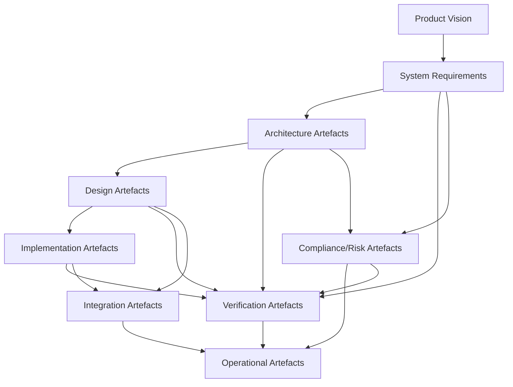

# Living Artefacts in the Cornerstone Framework: Types, Evolution, and Governance

The Cornerstone framework’s federated, artifact-centric philosophy translates directly into its rigorous treatment of all core engineering artefacts. These artefacts—whether requirements, designs, architecture models, test plans, or compliance records—are the canonical, versioned products of engineering knowledge and coordination. Artefact centricity is not a purely abstract principle: it forms the backbone of disciplined cross-domain collaboration, traceable integration, and auditable lifecycle management. This section will detail the classification, lifecycle, governance, and practical management of living artefacts within Cornerstone, highlighting their working conventions, roles in workflow, integration with CI/CD, and best-validated practices for sustaining their integrity across the evolving product landscape.

## 1. The Foundations of Artefact Centricity

Lens of Cornerstone, artefacts are not static deliverables or stale documentation—they are living, continuously evolving, federated records of intent, constraints, contracts, and verifiable outcomes. Each artefact acts as a boundary object: it enables shared understanding and contract negotiation between disciplines while surfacing ambiguity and enabling evidence-driven review at integration points.

This treatment of artefacts as living, versioned, and federated means they are at once the definitive sources of truth and the active scaffolds upon which all technical, process, and compliance activity depends. The artefact’s lifecycle is tightly coupled to—and drives—the flow of product development, a sharp departure from either document-heavy traditional approaches or ad hoc team memory prevalent in loosely managed agile.

To fulfil this role, artefacts in Cornerstone conform to the Docs-as-Code philosophy: they are maintained in version control, are accessible, reviewable, and comprehensible, and are tightly integrated with automation for validation and traceability. These characteristics underpin not only technical execution but also regulatory compliance, contract fulfilment, and scalable knowledge sharing.

## 2. Core Artefact Types and Their Evolution

Cornerstone distinguishes artefacts by their functional purpose, lifecycle, and degree of federation. Artefacts can be grouped into several principal categories: vision and requirements artefacts, architectural and design artefacts, implementation artefacts, verification and validation artefacts, compliance and risk artefacts, integration artefacts, and operational artefacts. Each of these artefact classes follows distinct workflows, evolution patterns, and governance regimes, but all share the foundational properties of contract clarity, versioning, and traceable evolution.

### 2.1 Vision and Requirements Artefacts

At the root of all product direction lie vision artefacts and requirements models. The vision artefact, often embodied in a versioned product charter or system statement of intent, is maintained by Product Vision Stewards as outlined previously. This artefact is not a marketing vision but a reference contract articulating what must be true of the delivered system and why. It is expressed in language that enables translation into actionable, atomic requirements.

Requirements artefacts, including stakeholder, system, interface, and derived requirements, are managed as versioned, traceable entities. Each requirement is uniquely identified, mapped to higher-level vision elements, and assigned to relevant architectural or subsystem contracts. Changes to requirements are managed through formal review, version history, and readiness gating, ensuring that downstream teams have reliable, auditable contexts at any point in the development lifecycle. Requirements artefacts also include regulatory and compliance mappings, which integrate directly with risk and test artefacts as the project evolves.

### 2.2 Architectural and Design Artefacts

Architectural artefacts capture the intentional structure of the system. These include architecture models—such as context diagrams, interface definitions, module dependency maps, and compliance matrices—maintained under architectural stewardship. Architecture artefacts are explicitly federated: each domain or subsystem maintains ownership boundaries and artefact contracts, while discipline-specific architectures (software, electronics, mechanical) are harmonised within a system-level federated model. Traceability from architecture artefacts to requirements and to implementation is continuously established and validated.

Design artefacts—such as detailed interface specifications, subsystem design descriptions, configuration models, and formal design rationale records—are similarly implanted in the Docs-as-Code pattern. Each is maintained as a living artefact, evolving through gated review, and subject to traceability and verifiability mandates. Critically, both architecture and design artefacts embody the evidence for decisions, change rationales, and legacy constraints, forming the authoritative knowledge base on which future adaptations depend.

### 2.3 Implementation Artefacts

Implementation artefacts comprise source code, firmware logic, hardware design files, mechanical CAD models, bill of materials (BOMs), and associated configuration data. Although these artefacts are more traditionally associated with version control, in Cornerstone they are formally bound to requirements and architecture artefacts via traceable links, and their readiness is gated not just by build status but by evidence of contract fitness. Changes to implementation artefacts trigger automated and manual checks for contract compliance, requirements coverage, and integration test pass/failures, all of which are logged as evolving state within the artefact system.

### 2.4 Verification and Validation Artefacts

Quality assurance is instantiated through a family of verification artefacts—test plans, automated test suites, validation matrices, simulation models (HIL/SIL/FIL), test logs, and coverage reports. Each test artefact references the requirement(s) and architecture elements it validates, with all results, coverage, and evidence maintained in auditable, version-controlled form. Automated pipelines ingest these artefacts for CI/CD execution, producing traceable evidence closures at every gate. Any deviation, failure, or ambiguity is surfaced immediately, enforcing discipline and resilience in the face of complexity.

### 2.5 Compliance, Risk, and Change Artefacts

Compliance artefacts encompass hazard records, risk registers, change requests, impact analyses, exceptions, and regulatory evidence bundles. These artefacts are not external appendices but are integrated into the active workflow, versioned, reviewed, and linked to the requirements, design, and test artefacts they reference. Their living nature is essential for regulatory, safety-critical, and heavily audited domains, where the speed and clarity of evidence closure determines not just product fitness, but organizational liability.

### 2.6 Integration and Operational Artefacts

Integration artefacts include incrementally produced integration plans, interface matrices, dependency manifests, and release readiness records. Each serves as both a plan and as a contract for boundary negotiation, surfacing architectural, operational, and delivery risks as early as possible. Operational artefacts—such as deployment manifests, production configurations, release notes, and runbooks—complete the lifecycle by encoding the information necessary for smooth transition to delivery, support, and incident management.

### 2.7 Artefact Federation and Boundary Management

A defining principle of Cornerstone artefact management is strict federation: no single artefact is owned or managed in isolation from boundary negotiation and mutual contract enforcement. Instead, artefacts are deliberately partitioned across domains, with well-defined interfaces and evidence-driven contracts specifying how artefacts interoperate, overlap, or supersede. Versioning discipline, traceable handoffs, and boundary reviews ensure that adaptation in one area does not subvert system coherence or contract integrity.

---

The following Mermaid diagram illustrates the federated artefact relationships and their principal touchpoints within the Cornerstone framework:

This diagram emphasises the direct and cross-linked relationships that are strictly mapped, versioned, and governed in practice. Notably, artefact flows are not strictly linear, but form a traceable mesh that enables contract closure and resilient adaptation at touchpoints.

---

## 3. Artefact Lifecycle, Workflows, and Evolution

Artefacts in Cornerstone are dynamic: their utility is derived not from simple presence but from active curation through the product development lifecycle. Their evolution is governed by explicit states, review gates, automated checks, and transition criteria, all with the goal of surfacing ambiguity, enforcing contract alignment, and sustaining traceable adaptation.

### 3.1 Artefact Lifecycle States

Each artefact type proceeds through well-defined lifecycle states, typically including at least **Draft**, **Proposed**, **Approved**, **Implemented**, **Validated**, and **Obsoleted**. These may be tailored depending on artefact domain and organizational requirements (for instance, some regulated industries may require intermediate or more granular states, such as "Under Review", "Baseline", or "Under Change Control").

Transitions between artefact states are evidence-driven—never purely discretionary—and are typically gated by a combination of automated checks (for completeness, traceability, schema correctness, test pass rate) and structured reviews (design review boards, architecture forums, compliance assessments).

### 3.2 Artefact Workflows

Artefact workflows in Cornerstone integrate collaborative editing, version-controlled change management, and structured handoff between domains. For example, requirements updates propagate downstream to architecture and test artefacts through automated traceability scans. Implementation artefacts, once committed and passing gated tests, trigger downstream validations of compliance artefacts and integration manifests.

This workflow is supported by rigorous automation (CI/CD, schema validators, traceability extractors), orchestration tooling (issue trackers, pull request policies), and domain-specific review boards that serve as the ultimate arbiters for high-impact artefact changes. Artefact change history is thus auditable and reconstructible at any moment, providing both internal accountability and external regulatory assurance.

### 3.3 Artefact Evolution and Change Governance

Cornerstone’s approach to artefact evolution prioritises adaptive rigour: change is expected, but only when it closes ambiguity, satisfies new requirements, or responds to validated risk. Changes are never simply “pushed” through, but negotiated and evidenced across relevant federated domains. The governance mechanisms include explicit change requests, impact analyses, cross-domain notification, and readiness gate signoff.

Artefact baselining and branching underpin safe concurrency. For instance, early-phase architectures may evolve rapidly in dedicated feature branches, only to be incrementally merged into the system baseline after passing coordinated readiness reviews. Historical baselines are maintained, ensuring that full traceability between artefact versions and product configurations is available for root cause analysis or regulatory audits.

---

## 4. Governance, Quality, and Contract Integrity Mechanisms

Artefact governance in Cornerstone is not the domain of a single role or function. Instead, it is a federated responsibility—with Product Vision Stewards, Architects, Process Facilitators, and Cross-Functional Teams each owning the fitness of artefacts at their domain boundaries. The integrity of artefacts is assured through evidence-based contract closure, layered review, and automation.

### 4.1 Evidence-Based Review and Readiness Gating

Each artefact’s advancement through lifecycle states requires explicit evidence: traceability links, review artefacts, validation results, and risk closures. Readiness gates are defined at key transitions—such as from draft to baseline, or from implementation to verified—and are enforced by both automation and accountable review forums.

For example, an architecture artefact advancing from “Proposed” to “Approved” state requires demonstration of mapped traceability to all relevant requirements, cross-domain dependency reviews, and established contract boundaries. No artefact, regardless of perceived urgency, is advanced without closing readiness criteria.

### 4.2 Automation and Continuous Integration Touchpoints

CI/CD automation is central to Cornerstone's artefact model. Artefacts are housed in code-derived repositories, and their validation is continuously executed as part of the integration pipeline. Schema checks, traceability scans, test executions, and compliance evidence generation are all implemented as CI/CD stages, rapidly surfacing drift, incompleteness, or broken dependencies.

This automation ensures that artefact integrity is not dependent on manual oversight alone. It also provides a scalable means of integrating cross-domain artefacts—such as triggering additional test validation upon requirements changes, or re-generating compliance tables on integrating new architectural components.

### 4.3 Contracts, Interfaces, and Boundary Artefacts

Boundary management in Cornerstone operates through artefact contracts—explicitly documented, version-controlled agreements on artefact structure, interface, and expectations. Artefact contracts define not only functional or architectural interfaces (such as an API schema or hardware pinout), but also the non-functional and process requirements (e.g., traceability completeness, code coverage minimums, compliance mappings).

Contracts are living artefacts: their negotiation, ratification, and modification are all versioned and reviewable. Breaking contract changes require not only technical approval, but cross-boundary sign-off, impact assessment, and back-mapped requirements validation. This contract-driven stewardship ensures resilience both to intentional adaptation and to organizational churn.

---

## 5. Practical Docs-as-Code: Implementing Federated Artefact Management

Docs-as-Code is not merely a philosophy, but an operational imperative within Cornerstone. All artefacts—from high-level vision to detailed interface specification and validation records—are treated as code: stored in VCS (e.g., Git), reviewed via pull requests, versioned, and rendered through automated pipelines.

### 5.1 Artefact Structure and Schematization

To be machine-validatable and human-comprehensible, artefacts are encoded in lightweight, accessible formats (Markdown, AsciiDoc, YAML, JSON, XML) according to explicit schemas. This enables:

- Automated schema checks for completeness and correctness.
- Rich linking among artefacts, facilitating end-to-end traceability.
- Human-readable, browsable documentation rendered directly from source.

For example, a requirements artefact may be expressed as a YAML document with unique IDs, taxonomy tags, and trace links to architectural and validation artefacts; architecture models may be represented in PlantUML/Markdown or domain-specific modeling standards (SysML, ULM for electronics), while test cases are expressed as structured documents with mapped requirement references and CI-executable steps.

### 5.2 Artefact Review, Versioning, and Branching

Each change to an artefact, regardless of type, follows the same disciplined workflow as code: it is committed, reviewed in context by relevant stakeholders, subjected to automated checks, and merged only upon signoff. Artefact versioning is explicit: semantic versioning is applied for major, minor, and patch updates, enabling both high-level and granular rollback, delta analysis, or multi-version support.

Branching is widely used to enable isolated evolution—e.g., development of major requirement changes, alternative architectural concepts, or experimental designs—without jeopardising the mainline artefact integrity. Review forums and automated merge gating ensure that only validated, readiness-closed artefacts flow into the baseline.

### 5.3 Automated Traceability, Reporting, and Evidence Generation

Automation pipelines continuously generate traceability matrices, coverage reports, compliance maps, and dependency graphs. These outputs are not external documentation artefacts, but integral, auto-updating summaries derived from the living artefacts themselves. This ensures that the state of requirements coverage, test adequacy, or interface contract integrity is never in question, and that decision-makers are armed with up-to-date, actionable evidence at all times.

Where regulatory or customer evidence bundles are required, automated artefact collections package the required artefacts with traceable dependency references, reducing manual effort and error. This is particularly critical in regulated domains (e.g., automotive, aerospace, medical devices) where audit-readiness is a non-negotiable standard.

---

## 6. Practical Realities, Constraints, and Integration Points

### 6.1 Integration with Continuous Delivery Toolchains

Artefact repositories are deeply integrated with the organization's automation stack: code repositories, CI/CD pipelines, automated provisioning, and release delivery. Promotion of artefacts from draft to baseline and to release must trigger appropriate pipeline stages—running traceability extraction, schema validation, test execution, and compliance validation. Proven open-source and commercial tools (Jenkins, GitHub Actions, GitLab CI, custom schema validators, test runners) are harnessed alongside domain-specific tools (e.g., Polarion for requirements, DOORS for safety-critical, Jira for change tracking) to maintain end-to-end artefact flow. The choice of tooling favours openness, interoperability, and API-accessibility to ensure seamless federation and long-term resilience against tool obsolescence.

### 6.2 Architectural and Organizational Implications

Adopting federated artefact centricity influences the technical and organizational architecture of the engineering organization. Teams must develop skills not only in their technical domains, but in artefact stewardship, contract negotiation, and evidence-based review. Governance structures (architecture boards, change control forums, readiness review committees) become operationally effective only when their deliberations and ratifications are encoded in living artefacts, not untraceable meeting notes or tribal memory.

There is a trade-off between up-front investment in artefact scaffolding and the long-term payoff of reduced ambiguity, improved auditability, and accelerated adaptability. In fast-moving domains, the discipline of living documentation may feel initially burdensome, but rapidly reveals its worth by surfacing ambiguity, preventing drift, and embracing cross-domain adaptation.

### 6.3 Failure Modes and Risk Mitigation

Common failure modes of artefact-centric approaches include outdated or decaying artefacts, lack of disciplined contract enforcement, fragmented ownership, and automation drift. Cornerstone addresses these via federated governance, role clarity, automated evidence generation, and explicit readiness gates. However, artefacts must remain fit for purpose: over-engineering, redundant artefact duplication, or excessive process overhead are to be guarded against. Artefact reviews are as much about excising superfluity as about enforcing completeness.

Risk is further managed by ensuring artefact “liveness”—any artefact not subject to ongoing update, review, and traceability is flagged as obsolete or drift. This encourages a bias towards lean, high-value artefacts with flexible but disciplined schemas.

### 6.4 Trade-offs and Tailoring

No artefact regime is one-size-fits-all. The depth, overhead, and granularity of artefact governance must be tailored to organizational complexity, regulatory burden, and domain volatility. In early-phase startups, a lightweight schema and minimal readiness gating may suffice, moving towards stricter discipline as the product and team scale. Conversely, safety-critical and regulated environments demand a heavier artefact burden, with extensive automation and layered human oversight. Cornerstone provides conventions, not dogma: the value lies in empowering teams to tune artefact discipline to real business and technical risk.

---

## 7. The Cornerstone Artefact Ecosystem: Sustaining Flow Through Living Evidence

The robust, federated artefact model within Cornerstone does not operate in isolation from the day-to-day flow of product development. Rather, it is a primary enabler of scalable, resilient, and adaptive engineering. By treating artefacts as living expressions of intent, contract, implementation, and evidence—documented, reviewed, automated, and governed as code—Cornerstone sustains both the pace and the quality required of modern hybrid product teams.

Federated artefact governance enforces not only cross-domain accountability but also enables integration and adaptation in the presence of evolving requirements, technological shift, and regulatory demands. Teams are structurally and culturally compelled to surface, resolve, and record ambiguity and uncertainty, not to bury it or delay it until late-phase crisis. Automation and transparency reinforce discipline, while adaptation and team learning are encoded in artefact evolution itself.

Ultimately, the maturity of an engineering organization within the Cornerstone framework is best measured by the health of its artefact ecosystem: its completeness, consistency, traceability, and evidence-backed fitness for purpose. By investing in robust artefact conventions and living documentation, organizations build not just better products, but better capacity for resilient, adaptive, transparent, and scalable delivery.

---

In the upcoming chapters, the framework will transition from structured artefact conventions to their practical application in software, firmware, hardware, and integrated system contexts—demonstrating how these foundational artefact disciplines underpin measurable, sustainable engineering outcomes across the entire product lifecycle.