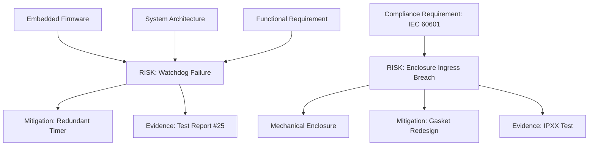

### Cross-Functional Techniques for Risk Identification and Analysis

In the practice of hybrid product development, risk management must synthesize perspectives from multiple engineering disciplines—firmware, software, hardware, mechanical, and regulatory domains. Cornerstone’s artefact-centric philosophy approaches risk not as a one-time event, but as a persistent and federated property of work-in-progress. The process of risk identification and analysis is therefore deeply cross-functional: effective risk discipline is only achievable when domain experts, system architects, project integrators, and compliance authorities work in concert through shared artefacts, repeatable techniques, and automated touchpoints.

#### Systematic Elicitation of Risk Across Disciplines

Cross-functional teams in the Cornerstone model gather to elicit potential risks from the very inception of a project, embedding risk consideration in all upstream decisions. Techniques previously popularized in safety-critical industries—such as Preliminary Hazard Analysis (PHA), Failure Modes and Effects Analysis (FMEA), and Fault Tree Analysis (FTA)—find renewed relevance when adapted to federated artefact management. Interdisciplinary workshops (“risk surfacing sprints”) bring together software engineers, hardware designers, industrial engineers, and quality/regulatory stewards to map out anticipated hazards, failure modes, compliance gaps, and integration points susceptible to uncertainty or misinterpretation.

Unlike traditional approaches in which risks are catalogued and intermittently reviewed, the Cornerstone model treats risk elicitation as a living activity. Risks are articulated in structured artefact formats, most commonly as Markdown or YAML documents, cross-linked to requirements, architecture, interface contracts, and historical risk records. This enables a federated, traceable scaffold upon which diverse perspectives are captured and aggregated in real-time as projects evolve and decomposition deepens.

#### Artefact-Federated Risk Capture

When dealing with cross-domain products—say, a medical device comprising embedded firmware, wireless protocol stacks, mechanical enclosures, and clinical compliance requirements—the challenge multiplies. Each discipline brings domain-unique risks: a firmware engineer may surface concerns about watchdog timer failures; a mechanical engineer identifies enclosure ingress weaknesses; the compliance lead interrogates IEC 60601 interpretations. By capturing these insights as artefacts with discrete cross-links to the relevant subsystem boundaries and contract artefacts, risks become first-class participants in federation. Traceability is maintained via toolchains that track not merely the risk entity, but its lineage: which requirement spawned it, which architectural design mitigated it, and which verification evidence eventually closed it.

#### Risk Analysis: Quantitative and Qualitative Dimensions

Effective risk management demands more than federated identification; it mandates formal analysis, both qualitative (descriptive, scenario-based reasoning) and quantitative (probability-impact scoring). The Cornerstone approach adopts standard forms of risk quantification—such as risk matrices—while integrating them as artefact attributes. 

**Probability-Impact Matrices** remain a cornerstone of cross-functional risk analysis, offering a simple yet powerful heuristic for ranking risks by their likelihood (probability) and consequence (impact):

- **Probability (P):** Reflects how likely it is that a risk event will materialize, often ranked in bands (e.g., Rare to Frequent).
- **Impact (I):** Captures the severity of consequence should the risk eventuate, spanning negligible effects up to catastrophic system or compliance failure.

These parameters, weighted and sometimes supplemented by factors such as detectability or exposure, are encoded as explicit fields within each risk artefact.

The artefact-based risk register thus transcends traditional, disconnected tabular registers. Within Cornerstone, risk artefacts are version-controlled, bidirectionally linked, and directly referenced in design code reviews, requirements acceptance criteria, and validation test plans.

#### Representing Risk Artefacts and Analysis

To support an integrated view of risk artefacts, a simplified Mermaid diagram illustrates the federated relationship between risk artefacts and their linked boundary artefacts in a typical hybrid product:

This diagram highlights how risks exist in a networked context—not as isolated records, but as living nodes in an artefact web subject to continuous evolution, state transition, and closure governance.

---

### Core Mechanisms in Risk Analysis: Application and Federation

#### The Probability-Impact Matrix

Within multi-disciplinary teams, the probability-impact matrix acts as a lingua franca for surfacing, discussing, and prioritizing risks. Cornerstone standardizes this matrix as a structured schema within the risk artefact. The matrix’s grid typically appears as:

| Impact \ Probability | Rare  | Unlikely | Possible | Likely | Frequent |
|---------------------|-------|----------|----------|--------|----------|
| Catastrophic        | Med   | High     | Extreme  | Extreme| Extreme  |
| Major               | Low   | Med      | High     | Extreme| Extreme  |
| Moderate            | Neg   | Low      | Med      | High   | Extreme  |
| Minor               | Neg   | Neg      | Low      | Med    | High     |
| Negligible          | Neg   | Neg      | Neg      | Low    | Med      |

In practice, each risk artefact includes as metadata:

- The estimated probability, agreed by cross-functional consensus.
- The impact, referencing system-level or regulatory consequence.
- The resultant score (often used for filtering, reporting, and workflow gating).

The practicality of this model is in its adaptability: for example, medical device projects may require regulatory-defined severity bands, while consumer IoT teams may favor leaner, more qualitative matrices. Nevertheless, standardizing the schema allows for automated traceability extraction, effective aggregation, and reporting across artefact repositories.

#### Risk Register as a Federated Artefact

Cornerstone eschews the traditional singular spreadsheet-based risk register in favor of a federated, artefact-based approach. Each risk exists as an independent, versioned document—cross-linked, traceable, and subject to state transitions. However, for program-level visibility, a dynamically generated risk register aggregates these artefacts against context-specific queries (e.g., “All open risks related to Power Subsystem”, “All Catastrophic risks for the upcoming release”).

This federated risk register supports several critical objectives:

- **Automated Coverage Analysis:** Determining which requirements, contracts, or compliance obligations remain at risk.
- **Audit Readiness:** Generating real-time, evidence-backed reports of risk status and closure; essential for ISO/IEC compliance.
- **Program Management:** Enabling risk burn-down tracking alongside feature or validation progress, all traceable through the same artefact ecosystem.

---

### Integrating Risk Mitigation and Monitoring: Behavioural and Architectural Considerations

#### Mitigation as Continuous, Artefact-Linked Action

In the Cornerstone framework, mitigation is not a static annotation appended to a risk artefact; rather, it is a distinct, traceable step in the artefact lifecycle. Every mitigation is encoded as a referenceable artefact or field linked back to the originating risk, and forward to the artefacts (designs, code, test) it influences.

For instance, mitigation measures for a firmware timing fault might reference both a detailed design update and new automated test scripts. For hardware-embedded ENC failures, a mitigation artefact could point to a mechanical redesign, associated tolerance analyses, and new manufacturing verification checkpoints.

Automated workflows enforce that no risk may transition to “Mitigated” or “Closed” state unless all linked mitigation artefacts are complete and validated, and the necessary evidence artefacts are available in the CI/CD pipeline or PLM database.

#### Monitoring and Re-Elicitation: The Artefact Lifecycle in Practice

Risks evolve: initial mitigations may prove insufficient as the design matures, new threats may be discovered during integration, and external changes (e.g., standard revisions, supply chain disruptions) may force reappraisal. To support this, risk monitoring is implemented as a periodic artefact-driven process.

- **Lifecycle Triggers:** State transitions in related artefacts (e.g., a requirement obsolescence, architecture pivot, or contract change) automatically trigger risk re-elicitation reviews.
- **Evidence Integration:** Continuous integration systems (CI/CD) and automated compliance pipelines extract evidence status, highlighting risks with incomplete or stale mitigations.
- **Feedback Loops:** Cross-functional teams periodically convene for risk review retrospectives, where emergent risks are surfaced, and mitigation effectiveness is assessed.

The federated approach ensures that risk closure is always evidence-linked and status-transparent, supporting not only internal governance but also formal regulatory submission and post-market surveillance compliance.

---

### Practical Realities and Trade-Offs in Cross-Domain Risk Analysis

#### Tooling, Integration Points, and Constraints

While artefact-centric risk management offers countless benefits in traceability and auditability, its successful application in hybrid teams rests on real-world considerations. Tooling must support federated artefact repositories—often involving integration between version control systems (e.g., Git), requirements databases, PLM tools, and regulatory compliance platforms. Interoperability is essential; schema transformations and automated cross-linking underpin efficient federation.

Integration with CI/CD infrastructure allows risk status to directly influence release readiness: pre-merge gates, automated coverage checks, and traceability-report generation all depend on seamless artefact-data flow. In regulated industries, additional integration with electronic signatures, document control, and validation tracking is often required. 

However, increased automation introduces failure modes—such as broken cross-references, schema drift, or misconfigured pipelines permitting release without risk closure. Robust monitoring, test automation for artefact integrity, and federated stewardship protocols must evolve to detect and remediate such breakdowns.

#### Organizational and Cultural Behaviours

Cornerstone’s artefact-centric approach also imposes culture shift. Cross-functional teams accustomed to ad hoc, informal risk recording must develop habits of artefact federation, evidence linkage, and disciplined state transition. Artefact completeness and traceability become performance criteria—each team, from software and electronics to mechanical and regulatory, sharing accountability for surfacing and resolving their class of risks.

In practice, adapting federated risk management may require role-based training, the establishment of routine risk artefact reviews, and explicit expectations around cross-functional participation in risk surfacing and mitigation retrospectives.

#### Scaling, Complexity, and Adaptability

Artefact-driven risk management is highly scalable: as project scope, regulatory burden, and technical complexity increase, artefact schema and automation can be extended to support more sophisticated risk models (e.g., hierarchical hazard analysis, multiple risk acceptance criteria, or process-specific risk attributes). Conversely, for lightweight initiatives, schemas can be pared down, supporting “just enough” discipline without burdening rapid development.

However, tailoring is essential. Overly rigid risk artefact requirements or excessive automation in exploratory projects may stifle creativity and tempo. Process facilitators, in coordination with architects and vision stewards, must continually calibrate risk rigor to suit organizational maturity, regulatory context, and the tempo of technical change.

---

### Conclusions: Unified, Live Risk Practice in Cornerstone Engineering

In federated, hybrid teams building modern products, risk identification, analysis, mitigation, and monitoring cannot remain siloed or episodic undertakings. Through structured, artefact-centric disciplines—rooted in cross-functional elicitation, artefact-embedded matrices, federated registers, and automated evidence flows—the Cornerstone framework integrates risk as a living, first-class concern. 

This approach enables visibility, traceability, and adaptive governance across disciplines and lifecycles, from initial requirements decomposition through to market release and compliance surveillance. Risk becomes a contract: visible to all, jointly owned, linked to outcomes, and validated through continuous evidence generation and review.

By embedding risk discipline in the same nervous system as requirements, architecture, implementation, and validation, organizations harness both rigor and agility—enabling product development that is proactive, auditable, and ultimately resilient in the face of complexity and change.