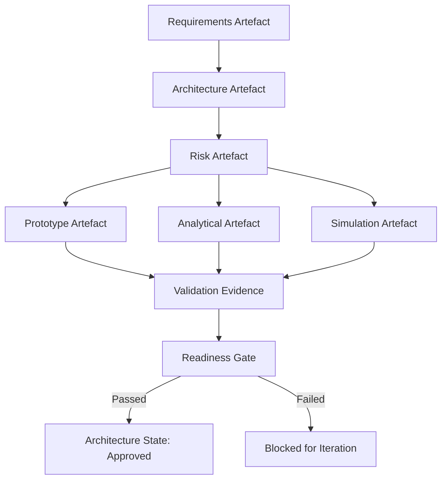

---

### De-Risking Through Prototyping, Analysis, Modelling, Gating, and Simulation

#### Context and Rationale

The federation of artefact-centric risk stewardship in Cornerstone does not treat risk management as an abstract or separate governance practice. Rather, the process of de-risking is operationalized through practical, evidence-backed actions—prototyping, technical analysis, simulation, digital and physical modelling, and progressive readiness gating. These activities form the backbone of federated risk mitigation across software, firmware, hardware, mechanical, and regulatory interfaces.

Federated de-risking enables ambiguity to be surfaced and resolved in the earliest possible lifecycle phases, converting untested hypotheses into validated knowledge, and transforming latent risks into managed artefacts with explicit traceability. This section explores these strategies in the context of multi-domain product development and delineates their integration into Cornerstone’s artefact-lifecycle workflows.

---

#### Prototyping as Evidence-Based Risk Reduction

Prototyping in Cornerstone extends beyond the familiar domain of user interface or form-factor demonstrators. It encompasses both virtual and physical instantiations that generate direct, empirical feedback regarding technical feasibility, integration boundaries, or user interaction. The role of prototyping, in this context, is to target the most consequential uncertainties encoded in requirement, architecture, or interface definitions.

Across software and firmware domains, minimal functional prototypes—often realized as “spikes” or “sandboxes”—enable validation of interoperability, dependency behaviour, or performance constraints. These prototypes are frequently code artefacts governed by the same docs-as-code and automated validation conventions as production code. By surfacing integration ambiguities or technology suitability issues through automated test rigs or instrumented feature toggles, engineers are able to rapidly converge on viable technical pathways or eliminate infeasible approaches before downstream dependencies accumulate.

In hardware and mechanical domains, prototyping is similarly federated across virtual (CAD, finite element models, simulation harnesses) and physical (3D prints, breadboards, rapid assemblies) instantiations. Key mechanical fit, thermal/load regimes, tolerance stack-ups, or manufacturability limits can be interrogated, with results captured in linked artefacts; e.g., design decision records, simulation attachments, and empirical test reports. The feedback loop is closed when these artefacts trigger architectural or requirement state transitions according to readiness or compliance criteria.

Crucially, prototyping in Cornerstone is governed not simply as an activity, but as a risk artefact state transition. Prototypes—whether code, schematics, assemblies, or models—are traceably linked to originating risk artefacts. Their outcomes, both positive and negative, are codified as living evidence, with fitness-for-purpose or non-conformance automatically gated. This tight coupling ensures that prototyping is not a one-time demonstration, but a continuous, traceable risk reduction mechanism embedded in every phase of product evolution.

---

#### Analytical and Modelling Approaches to Ambiguity Resolution

While prototyping transforms uncertainty into empirical data, technical analysis and modelling enable risk owners to reason about system properties, performance, and safety ahead of, or independent from, physical instantiation. In Cornerstone, analytical artefacts are first-class objects—calculations, interface budgets, derivations, or verification matrices—all governed under docs-as-code conventions and subject to automated validation, cross-linking, and lifecycle gating.

For software and firmware, static analysis, formal methods, and architectural modelling tools (e.g., UML, SysML, threat models) provide critical early feedback regarding correctness, memory safety, concurrency hazards, or attack surfaces. Automated static analysis runs—integrated into CI/CD—generate evidence of compliance to coding standards (MISRA, CERT C, etc.), or surface trends in code complexity and test coverage. Where regulatory, safety, or mission-criticality demands, model-checking or theorem-proving may be employed, with formal results captured as linked artefacts alongside requirement rationale and validation contexts.

Mechanical, electrical, and system domains employ analytical artefacts such as signal integrity budgets, tolerance analyses, failure rate computations, and thermal models. The artefacts governing these analyses are not passive records, but introduction points for cross-discipline evidence accumulation. A mechanical stack-up analysis, for example, is not validated solely within the mechanical domain, but is traceably linked into software, firmware, and manufacturing readiness artefacts—such as specifying assembly tolerances with direct impact on sensor calibration algorithms or bootstrapping calibration routines in embedded code during system bring-up.

The key organisational implication of federated analytical artefacts is the reduction of isolated or untraceable analyses, which are frequent precursors to integration risk. By enforcing artefact traceability and lifecycle controls, Cornerstone ensures that analytical conclusions propagate through all downstream artefacts and that their validity is maintained as system constraints and architectures evolve.

---

#### Simulation: Digital Evidence Across System Boundaries

Simulation serves as a bridge between purely analytical reasoning and physical prototyping. In federated product development, simulation encompasses a broad continuum: virtual prototypes of embedded firmware running in hardware-in-the-loop (HIL) rigs; co-simulation of software, networks, and physical environments; or digital twins for entire assemblies.

In software and firmware, simulation may mean emulation environments for early test harnesses, deterministic replay of complex real-world scenarios, or system-level performance modelling. By integrating simulators with CI pipelines, engineers expose algorithmic risks, timing uncertainties, or resource contention long before hardware integration. For hardware, HIL and sensor-/actuator-in-the-loop testing embed firmware and electronics into dynamically modelled environments, uncovering issues related to latency, cross-domain interference, or human-in-the-loop latency limits.

Mechanical and mechatronic systems leverage multiphysics simulation (e.g., thermal, dynamic, fluidic) to evaluate stress points, fatigue, or failure envelope limits. The simulation output—plots, parametric sweeps, data files—are automatically archived as artefact evidence, cross-linked to risk registers, requirements, and validation test cases.

A core feature of simulation in Cornerstone is automated result ingestion and traceability. Simulation artefacts are explicitly cross-referenced against originating risks, and are subject to versioned lifecycle controls. When simulation parameters, models, or assumptions are revised, affected risk artefacts are flagged via automation, triggering re-analysis or scenario extension.

This bidirectional governance strengthens auditability and compliance (e.g., with ISO 26262, IEC 61508, or FDA standards), and ensures that simulation is not a siloed or ad-hoc process, but a persistent and federated de-risking technique across all disciplines.

---

#### Readiness Gating and Lifecycle State Transitions

While prototyping, analysis, and simulation each contribute critical evidence in managing risk, their true effectiveness is realized through disciplined lifecycle gating. In Cornerstone, state transitions for all federated artefacts—requirements, architecture, risk, validation, and compliance—are governed by explicit readiness criteria. These readiness gates are encoded as part of the artefact schema, enforced via automation, and trigger procedural flows when unmet.

The artefact-centric readiness gate is not a subjective checkpoint, but an explicit set of version-controlled criteria (e.g., “Prototype validation complete and non-conformances resolved,” “Simulation evidence archived and reviewed,” “All analytical models cross-referenced and baselined”). Automated CI/CD workflows interrogate artefact metadata, enforce that all gating criteria and evidence links are satisfied, and block downstream activities (e.g., design freeze, release candidate, compliance body review) as defined in policy.

The practical effect of this discipline is twofold. First, ambiguity and latent risk are surfaced early, and cannot be indefinitely deferred—since artefact progression (and thus product maturation) becomes contingent on tangible evidence of risk reduction. Second, traceability to risk mitigations and evidence is rendered continuous, auto-auditable, and responsive to change: if new risks are identified or existing artefacts evolve, readiness gates re-engage and block until gaps are addressed.

This gating construct is central for regulated domains, where release to manufacturing or deployment is gated not by informal signoff, but by demonstrable closure against structured risk, validation, and compliance artefacts.

##### Mermaid Diagram: Artefact Lifecycle State Transitions with Readiness Gating

This diagram illustrates how each artefact—requirement, architectural, risk, prototype, analytical, and simulation—contributes linked evidence (Validation Evidence) to the Readiness Gate. The readiness gate either permits progression of the architecture (or next lifecycle artefact) or blocks progression pending further iteration.

---

#### Trade-Offs and Lifecycle Realities

Adopting a federated, artefact-governed approach to de-risking introduces strategic trade-offs. The rigor and automation of artefact state transitions drive transparency and early risk surfacing, but also require up-front investment in tooling, schema definition, and process discipline. Cross-discipline coordination around readiness gates may, if poorly designed, produce bottlenecks or procedural deadlock. Thus, criteria must be context-sensitive—tailored to proportional risk and product criticality—rather than rigidly enforcing “one-size-fits-all” thresholds.

Additionally, over-reliance on simulation or virtual prototyping, without corroborating physical or integration evidence, can produce a false sense of security—especially where environmental variables or emergent coupled effects are difficult to anticipate fully. Accordingly, Cornerstone embeds feedback loops: simulation or analysis unfailingly trigger complementary physical prototypes or integration sprints at staged intervals, with evidence linked and reviewed to confirm de-risking completeness before lifecycle transitions.

Organisationally, federated artefact gating diffuses the ownership of readiness away from single roles or functional silos. Cross-functional teams, as stewards of living artefacts, are accountable for both the creation and validation of evidence, strengthening collective knowledge and reducing blame-shifting or handoff latency.

Such a federated approach also enhances resilience against organisational and personnel change. Risk stories, mitigation evidence, and gating history remain accessible, traceable, and reproducible—enabling smooth onboarding and transition for new engineers, managers, or compliance auditors.

---

#### Integration with Regulatory and Compliance Frameworks

Many product domains must demonstrate not merely internal confidence in de-risking, but externally verifiable conformance to quality, safety, and regulatory standards. Artefact-centric de-risking in Cornerstone aligns closely with contemporary regulatory philosophies (e.g., ISO 13485, IEC 62304, ISO 26262), which emphasize traceability, evidence-backed design controls, and lifecycle risk management.

By encapsulating risk mitigations as linked artefacts—each with their own versioning, rationale, and outcome evidence—Cornerstone enables direct, audit-ready reporting across all product dimensions. When regulators require demonstration of hazard analyses, design mitigations, and validation evidence, federated artefact graph traversal produces comprehensive, current risk closure maps. Automated readiness gating further enforces correctness and completeness, reducing the likelihood of non-conformances or late-stage surprises during audits.

---

#### A Unified, Continuous Model for Risk Reduction

De-risking, in Cornerstone, is not an isolated milestone or single event, but a continuous, federated lifecycle process. Prototyping, analysis, modelling, simulation, and gating co-exist as boundary-spanning practices—not constrained by functional domain or disciplinary silo. Their outputs—artefacts, evidence, and lifecycle transitions—are versioned, cross-linked, and governed by explicit workflow logic.

This approach ensures that risk reduction is measured by explicit, artefact-backed knowledge rather than intuition or inertia, and that readiness to proceed—be it for engineering validation, field trial, or regulatory release—is always a function of federated, living, cross-disciplinary evidence.

In sum, the discipline of federated de-risking, realized through artefact-centric prototyping, analysis, simulation, and gated transitions, forms a core foundation of the Cornerstone delivery framework. It accelerates delivery, improves system quality and safety, and unifies diverse engineering domains within a resilient, adaptive, and auditable product development lifecycle.

---