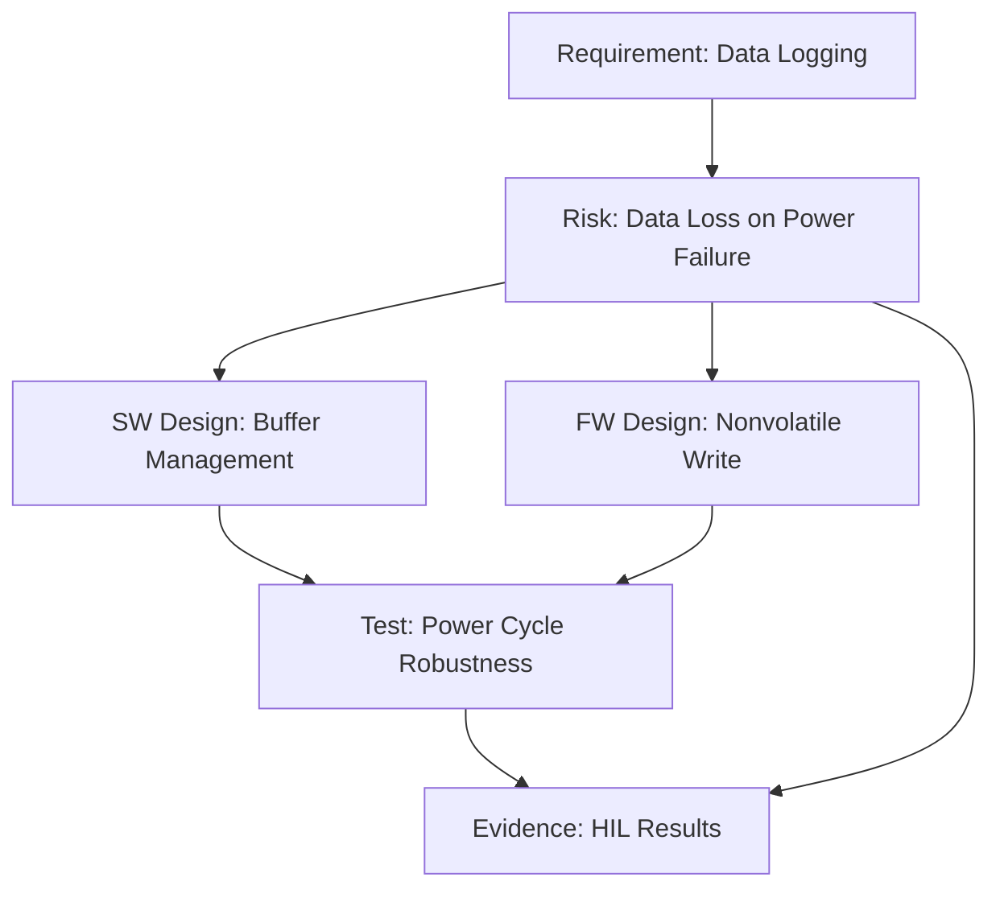
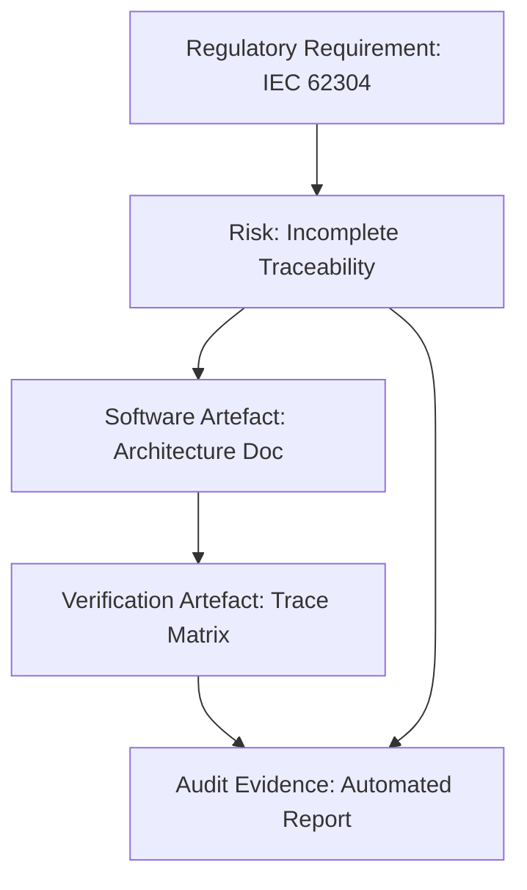
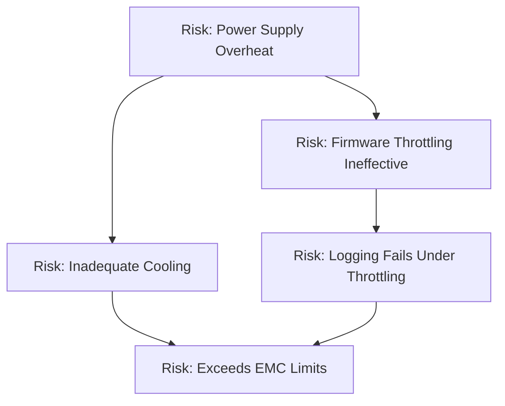

### Characterising Risk Across Software, Firmware, Hardware, Mechanical, Regulatory, and Market Domains

In the multifaceted landscape of modern product development, risk presents itself in diverse manifestations—each shaped by the intrinsic properties of its technical and organisational context. Recognising, distinguishing, and managing these risk modalities is foundational to artefact-centric, federated product engineering as defined in the Cornerstone framework. Understanding risk holistically—and engineering systems and workflows to make risk explicit, addressable, and persistent—enables cross-disciplinary teams to act with both autonomy and rigour throughout the product lifecycle.

#### The Nature of Engineering Risk

Risk, within the Cornerstone framework, is fundamentally the potential for events, actions, or system states to cause undesirable outcomes relative to the agreed product objectives and constraints. Risk comprises both the probability of occurrence and the potential impact, whether for safety, performance, security, compliance, market viability, or schedule adherence. Unlike static assumptions or issues, risk is dynamic, evolving as artefacts mature and external conditions shift.

Artefact-centric governance transforms risks into living boundary objects: explicit, versioned, and traceable across the full system landscape—each tied to requirements, architecture, design changes, validation activities, and evidence of mitigation. This holistic treatment enables continuous, automated risk visibility and proactive accountability well beyond traditional risk registers.

#### Software Risks: Complexity, Non-Determinism, and Lifecycle Volatility

Software, by design, is malleable and scalable; but this flexibility introduces risks inherently distinct from physical domains. Functional correctness is threatened by algorithmic flaws, concurrency errors, state-space complexity, and emergent behaviours arising from integration. Software risk is compounded by intangibles such as shifting requirements, external dependency churn (third-party libraries, APIs, cloud services), ambiguous interface contracts, and environmental uncertainty across platforms and deployment contexts.

The rapid pace and low cost of change foster an illusion of reversibility, often overshadowing latent risks such as technical debt, regression hazards, and hidden coupling. Furthermore, incomplete automated coverage (testing, static analysis, formal verification) may fail to reveal edge cases that express nondeterministic or unsafe system behaviour. These factors necessitate robust linking of risk artefacts to requirements, architecture, design contracts, and continuous integration outcomes, supporting both real-time assessment and historical traceability.

From a practical engineering workflow perspective, software risk is best surfaced by integrating automated traceability within CI/CD pipelines, linking artefact transitions to gating evidence—such as code reviews, static analysis reports, unit/integration test passes, and dynamic analysis. Where architectural or regulatory dictates (e.g., IEC 62304 for medical software) require elevated discipline, formal risk modelling (such as FMEA or Bowtie) and tool-based traceability (e.g., bidirectional linking between risk, requirement, and verification artefacts) become central.

#### Firmware Risks: Embedded Constraints and Contextual Dependency

Firmware inhabits a cross-domain nexus: its role as the connective tissue between software and hardware subjects it to unique risk profiles. Unlike general-purpose software, firmware operates with, and is constrained by, tight resource budgets (CPU, memory, timing), hardware-specific assumptions, and deterministic execution demands. Risk emerges from hardware abstraction errors, timing discrepancies, firmware-hardware interface mismatches, and latent bugs in low-level drivers or real-time tasking systems.

The risk posture of firmware is tightly coupled with hardware evolution: pinout changes, signal integrity, and electrical characteristics may propagate incompatibilities or failure modes. Furthermore, update mechanisms for firmware often necessitate careful validation, rollback capability, and cryptographic provenance to withstand threats such as bricking or unauthorised modification.

Regulatory frameworks for embedded and safety-critical firmware (for instance, ISO 26262 in automotive, ISO 13849-1 in industrial automation) impose explicit expectations on traceability, configuration management, and evidence-based validation. In Cornerstone, firmware risk is managed through artefact federation: hardware and firmware requirements, interface contracts, and risk artefacts are linked, with verification evidence progressively attached through simulation, HIL (hardware-in-the-loop), and integration sprints.

A simplified representation of risk traceability integration across software and firmware artefacts can be shown below:

This diagram illustrates federated risk artefacts bridging software and firmware domains, with traceability encompassing requirements, design, test, and mitigation evidence.

#### Hardware Risks: Physical Constraints, Manufacturability, and Systemic Interactions

Hardware risks are typically rooted in the immutable constraints of physical reality—electrical, mechanical, thermal, and material limitations. These risks evolve through the hardware lifecycle, from concept and simulation to prototyping, manufacturing, and integration. Unlike software, hardware changes post-fabrication are costly and slow, heightening the significance of early and continuous de-risking.

Sources of hardware risk include signal integrity and electromagnetic compatibility issues, thermal buildup, component obsolescence, tolerancing, mechanical fit, and susceptibility to supply chain failure. The periodicity of hardware iteration cycles intensifies risk, as confidence in simulation or calculation must be validated by physical build and empirical testing; incomplete de-risking before cutover to fabrication can result in systemic or catastrophic failures.

In federated artefact workflows, hardware risk is mapped rigorously via explicit artefacts: calculations, simulations, and analysis reports (such as FMEA, fault tree analysis, physical testing reports) are cross-linked to requirements and risk objects. These artefacts carry version histories and evidence states, supporting readiness gating and audit. Integration sprints incorporating hardware prototypes, board bring-up, and cross-disciplinary co-simulations serve as mandatory feedback loops to ensure that risk assumptions reflect operational reality.

Hardware risk management is further complicated by externalities such as changing component lead times, part discontinuation, or new safety compliance directives. Artefact-centric traceability assures that cascading impacts are automatically surfaced across the federated network of affected artefacts and roles.

#### Mechanical Risks: Tolerances, Fatigue, and Environmental Exposure

Mechanical risks are grounded in material behaviour, load paths, manufacturing process capability, and environmental durability. These risks include failure modes due to fatigue, creep, corrosion, wear, assembly variability, or vibration. The intersection of mechanical with other disciplines creates additional complexity—for instance, the mechanical enclosure may impact electromagnetic performance, thermal dissipation, or software updatability.

Workflow integration in mechanical risk management demands artefacts such as CAD models, FEA (finite element analysis) simulations, tolerance stack analyses, and manufacturing process characterisation. These are embedded in traceable artefact lifecycles, with readiness tethered to both analytic and empirical evidence. Feedback from prototype builds, assembly pilot runs, and accelerated life testing is captured as versioned evidence, closing the loop on risk reduction claims.

Federated governance ensures that when upstream changes occur to requirements or component form factors, downstream mechanical artefacts flag potential noncompliance or risk regression automatically, prompting de-risking tasks. In high-integrity systems, the rigour of safety analysis (such as hazard and operability studies, or HAZOP) is increased in accordance with system safety integrity levels (SIL) or application-specific standards.

#### Regulatory and Compliance Risks: Governance, Documentation, and Evidence

Regulatory risk extends beyond mere technical artefacts; it encompasses systemic conformity to external expectations for safety, security, privacy, and market authorisation. These requirements derive from standards (such as ISO 26262, IEC 62304, FDA 21 CFR Part 820, CE, RoHS), each with unique patterns of compliance artefacts, documentation, traceability, and audit readiness.

Nonconformity can result from explicit specification mismatches, undocumented exceptions, or undocumented assumptions. Points of noncompliance may also be latent, only revealed by regulatory review or incident investigation. The federated artefact approach positions regulatory risk as a persistent artefact, contextually linked to requirements, design decisions, validation evidence, configuration items, and risk mitigation outcomes. This enables proactive risk surfacing and automated gap analysis based on version state, gating releases until closure evidence is adequate.

Furthermore, change management is critical. The dynamic nature of both products and regulatory environments requires that risk artefacts encapsulate provenance—the temporal and contextual relationship between “as-designed,” “as-built,” and “as-deployed” states—ensuring ongoing compliance as artefacts and market expectations evolve.

Artefact-centric regulatory risk management is depicted below:

This diagram encapsulates the federated relationships ensuring compliance artefacts, risk evidence, and audit readiness trace back to regulatory mandates.

#### Market and Business Risks: Realisation, Delivery, and Lifecycle Adaptability

Market risk encompasses the possibility that developed artefacts, once technically viable, do not yield product fit, commercial advantage, or ongoing supportability. These risks often originate from erroneous market assumptions, technological shifts, ambiguous customer requirements, or macroeconomic volatility. While not always embedded directly within technical artefacts, market risk must be actively represented and managed in federated workflows, as it informs requirements volatility, timing, scope changes, and prioritisation.

Artefact-centric governance enables early surfacing of market risk through artefacts such as voice-of-customer analyses, business case validation, cost-modelling, and competitor benchmarking. These are explicitly linked to both system requirements and risk artefacts, ensuring that changes in customer needs, emerging regulatory trends, or supply chain disruptions are propagated through the full chain of product artefacts, thus making risk visibility cross-disciplinary and persistent.

Market risk is inherently dynamic, requiring iterative risk evaluation as the environment evolves. The ability to version artefacts, attach evidence from competitive analysis or user feedback, and block readiness progression until market risk is addressed, is central to sustainable product delivery.

#### Risk Interdependency and Systemic Behaviour

A salient feature of risk within federated, artefact-centric workflows is interdependency. Rarely do risks reside completely within single domains. For example, a power supply thermal issue (hardware risk) may impose firmware mitigation constraints (firmware risk), necessitate additional enclosure cooling (mechanical risk), require architectural re-partitioning (software risk), and create noncompliance with electromagnetic guidelines (regulatory risk).

Cornerstone’s federated artefact model provides the mechanism by which such interdependencies are rendered visible rather than left as implicit expertise or siloed knowledge. Automated artefact cross-linking, readiness gating, and workflow validation ensure systemic risk is not abstracted away, but made explicit—enabling proactive identification and collective mitigation.

A synthesised view of risk propagation in federated artefact-centric engineering is illustrated below:

This diagram demonstrates risk interlinkage across hardware, firmware, mechanical, software, and regulatory artefacts, reinforcing the necessity for unified, version-traceable stewardship.

#### Practical Considerations: Workflow, Integration, and Lifecycle Realities

Managing risk as a versioned, federated artefact introduces practical workflow considerations. Tooling must enable bidirectional traceability, automated evidence attachment, and lifecycle gating while scaling to cross-disciplinary complexity and maintaining audit readiness. Revision control, access control, and role-based federated responsibility are essential to harmonise latent expertise and ensure accountability across dynamically formed teams.

Artefact schemas must be adaptable to the context—enabling lean management in prototype environments and rigorous enforcement under regulatory scrutiny. Integration with existing systems (PLM, ALM, EDA, simulation platforms) is often required, with workflow automation surfacing artefact state changes and propagating necessary downstream actions automatically.

The cost of artefact-centric risk management is nontrivial: initial investment in adaptation, training, and migration competes against short-term delivery pressure. However, lifecycle realities—from rapidly iterating software to capital-intensive hardware—from shifting regulatory mandates to volatile market requirements—demand a structured apparatus that sustains traceability, supports continuous de-risking, and accelerates effective root cause analysis.

#### Summary: Risk as a Persistent, Evidence-Centric Artefact

Within the Cornerstone framework, risk is not a static afterthought or box-ticking exercise, but a first-class, persistent entity woven into every artefact lifecycle. By recognising and operationalising the unique risk topologies across software, firmware, hardware, mechanical, regulatory, and market spheres—whilst acknowledging their interdependencies and systemic emergent behaviour—engineering teams can unify risk management with continuous value delivery.

The artefact-centric, federated approach ensures risks are visible, actionable, and auditable—supported by contextual evidence and automated traceability. This underpins the enduring adaptability, compliance, and technical excellence requisite for successful, integrated products in complex, evolving markets.