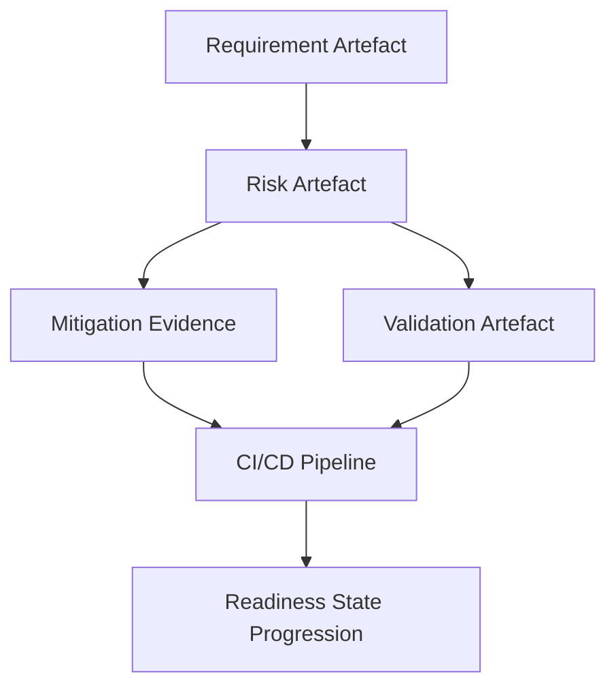
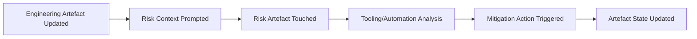

### Lightweight Integration of Risk into Ongoing Delivery

Successfully embedding risk management into product development requires not only robust governance and lifecycle formalism, but also practical techniques that maintain delivery velocity and team engagement. Within the Cornerstone framework, risk permeates each engineering activity as a living artefact—persistent, traceable, and dynamically responsive—rather than as a cumbersome overhead. This integration is both technical and cultural, leveraging artefact-as-code, federated workflows, and automation to make risk identification, analysis, mitigation, and monitoring frictionless components of everyday engineering practice.

#### Federating Risk with Workflow, Not Interrupting Flow

The chief challenge historically associated with risk management is its reputation as a “gated checkpoint” activity—soliciting documentation only at specific milestones, often detached from the rapid and granular nature of multidisciplinary delivery. Cornerstone overcomes this by federating risk artefacts directly with the core delivery workflows: user stories, requirement tickets, architectural definitions, test cases, and compliance evidence. Every artefact that influences product behaviour, performance, or compliance is linked—often automatically—to one or more risk artefacts.

For example, when a requirement is captured or modified, its risk aspects (hazards, vulnerabilities, assumptions, dependencies) are immediately surfaced as first-class fields or references, with lifecycle state transitions explicitly gated on corresponding risk review and mitigation artefacts. Engineering teams are thus prompted to record, discuss, and update risk context as a lightweight aspect of the artefact’s evolution, rather than through separate, duplicative processes. Automated CI/CD pipelines further enforce that artefact lifecycle transitions—such as progressing a user story to “done,” merging a design branch, or completing a verification cycle—are constrained by readiness criteria directly referencing risk mitigation status.

This tight coupling is visually represented below, simplifying the feedback cycle and making risk, in effect, “invisible” as a separate activity, yet always visible as an inherent property of the work at hand:

By structurally linking artefact progression to risk states and evidence, project flow is protected from risk escapement—where unidentified or insufficiently mitigated risks pass undetected through critical delivery phases. This minimizes the incidence of late-stage surprises, rework, or compliance failures.

#### Beyond Registers: Persistent, Traceable Risk Artefacts

Cornerstone reframes the ubiquitous “risk register” as a set of persistent, programmatically-managed artefacts. Instead of risk being a static ledger, each risk instance is a living object: versioned, status-tracked, and embedded in the federated artefact graph. The practical outcome is seamless traceability between risk, its sources (e.g., requirement, design, interface), its mitigation actions, and its empirical validation.

In software and firmware domains, for example, a security risk originating from an external dependency is linked from the requirements artefact through architectural models and codebase dependencies. Automated security scanning tools can write directly to the mitigation evidence artefact, updating status and surfacing remediation needs in the developer’s daily environment. In hardware and mechanical domains, failure-mode risks (such as thermal runaway or mechanical fatigue) are linked directly to simulation artefacts, empirical test results, and design documentation. Regulatory risks can be tied to compliance obligations, requirements, and supporting test evidence, ensuring a continuous, audit-ready chain.

This persistent, bidirectional interlinking supports not only engineering flow, but also enables dynamic reporting, ad-hoc queries, and automated compliance output, which is critical for domains governed by standards such as ISO 26262, IEC 62304, and FDA QSR.

#### Lightweight Risk Capture and Continuous Monitoring

To avoid process drag, the Cornerstone framework prescribes minimal but structured information capture at the point of work. When engineering artefacts are updated, tooling encourages terse, structured risk descriptions (e.g., “race condition risk in context switch handler”), categorical assignment (e.g., safety, security, regulatory), affected artefacts, and links to planned or completed mitigation. This approach supports rapid, accurate risk triage without requiring extensive documentation effort at each turn.

Continuous monitoring is achieved by integrating automation throughout the federated artefact ecosystem. Static and dynamic analysis tools, dependency checkers, code quality analyzers, and simulation platforms all produce outputs that can directly update risk and mitigation artefacts or trigger alerts. For example, the introduction of a critical hardware anomaly in lab testing automatedly revisits and reopens the associated risk artefact, retroactively gating related artefact states until new evidence is provided. Similarly, the emergence of a new security advisory for an open-source software dependency can automatically raise risk status and surface required actions to developer work queues.

The following illustration demonstrates the continuous interplay of artefact updates and risk artefact monitoring:

This cycle embodies the lightweight, low-latency integration that distinguishes Cornerstone: risks are never left static, nor is their active management separate from the practical cadence of engineering work.

#### Trade-offs and Organisational Dimensions

The practical reality of embedding risk as a living artefact is not without trade-offs. Initial setup requires investment in integrating tooling, harmonising artefact schemas, and establishing cross-team expectations about artefact stewardship. Engineering culture must evolve to treat risk updates as a daily norm, not a periodic compliance exercise. There can also be pushback if risk artefact updates are perceived as disconnected from tangible value, particularly when balancing delivery speed and operational rigour.

However, these short-term costs are counterbalanced by the reduction in long-term project risk, rework, and compliance overhead. The artefact-centric and federated approach promotes both accountability—by making risk state progression visible to the whole team—and adaptability—by reducing the latency between risk signals and decision-making. This model further allows variation in the granularity of risk artefact management: in high-integrity and regulated contexts, detailed traceability and readiness gating are enforced, while in more exploratory or agile domains, lighter-weight risk artefact templates can be sufficient, with “just enough” discipline to track emergent concerns.

#### Lifecycle Evolution and Failure Modes

A final practical consideration is the persistence of risk through the lifecycle. Risks are rarely static; mitigations may erode, new hazards emerge as dependencies shift or environments change, and “resolved” risks may reappear under new guises. By federating risk artefacts with delivery artefacts and automating periodic health checks (e.g., requirement obsolescence, dependency audits, simulation reruns), the system maintains “liveness”—old risks cannot simply be archived and forgotten. Conversely, this apparatus must avoid “alert fatigue”; risk prompts and gating need to be actionable and appropriately filtered, leveraging smart defaulting and escalation logic.

Failure modes remain: poorly defined artefact schemas, inconsistent application of readiness criteria, or incomplete integration may allow critical risks to escape detection until late in the lifecycle. Organisational change fatigue, lack of sponsorship, or insufficient technical automation can erode adherence to the model. Continuous improvement and cross-functional buy-in are thus vital adjuncts to the technical facets of lightweight, federated risk integration.

#### Summary

By embedding risk as a lightweight, federated, artefact-centric component of ongoing delivery, Cornerstone ensures that risk management no longer functions as an episodic hurdle but as an integral, continuous enabler of engineering flow. Its automation, structured linkage, and persistent visibility provide the means for highly adaptive, accountable, and resilient product development—supporting both the immediate need for delivery velocity and the enduring imperatives of safety, quality, and compliance.