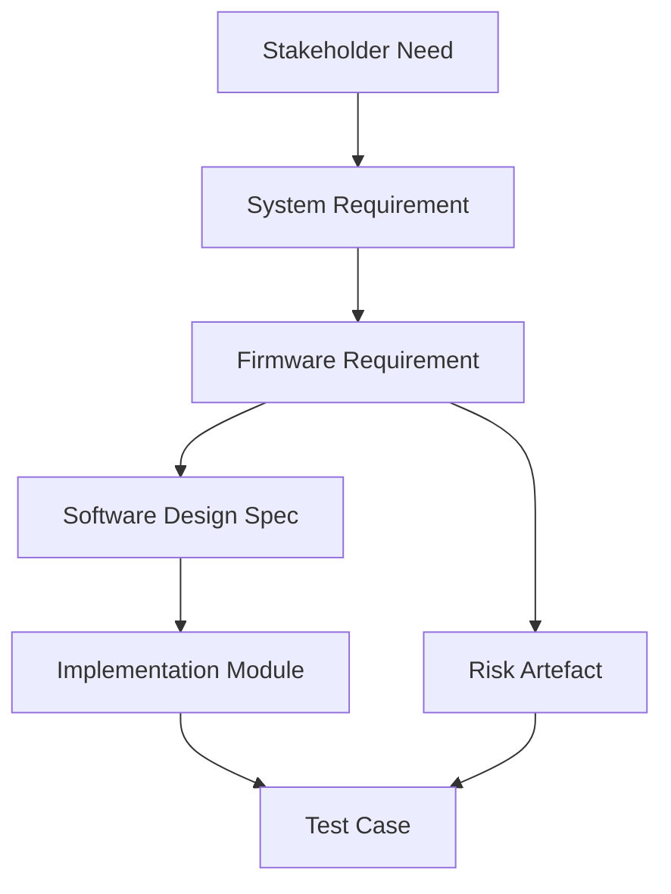

### Structured-to-Detailed Requirements: Traceability and Acceptance Criteria in Cornerstone

#### 1. Foundations of Requirements in Hybrid Delivery

At the heart of any robust engineering process lies the ability to express intent clearly, to decompose ambiguity into actionable units, and to ensure that what is built matches what is needed. The Cornerstone framework treats requirements not as static documents, nor as isolated tickets, but as actively governed, versioned artefacts underpinning the entire product lifecycle. This artefact-centric approach unifies structured systems engineering discipline with agile delivery, imposing a strict logic for decomposition, traceability, and validation through acceptance criteria.

Requirements thus evolve from high-level aspirations into actionable, interrogable, and testable constructs, bridging abstract system goals and practical engineering actions. The granularity, traceability, and lifecycle of these artefacts are central—each requirement, from initial stakeholder need through to detailed implementation constraints, drives downstream development and risk management, and forms a contractual baseline for acceptance.

#### 2. Requirement Breakdown: From Structure to Detail

Cornerstone adopts a hierarchical, federated requirements model, fully embracing the V-model principles of progressive elaboration and bidirectional traceability, whilst enabling incremental delivery in agile cadence. At the outset, product vision stewards, in collaboration with architectural stewards and domain experts, capture top-level needs: stakeholder objectives, compliance mandates, and key system capabilities. These are formalised as structured requirement artefacts—persistent, versioned, and tagged for provenance.

The decomposition process is both a matter of technical substance and workflow discipline. High-level (often system or feature-level) requirements are analysed and broken down according to architectural partitioning—reflecting logical subsystems, interfaces, and domain boundaries. For software and firmware, this may involve translation from product-level capabilities and constraints into software features, functions, user stories, regulatory requirements, and performance metrics. For instance, a system-level requirement pertaining to safety integrity (e.g., “The system shall detect and respond to over-temperature faults within 50ms”) is decomposed into firmware diagnostic algorithms, platform-level communication interfaces, and diagnostics reporting mechanisms, each managed as their own requirement artefacts. Hardware and mechanical decomposition follow similar logic, with partitioning driven by functional architecture and interface definitions.

The artefact model ensures that each derived requirement remains explicitly linked (“traced”) to its parent, preserving intent and context while supporting validation and change impact assessment. Artefacts record the origin, rationale, and downstream dependencies, providing an auditable requirements tree that evolves as both system and understanding mature. The decomposition is neither a one-off event nor a design-phase bottleneck; iterative refinement is expected, with new knowledge, risk analysis, and integration feedback continuously driving requirement updates and granularity adjustments.

#### 3. Requirements as Persistent, Versioned Artefacts

The rigorous treatment of requirements as persistent artefacts differentiates Cornerstone’s approach from both document-driven and ticket-based models. Each requirement artefact—whether epiced, user story, technical constraint, or compliance clause—resides in version-controlled storage, rendered in a lightweight, human- and machine-readable format (such as Markdown, reStructuredText, or YAML). This artefact is managed through an explicit lifecycle: drafted, reviewed, accepted, implemented, verified, and retired. At each stage, the artefact’s state is CI/CD-gated and reflected in audit- and traceability tools.

Artefact versioning is not merely administrative. When requirements change—whether through stakeholder feedback, regulatory revision, or emergent technical risks—the artefact’s version history maintains a permanent, reconstructable audit log. This enables teams to map code and test changes directly to the requirement versions they were intended to fulfil, and to reconstruct historical system baselines when diagnosing field issues or satisfying regulatory audit. In domains governed by standards such as ISO 26262 (functional safety for automotive software) or IEC 62304 (medical device software lifecycle), such atomic traceability is not only best practice but a statutory necessity.

#### 4. Traceability: Linking Intent, Implementation, and Validation

In the Cornerstone lifecycle, traceability is not an afterthought or an isolated compliance concern; it is woven into the engineering fabric from inception. Every requirement artefact is linked by explicit trace relationships to downstream artefacts: architecture components, design specifications, implementation units (such as source modules or firmware blocks), test cases, known risks, and validation evidence. The trace web supports bi-directional navigation, providing both bottom-up views (e.g., “What system-level objectives does this code module serve, and what must it not violate?”) and top-down views (“For this compliance mandate, what has been built, tested, and verified?”).

Mermaid provides a means to illustrate these relationships within a requirements tree, and a practical example would appear as:

Here, each node represents a versioned artefact. Trace links (arrows) show the decomposition and coverage relationships: a Stakeholder Need flows to a System Requirement, decomposed into a Firmware Requirement, specified in a Software Design Spec, realised by an Implementation Module, and validated by a Test Case. The same Firmware Requirement is linked to an explicit Risk Artefact, which, if mitigated or triggered, is validated or checked by one or more Test Cases.

Automated traceability is realised through artefact metadata and schema discipline; artefact identifiers and trace references are machine-readable and enforced through schema validation in Docs-as-Code repositories or requirements management platforms. During CI/CD pipeline execution, trace completeness can be checked automatically. Gating criteria may block merges or releases if defined traceability or acceptance evidence is missing or out of date, thus closing the compliance loop.

#### 5. Acceptance Criteria: The Bridge Between Requirement and Verification

A requirement is only as strong as the means by which its fulfillment can be demonstrated. In Cornerstone, every actionable requirement—across system, software, and firmware domains—is coupled to explicit acceptance criteria: the atomic, objective conditions that must be met to declare the requirement fulfilled. Acceptance criteria serve as both implementation contract and verification oracle, tightly binding requirements artefacts to their corresponding tests, analyses, and evidence artefacts.

Precisely defined acceptance criteria prevent ambiguity and misinterpretation and serve as the foundation for test automation and validation. For software and firmware, acceptance criteria may describe qualitative behaviours (e.g., “The device shall enter safe state within 200ms of detecting fault X”), quantitative thresholds (e.g., “Memory consumption under specified load does not exceed 512kB”), compliance attributes (e.g., “Component must pass MISRA-C static analysis”), or derive directly from regulatory clauses and risk mitigation strategies. Cornerstone’s artefact schema supports formalised expression of these criteria, embedding them within requirement artefacts or as tightly linked sibling artefacts. Acceptance criteria are not mere checkboxes; they are expressed such that automated test systems, static analysis tools, and validation frameworks can interrogate and validate fulfillment in CI pipelines.

The level of acceptance criteria formality may vary with domain and criticality. In mission-critical firmware, criteria are often expressed in unambiguous, measurable terms suitable for automated testbench integration. In user-facing software, criteria may blend objective and user-experience elements, with human-in-the-loop review forming part of the validation artefact. Where regulatory or safety standards apply, acceptance criteria artefacts are cross-referenced to their originating requirements, relevant risks, and compliance mandates, enabling complete and auditable coverage analyses.

#### 6. Lifecycle Interplay: Requirements, Risks, and Change

The artefact-centric paradigm enables requirements to function as living contracts, subject to dynamic update as systems evolve, risks emerge, and knowledge matures. Change propagation is managed through versioned artefact updates, and the artefacts’ trace links ensure that updates to requirements automatically flag downstream artefacts for review. For example, a revised firmware requirement tightening timing constraints will trigger impact assessment on software design, code modules, test cases, and risk mitigations. Automated tooling can surface gaps (“test case for new requirement version not yet implemented”), block progress until coverage is restored, and generate notification streams for impacted owners.

Requirements maintenance, while continuous, is regimented. Changes must be reviewed, justified, and accepted according to stewardship roles defined in earlier chapters (Product Vision Stewards for stakeholder needs, Architectural Stewards for technical and compliance alignment, Cross-Functional Teams for implementation impact). This federated governance model ensures that requirement updates remain coherent, intentional, and traceable, and that risk artefacts and mitigations are synchronised as changes are propagated.

Practical engineering realities must be considered. Requirements volatility—not uncommon in early-stage software and firmware—requires that traceability and test coverage mechanisms are lightweight to avoid process drag. Docs-as-Code implementations, with Markdown- or YAML-based requirements in git, can harness pull-request workflows and CI-integrated coverage analysis without the burdens of heavyweight requirements platforms. In larger regulated or safety-critical domains, dedicated requirements management tools with robust API integration (e.g., Jama, Polarion, IBM DOORS Next) may be warranted and are supportable under the Cornerstone artefact schema.

#### 7. Integrated Workflow: From Requirements to Continuous Verification

Cornerstone operationalises requirement artefacts as the central nervous system of delivery workflow. Rather than model requirements engineering as a pre-development phase, requirements artefacts are referenced throughout CI/CD delivery, forming the reference backbone for architecture design, code authoring, test construction, and risk validation. Engineering work begins and evolves against a “living” set of requirement contracts; branching, merging, and review of artefact repositories encompass requirements alongside code, design, and test artefacts.

In practical terms, development workflow may proceed as follows. Feature work begins via pull request against a requirements artefact—a new story or updated constraint. The requirement is reviewed under artefact stewardship workflow, with acceptance criteria scrutinised for clarity and testability. Downstream artefacts (e.g., design specs, interface definitions, test scripts) are branched and authored against the same requirement tree. Automated checks ensure that any newly merged requirement has corresponding trace links and acceptance criteria; that test artefacts reference the correct requirement versions; and that pending risks are accounted for. Prior to release or merge, CI/CD pipeline gating enforces that test evidence exists for each acceptance criterion and that risk mitigations arising from requirements decomposition are closed or otherwise dispositioned.

This federated, artefact-linked workflow maintains a state of continuous traceability and testability, essential for managing complex, rapidly evolving codebases and for achieving continual audit readiness in regulated domains.

#### 8. Trade-Offs, Failure Modes, and Lifecycle Realities

Cornerstone’s artefact-driven requirement and traceability regime presents clear advantages, but practical trade-offs and potential failure modes must be addressed at implementation.

First, the discipline and tooling investment required for persistent artefact management is non-trivial. Schemas must be defined so requirements artefacts are both human-accessible and unambiguous to tooling. Organisational buy-in is critical: requirements must not be seen as compliance paperwork but as operational assets. In multi-disciplinary teams, the risk of artefact drift—where code or design evolves without synchronised requirements or where artefact trace links are broken—can be mitigated through CI/CD-backed policy gates and automations, but only if stewardship roles are empowered and respected.

Second, requirements decomposition and traceability require a degree of architectural forethought. The pace of software and firmware iteration can risk outpacing requirements model updates, particularly in high-velocity, exploratory phases. Lightweight Docs-as-Code workflows allow rapid change, but with scale and criticality, more formal requirements management platforms may become necessary—introducing integration complexity to maintain artefact consistency across systems.

Failure modes to consider include “orphaned” artefacts—where implementation or test artefacts lose their requirement parent due to refactoring or requirement obsolescence; “traceability inversion”, where requirements are derived to justify pre-built code rather than the reverse; and “trace decay”, where artefact references become stale in the absence of enforced validation. Cornerstone addresses these through policy: automated health checks, persistent artefact state gating, and federated stewardship ensure such inconsistencies are detected and resolved proactively. Tooling integration is essential: requirements artefact repositories must interoperate with version control, issue tracking, and CI/CD systems to maintain fidelity and assurance across the lifecycle, not only in the initial development but also for defect analysis and post-market surveillance.

#### 9. Standards Alignment and Industry Norms

Cornerstone’s structured-to-detailed requirements scheme aligns with established engineering practice in both classical systems engineering and regulated agile frameworks. The separation of structured, hierarchical requirement artefacts and explicit acceptance criteria reflects best practices codified in standards like IEEE 830 (Software Requirements Specification), ISO/IEC/IEEE 29148 (Requirements Engineering), and GAMP 5 (Good Automated Manufacturing Practice for validation). For safety- and compliance-critical domains, the bidirectional traceability, controlled decomposition, and persistent acceptance coverage satisfy the mandates of ISO 26262 (Parts 8 and 9), IEC 62304, and DO-178C (for airborne software).

Unlike classical document-based approaches, the artefact-centric model ensures requirements live alongside code and tests, flexibly updated and versioned. The introduction of artefact lifecycles and acceptance criteria artefacts enables practical automation, essential for sustaining both engineering velocity and compliance readiness.

#### 10. Summary

Within Cornerstone, requirements serve as more than high-level agreements or compliance artefacts. Structured from vision down to detailed, testable units, and persistently versioned, they bridge intent and action, ensuring engineering activities remain accountable, transparent, and adaptable. Their explicit trace links—to architecture, implementation, risks, and acceptance artefacts—enable automated coverage and proactive governance. Acceptance criteria operationalise requirements, providing both engineering direction and assurance contract. The resultant ecosystem sustains continuous, federated delivery and audit-ready risk management—positioning requirements as a live, actionable cornerstone of modern integrated engineering.

The depth of requirement artefact management and traceability ultimately flex with domain criticality and organisational context, but the principles remain firm: clarity, traceability, and verifiability are not optional disciplines, but the structural backbone of resilient, audit-ready hybrid delivery.