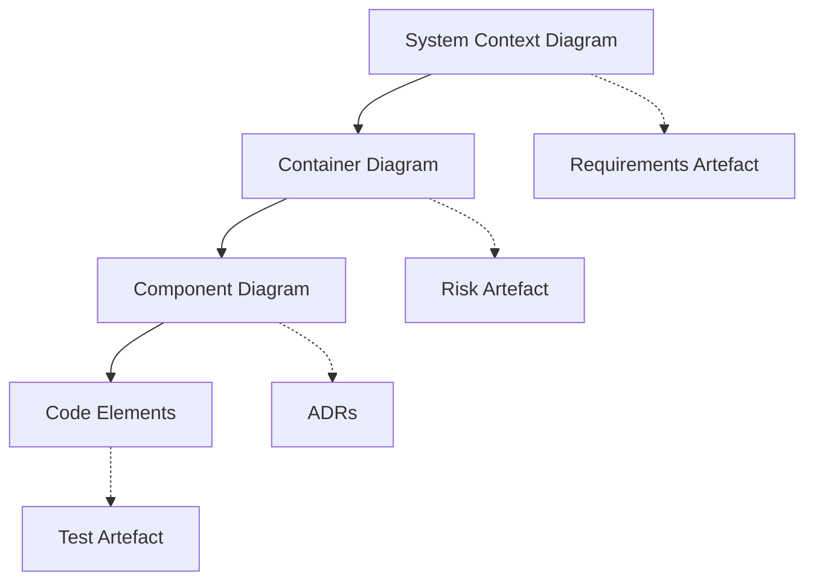
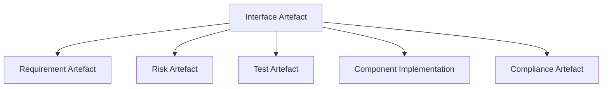

### 10.2 Architectural Practices in Cornerstone: Models, Evolution, and Traceability

#### Introduction

As product delivery unites disparate disciplines—firmware, software, hardware, and systems—architecture becomes the connective substrate that binds intent, implementation, and risk. In the Cornerstone framework, architectural reasoning evolves from static up-front schematics to a living, persistent discipline, manifest through artefacts that are versioned, governed, and integrated into the full delivery pipeline. This section examines the practical codification of Cornerstone's architectural intent for software and firmware development, focusing on the systematic creation, evolution, and traceability of architectural boundary objects, and how these structures underpin the hybrid lifecycle.

#### Architectural Representation: C4 and Structural Artefacts

Traditional architectural documentation—monolithic diagrams, word-processed notations, code comments—has long struggled to scale with system growth, team fluidity, and cross-domain risk. Cornerstone instead advocates artefact structures designed for maximum traceability, federation, and comprehension, both human and machine. At the software and firmware levels, this discipline is exemplified by the adoption and adaptation of the **C4 model**, persistent **Architecture Decision Records (ADRs)**, and doc-as-code schemas that embed architectural decisions within delivery pipelines.

The C4 model (Context, Container, Component, Code) offers a lightweight but robust visual language for representing system architecture at multiple levels of abstraction. Its hierarchical structuring aligns naturally with Cornerstone’s requirement for artefact decomposition and versioned traceability, supporting the navigation from high-level system context down to the internal structure of software modules or subsystems. By governing architecture models alongside code and requirements artefacts, C4 diagrams become boundary objects—living documents that mediate understanding and alignment across roles and disciplines.

Artefact-centric C4 diagrams transition beyond mere pictorial reference. Governed as versioned assets, they embed interface contracts, data flow, and dependency edges, forming the foundation for compliance, dependency management, and risk tracing. Every update—whether the addition of a new service container, modification of a core data path, or decomposition of a component—triggers automation that validates the conformance of implementation to declared architecture, flags traceability gaps, propagates downstream impact, and, through federated links with risk artefacts, can block promotion of unsafe or noncompliant changes.

Diagrammatically, the evolution and linking of C4 model artefacts within a Cornerstone pipeline may be represented as follows:

This structure encapsulates the flow from top-level architecture to test artefacts, and highlights that, in the Cornerstone lifecycle, all architectural diagrams remain versioned, federated, and linked to requirements, risk, and verification states. Regular validation is enforced through pipeline automation, ensuring architectural artefacts and implementation never drift without detected trace or review.

#### Architecture Decision Records: Capturing Evolution and Context

Modern delivery environments, especially those balancing velocity and safety, require architectural knowledge to be explicit, reviewable, and contextualized. **Architecture Decision Records (ADRs)** fulfill this need by rendering the decision process a durable artefact—each record serving as an atomic, persistent rationale for architectural choices and their consequences. Rather than transient design notes scattered across wikis or meeting minutes, ADRs reside within the same version-controlled context as code, requirements, and other core artefacts.

Each ADR captures a discrete decision: the problem statement, considered options, contextual constraints, rationale, and the resultant choice, together with explicit links to driving requirements, risks, or RFCs. The temporal dimension is emphasized—ADRs persist through time, accumulating a living architectural history, and any subsequent amendments are layered, not overwritten, ensuring full traceability of change.

In the context of Cornerstone, ADRs serve as the connective tissue between requirements, risk, and implementation. They document architectural trade-offs, clarify deviation from standards or past precedent, and illuminate the rationale behind potentially contentious or high-risk choices. By embedding ADRs into the artifact workflow, pipeline automation can validate that critical decisions are not only recorded but also referenced by downstream implementation, test, and compliance artefacts.

The practical import of this approach is twofold. Firstly, onboarding and domain transfer are greatly accelerated, as knowledge is structured and persistent. Secondly, risk traceability is inherently supported—if a risk artefact points to an ADR as its mitigation or justification, the system can automatically flag regressions or trigger re-evaluation when associated code or requirements change.

#### Modular Design: Isolation, Substitution, and Responsibility

The principle of modularity—decomposing systems into loosely-coupled, contractually-bound components—remains foundational in hybrid, multi-domain engineering. However, in the context of persistent artefact governance and federated system boundaries, modular design extends from code discipline into architectural, risk, and compliance domains.

Cornerstone operationalizes modularity as both an architectural and a governance strategy. Each module or component is represented as an explicit artefact, with defined boundaries, interface contracts, dependencies, and trace links to upstream requirements and downstream validation. The contract is not merely descriptive but can be validated or even enforced by automation: schema checks, static analysis, interface definition validation, and dependency scans all contribute to a persistent readiness model.

Modularity brings profound implications for risk and change management. Because components are bounded, the scope and impact of a failure, or an architectural change, can be isolated through mechanical analysis of artefact links. This containment accelerates impact analysis, enables partial promotion or rollback, and supports context-driven exception handling in regulated delivery. It also enables parallel evolution: teams can update, validate, and promote changes to a module when boundary contracts remain unchanged, without risking system-integrity regressions.

However, practical challenges persist. Modularity at the artefact level requires discipline in defining, versioning, and enforcing interfaces. Inadequate or ambiguous contracts propagate risk and complicate traceability. Excessive modularization may lead to administrative overhead, diluted ownership, and complex build/test orchestration. Cornerstone’s artefact-centric trace model enables dynamic balancing, surfacing coupling and dependency hotspots for architectural steering while supporting rapid, federated change.

#### RFCs in Cornerstone: Controlled Evolution at Scale

While ADRs capture discrete, local decisions, large-scale systems require a federated mechanism for proposing and integrating systemic or cross-cutting change. The **Request for Comments (RFC)** pattern, borrowed and adapted from internet engineering, is pivotal in Cornerstone for managing structured architectural evolution, especially in open, federated delivery models.

In practice, an RFC in the Cornerstone context is a versioned artefact proposing a change—architectural, processual, or systemic—to the boundary contracts, artefact schemas, or major workflows. Each RFC is subject to review, stakeholder feedback, and explicit acceptance or rejection, tracked as part of the artefact’s lifecycle and governance state. Critically, RFCs are linked bi-directionally to affected requirements, risks, architectural artefacts (including C4 diagrams and ADRs), and implementation artefacts, ensuring that systemic reasoning and decisions are comprehensively captured, discussed, and governed.

This federated RFC process supports several systemic outcomes:

- **Global Visibility:** Impacting change across multiple teams, domains, or product lines is made transparent and discussable across the delivery federation.
- **Structured Traceability:** Every adopted or rejected proposal is a first-class artefact, enabling impact analysis, regulatory audit, or post-incident review.
- **Change Containment:** By linking RFCs to risk and compliance artefacts, unreviewed or high-risk changes can be automatically gated or escalated.

Importantly, while the RFC process formalizes systemic evolution, it must be carefully managed to avoid bureaucratic drag. In Cornerstone, pipeline automation and clear artefact state models are used to eliminate hand-off delays, surface outstanding reviews, and ensure that only unresolved, high-impact RFCs impose gating on delivery flow.

#### Interface Reasoning: Contracts, Compatibility, and Risk

Consistent, unambiguous interface contracts bind software and firmware components, partners, and external systems within and across federated product boundaries. In the Cornerstone framework, interfaces themselves are artefacts: versioned, explicitly specified (often as schema or protocol definitions), and trace-linked to requirements and risks.

The discipline of interface reasoning extends from static syntax (APIs, hardware buses, protocol messages) into behavioural and risk semantics. Each contract conveys not only shape but also expectations—timing constraints, error modes, performance boundaries, and compliance requirements. These interface artefacts are governed alongside code, test, and architectural models, and are subject to machine validation as part of CI/CD: for example, through automated schema validation, contract tests, simulation, and formal verification where the domain requires.

Diagrammatically, the structural role of interface artefacts in federated traceability can be depicted as:

This structure reflects the multi-dimensional reasoning: a change in an interface artefact mechanically triggers cross-linked validation and, where appropriate, risk reassessment, compliance review, and implementation/test update. This persistent integration eliminates "silent" drift—where interface reality diverges from contractual specification unnoticed—and enables rapid, systemic de-risking during change.

#### Mechanisms for Architectural Traceability and Automation

Cornerstone’s artefact governance model operationalizes architectural traceability through automation. Every architectural artefact—diagrams, decisions, interfaces—holds state, version, and explicit trace links. A change in any artefact propagates through CI/CD pipelines: static and dynamic validation confirms trace coverage, implementation conformance, and test alignment. Should gaps or regressions emerge (for example, a new container module not covered by integration tests, or an interface version change not reflected in compliance artefacts), pipeline gates block promotion, surface actionable feedback, and, where policy requires, escalate for review.

Supporting this at scale demands integrated tooling. Doc-as-code approaches—using markdown, structured data schemas (YAML, JSON), and code-centric documentation—enable seamless integration between human-readable documentation, automation, and code artefacts. Version control systems (such as Git) not only anchor artefact states in delivery history but facilitate peer review, impact analysis, and systemic rollback. Schema validation and code generation may further reduce error and repetitive work, binding architectural intent to executable reality.

Practical realities must be managed: achieving robust traceability requires strict discipline in artefact definition and lifecycle management. Artefact schemas must be both expressive and evolvable. Automation is only as effective as the coverage and relevance of the defined rules; over-constraint or under-specification both lead to failure modes—either process deadlock or invisible architectural drift. Moreover, not all architectural reasoning can be mechanized: human oversight remains essential in ambiguous, novel, or high-stakes change.

#### Organisational Implications and Cultural Integration

Implementing the above practices at scale affects organisational design as much as it does technical execution. Architectural artefacts cut across functional and disciplinary boundaries, and accountability for their currency, traceability, and accuracy becomes a distributed concern. In the federated governance model advocated by Cornerstone, roles such as Architectural Stewards are empowered but not isolated: all teams contribute artefact states and evidence, and all changes are surfaced for wide review and risk assessment.

This collective stewardship necessitates cultural adjustment. Teams accustomed to informal or code-centric architectural reasoning must acclimatise to structured, persistent artefact capture and linkage. The initial overhead—learning new tools, defining and reviewing artefact contracts, and integrating automation into existing workflow—must be weighed against the durable gains in velocity, reliability, and auditability.

Cornerstone’s approach supports incremental adoption: artefact schemas and tooling can be introduced progressively, federated boundaries defined first at major system or subsystem interfaces, then recursively decomposed. Early wins—such as elimination of architectural drift, reduced onboarding time, or automatic detection of risky changes—reinforce adoption and maturity.

#### Trade-offs, Constraints, and Practical Constraints

The Cornerstone architectural approach is not without trade-offs or contextual constraints. Enforcing strong artefact discipline may conflict with exploratory, early-stage work; in such scenarios, lightweight or provisional artefact states can be declared, allowing rapid iteration while signalling unresolved structure or risk. Excessive modularisation or over-specification—particularly where cross-domain interaction is dense—may introduce friction, dilute end-to-end ownership, or hinder emergent systemic optimisation.

Resource investment in tooling, schema governance, and training should be factored into project and organisational planning. Some complexity is irreducible: safety-critical or regulated environments may mandate exhaustive decision and trace artefact capture, while commercial or startup contexts might tolerate leaner variants. Nonetheless, even in lightweight form, persistent, federated architectural artefacts provide resilience against system drift, accidental design regression, and compliance failure.

#### Conclusion

Architecture in the Cornerstone lifecycle is manifest as a living, persistent, and federated web of artefacts—structured through C4 diagrams, ADRs, modular contracts, RFCs, and interface specifications—all governed as part of the operational delivery pipeline. These artefacts collectively encode decision, rationale, structure, risk, and compliance, binding implementation to architectural intent. Their persistent, versioned, and traceable nature underpins both high-velocity agile delivery and robust, continuous audit readiness.

Achieving this requires organisational commitment, disciplined artefact practice, and investment in automation and cultural change. The benefits—transparent architectural evolution, risk-aware delivery, and systemic resilience—become especially pronounced at scale, or in the face of regulatory or cross-domain complexity. In hybrid delivery environments, where software and firmware are the connective tissue of integrated products, such rigor is not mere formality but the structural foundation of safe, adaptive, and sustainable engineering.