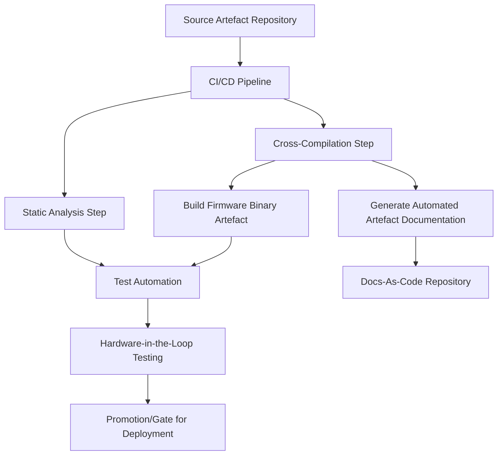
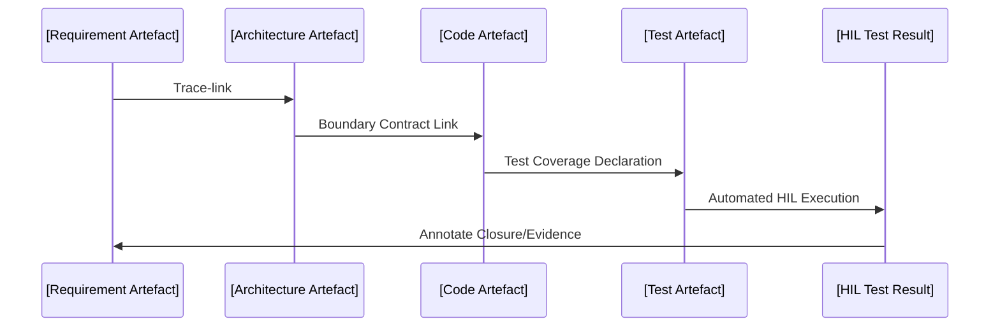

### Practical Iteration for Embedded Systems: CI, Static Analysis, and Artefact Flow

#### Introduction: Embedded Systems in the Cornerstone Lifecycle

Within the Cornerstone framework, software and firmware development are defined not primarily by technology choices, but by a philosophy of artefact-centric, federated product engineering. This approach is especially significant when dealing with embedded systems, where system constraints, integration complexity, and regulatory scrutiny impose non-trivial demands on the development lifecycle. Unlike purely software products, embedded systems reside at the interface between information and physical domains, compounding risk, challenge, and the importance of sustained traceability. In this context, iterative development, continuous integration (CI), and static analysis become pillars—not only of productivity, but of compliance and resilience.

#### Iterative Development in Embedded Contexts

Embedding an iterative mindset into embedded systems work demands reconciliation between agility and caution. The high cost of deployment, dependency on hardware, and irreversibility of physical failure mean that each software iteration must be treated as an artefact of record, subject to rigorous traceability and gating.

In conventional software endeavors, iteration can often proceed with minimal ceremony, and rapid deployment cycles are enabled by the fungibility of virtualized environments. In embedded systems, however, each iteration must address cross-domain concerns—hardware abstraction, real-time constraints, and often safety or regulatory requirements. As such, iteration is realized not simply as a rapid cycle of feature addition, but through intentional progression of artefact readiness states, reviewed and promoted within a federated governance model.

Artefacts underpin each iterative step: requirements and interface contracts evolve in tandem with implementation artefacts (source code, firmware binaries), test specifications, and risk analyses. Each iteration, regardless of scale, must ensure that versioned artefacts remain self-consistent, traceable, and auditable, preserving an unbroken chain of rationale from requirement through to operational implementation. This discipline is enforced by workflow automation within CI and by artefact state tracking as prescribed in the Cornerstone framework.

#### Continuous Integration: Building the Embedded System as Artefact

Continuous Integration (CI) in the context of embedded development is more than a build server. It is the mechanism by which federated artefacts are synthesized, validated, and promoted. The unique constraints of embedded platforms challenge standard CI philosophies: deterministic builds, cross-compilation, hardware-in-the-loop (HIL) testing, and integration with specialized toolchains are recurring realities.

At the core, every source artefact—code, configuration, interface definitions—must be compiled in an environment that is itself versioned and reconstructable. Containerization and toolchain pinning are essential; the CI pipelines themselves become governed artefacts. When cross-compiling firmware, for instance, the cornerstones of deterministic artefact production are provided through reproducible build recipes, explicit compiler versioning, and managed build orchestration. The build pipeline is required to produce binary artefacts—firmware images, bootloaders, configuration blobs—that carry embedded metadata pointing back to source artefacts, requirements, and architectural contracts via traceable links.

The following diagram illustrates a canonical CI pipeline in the embedded domain, aligning with Cornerstone artefact flow:

This diagram emphasizes that build, analysis, documentation, and hardware verification are federated under a single artefact flow, each step producing artefacts that are versioned, persistent, and trace-linked. Notably, quality gates—through static analysis, automated test, and HIL—are embedded early and enforced mechanically.

#### Static Analysis: Continuous Contract Validation

Static analysis—both in the conventional sense (linting, MISRA checks, etc.) and as artefactual contract validation—is a non-negotiable layer in Cornerstone’s federated lifecycle for embedded systems. It is not merely a quality step, but a mechanism to ensure persistent conformance to interface, architectural, and risk artefacts.

In embedded development, static analysis provides multiple roles:

- **Coding Standard Enforcement**: Automated linting for adherence to standards such as MISRA C for safety-critical embedded code, or AUTOSAR, is enforced within the CI pipeline. Each violation is linked to artefacts—requirements, risks, or waivers—preserving a documented chain of rationale for exceptions.
- **Interface Consistency**: Static analysis validations ensure that interface artefacts (for instance, protocol definition files or hardware abstraction modules) remain congruent across code, documentation, and test specifications. Gating mechanisms in the pipeline fail builds on contract drift, requiring explicit review and artefact update.
- **Control Flow and Static Contracts**: Tools that analyze control flow, data races, and memory safety provide early insight into implementation risks, surfacing findings that must be reconciled with risk and requirement artefacts. In high-assurance domains, these results are linked to compliance artefacts to demonstrate due diligence and regulatory conformance.

An additional dimension is introduced by model-based static analysis: for example, tools like Simulink Model Advisor in model-driven control systems, or formal property checkers for safety properties in low-level firmware. These outcomes, too, are artefacts—persisted, versioned, and linked to architectural contracts. The implication is that static analysis is broadened beyond code quality to become a central pillar of traceable, automatable system validation.

#### Integration Points: Artefacts Linking Hardware, Firmware, and Test

Embedded systems rarely operate as isolated entities. Software and firmware artefacts exist within a federation of hardware descriptions, mechanical constraints, and external interface artefacts. The integration points where these domains meet are critical in the Cornerstone lifecycle. Each integration point is treated as a boundary artefact—explicitly defined, versioned, and trace-linked to both upstream and downstream artefacts.

A practical example is the handoff from the electrical CAD (ECAD) artefact for a microcontroller pinout to the firmware’s board support package (BSP): this linkage is enforced through an interface specification artefact, which is itself validated through automation in the build and test pipeline. Any schematic change is required to propagate via an RFC artefact, triggering downstream checks on BSP and associated test artefacts. The federated artefact flow not only reduces integration risk, but also allows for scalable change management, as all dependencies are visible and mechanically enforced.

Another integration example concerns the inclusion of external libraries or middleware. In many embedded projects, RTOS (Real-Time Operating System) artefacts, third-party protocol stacks, or cryptography modules may originate from external sources. Within Cornerstone, inclusion is enacted via artefact registration—every dependency must be referenced, versioned, and linked to its own architecture, risk, and compliance artefacts. This explicit artefact linking allows for effective impact analysis and federated control across the extended product boundary.

#### Hardware-in-the-Loop (HIL) and Test Artefact Federation

Testing within embedded systems cannot stop at simulation or unit testing. The physical constraints and real-world dynamics of embedded deployment demand that test artefacts span from emulated environments to in situ hardware-in-the-loop (HIL) apparatus. Within Cornerstone, automated test artefacts are first-class citizens—described, versioned, and promoted in the same lifecycle as code and architecture.

A federated HIL test artefact links to board revisions, firmware builds, configuration artefacts, and expected behavioural models. Automation pipelines orchestrate test execution, logging results as immutable artefacts referenced by requirement IDs, risk justifications, and deployment candidate tags. These test results are not merely pass/fail records, but annotated artefacts that inform both compliance reports and architectural risk closure.

Organisationally, this federation enables engineers from disparate subdomains—firmware, test engineering, hardware design—to collaborate upon a unified, artefact-governed information domain. Each test point, stimulus table, and expected response is an artefact entry, with CI enforcing completeness and traceability across release candidates.

The following Mermaid sequence diagram illustrates the federated artefact validation from requirement through HIL testing:

This diagram demonstrates how artefact states and trace links drive a closed-loop system, enforcing compliance and supporting audit in regulated environments.

#### Practical Realities: Toolchain Complexity and Lifecycle Constraints

Adopting artefact-centric continuous integration in embedded domains introduces distinct complexity. Toolchains and hardware dependencies are often bespoke, subject to licensing constraints, and tightly coupled to hardware revision states. Reproducible builds demand not only deterministic compilers but also versioned hardware abstraction libraries, simulation models, and even device programming scripts.

CI infrastructure must be adapted to support isolated hardware provisioning—physical test jigs, multiplexed device racks, or virtualized device simulators. Artifacts describing these resources (jig configuration files, simulation environment descriptors) are themselves governed and versioned. In safety- or security-critical workflows, air-gapped pipelines or cryptographically signed artefact promotion become required, adding further complexity to the automation layer.

A common trade-off emerges in balancing the velocity of iteration against the depth of end-to-end artefact verification. Fast feedback cycles are maintained by enforcing that early pipeline stages (static linting, unit test) run rapidly and with low hardware dependency, deferring hardware-in-the-loop and full system verification to scheduled or batch phases. However, this tiered gating must remain strictly trace-linked and fully auditable, or the artefact federation risks fragmentation.

#### Failure Modes: Artefact Drift, Contract Breach, and Risk Regressions

Despite the rigor of the federated artefact model, practical delivery may encounter failure modes unique to embedded systems: 

- **Artefact Drift**: Hardware or firmware interfaces may intentionally or inadvertently drift from their contractual specification, due to schematic updates, late software additions, or necessity-driven tuning. Detection relies upon automation of interface contract validation and trace link coverage. Missing or stale artefact linkages are flagged as gate failures in the pipeline, enforcing review and reconciliation.
- **Contract Breach**: Undocumented changes—especially at hardware/firmware boundaries—can lead to latent incompatibility or field failures. The Cornerstone discipline mandates that contract artefacts (interface specs, protocol definitions) are mechanically enforced and updated, with change propagation governed via RFC and ADR artefacts.
- **Risk Regressions**: Each artefact adjustment carries potential for risk regression, especially if validation artefacts (test cases, safety arguments) are not synchronously updated. The federated traceability of Cornerstone mitigates this by requiring every change to a risk-linked artefact (e.g., modification of a memory safety mechanism) to trigger validation cascade and artefact closure evidence.

Beyond technical enforcement, adherence is a matter of cross-team discipline—process facilitators and architectural stewards must sustain a culture of artefact completeness, federated review, and continuous refinement.

#### Trade-Offs and Lifecycle Variations

There is an unavoidable trade-off between upfront governance and iterative agility. As artefact discipline tightens, initial development may experience friction—especially in exploratory or high-innovation phases, where final contracts are emergent and requirements in flux. The Cornerstone approach accommodates these realities via provisional artefact states: artefacts may be “draft”, “review”, or “provisional” with explicit readiness criteria. Workflow automation can prioritize fast iteration for provisional states while enforcing progressive hardening and trace completion as artefacts mature toward release readiness.

Variations by domain and scale are likewise common. In high-assurance or regulated products, artefact completeness and static checks may be enforced as gates for every iteration. In early research and prototyping, federated artefacts may be tracked informally, solidifying only as convergence occurs. The lifecycle is thus adaptable, but always traceable, with each artefact state explicitly recorded.

#### Organisational Implications: Collective Stewardship and Flow

Sustaining Cornerstone’s federated, artefact-centric discipline requires organisational adaptation. Teams may initially resist what is perceived as overhead or bureaucracy—yet, as artefact completeness increases, onboarding accelerates, collaboration improves, and review becomes evidence-based rather than opinion-driven.

CI and static analysis pipelines support this by automating administrative burden: artefact linkage, coverage checking, and documentation generation become default outputs of the developer’s workflow, not parallel tasks. Gate failures surface as concrete artefact traceability issues, not ambiguous quality metrics, thereby aligning technical expectations with regulatory and stakeholder needs.

Crucially, collective stewardship—where no single role owns or gates artefact evolution—fosters a culture in which architectural and test knowledge is federated, not isolated. This facilitates more robust flow across handoffs, reduces the siloing often seen at hardware/firmware boundaries, and mitigates the risk of institutional knowledge loss.

#### Conclusion: Adaptive Iteration in the Artefact-Centric Lifecycle

Embedded system development, realized through the Cornerstone framework, becomes not a linear progression of handovers, but an adaptive, federated web of evolving artefacts, woven through disciplined iteration, automation, and traceable validation. Iterative practices are underpinned by continuous integration architectures that integrate static analysis, boundary-contract gating, and HIL test automation as default, always-on controls.

The governance of this federated artefact ecosystem enables teams to adapt the degree of rigor to business and technical context, scaling compliance and assurance as readiness advances. By treating every boundary—hardware interface, protocol contract, configuration file—as a versioned, automatable artefact, Cornerstone transforms the risk-laden realities of embedded delivery into a manageable, continuously improvable system.

The practical outcome is a resilient delivery pipeline, in which embedded software and firmware engineering benefit from the same transparency, auditability, and flow as modern software—while remaining grounded in the unique constraints and demands of physical-domain integration. The approach both enables and demands a culture of collaborative stewardship, sustained by automation and clear governance, providing a genuine cornerstone for integrated product development.