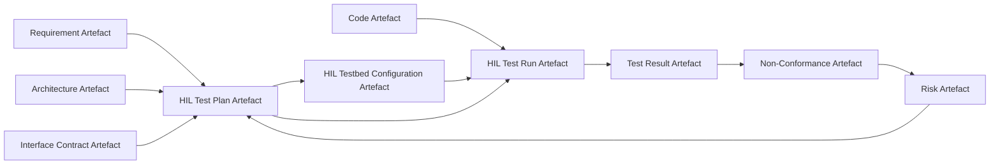

### Verification and Validation as Federated Artefact Flows

Within the Cornerstone framework, the discipline of verification and validation (V&V)—encompassing unit tests, integration tests, system tests, and hardware-in-the-loop (HIL) tests—advances from a supporting practice to a first-class, federated artefact flow. This shift reflects the artefact-centric philosophy: every test, test result, and test plan is versioned, trace-linked, and governed with the same rigour as architectural and code artefacts. Ensuring that evidence of correctness is not merely generated and consumed within isolated teams, but instead persists as an auditable, automated web, is foundational to Cornerstone’s proposition of compliance, transparency, and change resilience.

#### The Artefact Lifecycle of Tests

In practice, the treatment of tests and their artefacts mirrors that of requirements or architecture: each is maintained “as code”—machine-readable, version-controlled, and integrated into continuous integration (CI) pipelines. Tests become immutable records at a given revision. Test definitions, fixtures, data, and results are systematically tied by trace links to the architectural elements, implementation artefacts, risk mitigations, and requirements they validate or verify. This intentional redundancy ensures that change impact radiates automatically: when a requirement or interface evolves, automation surfaces and, where possible, regenerates or invalidates the affected test artefacts, enforcing systemic coherence.

#### Unit Testing: Isolating Functional Atomicity

Unit testing establishes the lowest, most granular tier of verification within Cornerstone. Unit tests are defined as artefacts at the scope of individual modules, components, or functions, each governed by boundary contracts specified in code and described at the C4 container or component level. The federated approach dictates that unit tests are:

- Persistently codified alongside the implementation, adopting the same versioning and CI enforcement.
- Trace-linked to boundary definitions, coding standards, and, crucially, to higher-level requirements wherever such linkage is meaningful or prescribed by regulatory need.
- Executed automatically at every code change, with results ingested into a persistent test evidence artefact, itself versioned and reviewed within the wider artefact registry.

Test cases may be generated via static analysis, property-based frameworks, or developer-authored scripts. Crucially, exceptions, limitations, or code contracts that cannot be fully exercised due to hardware or resource constraints are surfaced as part of the federated risk artefact model.

As with all artefacts in Cornerstone, conformance is not purely binary; provisional and in-progress states enable teams to gate promotion of features or refactorings based on unit test coverage, evidence, and readiness. This promotes visibility and disciplined negotiation of technical debt.

#### Integration Testing: Assembling Federated Contracts

Integration testing ascends from the isolation of unit boundaries to the validation of interactions across defined interfaces. Within the Cornerstone model, integration tests are formal artefacts that validate adherence to contract at architectural and implementation junctions. These typically exercise:

- Communication paths, serialization/deserialization, and error handling between two or more compositional artefacts (e.g., a protocol stack interacting with a hardware abstraction layer).
- Adherence to interface specification documents, with violations automatically detected by schema validation or runtime assertion.
- Federated risk mitigations, such as timeouts, concurrency interactions, and resource contention, especially in resource-constrained embedded environments.

Here, the artefact-centric view provides three core benefits. Firstly, interface contracts—expressed in Interface Definition Language (IDL), SVD files, or documented as C4 component boundaries—are themselves versioned artefacts, automatically validating if changes break downstream integrations. Secondly, integration test results are systematically versioned and trace-linked to the exact versions and configuration of all participating artefacts. Thirdly, test failures escalate risk artefacts mechanically, enforcing the discipline of observed evidence over trust in handoffs.

Integration test artefacts are promoted in the CI flow as contractual evidence: features, fixes, or refactorings that threaten established integration contracts surface immediately, with traceable justification needed for any breakage or exception.

#### System Testing: Verifying End-to-End Behaviour

System testing constitutes the orchestrated verification of the product as a bounded whole, reflecting not only correct operation under a defined set of requirements, but also satisfaction of user-facing, regulatory, or business-driven non-functional criteria. In the artefact model, system tests are designed as high-level, federated scenarios tied both to requirement artefacts—such as use-case specifications or product goals—and to architectural boundaries as defined in the C4 Context and Container models.

A critical aspect is the bi-directional traceability from system-level requirements down through their decomposition, enabling any requirement change to automatically flag or regenerate the necessary system-level test scenarios. These tests frequently cross functional domains: in an embedded system, they may represent workflows that couple firmware, control logic, embedded Linux applications, or even cloud interfaces. Such complexity is codified as system test artefacts, themselves versioned and federated across multi-disciplinary teams.

System test results serve as high-level compliance evidence. In regulated environments (e.g., automotive, industrial controls), artefacts must fulfil standards such as ISO 26262, IEC 61508, or FDA design controls, each prescribing explicit traceable evidence linking tests to mitigated hazards or requirements. Cornerstone’s artefact model enables automated generation, review, and promotion of such evidence within the persistent system-of-record, easing audit and compliance burdens.

#### Hardware-in-the-Loop (HIL) Testing: Unifying Physical and Logical Evidence

Nowhere is the Cornerstone philosophy more challenged—and more beneficial—than in the domain of hardware-in-the-loop (HIL) testing. HIL sits at the boundary of software, firmware, and physical systems, providing a means not just to execute logic in situ, but to validate functional correctness, timing, and fault responses against real hardware or high-fidelity emulation.

HIL test artefacts are distinctive in several dimensions:

- **Test Scenarios** encapsulate not only software inputs but hardware stimulus, sensor emulation, and environmental conditions.
- **Physical Configuration Artefacts** define the hardware and testbed topology, with versioned records of device firmware, board revisions, instrumentation, and rack assignments.
- **Result Artefacts** must capture both digital and analog outputs, sensor readings, timing diagrams, faults, and logs, all trace-linked to the hardware and software configurations under test.

Automation is essential; every run is a federated artefact in its own right: uniquely identified, version-stamped, and trace-linked to the requirements, risks, and architecture validated therein.

##### HIL Test Artefact Lifecycle

In practice, the HIL test lifecycle under Cornerstone proceeds as follows: a HIL test plan artefact is created, itself referenced by requirement, risk, or architectural decision artefacts that demand hardware-validated evidence. Test environment setup is registered as a versioned configuration artefact, capturing hardware, firmware, calibration, and sometimes even cabling. Test execution is orchestrated via CI integration, synthesizing stimulus-responses and capturing result artefacts that include logs, diagnostic traces, and DLT (Diagnostic Log and Trace) data where applicable. Failures and non-conformances are promoted to artefact status, with risk artefact updates and cross-team notifications enforced via automation.

##### Diagram: Federated Artefact Flows for HIL Testing

The federated and trace-linked nature of HIL test flows, and their interaction with other artefact types, can be represented as follows:

This model enforces that each HIL test is not an isolated episode but a deterministic, traceable event in a living artefact web, ensuring both provenance and accountability.

#### Automation, Gating, and Evidence Promotion

The essential distinction of the Cornerstone approach is that V&V artefacts are not ephemeral, nor are they local to a team or discipline; they form an auditable backbone that powers automation, traceability, and regulatory conformance across the product lifecycle.

Continuous Integration (CI) serves as both the orchestrator and arbiter of all test artefact flows. At every push, merge, or promoted revision, the CI engine ingests federated artefact states: it parses versioned test plans, executes the requisite unit, integration, system, and HIL tests, and ingests their outcome into test evidence artefacts. Each artefact’s lifecycle state—provisional, ready, deprecated, superseded—is enforced by pipeline automation. Gating occurs at promotion points: commits or merges that fail to satisfy the agreed artefact readiness criteria (e.g., coverage thresholds, critical scenario pass/fail, regression impact) are automatically blocked, raising exceptions as artefacts which are then adjudicated through federated stewardship.

This rigorous automation model yields significant practical benefits: risk regressions and test collateral drift are surfaced mechanically, not reactively; cross-team dependencies are mapped by federated artefact readiness, not informal communication or manual checklists; compliance and audit readouts can be generated as consistent, artefact-driven narratives without bespoke reporting.

#### Traceability, Change Management, and Auditability

The federated artefact discipline delivers operational traceability at a depth unparalleled by legacy siloed approaches. For each requirement, risk, architectural feature, or interface, the trace web automatically surfaces all verifying or dependent test artefacts in their current lifecycle state. When a requirement is refined, a risk refactored, or an interface modified, automation prompts mapping to affected test artefacts—validating, updating, or orphaning tests as dictated by the federated schema.

Change management is transformed from a burdensome document-centric workflow to a dynamic, CI-validated artefact flow: proposed revisions (e.g., via RFCs or ADRs) must include impact analysis artefacts, and the test evidence chain becomes self-validating—evolving in step with the living product system.

Auditability, a key requirement in regulated and safety-critical domains, is likewise automatic: every test artefact, plan, script, and result is versioned, immutable at each release milestone, and traceable to the requirements and risks it substantiates. Audit trails are generated by traversing the artefact registry at each point in time—enabling precise, reproducible compliance narratives in line with standards such as ISO 26262, DO-178C, or IEC 62304.

#### Trade-offs, Failure Modes, and Practical Considerations

Such discipline is not without its trade-offs and operational burdens. Maintaining every test as a versioned artefact imposes tooling demands, especially with long-lived branches or provisional states. Test duplication or bloat can accumulate if artefact lifecycle management is neglected, occasionally leading to artefact drift detectable only by static cross-reference checks or periodic federated reviews. Automation infrastructure itself becomes a source of risk: schema breaks, pipeline failures, or toolchain upgrades may block artefact advancement until remediated.

Engineers must calibrate the granularity and readiness criteria of test artefacts to product context; excessive formality can slow iteration, while insufficient traceability undermines the compliance and integration value of the framework. In legacy retrofit scenarios, import and adaptation of unstructured test artefacts may require staged migration to conformant artefact schemas. Coordination overhead can rise temporarily in multi-disciplinary teams as common standards and artefact states are negotiated.

Yet the systemic payoff—early exposure of integration risk, automated change propagation, durable compliance evidence, and team alignment—is both practical and strategic. Failure modes such as “invisible drift” in test coverage, “contract breach” at system interfaces, or “risk regression” after non-incremental platform changes are rendered tractable by this enforced, federated approach.

#### Federation of Test Evidence Across Domains

Cornerstone’s contribution is not only technical but also organisational: test artefacts become shared reality, not private collateral. System teams, compliance officers, and product owners operate on the same artefact web as embedded developers and test automation engineers. This flattened, federated evidence network supports distributed development (onsite or remote), secure handover between lifecycle phases (development, integration, verification, release), and transparent participation by regulatory or customer stakeholders.

Artefact-centric CI automation enables even cross-organisational compliance. For example, in safety- or security-assessed environments, external auditors can be granted artefact read access with deterministic, time-stamped evidence of test completeness, coverage, trace links, and exceptions—without interrupting the delivery flow. Deviations, waivers, or incomplete test cases are themselves artefacts, gating readiness and driving collaborative negotiation of risk.

#### Summative Reflection

Testing, in the context of Cornerstone, is irrevocably transformed from a parallel discipline to a core federated artefact flow. Versioned, traceable, automated test artefacts become the backbone for not only verification and validation, but for product governance, change management, compliance, and sustained delivery flow. The discipline, though initially intensive, brings resilience against drift, audit gaps, and costly late-cycle integration failures—and aligns the rapid iteration demanded by modern product engineering with the evidence-heavy rigour dictated by safety, quality, and market expectations.

By embedding V&V activities at every artefact boundary, and orchestrating their lifecycle through CI automation and persistent traceability, Cornerstone delivers not just confidence, but a living, systematised record of product correctness—establishing a robust foundation for scaling, auditing, and evolving integrated products within and across disciplinary boundaries.