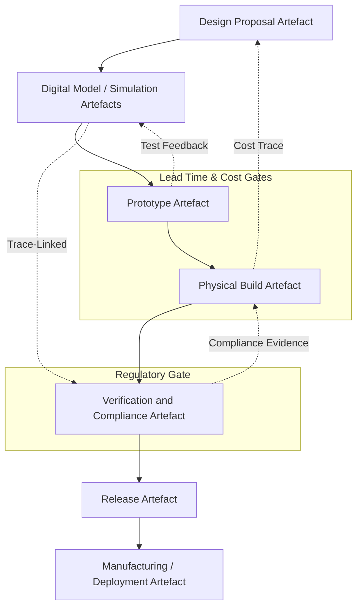

### Navigating Lead Times, Costs, and Regulatory Constraints in Physical Product Domains

#### Introduction: The Distinct Realities of Physical Domains

While software and firmware disciplines are distinguished by rapid iteration cycles and relatively unconstrained change propagation, the hardware and mechanical realms operate under a fundamentally different set of physical, temporal, and regulatory laws. In transitioning Cornerstone from digital to physical domains, understanding and managing the realities of lead times, costs, and compliant delivery becomes crucial. These factors consistently influence the viability of iterative development, artefact readiness, and the overall pace of innovation. Unlike purely digital artefacts, hardware and mechanical artefacts manifest not only as specifications or models, but also as physical instantiations, prototypes, tooling, and ultimately manufactured products—each introducing tangible constraints that shape workflow design, risk tolerance, and governance.

#### Lead Times: The Rigid Pace of the Physical World

The most foundational difference between digital and physical artefacts arises from lead time. In software-centric workflows, changes can propagate into production within minutes or hours, thanks to high automation and near-zero reproduction costs. By contrast, hardware and mechanical artefacts are subject to elaborated supply chains, fabrication cycles, and sometimes international transit. Design changes frequently entail waiting periods for component procurement, board fabrication, mechanical manufacturing, or regulatory re-qualification.

Lead time in hardware is not uniform. Short-cycle processes, such as rapid prototyping using additive manufacturing or quick-turn PCB houses, can compress timeframes into days, facilitating more parallel agile workflows. However, production-scale runs involving custom tooling, injection moulding, advanced component procurement, or environmental testing extend lead times into weeks or months. In regulated environments—such as automotive or medical device development—these cycles are further elongated by mandatory certification or conformance test windows.

In the context of Cornerstone, this demands that lead times become explicit, first-class artefacts within the system engineering process. Proposals for change must not only update digital artefacts but also encode temporal commitments and gating criteria that reflect the real-world delays inherent in moving from intent to physical instantiation. Impact analysis must therefore incorporate both technical and temporal dependency chains—enabling accurate risk assessment, resource planning, and compliance projection. This elevation of lead times as artefact properties enforces discipline: teams can reason concretely about the pacing of integration, validation, and rollback under physical constraints.

#### Cost Dynamics: Irreversibility and Batch Economics

Cost in physical engineering is inextricably bound to the realities of materials, fabrication runs, tooling cycles, and operational overhead. In digital systems, the marginal cost of reproducing artefacts is minimal; however, in hardware and mechanical domains, each iteration—whether a prototype run or a change in production tooling—incurs significant, often irreversible, financial commitments. For example, modifications to an injection-moulded part may require fabricating a new steel mould, potentially costing tens of thousands of dollars and weeks of lead time, while a new electronic design might entail a non-recurring engineering (NRE) charge for component requalification, and scrapping pre-existing inventory.

The economic model for hardware and mechanical production introduces strong incentives for batching changes, managing configuration variants rigorously, and favouring simulation or emulation over physical builds wherever feasible. Iterative development remains possible but must be managed within a hybrid cadence: simulation- and prototype-driven validation at lower cost and risk, escalation to physical build only when design maturity and readiness criteria are satisfied. This staged progression also aligns with Cornerstone’s artefact readiness states, where development artefacts progress through provisional, review, approved, and released states in synchrony with physical build commitments.

Cost control further necessitates disciplined obsolescence management and change tracking. Artefact traceability within Cornerstone must connect not only to the technical rationale for a change, but also to its economic implications—supporting roll-forward or rollback, inventory impact analysis, and total cost traceability. Automation can assist in exposing these cost dependencies, providing stakeholders with early warning of high-impact changes and enabling explicit cost gating at every lifecycle stage.

#### Regulatory and Compliance Constraints: Governing Change and Conformance

Regulatory frameworks such as ISO 9001 (quality management), ISO 13485 (medical devices), ISO 26262 (functional safety for automotive), and IEC 61508 (safety for electrical/electronic systems) impose rigorous engineering process controls, documentation standards, and conformance requirements in physical product domains. Unlike in software, where regulatory compliance is often limited to specific use cases, nearly all physical products destined for safety-critical or mass-market deployment must traverse an explicit certification path.

Compliance regimes introduce several non-negotiable artefact requirements: detailed documentation of design rationale, version-to-version traceability, evidence of testing (including environment, configuration, and fixtures), and immutable records of change review and approval. Regulatory reviews demand not only that every artefact can be surfaced on demand, but that the mapping between requirements, verification plans, risk assessments, and test evidence is verifiably complete and consistent.

Within Cornerstone, this necessitates that compliance-critical artefacts—such as FMEAs (Failure Modes and Effects Analyses), risk registers, trace matrices, and regulatory submissions—are federated peers to architectural, implementation, and test artefacts. Their presence in versioned, machine- and human-readable forms, linked to their associated technical artefacts, enables automation to provide real-time compliance coverage and audit readiness. The system must also support gated promotion, with artefacts passing through distinct regulatory review and approval stages before they become eligible for release or physical build.

This compliance landscape enforces a particular discipline in configuration management: every physical build must be reproducible from a fully versioned set of artefacts, with explicit records of every component, material, process, and step involved. Any deviation—from component substitutions to process tweaks—must trigger trace-linked artefact updates, ensuring that compliance and recall obligations can be met without ambiguity.

#### Interdependencies and Propagation: Artefact Lifecycle Realities

An essential architectural implication of these constraints is the tight interdependency between digital and physical artefact readiness. Within Cornerstone, this is rendered explicit: a design proposal impacting code, firmware, and hardware must advance all affected artefacts through their respective revision cycles while respecting the slowest mover—typically the physical artefact. For example, a software feature that depends on a new sensor interface cannot progress beyond a provisional state until the requisite hardware artefact has cleared its engineering build and qualification gates.

The concept of “federated readiness” thus becomes critical. The artefact web presents the current state, dependency tree, and readiness of each constituent element. Automated CI engines can surface when downstream artefacts become “blocked” by upstream delays (e.g., awaiting prototype completion, conformance test pass, or regulatory sign-off), reducing the risk of “design drift” and wasted rework.

This federated structure also enables traceable impact analysis across lead time and cost boundaries. When cascading changes arise—driven by failure, obsolescence, or regulatory revision—the system can mechanically enumerate every impacted artefact, gating each on feasibility, economic impact, and compliance pathway. This prevents the proliferation of “invisible” technical debt often encountered in legacy, untraceable BOMs or patchwork document systems.

#### Modelling Flows: Artefact Progression with Physical Constraints

The interplay between artefact states, lead time, cost, and regulatory milestones can be meaningfully illustrated through a federated artefact promotion flow. Here, each artefact—digital or physical—advances through readiness states only as its dependencies and constraints are satisfied.

This flow articulates how each stage is gated by both the artefact’s intrinsic readiness and contextual externalities—such as accumulated lead time, incurred cost, and regulatory sign-off. Back edges represent feedback and traceability, enforcing mechanical closure of compliance loops and preventing drift.

#### Trade-offs, Failure Modes, and Engineering Discipline

Attempting to “shift left” in the hardware and mechanical disciplines—pushing integration, validation, and readiness assessment earlier in the lifecycle—must be balanced against the realities of cost, physicality, and regulatory inertia. Overly aggressive iteration in physical build stages can quickly exhaust budgets and overwhelm supply chains, while underinvestment in simulation, digital modelling, and artefact discipline can result in latent design flaws or compliance gaps only exposed during expensive physical runs.

Common failure modes include artefact drift (where documentation, models, and physical artefacts diverge), “ghost artefact” inventory (where physical assets are built to outdated specifications), or compliance regressions (where ad-hoc change propagation breaks certification traceability). The federated, artefact-centric Cornerstone model seeks to counter these risks via automation, enforced traceability, and a cultural commitment to artefact readiness discipline.

Organisational implications are pronounced. Teams must build shared fluency in federated artefact management and evidence-driven review, often merging traditionally siloed functions—mechanical, electrical, software, and compliance—into collaborative delivery networks. Here, CI pipelines not only build and test digital artefacts but also govern physical build readiness, coordinate test and compliance artefact promotion, and surface risk and dependency states to all stakeholders.

#### Conclusion: Federating Physical Constraints with Digital Rigour

Integrating hardware and mechanical domains into Cornerstone’s federated artefact model requires more than new tools and schemas—it demands a fundamental rethinking of how physical realities shape all aspects of engineering workflow. Explicit modelling of lead times, costs, and regulatory constraints as first-class artefact properties and dependencies enables systematic, auditable, adaptive product development at scale. By making the implicit explicit, and federating both physical and digital artefacts into a unified, governed flow, Cornerstone provides the scaffolding necessary for robust, compliant, and responsive product delivery in complex physical domains.