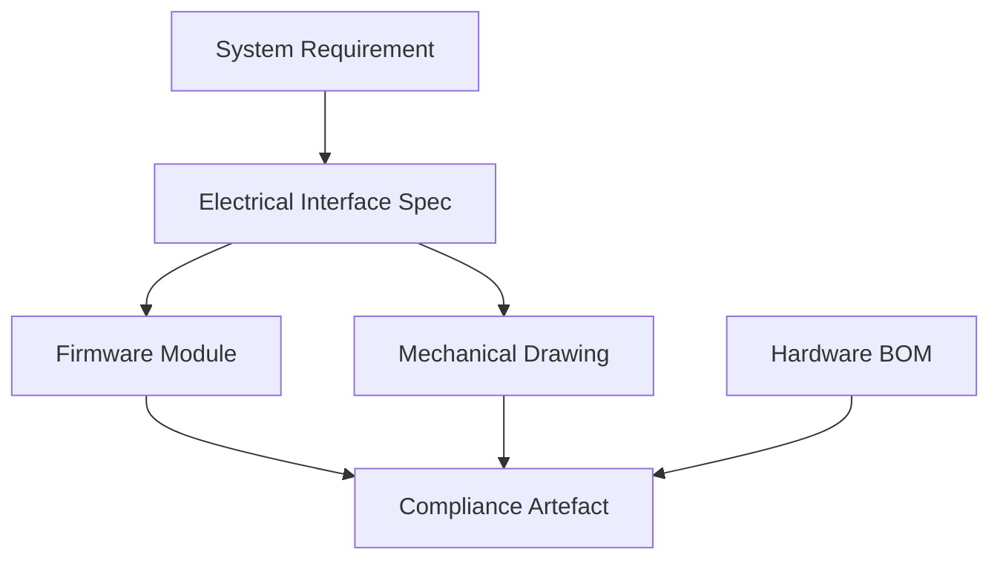

# Decoupling, Synchronisation, and Design Loops in Artefact-Centric Engineering

The delivery of integrated products across digital and physical domains demands not only robust engineering practices but a nuanced orchestration of parallel efforts operating at varying speeds, degrees of maturity, and states of uncertainty. In Cornerstone, these realities manifest as artefact-centric workflows, where decoupling, synchronisation, and iterative loops replace static, schedule-driven processes. This section explores the mechanisms and realities by which coordinated progress is achieved, even as hardware, firmware, software, and mechanical design evolve at different rates, under disparate constraints, and in the shadow of irreversible commitments.

## Artefact Decoupling: Separation for Adaptability and Flow

Engineering discipline invariably strives to decouple concerns, choosing architectural boundaries and interfaces that minimize coupling, maximize reusability, and enable adaptation. In Cornerstone, decoupling is extended beyond the classical sense of software modularity to encompass the entire artefact graph: requirements, models, interface contracts, designs, test artefacts, prototypes, compliance documentation, and physical constructs are all treated as discrete, versioned objects with explicit dependencies and readiness states.

The primary aim of decoupling in an artefact-centric context is to localize change, enabling advances and explorations in one dimension without forcing premature convergence or unnecessary stalling in others. For instance, mechanical enclosure design may continue in simulation and rapid-prototyping, informed by a stable electrical interface specification that itself is a living artefact, with potential for change surfaced through federated traceability and readiness gating. Firmware engineers, meanwhile, may decouple their progress from final PCB maturity by targeting virtualized hardware or programmable interface mocks, whose artefacts are traced to intended hardware versions, enabling test-driven development and early integration in advance of first silicon or prototype boards.

Critically, this decoupling does not imply ignorance or neglect of coupled risks. Rather, it makes dependencies explicit, automated, and continually traceable. When a coupled constraint (a pin assignment, a thermal envelope, an EMC specification) is at risk of changing, impact can be surfaced immediately and propagated to downstream or laterally dependent artefacts. The result is not total independence, but *managed, federated dependency*—adaptive isolation with real-time feedback.

In Cornerstone, interface contracts are versioned artefacts whose readiness is itself the subject of CI evaluation and impact analysis, allowing for provisional stubs, simulation models, or early prototypes to stand in for later, higher-fidelity or final forms. Artefact decoupling thus underpins not only development flow, but also parallel validation, compliance analysis, and cross-domain architectural negotiation.

## Synchronisation: From Calendar Coordination to State-Driven Integration

Where classical product development models rely on gates, milestones, or releases to force synchronisation, the artefact-centric approach makes synchronisation a function of artefact readiness and dependency resolution. Synchronisation is not a one-time act, but a continuous process managed via the evolving state of the federated artefact graph.

A salient difference arises in the coordination of lead times and iteration cycles. Hardware, for instance, often demands longer-turn cycles—fabrication, assembly, and bring-up—that are not easily compressed. Software and firmware, in contrast, iterate rapidly, enabled by virtual environments and automated CI/CD pipelines. The federation of artefact states makes these durations and flows visible. Synchronisation occurs when the readiness state of a given artefact, such as a manufacturable PCB or a certified mechanical enclosure, reaches the level required by a dependent workflow—e.g., system integration, regulatory verification, or volume manufacturing.

This can be formalised in the lifecycle of interdependent artefacts. Consider the synchronisation of embedded firmware and custom hardware:

```mermaid
stateDiagram
    [*] --> [Hardware Spec Proposed]
    [Hardware Spec Proposed] --> [Simulated Hardware Artefact]
    [Simulated Hardware Artefact] --> [Hardware Prototype Built]
    [Hardware Prototype Built] --> [Hardware Verified]
    [Hardware Verified] --> [Released Hardware]

    [*] --> [Firmware Spec Proposed]
    [Firmware Spec Proposed] --> [Firmware Simulated/Tested]
    [Firmware Simulated/Tested] --> [Firmware Validated Against Prototype]
    [Firmware Validated Against Prototype] --> [Firmware Verified]
    [Firmware Verified] --> [Released Firmware]

    [Simulated Hardware Artefact] --> [Firmware Simulated/Tested] : "Virtual Integration"
    [Hardware Prototype Built] --> [Firmware Validated Against Prototype] : "HIL Integration"
    [Hardware Verified] --> [Firmware Verified] : "System Verification"
    [Released Hardware] --> [Released Firmware] : "Release Integration"
```

This state diagram makes clear that synchronisation is achieved not through shared schedules, but through artefact state transitions and dependency fulfilment. Firmware development may proceed against a simulated hardware artefact, decoupling progress from actual hardware availability; as soon as a prototype is built, additional verification can proceed in hardware-in-the-loop (HIL) setups, further driving concurrent maturity.

Such workflow modelling is crucial in scaling delivery, allowing for asynchrony where possible, and precise synchronisation where essential. Dependency blocks are not hidden behind Gantt charts or ad-hoc communications, but surfaced automatically as a property of the artefact graph.

## Design Loops: Iteration as a First-Class Flow

Despite aspirations toward clean, serial progression, real engineering unfolds through iterative loops—in requirements, modelling, integration, and validation. In physical domains, these loops span simulation, prototyping, rework, and transition to manufacturing; in digital domains, they may be compressed into continuous integration and auto-deployment.

Cornerstone explicitly models these loops. Artefacts transition through proposed, simulated, prototyped, verified, and released states, each governed by readiness gating and traceable to upstream and downstream artefacts. Crucially, the artefact graph represents not only nominal flows but also *back edges*—where rework, risk, or emergent findings necessitate looping back to an earlier design or validation phase.

Within hardware domains, such loops typically incur time and cost penalties, given the irreversibility of many steps (e.g., board fabrication, tooling, custom parts). Artefact-driven design loops mitigate this by:

- Instrumenting readiness with simulation artefacts where possible, to compress or pre-validate across digital/physical boundaries.
- Managing interface and requirement changes through trace-linked impact analysis, informing both what must be revisited and what downstream artefacts are affected.
- Allowing partial progression (e.g., parallel firmware and mechanical iteration) where dependencies are sufficiently abstracted, synchronising only as necessity dictates.
- Ensuring compliance artefacts (e.g., DFMEAs, verification plans) remain in closed-loop synchrony, with each design loop providing evidentiary updates for audit and release.

For mechanical and hardware disciplines, where design loops have material consequences, artefact readiness acts as a governor, preventing expensive progression before necessary validation—while still supporting iterative refinement through simulation and rapid prototyping. The existence of back edges in the artefact graph does not indicate failure; it encodes engineering reality, allows for rapid feedback, and supports resilience in the face of uncertainty.

## Practical Mechanisms for Artefact-Driven Synchronisation

Achieving robust decoupling and synchronisation across domains requires not simply engineering discipline, but explicit enabling mechanisms. Under Cornerstone, these manifest as artefact lifecycle controls, readiness gating, and integration with CI/CD and toolchain workflows.

**Artefact Lifecycle Controls**  
Each artefact—be it a hardware schematic, formal interface contract, model, or compliance document—embodies a lifecycle: proposed, in-review, simulated, prototyped, verified, released, and potentially deprecated. The transitions are not arbitrary; they are governed by federated criteria, often integrated with automation. For example, a hardware interface contract may be promoted from proposed to simulated based on the completion of model-based verification, which in turn unblocks parallel firmware mock development.

**Readiness Gating and Pipeline Integration**  
Automated pipelines (CI/CD) enforce readiness criteria and synchronisation points. If a firmware artefact depends on a hardware prototype not yet built, the pipeline can block progression to HIL integration, but allow continued simulated validation. If a mechanical artefact meets readiness for manufacturing, but an interface artefact is in flux, automated alerts and impact analyses surface the risk, informing stakeholders in real time.

**Explicit Interface Artefacts**  
Robust decoupling and synchronisation depend on versioned, traceable interface contracts that span electrical, logical, and mechanical boundaries. These artefacts allow each discipline to proceed with confidence, while automated impact analysis ensures changes are visible and auditable. A change in a connector pin-out, for example, marked as a new interface version, triggers immediate status and risk analysis across all dependent artefacts, from software drivers to mechanical drawings.

**Artifact Dependency Visualisation**  
To aid understanding and governance, the artefact dependency graph can be visualised, with nodes and edges expressing the current state of artefact readiness and synchronisation. Consider the following simplified diagram excerpt:

This depiction not only captures the static dependencies but, when overlaid with readiness states, supports automated surfacing of blocks, risks, and available progress for each team.

## Organisational and Lifecycle Implications

The artefact-centric approach to decoupling, synchronisation, and design loops yields significant organisational and architectural implications. Team responsibilities shift from adherence to static schedules toward stewardship of artefact states and responsiveness to dependency signals. Federated governance aligns cross-disciplinary accountability with the reality of physical/digital integration, demanding skills beyond single-domain specialisation.

This model enforces clarity in ownership—each artefact, whether a board layout, interface contract, or simulation, is governed by a named steward with explicit accountability for readiness and traceability. This eliminates ambiguity in handoffs, reduces schedule risk, and streamlines audit trails. Artefact-centric synchronisation compels teams to declare dependencies early, maintain up-to-date artefact versions, and invest in automation to mitigate manual drift.

Lifecycle management similarly benefits—integration points become state-driven, with phased, automated notifications replacing status meetings or asynchronous document reviews. Failures, when they occur, are traceable to explicit artefacts and their dependencies, offering post-mortem clarity and actionable insight for continuous improvement.

## Trade-Offs, Constraints, and Failure Modes

Artefact-centric decoupling and synchronisation are not panaceas; they encode engineering trade-offs. Excessive decoupling can ossify interfaces prematurely, embedding constraints before real requirements are understood. Conversely, deferred interface definition risks late-stage integration failures and costly backtracking. The art lies in dynamic interface management—provisional artefacts and traceable impact analysis empower teams to adapt as more is learned, without compromising traceability or discipline.

Physical realities impose their own limits. Hardware manufacturing lead times, material procurement, or regulatory review can become critical-path artefacts—no amount of simulation can wholly offset the need for physical validation and compliance activities. Artefact granularity also requires careful design: too fine, and coordination overheads consume productivity; too coarse, and traceability or adaptability may suffer.

Failure modes are thus grounded in both process and modelling error. Hidden dependencies, inadequately versioned artefacts, or out-of-sync readiness states can break the feedback loop, resulting in integration surprises or compliance exposure. Addressing these demands rigorous application of artefact stewardship, toolchain automation, and federated governance—the architectural disciplines at Cornerstone’s core.

## Standards and Normative Practices

Cornerstone’s mechanisms for decoupling, synchronisation, and iterative loops resonate with established systems engineering and product development standards. ISO/IEC/IEEE 15288 (Systems and Software Engineering—System Life Cycle Processes) emphasises traceable lifecycle artefacts and explicit dependency management. Model-Based Systems Engineering (MBSE) practices align well, with digital twins, model exchange, and interface contracts as central artefacts. IEC 61508 (Functional Safety of Electrical/Electronic/Programmable Electronic Safety-related Systems) formalises traceable versioning, change control, and readiness gating for compliance artefacts.

Docs-as-Code practices extend these to the artefact graph, ensuring all documentation, models, and specification artefacts participate equally in version control, CI, and traceability regimes. This harmonises conventional engineering workflows with the demands of agile, distributed, multi-disciplinary teams.

## Conclusion: Adaptive Integration by Design

The promise of Cornerstone, particularly in the integration of hardware and mechanical domains, is not one of eliminating dependencies or decoupling to arbitrariness, but of making these realities explicit, manageable, and adaptive through federated artefact discipline. Decoupling empowers progress and innovation within and across domains. Synchronisation, when governed by artefact readiness and dependency resolution, enables just-in-time integration, transparent risk management, and scalable compliance. Design loops are not symptoms of chaos, but engines of discovery, quality, and resilience; when modelled explicitly in the artefact graph, they propel collaborative learning and continuous delivery.

By elevating decoupling, synchronisation, and design loops to first-class artefact flows—instrumented, automated, traceable—Cornerstone operationalises multidisciplinary delivery at scale, bridging the divide between digital ambition and physical reality.