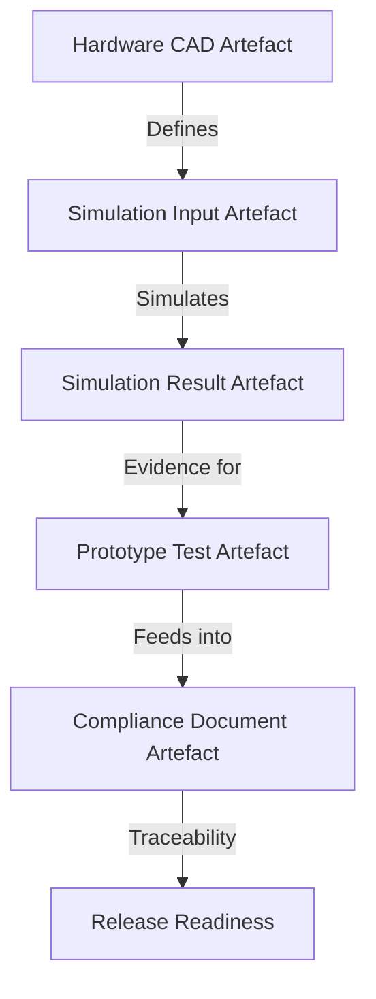
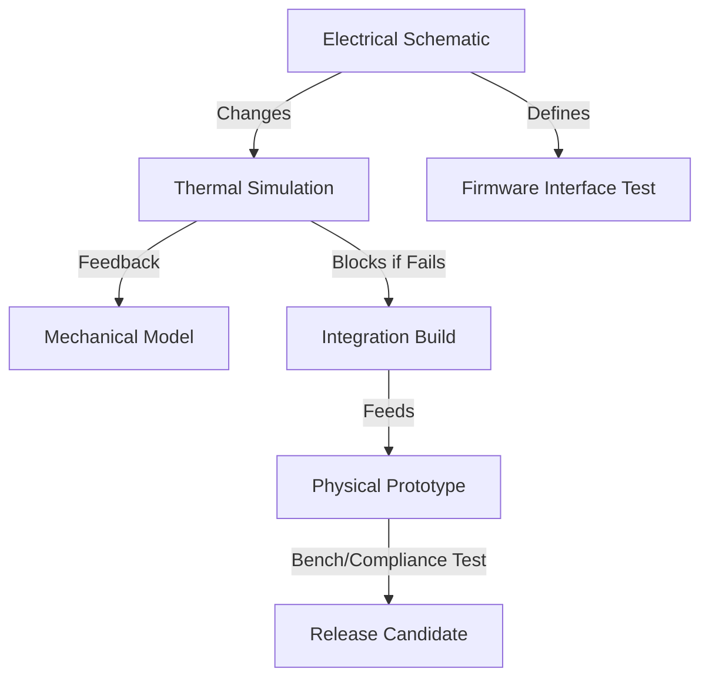

### Testing, Compliance, and System Integration in Multidisciplinary Delivery

The rigor of testing, compliance, and system integration defines the operational integrity and market success of complex products spanning software, firmware, electronics, and mechanics. Within the Cornerstone Framework, these disciplines cease to be sequential gates or siloed afterthoughts, instead emerging as integrated flows inseparably bound to artefact lifecycles, dependency management, and outcome traceability. For multidisciplinary engineering teams, this systemic cohesion enables synchronized quality assurance and regulatory conformity throughout the product delivery continuum, addressing the realities of physical production and digital evolution alike.

#### Typologies of Testing Across Disciplines

Testing within integrated product development does not merely verify the incidental correctness of artefacts; it underpins the entire closed-loop of validation, traceability, and readiness spoken of in earlier chapters. While software domains have long practiced rigorous automated testing—unit, integration, system, and acceptance testing—hardware and mechanical domains demand analogous, but domain-specialized, strategies spanning digital simulation, prototype evaluation, and physical verification.

In hardware and mechanical engineering, a taxonomy of test and validation artefacts emerges:

- **Simulation-Based Testing**: Techniques such as finite element analysis (FEA), computational fluid dynamics (CFD), electromagnetic compatibility (EMC) simulation, and signal integrity analysis serve as digital proxies to anticipate subsystem and system-level behaviours under varied operational and environmental conditions. These simulation artefacts are governed with the same lifecycle and readiness gates as source code in Cornerstone, embodying precise input configurations, output evidence, and trace links to design artefacts and requirements.

- **Prototype and Laboratory Testing**: Physical prototypes—whether quick-turn PCB assemblies, additive manufactured mechanical parts, or system integration stacks—undergo benchtop and environmental tests to validate assembly integrity, fit, functional correctness, electrical performance, and tolerance to thermal, vibration, humidity, and EMC stressors. Each test instance is treated as an immutable artefact within Cornerstone: its provenance, configuration, results, and sign-offs directly trace-linked to the artefacts and interfaces under evaluation.

- **Compliance and Regulatory Verification**: Many hardware and electromechanical systems are subject to external standards—ranging from CE/UL marking, RoHS and REACH material compliance, to application-specific standards like ISO 26262 (functional safety in automotive), IEC 60601 (medical electrical equipment), or electromagnetic standards such as FCC Part 15 or CISPR 22. Compliance evidence, in the Cornerstone model, is not an external dossier but a federated artefact, systematically collected and versioned alongside technical artefacts, and gated by explicit criteria before progression to irreversible manufacturing or release.

- **Integrated System Testing**: Multi-disciplinary products require system-level validation, where embedded software, electronics, and mechanics are composed and exercised as a holistic entity. Test artefacts here might include automated end-of-line (EOL) test scripts, hardware-in-the-loop (HIL) test benches, and sensor/actuator rig setups, all governed and instanced as artefacts, their evidence contributing directly to the artefact graph’s readiness and compliance posture.

The converged artefact-centric approach dissolves classical handoff-based ambiguities, ensuring each test—in silico or physical—is not only authoritative but directly traceable, reproducible, and governable in the context of evolving product states. This systematic approach offers a foundation for continuous integration and continuous compliance unprecedented in disciplines historically dominated by batching and tacit knowledge.

#### Artefact Lifecycles in Validation and Compliance

Within Cornerstone, every validation and compliance activity is instantiated as an artefact with an explicit, governed lifecycle, tightly bound to requirements, architectural decisions (ADRs), and downstream artefacts. The artefact-centric paradigm ensures that simulation files, prototype test reports, compliance checklists, and regulatory certificates are defined, versioned, and statused with the same discipline as code or EDA schematics.

A prototypical lifecycle for a test artefact might traverse the following states: **Draft → Configured → Ready for Execution → Executed → Evidence Captured → Reviewed → Approved**. At each stage, automation validates dependencies: for example, a simulation may be blocked from execution if its input design artefacts are not in a compatible, “ready” state, or if upstream requirements have changed but not been acknowledged. Test execution itself is gated, versioned, and cryptographically linked to the specific artefact revisions under test, avoiding ambiguities of source and reproducibility endemic to less disciplined regimes.

Regulatory and compliance artefacts possess similarly controlled lifecycles. For example, a CE declaration or safety risk assessment is not simply an attached document but a persistent artefact, linked via trace graph to all contributing evidence—test reports, design records, simulation results, materials declarations. State transitions—such as “Pending Review,” “Conditionally Approved,” “Stale (due to upstream change)”—are managed as events in the artefact graph, with downstream readiness or release blocked until compliance artefacts are incontrovertibly satisfied. This structure formalizes the “compliance by construction” model sought in modern regulated product delivery, making audit and certification non-disruptive extensions of the delivery flow.

The following Mermaid diagram illustrates the artefact flow through validation and compliance states in the context of a hardware artefact, simulation evidence, and compliance documentation:

This flow ensures that at each transition, dependent artefacts can only advance if all upstream readiness, validation, and compliance requirements are satisfied, reinforcing both engineering discipline and auditability.

#### Continuous Integration and Readiness Gating in Physical Domains

The hallmark of modern software engineering—continuous integration and readiness gating—finds powerful expression in the multidisciplinary domain when enabled by artefact discipline and automation. For firmware and software components, continuous integration has long automated build, test, and deployment pipelines. Extending this model to hardware and mechanical artefacts within Cornerstone necessitates both organizational and technical adaptations, but yields significant resilience and efficiency gains.

Changes to any artefact—whether a schematic revision, new mechanical tolerance, or updated interface contract—immediately trigger automated impact analysis along the artefact graph. Downstream validation artefacts are flagged as stale if their inputs change, and CI/CD orchestrates notification, workflow assignment, or blocking of affected artefacts. For example, an updated sensor interface in the electrical domain triggers refresh and revalidation of both related firmware tests and any thermal simulation relying on power dissipation models.

Physical validation imposes intrinsic constraints—prototype lead times, limited test equipment, regulatory bottlenecks—that challenge the ideal of instant feedback. However, by splitting validation into digital (simulation, pre-silicon) and physical (prototype, system-level) flows, Cornerstone permits maximum concurrency while minimizing redundant iterations and surprise failures. The artefact graph clearly exposes readiness at each node, with exceptions or provisional states only permitted under strict governance to handle lead time or supply constraints.

A simplified Mermaid diagram models this linked, staged readiness:

This representation communicates the Conditional and blockable nature of downstream progression: the integration build and physical prototype cannot progress or be marked “ready” in the artefact graph until upstream tests and simulations are valid and passing, ensuring controlled, high-confidence iteration.

#### Interfacing with Compliance Frameworks and Standards

Modern products, especially across hardware and electromechanical domains, are subject to increasingly intricate compliance and certification regimes. The Cornerstone Framework aligns naturally with such requirements, as it institutionalizes the persistent linkage of requirements, evidence, and compliance artefacts. Global regulatory frameworks—such as ISO 9001 (quality management), ISO 13485 (medical device quality), ISO 26262 (automotive functional safety), and IEC 61508 (general functional safety)—demand evidence of not only technical rigour but process traceability and artefact state management. Cornerstone’s artefact graph, lifecycle governance, and bi-directional traceability provide an innate compliance backbone.

Artefact discipline offers several structural benefits for compliance:

- Regulatory artefacts—compliance certificates, third-party test evidence, supplier declarations—are versioned and linked to their precise product and subsystem instantiations, eradicating ambiguities in scope or applicability.
- Change impact on compliance is explicit: any modification to a governed artefact (e.g., PCB layout, material specification) automatically propagates dependency updates and invalidates affected compliance evidence, surfacing required revalidation or review tasks.
- The artefact graph enables automated collation and packaging of compliance evidence for audit, integrating with Product Lifecycle Management (PLM) systems where domain boundaries necessitate formal sign-off.
- Inclusion of compliance artefacts in CI/CD gating ensures that releases, even of subcomponents or variants, cannot progress until all required evidence and sign-offs are present, reducing late-stage compliance risk and cost.

In practice, organizations deploying Cornerstone must harmonize the artefact graph and compliance state machine with their chosen PLM, ERP, and regulatory reporting systems, but the explicit, machine-readable nature of artefact lifecycles and dependencies positions Cornerstone as a natural enabler, rather than a disruptor, of compliance-centric development.

#### Architectural and Organizational Implications

Adopting an artefact-centric validation and compliance strategy influences not just technical workflows but team structure and responsibility. Ownership of test, validation, and compliance artefacts becomes distributed: electrical engineers, firmware developers, systems integrators, and compliance officers all act as producers and stewards of domain artefacts, each governed by readiness, traceability, and approval conventions embedded in the artefact graph.

This federated ownership challenges traditional “handoff” boundaries. For instance, a firmware engineer may be responsible not only for code but for automated hardware interface tests and their linked simulation stubs, while a mechanical engineer must manage both CAD artefacts and their compliance-relevant material declarations. Systems engineering and solution architecture roles shift towards stewardship of the artefact dependency graph, ensuring architectural integrity and facilitation of traceable, executable workflows rather than manual document coordination.

Toolchain implications are considerable. Effective implementation demands not only extended traceability in source control systems (Git LFS, PLM with artefact lifecycle states), but enhanced automation to integrate physical test benches, laboratory information management systems (LIMS), and regulatory evidence management. API access, event hooks, and automated artefact status propagation must bridge siloed toolsets, ensuring that all relevant validation and compliance evidence flows into the federated artefact graph in near real-time. The ability to trace every test or compliance event back to the precise configuration, revision, and test conditions is what enables both systemic adaptability and audit compliance at scale.

#### Trade-offs and Practical Realities

While the Cornerstone model advances substantial rigor and automation, multidisciplinary teams must balance artefact discipline with the pragmatic realities of hardware and mechanical development. Test and compliance artefacts accrue cost—in terms of equipment, time, and expertise—as well as stewardship complexity. Physical testing cannot always match the instantaneity of software. Environmental, EMC, or regulatory labs may have long lead times and limited capacity, while prototype build cycles are non-trivial and sometimes constrained by external suppliers or supply chain realities.

Artefact granularity is a persistent trade-off. Excessively fine-grained artefacts enable pinpoint traceability but can generate unwieldy complexity and cognitive overhead; overly coarse artefacts obscure impact and risk hidden integration errors. Cornerstone advocates for artefact granularity aligned to functional, architectural, and compliance boundaries, subject to explicit readiness and approval requirements. Exception governance—for example, allowing provisional artefacts during parallel development—must be bounded, visible, and auditable, with clear revalidation conditions.

Failure modes often arise not from technical deficiency but process gaps: incomplete or unlinked test evidence, unsurfaced dependency drift, or late-stage compliance surprises. These underscore the necessity of unwavering artefact discipline, automated impact analysis, and continuous dependency orchestration. Such structures do not eliminate the inherent risks of physical product delivery, but systematically surface them early and controllably, allowing informed risk management and agile course correction.

#### Conclusion: Systemic Quality and Compliance as a Delivery Foundation

Within the Cornerstone Framework, testing, validation, compliance, and integration are not mere appendages—they are fundamental flows, instrumented by artefact discipline and sustained by continuous, automated orchestration. The unified artefact graph, explicit lifecycle states, and rigorous dependency gating enable teams to move beyond checklists and gate reviews, embedding evidence-driven engineering discipline at the operational core of product development.

The result is a delivery ecosystem where multidisciplinary teams can contend with the real-world complexities of hardware, software, and mechanical integration: accommodating asynchronous lead times, regulatory hurdles, and intricate technical dependencies, all while sustaining flow and product integrity. By integrating systemic quality and compliance assurance into the cadence of cross-disciplinary engineering, Cornerstone offers not just a hybrid methodology, but a platform for adaptive, auditable, and scalable product delivery in the modern era.