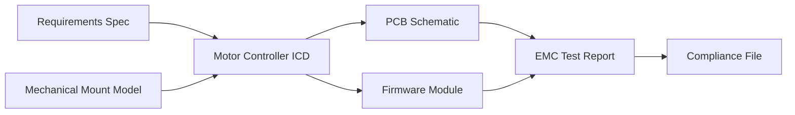
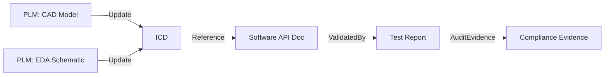

# Interface Control Documents, Dependency Mapping, and Integration Cadence in Artefact-Centric Delivery

A cornerstone of rigorous multidisciplinary product development is the controlled management of dependencies and interfaces. In the Cornerstone framework, the governance of integration points—embodied in explicit artefacts such as Interface Control Documents (ICDs)—serves as the nexus binding software, hardware, and mechanical threads. This section explores the function of ICDs, engineered approaches to dependency mapping, and the orchestration of integration cadence, with attention to both the disciplinary nuances and organizational realities that shape their effectiveness.

---

## 1. The Role and Structure of Interface Control Documents

### 1.1 Definition and Scope

An Interface Control Document (ICD) is a formal artefact encapsulating technical, behavioural, and protocol specifications at the intersection between major system boundaries. In the context of the Cornerstone framework, an ICD is more than a static document; it is a managed, versioned, and trace-linked entity, serving both as a contract and as an integration dependency across software, hardware, firmware, and mechanical domains. It bridges diverse domains and abstraction levels, ensuring systematic alignment and mutual expectations for integration.

### 1.2 Artefact Lifecycle and Versioning

Cornerstone treats ICDs as governed artefacts within the federated artefact graph, subject to draft, review, approval, and change control lifecycles. Each version of an ICD is tightly coupled to specific releases or partial readiness states of the subsystems it binds. Through explicit linking to requirements, design models, source schemas, and test vectors, ICDs become the canonical source for both automated validation (e.g., CI gating) and human-centric review.

ICD changes propagate through the artefact dependency graph, producing automated notifications of required review, impact analysis, and gated progression wherever a downstream artefact is affected. This mechanism supports the controlled co-evolution of interfaces and implementations, minimizing the risks of integration drift, latent incompatibility, or ungoverned "handshake" erosion between teams.

### 1.3 Content and Formalization

While the content of an ICD is context-dependent, several core elements are invariant in Cornerstone’s philosophy: enumerated interface signals or protocols, electrical/mechanical specification parameters, timing and power budgets, logical schemas (in software contexts), state transition diagrams, and explicit interface "contracts" (e.g., preconditions, invariants, and error behaviours). These are realized as structured, machine-readable artefacts (e.g., using JSON Schema, Protocol Buffers, VHDL packages, or SysML interface blocks), with human-readable annotations for rationale and usage semantics.

The use of machine-parseable formats enables seamless automation: impact analysis, stub/mock generation, and conformance checking become integral to the CI pipeline, reducing manual error and ambiguous interpretations. Additionally, the bidirectional traceability enforced by the artefact graph ensures that a modification in requirements or downstream implementations triggers corresponding updates or non-conformance alerts in the interface contract.

---

## 2. Dependency Mapping Across Multidisciplinary Artefacts

### 2.1 Dependency as a First-Class Construct

In conventional project management, dependencies are often reactive artefacts tracked informally—via Gantt charts, status reports, or ad hoc meetings. The artefact-centric approach within Cornerstone reifies dependencies as explicit, version-controlled relationships within the domain artefact graph, unifying design, test, compliance, and production perspectives.

A dependency is thus not simply a project management concern but a technical coupling between artefacts: a firmware image depends on the register map defined by an ASIC’s ICD; a motor controller PCB depends on mechanical mounting interfaces; a regulatory compliance submission depends on validated EMC test artefacts. Each dependency is annotated with life-cycle states, readiness criteria, and gating rules, such that automated systems can assess when and how downstream integration may proceed.

#### Example Dependency Graph

The federated artefact graph enables multi-tier mappings. The following Mermaid diagram illustrates a simplified dependency topology spanning software, hardware, and mechanical boundaries:

In this example, changes to either the PCB schematic or the firmware implementation propagate through their shared dependency—the ICD—automatically triggering re-validation. Upstream, changes in the mechanical domain (mounting interfaces) feed into the ICD, demonstrating bi-directional impact.

### 2.2 Types and Granularity of Dependencies

Depending on delivery context, dependencies may be:

- *Direct artefact-to-artefact* (e.g., a software library using a published API)
- *Transitive* (e.g., mechanical bracket tolerances affecting sensor alignment, thereby impacting firmware calibration)
- *Abstract contractual* (e.g., a safety requirement propagates to all related design and validation artefacts).

Granularity is a practical engineering trade-off. Excessive fine-graining can result in unmanageable graphs, with minute changes triggering disproportionate integration work, especially given physical lead times and test costs. Conversely, coarse-grained dependencies obscure critical risk, delay feedback, and hide subtle integration mismatches.

Cornerstone addresses this with configurable dependency abstraction layers. Teams may establish aggregation artefacts (e.g., “electrical interface group” or “mechanical envelope”), allowing batch progress within bounded variances, while reserving fine-grained control for high-risk or high-velocity artefacts.

### 2.3 Change Propagation, Impact Analysis, and Gating

The automated evaluation of dependency impacts is central to sustained flow and integration quality. Upon change to any governed artefact, the CI/CD system traverses the artefact graph, marking all dependent artefacts as “stale” where conformance or readiness must be reassessed. This propagation triggers specific outcomes: test reruns, compliance checks, or manual reviews, as dictated by artefact type, risk, and criticality.

This discipline empowers teams to rapidly identify integration blockers and surface conflicting changes early. For example, if a firmware team proposes a modification to an interface aligned with a hardware ICD, the system can block firmware integration until the hardware implementation, test rigs, and compliance artefacts have updated or revalidated their dependencies. Similarly, late-emerging requirements (e.g., environmental robustness) drive assisted impact analysis to highlight all affected design, test, and compliance nodes.

---

## 3. Integration Cadence: Orchestrating Concurrency and Flow

### 3.1 Integration Workflows in Physical-Digital Development

Unlike purely digital systems, integrated product teams contend with both digital (software/firmware) and physical (hardware/mechanical) artefact flows, each with distinct cycle times, lead times, and constraints. Software changes can typically be integrated and validated in hours or days, while hardware modifications must respect order-fabricate-test cycles spanning weeks or months. Mechanical validation introduces additional delays due to tooling, environmental testing, and regulatory certification.

A strict “integration on complete artefact readiness” approach would throttle system flow, creating bottlenecks at hardware handoffs or in compliance review. Instead, Cornerstone advocates structured integration cadence—interleaving concurrent work at the artefact level, while enforcing discipline through readiness gating, simulation-based bridging, and batch-managed prototyping.

### 3.2 Integration Cadence Models

Within the federated artefact system, integration cadence refers to the rhythm and synchronization of cross-disciplinary integration events. Integration cadence can be structured through several models, each with its own operational and risk trade-offs:

#### Continuous Integration with Staged Artefacts

Where digital and simulated artefacts can be validated, continuous integration is feasible. Variation occurs where hardware and mechanical artefacts enter the flow; “staged artefacts” (e.g., simulation models, interface mocks) stand in for not-yet-ready physical artefacts. Integration cadence, in this scenario, follows a digital-first loop, with readiness gating controlling progression toward hybrid physical-digital milestones.

#### Batch Integration and Gated Drops

For high-cost or high-risk physical changes, integration events may occur in scheduled “drops”—aggregated sets of ready artefacts staged for joint validation (e.g., a major PCB spin, matched with stable firmware and enclosure design). The artefact graph points to batch gates, and all upstream artefacts feeding the batch are marked as “required ready” for the window to open. This model supports efficient use of prototypes and test resources but can introduce latency between critical integration points.

#### Rolling Wave Integration

For large, distributed systems, a rolling wave cadence synchronizes integration at subsystem levels, with integration windows cascading downstream as upstream artefacts reach contingent readiness. Each “wave” propagates integration opportunity and risk-handling only once the artefact graph’s dependency chain is satisfied for a given domain or subsystem.

### 3.3 Simulation-Driven Bridging and Surrogacy

Where physical artefacts are unavailable or iteration is too slow, Cornerstone enables simulation, test doubles, or surrogate artefacts to stand in place of their physical counterparts—subject to explicit readiness criteria. These surrogates are governed as first-class artefacts, with their own validity periods, assumptions, and defined expiry conditions.

Integration cadence models leveraging surrogacy allow early, parallel validation of software/firmware components against simulated hardware, for instance, or mechanical assemblies using FEA-generated behavioural artefacts in place of fabricated prototypes. Crucially, transition from surrogate to physical artefact is a gated artefact event; the system enforces re-validation and prohibits final system readiness until all critical surrogates are retired in favour of tested physical implementations.

---

## 4. Formal PLM Integration and Artefact Federation

### 4.1 Product Lifecycle Management in Artefact-Centric Flow

Product Lifecycle Management (PLM) systems—in their traditional guise—focus on static BOMs, revision control, and workflow management for physical artefacts. Cornerstone, by contrast, federates PLM as a domain within the artefact graph, treating PLM-managed objects (e.g., CAD models, EDA files, compliance records) as addressable, versioned nodes trace-linked to software, firmware, and system artefacts.

The integration is bi-directional: changes in the software (e.g., firmware update altering register behaviour) can propagate into linked PLM artefacts (e.g., requiring review on PCB constraints or EMC validation), and vice versa. The discipline of artefact readiness and automated impact propagation allows the full cross-domain impact of engineering change orders (ECOs) to be surfaced and managed not just as paper trails but as active system events.

#### Example PLM Artefact Integration

Here, changes to CAD or EDA artefacts in the PLM system feed directly into the central ICD, which serves as the nexus for downstream software, test, and compliance artefacts.

### 4.2 Workflow Coordination and Toolchain Federation

Practical integration between artefact-centric delivery and PLM systems introduces both technical and organizational challenges. Toolchains must support bidirectional synchronization of metadata and artefact links—preferably via open APIs, webhook-driven notifications, or procedural integrations that avoid manual “swivel-chair” operations. Engineers must be able to reference, query, and embed trace links spanning software repositories, document management systems, PLMs, and CI/CD pipelines, without duplicating state or risking link rot.

Organizational practice evolves in parallel; artefact stewardship—wherein domain experts are responsible for artefact completeness, relevance, and linkage—extends into traditional hardware and mechanical functions. This dissolution of silos requires agreement on shared conventions for artefact naming, lifecycle states, and update protocols, underpinned by robust governance to resolve disputes and manage exceptions (e.g., provisional artefacts for rapid prototyping, or overridden constraints for late-stage issue resolution).

### 4.3 Traceability, Compliance, and Audit

PLM-federated artefact management simplifies compliance and system audit by linking all technical decisions, implementation artefacts, test evidence, and compliance records into a queryable, reproducible, and reviewable chain. Regulatory audits, whether for safety, EMC, or environmental compliance, become streamlined; evidence can be surfaced directly from the artefact graph, cryptographically linked to the precise versions in effect at time of sign-off.

---

## 5. Practical Realities and Engineering Trade-Offs

### 5.1 Constraints and Failure Modes

Artefact-centric dependency mapping and interface governance introduce non-trivial engineering costs: the overhead of maintaining detailed artefact graphs, balancing dependency granularity, and governing readiness can threaten to slow down fast-moving teams—especially when not matched by discipline in artefact ownership and toolchain automation.

Integration cadence in environments with long physical lead times (e.g., hardware or mechanical prototyping) risks starvation of downstream work pending upstream artefact readiness. Surrogacy and simulation mitigate this risk, but introduce their own hazards: mismatch between simulation and hardware realities, invalidated assumptions, or deferred issues that manifest at late system integration.

PLM integration can be constrained by legacy toolchain limitations—closed APIs, incompatible versioning models, or awkward user interfaces—requiring procedural workaround or toolchain augmentation to maintain artefact flow and consistency.

### 5.2 Assumptions and Organizational Implications

Successful implementation assumes:

- Multi-disciplinary buy-in to artefact-centric practices and readiness gating as operational norms.
- Sufficient automation and integration of supporting tools to avoid manual state drift.
- Organizational tolerance for early surfacing of “hard” integration issues (conflicts, gating blocks), and commitment to iterative resolution.
- Willingness to negotiate artefact granularity and handling of exceptions (e.g., for exploratory work, field trials, or supplier integration).

Organizationally, distributed responsibility is paramount: each engineer or team maintains stewardship of the artefacts and interfaces in their domain, escalating and tracing integration impacts as they emerge, rather than relying solely on centralized project or program management for coordination.

### 5.3 Strategies for Managing Complexity

Scale and complexity can be managed by partitioning the artefact graph—grouping related artefacts into domains or subgraphs, assigning architectural stewards for high-impact interface points, and leveraging automated dependency visualization to surface systemic risk. Iterative refinement of dependency mapping—balancing explicitness with manageability—enables organizations to learn and adapt optimal partitioning strategies as products and teams evolve.

Cornerstone’s hybrid approach—combining strong structural conventions, explicit artefact governance, and adaptive integration cadence—affords both necessary control for high-stakes integration and operational flexibility for real-world delivery.

---

## 6. Conclusion

In sum, the interplay among ICDs, dependency mapping, and integration cadence forms the backbone of artefact-centric delivery in multidisciplinary environments. The explicit treatment of interfaces and dependencies as managed artefacts, governed by automated readiness and formalized in CI/CD and PLM-integrated flows, underpins the adaptive, synchronized co-development essential for robust, scalable physical-digital system integration. Through disciplined management of artefact state, dependency propagation, and integration rhythm, organizations achieve not only technical coherence but also auditable, iterative progress—cornerstones of modern engineering delivery.