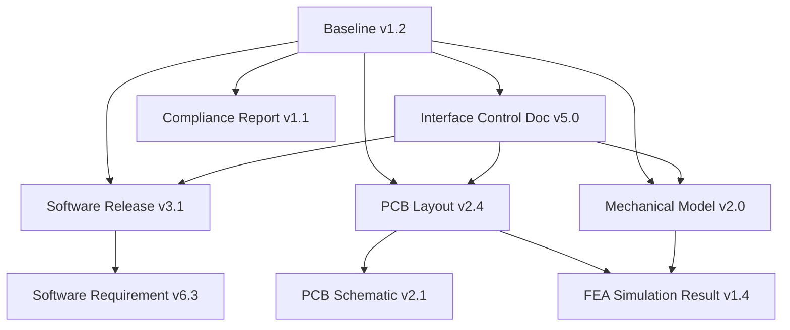
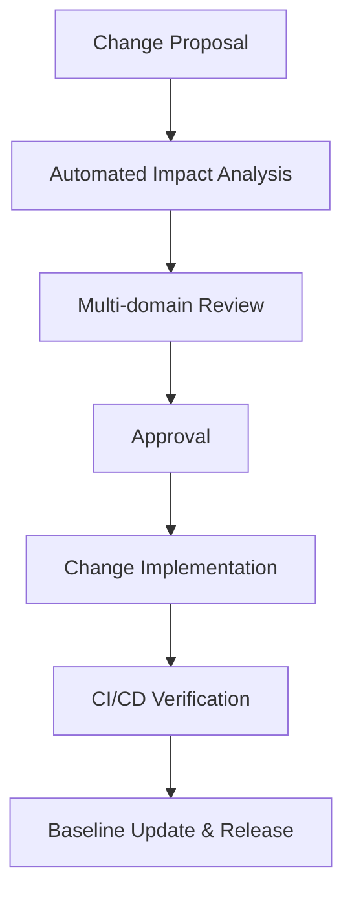

---

### Configuration Management, Baselines, Traceability, and Change Control

#### Foundations of Artefact-Centric Configuration Management

In multidisciplinary product development, configuration management (CM) encompasses the identification, control, status accounting, and verification of all artefacts constituting a product and its supporting infrastructure. The Cornerstone framework reconceptualizes configuration management as a living, artefact-centric backbone. Here, each artefact—be it a requirements document, embedded software binary, EDA design source, or regulatory compliance record—is a discrete, governed entity, integrated within an explicit artefact graph as described in earlier chapters. Configuration is not merely a static snapshot, but a dynamic fabric of interrelated versions, readiness states, and traceability links, ensuring every product increment is both reproducible and auditable at any stage of its lifecycle.

Traditional CM practices, especially in legacy hardware or single-domain software domains, often rely on separate repositories, ad-hoc naming conventions, manual baselining, and periodic reviews to maintain order. However, such fragmented practices often break down as integration cadence accelerates and multi-domain boundaries blur. The artefact-centric approach within Cornerstone, by contrast, federates all artefacts within a governed ecosystem—backed by CI/CD orchestration and machine-enforceable lifecycle rules. This establishes configuration management not as a bureaucratic burden but as an intrinsic, enabling discipline underpinning continuous, reliable flow across software, firmware, hardware, and mechanical boundaries.

#### Baselines: Definition, Role, and Lifecycle in Cornerstone

The concept of a **baseline** is foundational to configuration management, representing a formally approved, versioned set of artefacts and their interdependencies at a particular point in the product lifecycle. Within the Cornerstone model, a baseline is not an undifferentiated monolith but a structured subgraph of artefacts, each explicitly linked to version-controlled interface contracts, requirements, and downstream dependencies. Each baseline captures not just the outputs—such as a software release, a PCB layout, or a regulatory submittal—but also the complete network of prerequisite artefacts, their readiness states, and the approved configuration of interfaces.

Unlike point-in-time “snapshots” that are quickly rendered obsolete by ongoing development, baselines in Cornerstone persist as formal, versioned artefacts themselves. They serve three core roles:

1. **Release Provenance**: By capturing the precise constellation of artefacts that compose a system or subsystem, a baseline provides a verifiable record for audit, certification, or customer delivery.
2. **Integration Checkpoints**: Gates for integration, verification, or staged deployment are universally keyed off explicit baselines, not ad hoc combinations of source or documents, ensuring that only complete, approved configurations are promoted downstream.
3. **Change Reference Points**: Subsequent evolution—whether requirements changes, defect corrections, or new feature integration—are always anchored relative to a prior baseline, enabling robust change impact analysis and bidirectional traceability.

Baselines within Cornerstone are systematically generated—often via automated CI/CD pipelines—at meaningful product milestones: completion of architecture reviews, subsystem integration events, or regulatory sign-offs. They are identity-bound by cryptographically secure signatures and immutable versioning, ensuring that each baseline is uniquely addressable and persists throughout the product lifecycle.

The following diagram captures the artefact relationships and dependencies anchored at a baseline within the artefact graph:

This baseline-centric approach makes explicit the cross-domain dependencies and readiness gates that must be validated for system integrity, enabling fine-grained control and auditability across the federated artefact ecosystem.

#### Traceability: Granularity, Bi-Directionality, and Coverage

Traceability, in the context of Cornerstone, is not an auxiliary process but a structural property of the artefact graph. Effective traceability ensures that every artefact—requirement, code module, hardware design, test result, compliance evidence—can be bi-directionally linked to upstream drivers (such as stakeholder requirements or regulatory mandates) and downstream realisations (such as verified implementations, hazard analyses, or field complaints). This property is indispensable for regulatory compliance, quality certification, and root cause analysis, but also streamlines the daily engineering flow by surfacing integration risks, coverage gaps, and ambiguous ownership.

Unlike traditional “traceability matrices”, which often degenerate into manually maintained, out-of-date documents, Cornerstone operationalizes traceability through structured artefact metadata and enforced graph relationships. Artefact linkages are established via strong, typed references (e.g., “implements”, “verifies”, “governs”, “depends-on”), not informal annotations or ephemeral spreadsheet mappings. The artefact graph is continuously updated via automated tooling—integrated with CI/CD orchestration and, where present, PLM or ALM platforms—to ensure that linkage integrity is maintained as new artefacts are introduced, modified, or deprecated.

The required granularity of traceability is adjustable by policy, but is always designed to balance two competing needs: (a) sufficient detail to unambiguously satisfy all regulatory, contractual, and architectural obligations; and (b) pragmatic manageability avoiding needless proliferation of micro-linkages that impair scalability and clarity. In Cornerstone, granularity is typically governed by logical decomposition: traceability should connect requirements to system/subsystem behaviours and technical artefacts at the level where intent materially diverges, or integration risk is created.

Coverage is also inherently bi-directional. It is not sufficient to be able to trace “forward” from requirement to system element—engineers must be able to trace “backward” from any artefact or defect to its originating rationale or regulatory driver. This closure property is crucial for managing change propagation, dependency impact, and auditability.

For instance, a compliance artefact (such as an EMC test report) will link backward to the requirement or regulation it is intended to satisfy, and forward to the certified configuration baseline where its results are valid. If a compliance requirement is amended, automated impact analysis surfaces all affected downstream artefacts and blocks relevant integration or release flows until compliance integrity is restored.

#### Change Control: Policy, Workflows, and Automation

Across software, hardware, and mechanical disciplines, change is the norm rather than the exception. However, uncontrolled change—particularly in tightly integrated multi-domain environments—can rapidly erode product coherence, regulatory compliance, and enterprise trust. Change control, therefore, is formalized within Cornerstone as a governed set of policies and workflows, tailored to the unique lifecycles and risk profiles of each artefact class, but operating uniformly via composable, automatable mechanisms.

At its core, change control in Cornerstone is an extension of the artefact governance regime. All deliberate changes—whether to requirements, interface definitions, architectural decisions, or physical implementations—must progress through explicit, gated workflow stages:

- **Proposed**: Changes are initiated, minimally specified, and registered for consideration. This stage often includes a change proposal artefact, linked to the affected baseline(s), justifying both intent and context.
- **Impact Analysis**: Automated and human-in-the-loop mechanisms assess the full downstream and upstream consequences of the proposed change. The artefact graph is traversed to identify all dependent artefacts, and to highlight required updates or verification steps.
- **Review & Approval**: Changes are reviewed and ratified by domain stewards, often organised by cross-disciplinary “change boards” operating under documented charters (akin to the classical Configuration Control Board, or CCB, but integrated with the artefact governance layer).
- **Implementation & Verification**: Upon approval, changes are implemented within local artefact repositories, CI/CD gates validate compliance with readiness criteria, and traceability coverage is updated to remain consistent.
- **Release & Baseline Update**: Only after all dependent artefacts are validated and all readiness gates are satisfied is the modified configuration integrated into an updated baseline, preserving full auditability.

While workflow models may vary—from highly regimented, formal change control procedures for safety-critical artefacts, to more flexible, iterative flows for early-stage software development—the overriding principle in Cornerstone is that change must always be visible, governed, and auditable as a first-class artefact event.

Automation is emphasised throughout. Routine steps—such as impact analysis, artefact graph traversal, notification, and readiness validation—are orchestrated by CI/CD platforms, integrated with PLM or federated product data platforms where appropriate. Human intervention is reserved for judgemental tasks: requirements negotiation, exception approval, risk ranking, or trade-off arbitration.

#### Architectural Considerations and Failure Modes

The resilience of configuration management, traceability, and change control regimes is often tested not by routine operations, but by architectural or organisational strain. Several failure modes and trade-offs merit discussion in the context of Cornerstone's approach.

First, artefact **granularity** is a double-edged sword. Excessively fine-grained artefacts and traceability may satisfy every imaginable audit requirement, but at the cost of cognitive overload and diminishing returns, especially for large-scale or fast-moving teams. Conversely, overly coarse artefacts can mask integration risk, enable inadvertent drift, or impede compliance closure. Pragmatic partitioning—where artefacts reflect logical, architectural, or contractual seams—mitigates these risks, and is supported by graph abstraction and visualisation tools.

Second, the strict gating of baseline promotion and integration—though crucial to preventing drift and unauthorized configuration—is potentially a source of friction when lead times vary widely across domains. For example, hardware changes may span weeks or months owing to fabrication constraints, while software artefacts can iterate daily. Simulation artefacts and surrogate baselines (as introduced in earlier chapters) provide a partial buffer, but organisational alignment and discipline remain essential to prevent bottlenecks.

Another consideration is the **federation of configuration management** across diverse tools and organisational boundaries. In Cornerstone, this means that artefacts managed within external PLM or ALM systems are not mirrored or isolated, but referenced and integrated via explicit, versioned links and open APIs that maintain traceability and change propagation. This avoids the classic failure mode of “shadow” configuration systems that diverge irreconcilably from operational reality.

Change control can founder when ad hoc exceptions, urgent triage, or “siloed” domain practices subvert the enforced artefact workflows. The Cornerstone discipline—by treating change events as first-class, governed artefacts, and embedding readiness gates in automation—minimises these risks, but does not eliminate the necessity for strong leadership, shared domain understanding, and a culture of artefact stewardship.

A representative workflow in the Cornerstone change control process is illustrated below:

This schematic exposes the characteristic flow, with automated artefact graph traversal and readiness validation acting as systemic controls enforcing consistency and auditable change.

#### Practical Realities and Integration Points

The effectiveness of the Cornerstone approach to configuration management, traceability, and change control is highly dependent on the tight integration between tooling, organisational processes, and technical culture. Tooling platforms—ranging from distributed source control systems and CI/CD orchestrators, to PLM/ALM suites and artefact registries—must support the structured, federated artefact graph and enable fine-grained control over artefact lifecycle events. APIs and data exchange standards (such as OSLC for ALM or ISO 10303 STEP for product data) provide the interoperability needed for cross-domain traceability and configuration integrity.

Organisationally, the responsibilities for artefact ownership, traceability coverage, and readiness validation are distributed among domain stewards, empowered by transparent policy and governed workflows. Cross-disciplinary change forums and readiness boards—not merely CCBs in name—act as boundary authorities, resolving disputes and negotiating trade-offs where conflicting domain priorities emerge.

Workflow discipline is essential but must be counterbalanced by agility, especially in early-stage or exploratory development where requirements are still being validated and architectural seams may still be fluid. Here, Cornerstone supports temporary “provisional” or “experimental” baselines and artefacts, clearly demarcated within the artefact graph to prevent confusion with production-ready configurations.

Furthermore, compliance and certification scenarios require particular vigilance. Artefact-centric traceability must deliver conformance evidence that is directly packageable for regulatory submission—linking the relevant baseline, compliance reports, sign-off records, and governing requirements in a logically complete subgraph. Automated trace generation and coverage verification are not just productivity aids, but critical to meeting external audit or regulatory demands without last-minute panic or uncontrolled documentation scramble.

#### Standards, Norms, and Industry Practices

Cornerstone’s CM and traceability model draws on, and extends, established industry standards and frameworks. The principles of ISO 9001 and ISO/IEC/IEEE 12207 find direct realisation in the artefact lifecycle and change control regime. Hardware and mechanical artefact governance reflects the stricter mandates of ISO 9001:2015, AS9100, and the IEC 61508/ISO 26262 safety regimes, with formal baselining and change control processes adapted for integration with software continuous delivery practices. The deliberate merging of “docs-as-code” with artefact-centric PLM enables traceability and conformity to be designed-in and perpetually validated, not as a secondary documentation exercise.

A notable deviation from traditional practice lies in the degree of automation, bi-directional traceability, and integration with federated artefact ecosystems. In most engineering environments, configuration management remains a discrete, boundary-setting practice rather than a first-class operational workflow. By contrast, Cornerstone embeds CM, traceability, and change control as composable, automatable workflow primitives, ensuring that product integrity, compliance, and delivery cadence are structurally harmonized.

#### Trade-offs and Variations

Several practical trade-offs and variations must be considered when applying the Cornerstone approach in different organisational and technical contexts. High-maturity, safety-critical domains may require extremely formalised baselining, change authority, and completeness in traceability, sometimes necessitating staged or manually reviewed change progression. Fast-moving or exploratory domains will prioritise flow and local autonomy, using lightweight artefact types, “soft” readiness gates, and more incremental baselining.

Hybrid scenarios—such as the intersection of agile software development with regulated hardware contexts—demand nuanced policy, allowing for localized autonomy within the software domain but enforcing strict traceability and gating for cross-domain releases or regulated artefacts. Artefact graph partitioning, conditional readiness criteria, and mixed granularity baselines are all viable adaptations within the Cornerstone model.

#### Conclusion: Enabling Resilient, Observable Product Configuration

Configuration management, traceability, and change control within the Cornerstone framework are not auxiliary or hindrance functions—they are the invisible mechanics underpinning robust, auditable, and adaptive product delivery. By elevating artefacts, baselines, and change events to first-class, governed entities within a federated ecosystem, Cornerstone ensures that every product increment is both reliable and observable; that every interface, dependency, and compliance obligation is both explicit and enforceable; and that change—however frequent or complex—remains tractable and trustworthy.

The shift to artefact-centric CM delivers clarity amid complexity, engineering discipline amid agility, and sustained product coherence in a world of accelerating integration and regulation. As the subsequent chapters will discuss, realizing this vision depends not just on tooling, but equally on domain stewardship, cross-disciplinary alignment, and a culture that values transparency, governance, and continuous learning.

---