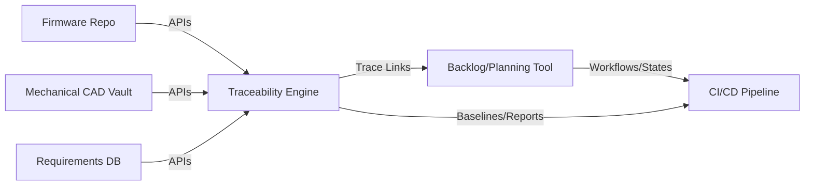

### Tooling for Backlogs, Traceability, and Workflow Alignment

In the context of the Cornerstone framework, tooling serves not merely as a collection of disparate utilities but as the foundational substrate enabling governed, artefact-centric delivery. The orchestration of planning, traceability, and workflow alignment across multi-disciplinary domains demands tools purposefully selected and integrated to realize artefact fidelity, lifecycle discipline, and end-to-end visibility. This synergy is best understood through the interplay between backlog management, traceability enablement, and workflow embedding—a triad at the heart of Cornerstone’s operationalization.

#### Backlog Management: Artefacts as the Source of Truth

Modern product development spans not just software “tasks” or “stories,” but complex, interrelated artefacts: requirements, models, interface definitions, test vectors, compliance items, and design outputs. In Cornerstone, the product backlog is reconceived: rather than a single flat queue of stories, it is a projection of the artifact graph filtered by readiness, discipline, product architecture, or release scope.

Traditional tools such as Jira, Azure DevOps, or Polarion are frequently extended with custom schemas and plug-ins to represent physically distinct artefact types and versioned linkages. However, integration is paramount. The backlog tool becomes a federated view, not the master artefact repository: it reflects and interacts with artefact-centric repositories (e.g., Git, requirements databases, model stores) via robust APIs. The act of “prioritizing work” thus shifts to managing the lifecycle of baseline-bound artefacts—evolving each artefact towards readiness, compliance, and integration according to policy rather than task burndown alone.

This reorientation raises practical considerations. Different engineering domains often favour distinct backlog representations aligned with their temporal rhythms—mechanical units may work in biweekly increments tied to prototyping capacity and supplier lead times, while firmware or software teams iterate daily. The chosen tooling must present a harmonized view, capable of both granularity (for traceability and compliance) and roll-up (for programme-level tracking) while supporting domain-specific interfaces and terminology.

Beyond display, artefact readiness and constraints—such as interface freeze or compliance gating—must be enforced or surfaced directly within backlog tools. Policy-driven transitions, readiness reviews, and gating criteria need to be codified as tool-native workflows or integrated via automation scripts. Failure to synchronize these mechanisms with the persistent artefact graph risks misalignment, rework, and audit gaps.

#### Traceability Enablement: Graph-Oriented Foundations

Cornerstone’s approach to traceability—typed, bi-directional relationships among artefacts—necessitates tooling able to natively represent, traverse, and report on complex artefact graphs. Standard issue-trackers or simple requirement tools, based on flat tables or unidirectional links, quickly reach their limits. Instead, graph-based traceability tools or frameworks—Jama Connect, Helix RM, DOORS Next, or custom-built solutions leveraging graph databases—offer the semantic expressiveness to capture not only forward and backward trace but also the multidimensional context of integration artefacts, regulatory references, and surrogate representations.

A tool’s capacity for traceability is more than a static reporting engine; it must respond dynamically to artefact lifecycle events. For example, the creation or versioning of an interface definition artefact triggers a cascade of trace continuity checks, impact analyses, and policy evaluations—potentially gating downstream work or integration baselines. Workflow automation, through webhooks, plug-in APIs, or CI/CD job orchestration, becomes integral, ensuring trace links are maintained, compliance reports are generated on-demand, and audit trails are cryptographically sound.

A perennial constraint in multidisciplinary organizations is the prevalence of legacy or domain-specific tools—some of which resist integration or lack robust APIs for trace synthesis. Here, federation patterns (e.g., synchronization agents, intermediate artefact representations, delta-based imports/exports) are essential for composing a unified artefact graph that is both accurate and actionable. Such federation supports continued use of deep-featured, discipline-optimized tools, while sustaining top-level traceability and configuration management.

The following conceptual diagram illustrates how federated artefact repositories, a graph-centric traceability engine, and domain-facing tools interface in Cornerstone’s architecture:

In this diagram, discipline-specific repositories (Firmware, Mechanical, Requirements) surface artefacts into a central traceability engine, which then projects trace links and artefact states into planning and CI/CD tools, facilitating workflow synchronization.

#### Workflow Alignment: Automation and Lifecycle Governance

Effective product development hinges upon the tight coupling of artefact state transitions, workflow automation, and governance gating. The Cornerstone framework demands tools that support the formalization of states (e.g., “draft,” “reviewed,” “approved,” “released”), roles, and gating conditions at both the artefact and baseline levels. This is seldom achieved through manual process: workflow engines embedded within ALM/PLM tools (e.g., Siemens Teamcenter, PTC Windchill), orchestration platforms (e.g., GitHub Actions, Jenkins), or generic workflow solutions must be integrated to ensure that each artefact’s lifecycle is explicit, auditable, and enforceable.

Workflow alignment faces several implementation challenges:

- **Multi-domain Synchronization:** Artefact-centric state machines and gating criteria may diverge in nomenclature or process depth across domains. Tooling must accommodate both standardized global states (for cross-domain baselines) and local variations (reflecting unique discipline workflows).
- **Human-in-the-Loop Governance:** Automated checks and transitions provide compliance and repeatability, but governance often requires structured human interventions (e.g., formal reviews, exception approvals). Tools must blend automated gating with ergonomic, accountable review experiences, preserving artefact-level audit trails.
- **Change Impact Visibility:** Tooling must surface, in real time, the propagation of change-induced impacts (e.g., a revised requirement necessitates retesting or interface refactoring) across all active streams. Configurable notifications, dashboards, and actionable trace visualizations equip engineers and leaders to adjudicate scope, risk, and readiness.

Organizational entrenchment of legacy workflows, inconsistent process maturity, or tool proliferation pose additional practical constraints. The adoption of workflow governance tools often requires planned migration, transitional glue-code, and an elasticity of process templates. A successful integration respects the existing competency of domain teams while progressively enforcing artefact-centric discipline.

#### Trade-offs and Engineering Realities

The path to tooling harmony is seldom without friction. Federated architectures increase system complexity, necessitating robust version mapping, error handling, and reconciliation logic. Overly rigid tool-driven processes can stifle flow in exploratory or early development phases. Conversely, insufficiently governed tools may afford short-term velocity but erode traceability and compliance posture—especially critical in regulated industries.

It is also essential to acknowledge that tooling is not a substitute for organizational alignment: role clarity, stewardship of artefact repositories, and policy discipline must underpin any technical integration. Cornerstone’s artefact-centric philosophy presupposes both technical and social readiness for disciplined, federated delivery—an interplay that tooling can enable, but not enforce on its own.

In practice, success lies in iterative maturing of the toolchain: starting with robust, API-accessible artefact repositories, layering graph-oriented traceability, bridging into federated backlog platforms, and finally embedding automated, role-aware workflow governance. This progressive, feedback-driven approach supports both the rigor and agility that Cornerstone envisions, anchoring the artefact-centric ecosystem at the operational core of engineering delivery.