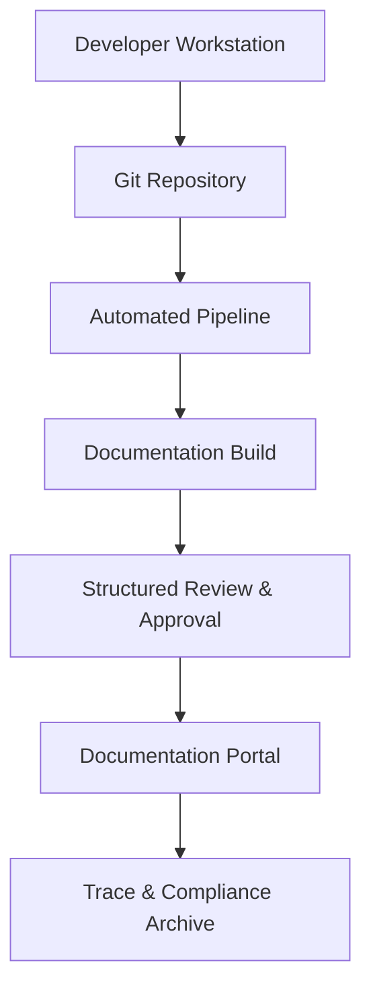

### Docs-as-Code Tooling, Diagramming, and Publishing in Cornerstone

The adoption of Docs-as-Code within the Cornerstone Framework marks a decisive progression toward artefact-centric delivery, extending disciplined versioning, review, and governance principles from source code to engineering documentation. In multidisciplinary product development, engineering documentation is not static auxiliary output, but an integral, living artefact—encompassing system specifications, interface definitions, architectures, requirements, compliance records, and operational procedures. Consistent with Cornerstone’s artefact-centric foundation, documentation must be governed, traceable, and synchronized throughout the product lifecycle.

#### Foundations of Docs-as-Code in Product Development

Docs-as-Code elevates documentation to a first-class artefact status by leveraging the same tooling, processes, and architectural rigor as is applied to source code and model artefacts. At its core, this principle depends on plain text-based source formats—such as Markdown, reStructuredText, or AsciiDoc—stored within version-controlled repositories, managed via branching, reviewed through structured workflow, and built via automated pipelines. This approach counters the limitations of traditional document management systems, which often create isolated knowledge silos, impede traceability, and hinder compliance-ready change control.

Within Cornerstone, the governing repository patterns outlined previously provide the architectural context for documentation. Whether operating in monorepo or federated multirepo arrangements, documentation artefacts must be bounded, discoverable, and aligned with code, models, and other governed items. Automated reviews—often enforced by platform-native pull/merge request workflows—ensure that changes to documentation are subject to the same review rigor, provenance capture, and policy compliance as technical artefacts. This provides a direct mechanism for embedding traceability links between documentation, requirements, designs, and test artefacts, supporting both inline referencing and machine-verifiable change history.

The practical realities of technical documentation in complex engineering efforts, however, demand more than mere text management. Long-form specifications, rich architectural diagrams, embedded simulation results, and reference schemata require structured authoring, multi-output publishing, and the integration of specialized tooling—without eroding core principles of traceability and automation.

#### Diagramming and Visual Artefact Integration

Within integrated product domains, diagrams are not ornamental but essential artefacts—defining architectures, component relationships, data flows, and interface contracts. The Docs-as-Code paradigm mandates that diagrams themselves should be governed as artefacts: source-controlled, reviewable, and reproducibly rendered. The shift away from proprietary, binary diagram formats (e.g., native Visio or proprietary CAD outputs) toward text-based or deterministic representations (such as Mermaid, PlantUML, or Graphviz) brings several critical advantages.

First, diagram source files—typically authored in declarative domain-specific languages—are naturally diffable, supporting precise code review, conflict detection, and traceability to specific changes or decision records. This textuality also enables automation: diagrams can be rendered during documentation build stages within CI/CD pipelines, ensuring consistency and repeatability across published artefacts. Furthermore, automated inclusion of diagram source within documentation repositories reinforces provenance and supports auditability.

However, practical integration must consider limitations. Text-based notations, while suitable for flowcharts, sequence diagrams, and many architectural views, may lack the expressiveness required for detailed mechanical drawings, complex circuit schematics, or embedded simulation results. In such cases, governed binaries or synchronized outputs from domain tools (e.g., exported vector graphics under version control, accompanied by reference hashes) must be adopted, with the provenance and rendering pipeline codified as part of the artefact lifecycle.

**Example: Mermaid-Rendered Architecture Diagram**

The following Mermaid diagram illustrates a simplified artefact flow in a typical Docs-as-Code pipeline governed by Cornerstone principles:

This diagram encapsulates the progression from authoring to review, build, publication, and trace capture—each representing a policy-controlled transition in the artefact lifecycle.

#### Documentation Build Pipelines and Publishing Workflows

Automated build and publishing pipelines are at the core of Docs-as-Code governance in Cornerstone. These pipelines, themselves codified artefacts, orchestrate transformation from raw source to distributed outputs—be it HTML portals, PDF baselines for compliance, or API reference sites. Typical build systems (MkDocs, Sphinx, Docusaurus, Hugo) consume version-controlled markdown and embedded diagrams, apply organizational templates, and output structured, navigable documentation.

Critically, these pipelines enforce link validation, diagram rendering, and cross-reference checks, blocking publication of artefacts that fail integrity, schema, or traceability requirements. Build metadata can be injected into documentation outputs, recording provenance, review signatures, and trace references to associated requirements, source code, or compliance artefacts. This ensures that published documentation is an auditable, contemporary reflection of governed artefacts at a specific lifecycle state.

Publishing destinations are determined by business and compliance requirements: internally, artefacts may be published to versioned documentation portals with access controls, or externally, baselined for regulatory submission. In either case, automated trace export, artifact signing, and lifecycle status capture form essential elements in sustaining auditability and lifecycle coherence.

#### Integration Points and Organisational Considerations

Integrating Docs-as-Code into a federated artefact landscape requires architectural planning. Documentation repositories or subtrees must be harmonized with code, test, and requirements repositories, supporting trace cross-linkage and federated lifecycle status propagation. For cross-domain delivery—such as embedded firmware with mechanical documentation—additional adapters or synchronization agents may be needed to bridge incompatible authoring tools or legacy document archives.

Organizationally, the cultural shift to Docs-as-Code confronts established habits: engineers, technical writers, and compliance leads alike must adapt their authoring practices and review expectations. Training, clear governance policy, and collaborative review workflows are necessary to embed sustained discipline. The cost is offset by substantial gains in visibility, reduction in rework, and alignment between source, design, implementation, and compliance artefacts.

#### Trade-Offs and Lifecycle Realities

While Docs-as-Code provides traceability, auditability, and integration coherence, it also introduces practical constraints. Large binary artefacts (e.g., detailed mechanical models, high-resolution schematics) challenge repository performance and diff-ability, demanding artefact storage extensions (e.g., Git LFS, external artefact vaults) and stricter change discipline. Automated pipelines introduce dependencies: build system drift, toolchain updates, and rendering compatibility must be actively managed. Furthermore, strict review and protected branch enforcement may slow rapid iteration if not balanced against delivery cadence and business priorities.

#### Conclusion

In the context of Cornerstone, Docs-as-Code is not merely a tooling preference but a disciplined extension of artefact-centric governance, embedding documentation as a living, governed artefact throughout the product lifecycle. Diagramming and publishing pipelines enforce structural integrity and traceability, while integration with broader artefact management sustains compliance and audit readiness. The concrete realisation of these principles depends not only on tooling selection, but on rigorous workflow design, adoption discipline, and sustained architectural governance—solidifying documentation as a durable cornerstone of modern, integrated product delivery.