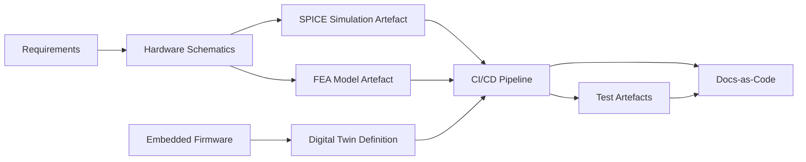

### Simulation and Emulation: Engineering Models in the Cornerstone Framework

#### Introduction

Simulation and emulation technologies are deeply embedded in modern multi-disciplinary product development, fulfilling roles ranging from early architectural validation to continuous test automation and digital certification. Within the Cornerstone framework, these tools support artefact-centric governance and cross-domain traceability by providing authoritative reference models and executable specifications. When effectively integrated, simulations become first-class citizens in the engineered artefact lifecycle, closely coupled with documentation, requirements, firmware, and hardware designs. This section provides a systematic examination of key simulation methodologies—SPICE circuit analysis, finite element analysis (FEA), and digital twins—and clarifies their function, integration, and practical realities within Cornerstone-driven delivery.

#### Role of Simulation in Engineering Governance

Cornerstone treats simulation artefacts, input decks, and reference models as version-controlled, reviewable units. This embedding enables deterministic traceability from requirements through to validation evidence and technical baselines. Simulation outputs—whether generated by a SPICE netlist, FEA solver, or a high-fidelity digital twin—become part of the governed artefact inventory, referenced in release documentation, test cases, and compliance dossiers. By promoting simulation data and workflow metadata through the same CI/CD pipelines as source code and documentation, Cornerstone ensures lifecycle synchronization, provenance, and reproducibility.

A fundamental distinction exists between predictive simulation—used during conceptualization and architecture—and verification simulation, which supports requirement satisfaction and compliance. The organizational boundary between experimentation and release-grade validation must be clear: simulation environments, solver versions, and reference models should be locked at release boundaries, with provenance encoded in build metadata.

#### SPICE and Electronic Simulation

SPICE (Simulation Program with Integrated Circuit Emphasis) remains the de facto standard for electronic circuit simulation, underpinning all serious analogue, mixed-signal, and increasingly digital logic verification. SPICE input—consisting of netlists, model cards, and analysis directives—forms a declarative specification of circuit topology and component behaviors. Within the Cornerstone context, these SPICE artefacts are managed alongside schematics and PCB source, allowing for direct cross-linking to requirements, interface definitions, and design rationale.

SPICE simulation supports a range of analyses—transient, DC bias, AC frequency domain, noise, and Monte Carlo variation—each providing different assurance axes within system engineering. For safety-critical or high-reliability domains, simulation results may be retained as compliance artefacts, archived with full provenance: solver version, model library hashes, simulation scripts, random seeds, and environmental assumptions. Integration with CI/CD can facilitate automated regression simulation, validating that parametric shifts or design revisions have not compromised established performance envelopes. This capability is especially potent in firmware-configurable hardware, where co-simulation and co-verification workflows are necessary.

A contrasting challenge lies in model fidelity and IP sensitivity. SPICE models provided by vendors may be encrypted or distributed as black-box binaries, imposing constraints on reviewability and direct validation. In such cases, governance must account for supply chain provenance and cryptographic authentication of model artefacts rather than direct source scrutiny. Additionally, large, hierarchical designs can stress simulation scalability, necessitating modular simulation breakdowns and judicious use of behavioral abstraction.

#### Finite Element Analysis (FEA)

FEA is central in mechanical and electromechanical engineering, enabling predictive assessment of structural, thermal, and electromagnetic properties before physical prototypes. FEA divides a system into discrete finite elements, solves governing field equations (e.g., Newtonian mechanics, Maxwell’s equations) numerically, and reconstructs global responses from local element behaviors. FEA model files—often large and parametric—are artefacts subject to rigorous version control and configuration management within Cornerstone.

Workflow integration of FEA presents unique realities. FEA model inputs (meshes, boundary conditions, material properties) are typically constructed in specialized CAD-integrated environments, requiring conversion or parameter extraction for broader artefact governance. Automated pipelines can execute parametric sweeps or worst-case analyses, pushing summarized results and visualizations (e.g., stress distributions, thermal maps) into traceable documentation or compliance baselines.

A recurring complexity is the non-determinism induced by solver parallelism and floating-point artifacts, which may result in minor variance—requiring tolerance-aware result comparison for regression pipelines. In heavily regulated contexts (e.g., aerospace, medical), simulation models, solver settings, and runtime environments must be strictly fixed, and any modification subjected to formal change control and validation.

Organizationally, FEA bridges mechanical, electrical, and even software disciplines, as firmware-managed actuation or feedback loops increasingly interact with modeled physics. This necessitates governance patterns where co-simulation and cross-disciplinary artefact linking are codified.

#### Digital Twins: Extensible, Executable Product Models

The concept of the digital twin encompasses a high-fidelity, continuously updated virtual representation of a physical product, system, or process. Unlike isolated simulations, digital twins are tethered to live data streams—telemetry, operational state, and event logs—enabling real-time synchronization, predictive analytics, and closed-loop control or anomaly detection. Within the Cornerstone framework, the digital twin is treated as a dynamic artefact: a governed composition of models, data connectors, behavioral scripts, and visualization layers.

Digital twin implementations range from lightweight surrogate models—supporting remote diagnostics and firmware-in-the-loop testing—to full-fidelity, sensor-driven environments designed for operational optimisation. Modern toolchains frequently rely on standards such as OPC-UA, Asset Administration Shell, or Digital Twin Definition Language (DTDL) for model structure and data exchange semantics.

Architecturally, integrating digital twins requires defining explicit interfaces and data contracts, ensuring life-cycle traceability between twin models, real asset configurations, and software release artefacts. Digital twins can be instantiated in CI/CD pipelines for deployment verification, system integration tests, or even simulated field trials, allowing cross-domain teams to validate end-to-end workflows without physical hardware availability. They are especially critical to sustaining flow and traceability in hardware-constrained or distributed development contexts.

The following Mermaid diagram illustrates the Cornerstone-governed flow for simulation artefacts and their lifecycle integration:

This integration enables controlled and auditable propagation of simulation results throughout design, validation, and release documentation.

#### Trade-Offs, Governance, and Lifecycle Implications

While simulation and digital twin artefacts are invaluable, real-world adoption surfaces several persistent challenges. Toolchain interoperability and closed vendor formats often impede seamless artefact management and integration. Large binary artefacts (e.g., meshed FEA models or high-resolution simulation results) present storage, diffing, and reviewability constraints within conventional version control systems. Effective governance mandates modularization, surrogate model generation, and selective promotion of result summaries as canonical artefacts for tractable review and long-term retention.

There is also a sharp distinction between developmental and release-grade simulation artefacts. Preliminary models may make unverifiable approximations or depend on rapidly evolving assumptions, whereas artefacts used for release or certification must exhibit documentary completeness, fixed toolchain versions, and documented input assumptions agreed upon with regulatory or quality assurance stakeholders.

Organizationally, exposure and traceability of simulation artefacts across disciplinary boundaries is often non-trivial. Cross-functional training and model abstraction layers (black-box wrappers, documented APIs) are typically necessary to enable both domain specialists and discipline-adjacent engineers to reliably consume and review simulation-derived evidence. Governance strategies should codify simulation input and output schema, artifact release checklists, and inter-domain linkage conventions.

#### Conclusion

Simulation, from foundational SPICE and FEA to advanced digital twins, functions as a cornerstone of multi-domain product engineering. Within the Cornerstone framework, robust lifecycle management of simulation artefacts—anchored in version control, automated pipelines, and disciplined traceability—enables high-confidence design verification, compliance readiness, and architectural adaptability. By treating simulation models as peer artefacts to code, documentation, and tests, organizations materially reduce silos, enhance reviewability, and foster a coherent, trusted product engineering lifecycle.