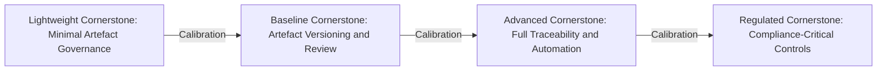

### Why "One Size Fits All" Fails in Modern Engineering Organizations

#### The Fallacy of Prescriptive Universality

Contemporary engineering organizations—particularly those operating at the intersection of hardware, software, firmware, and mechanical domains—often encounter methodologies that are presented as universally applicable solutions. The temptation to adopt a single, unaltered framework across diverse teams and products is driven by perceived efficiency, ease of governance, and reduced overhead in training or tooling. However, such prescriptive universality fails on both conceptual and practical grounds. Cornerstone explicitly resists this tendency: neither its foundational principles nor its artefact-governed delivery mechanisms presuppose that methods, granularity, or process rigor remain fixed across all domains, project scales, or regulatory landscapes.

The inherent diversity within and between engineering organizations—manifested in product complexity, team maturity, business context, compliance needs, and legacy constraints—renders a one-size-fits-all approach not only unworkable but actively counterproductive. Attempting to enforce identical workflows on a two-person firmware prototype team and a cross-domain, safety-critical system with hundreds of contributors results in either under-governance (exposing the large project to risk) or overburden (crippling the agility of small teams). The Cornerstone Framework instead provides a spectrum: at one end, lightweight artefact governance suffices; at the other, rigorous formal practices are non-negotiable. Between these poles lies a continuum of deliberate, context-driven adaptation.

#### Core Contextual Factors Driving Variation

Several dimensions must be considered in determining the appropriate calibration of Cornerstone for any given environment. Foremost among these are organization size, team maturity, regulatory exposure, inherent product complexity, and real-world operational constraints. Each factor exerts nuanced demands on governance, traceability, documentation, simulation fidelity, and automated compliance.

**Organization size** changes the communication topology, introduces multiple layers of review and delegation, and amplifies risks around coordination and decision latency. As headcount grows, informal knowledge sharing and verbal agreements recede, and formalization of decision records, change control, and cross-team alignment becomes vital. Small teams can tolerate lightweight mechanisms but risk lost context without artefact-centric support; larger organizations require workflow infrastructure to prevent fragmentation.

**Team maturity** reflects cumulative experience with disciplined delivery, automation, and continuous integration. Mature teams often possess intrinsic reflexes for version control, review, and test automation, enabling them to operate effectively with only minimal scaffolding. Conversely, nascent or ad hoc groups may demand stricter process prescription and stronger lifecycle checks to avoid chaos or compliance failure.

**Regulatory environment** defines the minimum necessary rigor regarding traceability, documentation, and formal verification. Safety-critical contexts (e.g., medical devices under IEC 62304 or automotive systems in ISO 26262) mandate explicit artefact relationships, formal approvals, and comprehensive audit trails. Non-critical domains may tolerate relaxed controls provided core artefact traceability and lifecycle synchronization persist.

**Product and system complexity**—reflected in heterogeneous component interactions, concurrent physical and logical behaviors, and multidomain integration—sets the bar for modelling, simulation, and architectural discipline. High-complexity, multi-disciplinary systems benefit from full-fledged Cornerstone artefact governance, whereas isolated firmware or proof-of-concept developments may proceed with only essential artefact gating.

**Operational and legacy constraints**—such as toolchain limitations, inherited repositories, or customer-imposed delivery cadence—act as persistent boundaries on theoretical best practice. Cornerstone acknowledges these realities with a spectrum-based philosophy, supporting practical trade-offs without forfeiting the integrity of artefact lifecycle fundamentals.

The interplay among these factors can be visualized as a multi-axis gradient rather than a single dimensional scale. The adaptation challenge is less about discrete "lightweight" or "heavyweight" operation and more about calibrated hybridization within those gradients, aligning process burden with risk, compliance, and strategic focus.

#### Architectural Consequences of Rigid Standardization

Rigid, undifferentiated application of framework practices introduces architectural and organizational liabilities. Uniform doc-as-code governance, simulation formalization, or review cadence across artifacts and teams can have unintentional effects. For example, applying full traceability matrices, change approval boards, and multi-stage review to high-velocity exploratory spike initiatives will paralyze experimentation, distort incentives, and cause process circumvention. Conversely, omitting review and artefact lifecycle discipline in safety, regulatory, or integration-heavy environments will inevitably result in ambiguous decision histories, audit gaps, and reduced defect containment efficacy.

A further complication arises in sequencing adoption: teams rapidly transitioning from a “startup” operational model to deliver regulated products must graduate process rigor in a measured, evolutionary way. Lockstep imposition induces friction, while laissez-faire approaches defer existential risks. Cornerstone provides an architectural safeguard: adaptation by policy, with artefact boundaries and workflow controls parameterized according to context rather than dictated by central dogma.

#### Mechanisms for Sustainable Calibration

The Cornerstone Framework is designed for policy-driven adaptation. At its core are artefacts—requirements, models, tests, and simulations—managed under defined lifecycle controls. These controls, including review rules, traceability obligations, and release criteria, can be parameterized. A lightweight application might instantiate minimal review and simplified traceability, perhaps requiring only author-attestation and peer review. A heavyweight instantiation formally encodes signed approvals, mandated test coverage, automated simulation tracebacks, and cross-functional review signoff.

The adaptation pathway leverages governance as code—policy artefacts specifying which controls are mandatory, advisory, or contextually disabled at artefact, team, or program boundary levels. This enables organizations to construct graded gates without resorting to either universal minimalism or maximalism.

This adaptability can be conceptualized as a spectrum across governance domains. The following Mermaid diagram illustrates this calibration pathway, situating key artefact controls within a context-dependent governance spectrum:

Here, transitions represent the ability to tune the rigor of artefact lifecycle management as required—rather than enforcing a monolithic process state.

#### Trade-Offs and Locus of Control

Calibrating the rigor of Cornerstone practices is fundamentally an exercise in risk management. At any calibration point, trade-offs emerge between speed and assurance, flexibility and repeatability. Policies must be explicit and reviewable, not just idiosyncratic or implicit, to avoid both shadow process bloat and “alert fatigue” among practitioners. In practice, engineering leadership—supported by systems architects and compliance owners—carries primary responsibility for these policy calibrations, using artefact traceability, historical defect data, and regulatory mandates as calibration guides.

Lifecycle controls—automated or manual—must be operationally transparent, discoverable within documentation portals, and, where possible, self-validating. Over time, as organizational maturity evolves or external constraints shift, these policies must be subject to continuous reexamination and refinement. Cornerstone’s abstraction of governance as parameterized artefact policy, rather than invariant dogma, is what enables sustainable, scale-appropriate adoption.

#### Conclusion: Adaptation as Foundational Principle

Cornerstone’s value does not arise from its prescriptive completeness but from its structured adaptability. Universal, undifferentiated models of process, artefact governance, and documentation delivery are fundamentally unsuited to the complex, variable terrain of modern engineering organizations. Context-aware calibration—using artefact-centric policy and automated lifecycle management—ensures that rigor, velocity, and compliance harmonize rather than compete. The only universal principle within Cornerstone is that “one size never fits all.” Instead, a living engineering framework responds to context, scales with ambition and risk, and delivers the transparency, assurance, and velocity needed for sustained innovation.