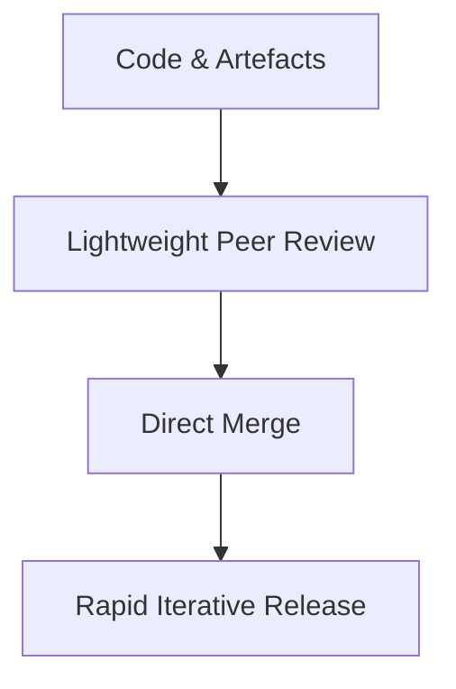
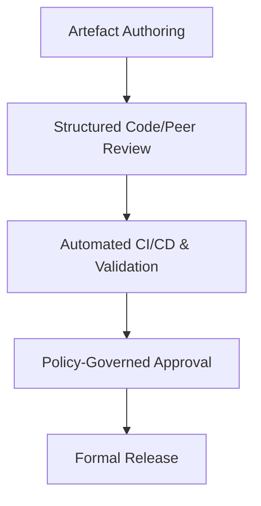
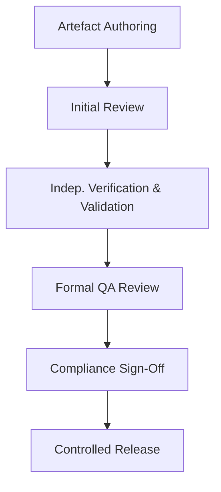

### Lightweight, Balanced, and Heavyweight Variants of Cornerstone

For the Cornerstone framework to serve as a truly universal substrate for modern engineering organizations, it must accommodate the wide spectrum of operational environments—from nascent start-ups seeking to validate a product hypothesis, to highly regulated enterprises tasked with developing mission- or safety-critical systems at industrial scale. This demands a flexible, parameterized model where governance rigor, artefact visibility, and lifecycle controls are applied contextually, not arbitrarily. Within this adaptive landscape, three principal variants naturally emerge: lightweight, balanced, and heavyweight implementations. Each reflects a distinct set of calibration choices mapped to an organization’s size, domain maturity, compliance requirements, and architectural complexity.

#### Contextual Factors Shaping Implementation

The calibration of the Cornerstone framework is not arbitrary, but rooted in an explicit recognition of an organization’s situational context:

- **Organization Size and Structure:** Smaller teams typically adopt flatter, more fluid structures, whereas larger enterprises introduce stratified roles, multiple levels of review, and cross-functional coordination complexity.
- **Team Maturity:** Novice groups may lack established engineering discipline and formal processes, while seasoned teams possess deeper domain knowledge, existing patterns, and greater process resilience.
- **Regulatory and Compliance Exposure:** Depending on sector (medical, automotive, defense, etc.), products may be subjected to rigorous external governance (ISO 26262, FDA, DO-178C, IEC 62304) requiring audit trails, segregation of duties, and adherence to formal bodies of evidence.
- **Product/System Complexity:** Single-domain products may afford streamlined processes, while multi-disciplinary, safety-critical, or high-value offerings necessitate intricate engineering governance and cross-domain traceability.
- **Flow Constraints and Time-to-Market:** Early-stage ventures or innovation programs often prioritize cycle time over completeness, whereas mature product lines or legacy platforms require steady, compliant evolution.

The governance and artefact policy spectrum defined by Cornerstone permits, and indeed encourages, regular recalibration as these environmental signals evolve. At its core, the choice between lightweight, balanced, or heavyweight variants is a deliberate one, reflecting thoughtful consideration of risk, value, assurance, velocity, and sustainability.

---

#### The Lightweight Variant: Agility by Design

The lightweight implementation of Cornerstone is most appropriate for small, autonomous teams or organizations in the formative phases of product discovery. Here, minimization of governance overhead is essential to preserve exploratory agility. Artefact-centric practices—such as Docs-as-Code, simulation-as-artefact, and traceable requirements—are retained, but applied with an explicit bias toward velocity and learning over formal assurance.

**Documentation and Artefact Practices:**  
Governed documentation remains, but with relaxed branching, review, and approval policies. All artefacts reside in version control and are diffable, but conventions may allow for direct commits, lightweight peer reviews, and limited release sign-offs. Automated pipelines (e.g., documentation site builds, simulation runs) are employed selectively, focusing on “high-value” artefacts whose evolutionary trace is critical for current learning or near-term team alignment.

**Simulation and Modelling:**  
Simulation artefacts serve as both exploratory sandboxes and foundational documentation. Emphasis is placed on rapid iteration rather than reproducibility or regulatory traceability—simulation code, models, and results are versioned, but formal reviews, trace matrices, or compliance sign-offs are not mandatory. The return-on-investment for rigorous governance is intentionally capped, proportional to the stage of system verification and business risk.

**Organizational Implications:**  
Engineering roles are fluid, with individual contributors often owning end-to-end workflow cycles, encompassing design, implementation, documentation, and basic testing. Policy artefacts, where they exist, are informal and primarily serve to codify collective expectations for collaboration, rather than serve as instruments of compliance or audit.

**Adaptation and Failure Modes:**  
While this variant maximizes speed, it tolerates incompleteness—there are risks of architectural drift, insufficiently specified system boundaries, and incomplete traceability to requirements or test rationale. However, this tolerance is deliberate, justified by the need for experimental throughput, early product-market fit, and evolutionary learning.

A simple depiction of artefact governance in the lightweight variant is given below:

This diagram illustrates the streamlined, low-friction artefact lifecycle typical in a lightweight implementation. Artefacts flow quickly from creation to release, with minimal mandated checkpoints.

---

#### The Balanced Variant: Harmonizing Rigour and Flow

The balanced implementation represents the default calibration for most mature product organizations—those with appreciable architectural complexity, cross-domain interfaces, and risk that is measurable yet manageable. Here, Cornerstone is applied to both enforce traceability and support adaptive, iterative delivery, without incurring the friction or ceremony of heavyweight governance models. This mode is particularly suited to interdisciplinary teams integrating software, firmware, hardware, and mechanical artefacts, constrained by a mix of internal and moderate external compliance obligations.

**Documentation and Artefact Practices:**  
Docs-as-Code is systematically adopted: all source artefacts—requirements, architectural diagrams, process documents—flow through version control with robust branching, code review, and automated publication pipelines. Artefact policies are explicitly defined and embedded as code, governing review assignment, traceability requirements, and approvals. Automation ensures continual cross-linking between requirements, tests, design artefacts, and change histories, with compliance checks embedded in continuous integration.

**Simulation and Modelling:**  
Simulation and emulation artefacts are not merely exploratory, but promoted through formal review and integrated into mainline validation pipelines. Each simulation model or testbench is traceably linked to requirements or system interfaces. Automated regression and reproducibility are achieved through governed pipelines, enabling auditability but without requiring full compliance sign-off for every artefact revision.

**Organizational Implications:**  
Teams are cross-functional, but roles are more clearly stratified—architects, domain leads, and technical product owners participate in artefact reviews and release decisions. Interfaces between teams, or between disciplines, are governed using explicit policy artefacts which define handshake conditions and release quality criteria.

**Lifecycle Realities and Trade-Offs:**  
The balanced variant achieves a sustainable compromise: friction is introduced where it is most valuable—at quality, compliance, and integration boundaries—while internal exploration and early feature work can flow with lightweight controls. Threats to velocity are managed by periodic retrospective and recalibration of policy artefacts—when bottlenecks emerge, policy is adjusted rather than processes rigidly enforced.

A diagrammatic view of this balanced governance cycle is as follows:

Here, distinct governance stages are shown, each introducing specific controls or automation, balancing assurance and throughput.

---

#### The Heavyweight Variant: Assurance and Compliance-Centric Governance

The heavyweight implementation of Cornerstone is mandated for organizations, teams, or products subject to stringent regulatory requirements, mission- or safety-critical assurance, and complex system integration. This environment—characteristic of medical device development, aerospace, automotive systems, and national infrastructure—demands an uncompromising approach to traceability, evidence, and segregation of duties.

**Documentation and Artefact Practices:**  
Every artefact flows through formal lifecycle states: authoring, multi-stage review, approval, and release, each with recorded accountability and trace matrix updates. Docs-as-Code becomes not only a technical convenience but an audited record, supporting reproducibility, full traceability (from requirements to tests, defects, and compliance evidence), and immutable artefact trails. Policy artefacts specify explicit controls for review assignment, independence of reviewers, segregation of duty, and management of binaries (e.g., FEA models, certified tool outputs), ensuring compliance with external standards such as DO-178C, ISO 26262, or IEC 62304.

**Simulation and Modelling:**  
Simulation artefacts serve as formal bodies of evidence. Each simulation result or hardware-in-the-loop run is linked directly to the requirements and validation plan, subject to documentary sign-off and archival. All model changes trigger regression, review, and compliance checks, with reproducibility and chain-of-custody as first-order imperatives.

**Organizational Implications:**  
Artefact lifecycles cross both disciplinary and organizational boundaries, involving independent quality assurance teams, configuration managers, and compliance officers. Workflow is stage-gated, with mandatory independent verification and validation (IV&V), “four-eyes” approval, and separated responsibilities for authoring, review, and release. Artefact policy specification is itself versioned and auditable.

**Practical Realities:**  
The principal trade-off is reduced velocity in exchange for a marked increase in product assurance, compliance defensibility, and resilience to organizational scaling. This variant is inherently more costly, requiring investment in tooling, automation, and cultural discipline; however, it is the only defensible approach for high-assurance, regulated products.

This more elaborate lifecycle is represented below:

Multiple review and approval stages are introduced, reflecting strict separation of duties and rigorous control.

---

#### Architectural and Workflow Implications

The implementation spectrum described above creates tangible knock-on effects for toolchain integration, build and validation automation, and team workflow.

- In lightweight modes, simple “mono-repo” structures and limited pipeline orchestration suffice; most artefact controls reside at the discipline or team boundary. Balanced implementations require more sophisticated multi-repo designs, automated cross-linkage between requirements, docs, models, and code, and CI/CD pipelines that enforce policy as code. Heavyweight environments necessitate even more segregated pipelines, protected artefact stores, cryptographic signing, and configurable release perimeters for audit and compliance.

- Artefact lifecycles in Cornerstone are always explicit, but in heavyweight settings, lifecycle metadata (creation, review, rationale, compliance mapping) must be preserved in immutable logs, with full trace coverage mandated by external standards.

- Handshake and integration points between disciplines—where, for example, software artefacts must prove compliance with hardware or mechanical requirements—become progressively more formalized. In lightweight modes, integration is achieved through shared review and collaborative iteration; in heavyweight systems, interface definition and verification are themselves artefacts, governed at the same rigor as code.

- Operational constraints, such as the necessity for rapid experimentation, hardware bring-up, or failure analysis, are directly confronted by the governance variant selected. Lightweight implementations empower immediate feedback; heavyweight gates force deliberate control but may impede rapid fault investigation or emergency product fixes.

---

#### Maintaining Sustainability Across the Spectrum

Regardless of the chosen variant, the sustainability and effectiveness of Cornerstone hinge upon continuous policy reflection and adaptation. Artefact governance is not fixed in perpetuity; as teams grow, products mature, or regulatory environments shift, so too must the intensity and nature of controls. Lightweight approaches may harden as prototype products graduate toward market entry; conversely, overly heavyweight controls imposed prematurely can stifle innovation and accumulate process debt.

As a practical matter, most organizations will blend these variants—adopting lightweight controls for discovery programs, balanced governance for mainstream product lines, and deploying heavyweight rigor only where dictated by regulation or criticality. The architectural foundation provided by Cornerstone’s artefact-centric, policy-as-code paradigm enables such dynamic adaptation, preserving the central tenets of discipline, traceability, and flow at all scales and maturities.

Indeed, the paramount virtue of Cornerstone lies not in prescribing a one-size-fits-all regime, but in providing the vocabulary, tools, and policy abstractions for principled, continuously recalibrated engineering governance. Whether in pursuit of speed, assurance, scale, or compliance, each organization finds its own equilibrium—ultimately shaping a delivery framework commensurate to both its present context and its strategic ambitions.