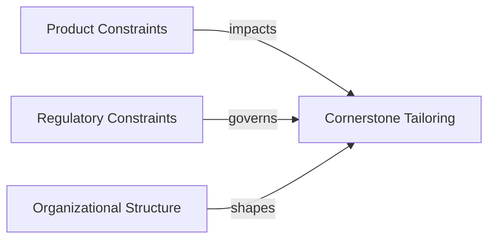

### Constraints in Context: Product, Regulatory, and Organizational Dimensions

In modern multi-domain engineering, constraints serve not as mere obstacles but as the defining parameters within which robust products, compliant processes, and sustainable organizations are built. The Cornerstone framework is explicitly structured to address these constraining forces, recognizing that effective tailoring of governance, process rigor, and technical discipline depends fundamentally on the detailed understanding of product-, regulatory-, and organizational-layer realities. These contextual forces inform not just the scope of artefact management, simulation rigor, and documentation, but also the very cadence and adaptivity of the overall development lifecycle.

#### Product Constraints: Complexity, Criticality, and Platform Realities

Product constraints originate from the system under development: its scale, complexity, and the interactions among its constituent domains—software, firmware, hardware, and mechanics. A core parameter influencing the level of governance is system criticality, which is closely linked to safety, reliability, and business impact. For example, life-critical devices in medical or automotive sectors naturally demand more exhaustive traceability matrices, formal simulation artefacts, and segregated build pipelines, while less critical commercial devices can accept more iterative validation and less complete documentation during early development.

The technical architecture itself imposes further constraints. Embedded devices, for instance, often feature limited memory footprints and constrained interfaces compared to cloud-deployed solutions, making simulation and emulation artefacts both more challenging to construct and more essential for validation. Multi-tenant or high-availability platforms introduce issues such as state consistency, upgrade resilience, and distributed artefact management, each requiring bespoke governance controls. Architectural patterns—modularization, clear abstraction boundaries, and interface formalization—become integral not only to product quality but also to the feasibility of artefact-centric, hybrid governance that Cornerstone prescribes.

Some constraints are logistical and stem from realities such as supply chain lead times, hardware bring-up cycles, and test infrastructure availability. For example, limitations in hardware availability may necessitate a heavier reliance on digital twins, virtual test benches, or fault injection within a simulation environment. Each constraining force ultimately shapes the artefact lifecycle and validation regimes that Cornerstone employs.

#### Regulatory Constraints: Compliance, Standards, and Evidence

Perhaps the most rigid and prescriptive set of constraints derives from the regulatory environment surrounding a product. Regulatory obligations, often codified in formal standards such as ISO 26262 for automotive, IEC 62304 for medical software, or DO-178C for avionics, dictate not only the artefacts to be produced, but the manner in which their lifecycle is governed: who can author, review, and approve; how traceability and segregation of duties is enforced; and the mechanisms by which audits and evidence are assembled.

Cornerstone accommodates these constraints through parameterized governance controls, which can be dialed up or down according to regulatory exposure. For highly regulated products, the framework demands immutable, versioned documentation, multi-stage review workflows, and policy-as-code enforcement for artefact integrity. In contrast, minimally regulated consumer products may admit more lightweight review protocols so long as quality and functional targets are met. A defining feature of Cornerstone is that escalation or relaxation of such controls is itself versioned, auditable, and traceable to explicit policy updates, enabling clear, justifiable adaptation to changing regulatory interpretations or compliance landscapes.

It is essential to recognize that regulatory requirements extend beyond documentation to include simulation credibility, formal requirements coverage, and tooling qualification. This breadth mandates tight integration between artefact repositories, CI/CD toolchains, and compliance-oriented reporting. Automated trace matrix generation, cryptographically signed releases, and continuous compliance monitoring are no longer optional but required features in high-assurance contexts.

Where direct diagrammatic representation of the interplay between product, regulatory, and organizational domains adds clarity, a high-level Mermaid diagram illustrates these relationships:

#### Organizational Structure: Teams, Domains, and Authority

The nature of the organization—its scale, hierarchical structure, and distribution of authority—plays a determining role in how product and regulatory constraints are interpreted and applied. In small, co-located teams, communication overhead is lower, and tacit knowledge flows more freely. This permits a leaner instantiation of the Cornerstone framework: reviews may be more synchronous; artefact completeness requirements are relaxed; and pipeline integration is often simplified.

By contrast, large matrixed organizations distributing work across geographical, functional, or even contractual boundaries, require formalized interfaces, explicit traceability, and segregation of review and approval responsibilities. Dependencies across hardware, firmware, software, and mechanical teams introduce coordination latency, necessitating robust linking of artefacts and automatable evidence of sign-offs and hand-overs. Furthermore, multi-product or platform organizations must contend with version branching, backward compatibility, and compatibility matrices across a family of artefacts.

The structure also determines who defines, enforces, and adapts the governance knobs exposed by Cornerstone. In small teams, policy ownership resides with the team itself, while in highly regulated or safety-critical settings, organization-level process authorities or functional safety officers may control policy evolution, sign-off rights, and escalation pathways. The framework accommodates both centralized and federated governance models, provided that artefact-centric controls remain enforceable and auditable.

#### Practical Synthesis within Cornerstone’s Spectrum

The interplay of product, regulatory, and organizational constraints yields a spectrum of possible Cornerstone instantiations, each calibrated to a unique set of realities. For a minimally regulated, low-complexity consumer device managed by a startup team, governance parameters may favor agility: limited artefact review, flexible simulation, and deferred documentation are traded off against faster learning and iteration. For a complex, safety-critical automotive platform in a multinational enterprise, every artefact is formally versioned, peer reviewed across domains, and mapped in exhaustive trace matrices per ISO standard requirements.

The essential task, therefore, is not the absolute elimination of constraints but their principled negotiation: tailoring artefact and governance controls to achieve transparency, traceability, and flow proportional to the risks and obligations at hand. Real-world engineering is seldom an idealized workflow—a reality embraced by Cornerstone’s artefact-centric design, enabling sustainable product delivery within the inevitable boundaries imposed by system, statute, and structure.