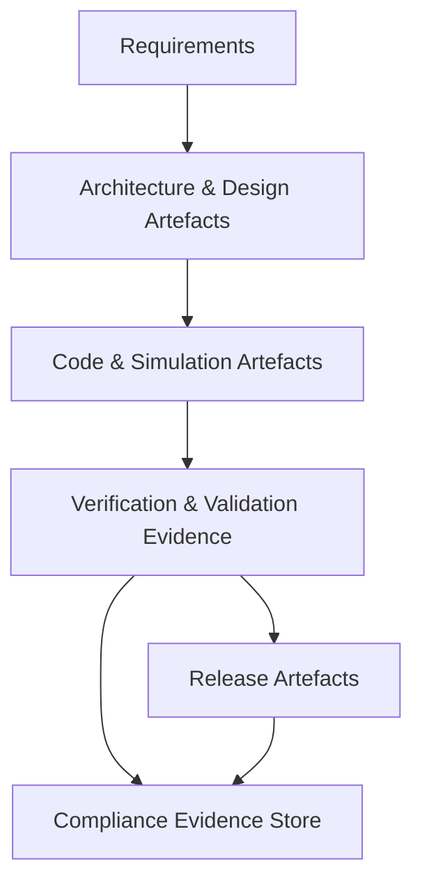

### Structural Alignment and the Practical Realities of Cornerstone Adaptation

The process of adopting the Cornerstone framework within an engineering organization is fundamentally an act of structural alignment: the governance principles, artefact lifecycle models, and delivery mechanisms embedded in Cornerstone must harmonize with the organization's prevailing realities—whether these are dictated by team scale, development maturity, regulatory severity, or system complexity. Achieving this alignment is not merely a matter of procedural compliance or tooling integration. Rather, it demands a considered orchestration of responsibilities, interfaces, and artefact controls that respects the constraints and operational tempo of the context. This section analyzes the mechanics and consequences of such alignment with attention to engineering rigor, cross-disciplinary collaboration, and the inevitable trade-offs that shape the deployment of hybrid delivery frameworks across a spectrum of organizational archetypes.

#### Alignment with Organizational Scale and Structure

The most immediate determinant of governance architecture is the structure of the engineering organization itself. In a small co-located team, direct communication and shared context enable synchronous, opportunistic governance: technical leads can arbitrate trade-offs in real time, and the lifecycle of artefacts can be tracked through lightweight yet effective social contracts. Here, the friction introduced by rigid process controls is unwarranted, and may even be counterproductive, as it can impede the autonomy and rapid feedback cycles that are the team's strength. In this context, Cornerstone is best instantiated in its Lightweight variant, where pipeline automation, artefact versioning, and minimal review policies optimize for speed without eroding the essential traceability required for future scaling or compliance.

Contrast this with a matrixed or distributed engineering environment, where teams may span time zones, domains, and legal jurisdictions. Interfaces are necessarily explicit, and organizational resilience depends on the formalization of responsibility, traceability, and escalation. Artefact flows demand robust lifecycle enforcement, and pipeline automation is no longer a convenience but a necessity for synchronized integration. Here, the Balanced or Heavyweight variants of Cornerstone become essential: the architecture must support deep artefact segregation, artifact-centric CI/CD pipelines, multi-layered review mechanisms, and immutable trace evidence aligned with the organization’s compliance envelope. Crucially, governance itself becomes federated—the framework must accommodate both top-down controls (e.g., via process authorities or compliance officers) and distributed team autonomy, demanding greater sophistication in the parameterization of Governance-as-Code controls.

This divergence of needs underscores the necessity for Cornerstone to treat organizational structure as a first-class parameter. The alignment process is not monolithic; it requires introspection and quantification of communication patterns, authority boundaries, and functional silos, translating these into governance architecture. This principle—the recursive adaptation of process rigor and traceability to the structure of human collaboration—marks a significant departure from legacy, monomorphic frameworks, whose rigidity often proved at odds with the realities of complex organizations.

#### Navigating Product and System Complexity

System complexity—encompassing architectural heterogeneity, domain coupling, and risk profile—is a potent driver of governance requirements. In simple, decoupled product domains (e.g., low-complexity IoT sensors or standalone applications), the correlation between artefacts, requirements, and test evidence is easily managed. Simulation and emulation may be modest, and the depth of cross-domain traceability can be moderated without significant risk to quality or compliance. Under these circumstances, a minimalist governance instantiation is functionally sufficient, streamlining delivery and reducing overhead.

As system risk and criticality escalate—consider, for example, a medical device with embedded firmware, cloud connectivity, and sophisticated user interfaces—the need for comprehensive artefact traceability, reproducible simulation, and well-founded validation increases sharply. Artefacts extend well beyond code and documentation to incorporate simulation models (finite element analysis, SPICE netlists, or digital twins), hardware abstraction targets, and regulatory evidence. The lifecycle of such artefacts must be tracked from upstream requirements to downstream verification and validation, each step auditable and governed by policy. Ambiguity at interface boundaries or artefact handoff points constitutes a material risk, with potential real-world implications for product safety, compliance exposure, and operational sustainability. Here, the efficacy of Cornerstone's artefact-centric paradigm becomes most apparent: the centralization of governance at the artefact level enables granular calibration of controls, ensuring that rigor is applied proportionally to complexity, criticality, and value.

From an engineering standpoint, this scaling of governance necessitates not only architectural modularity, but also disciplined abstraction. Artefact interdependencies—spanning mechanical, electrical, and software domains—create a lattice of trace and impact, which must be mapped, versioned, and subjected to change impact analysis. The orchestration of this lattice demands robust toolchain interoperability: simulation artefacts must be version-controllable and composable, bridging domain-specific tools (e.g., Altium, MATLAB, ANSYS) into a unified documentation and pipeline architecture. Failure to align toolchains and documentation practices exposes failure modes at integration boundaries, increasing the risk of defect leakage or compliance breach.

The following Mermaid diagram illustrates a canonical artefact flow and lifecycle alignment as complexity increases, further emphasizing the stratification of governance requirements:

This linear flow masks the often-iterative, recursive nature of product lifecycle, but highlights the evolutionary overlay of artefact synchronization and governance at each escalation of system complexity.

#### Regulatory Alignment and Traceable Compliance

No discussion of structural alignment is complete without addressing regulatory context. In regulated domains—medical, automotive, aerospace—the adoption of the Heavyweight variant is not optional, but required. Each artefact must satisfy not only technical sufficiency but also regulatory documentary completeness. Standards such as ISO 26262, IEC 62304, and DO-178C prescribe precise documentation, authorship, and review obligations, as well as the requisite level of validation and segregation of deliverables. The artefact lifecycle is prolonged and partitioned, with immutable, cryptographically signed deliverables serving as compliance evidence.

Critically, simulation tools, emulators, and CI/CD infrastructure themselves become in-scope for qualification and audit. This interdependence exposes a further alignment challenge: toolchain governance is now a function of policy, and changes to tool qualification or simulation fidelity must be versioned, reviewed, and included in compliance evidence. Any deviation—be it in assumptions embedded within simulation models, or upgrades to the pipeline automation—risks invalidating previously generated evidence and requires explicit regulatory signoff.

The governance architecture must therefore support retroactive traceability: not only mapping direct artefact lineage, but also linking successive versions of policies, tools, and base infrastructure that underpin compliance. Cornerstone achieves this by enforcing policy-as-code and infrastructure-as-code principles, ensuring every environmental and procedural change is versioned, traceable, and auditable. For engineering teams, this translates into deep integration of documentation generation, simulation qualification, and digital signing within delivery pipelines—a reality that can strain under-designed toolchains or ill-prepared organizational structures.

#### Artefact-Centric Workflows: Practical Realities

Translating Cornerstone’s principled artefact-centricity into operational cadence demands practical mechanisms that accommodate the multitude of trade-offs inherent to real-world engineering. In Lightweight deployments, artefacts—typically source-controlled text and minimal documentation—move rapidly through short, automated pipelines, with shallow but sufficient review rituals. The cost of governance overhead is consciously minimized, accelerating learning and adaptation.

Balanced and Heavyweight implementations, by contrast, must sustain the momentum of delivery while institutionalizing deep traceability and controlled release. This introduces new classes of integration point: artefact repositories must support segregation (for access control and compliance), artifact provenance tracking, and the retention of intermediate states for audit and rollback. CI/CD pipelines are no longer generic automation frameworks, but become orchestrators of policy, trace, and evidence. Error handling, pipeline resilience, and revalidation on upstream policy or dependency change become first-order engineering requirements.

In practice, this translates to an increased emphasis on text-based, version-controllable artefacts wherever possible, enabling Docs-as-Code, peer review, and decentralized change proposals. However, binary artefacts (compiled simulation models, FPGA images, reference datasets) remain essential in many domains, demanding parallel systems for reproducibility assurance and cryptographic verification of release authenticity. The practical reality is one of hybrid management, balancing traceable text artefacts with controlled binary lifecycle strategies. This further highlights the importance of governance policy parameterization—with the same fundamental framework underpinning variable artefact regimes as complexity and compliance evolve.

#### Failure Modes and Resilience Strategies

No governance model is immune to misalignment between policy intent and operational reality. Lightweight controls may yield to entropy as teams grow and interfaces multiply, resulting in incoherent artefact lineage or unintentional process circumvention. In contrast, prematurely applied Heavyweight controls may stifle delivery velocity, provoking workarounds and process avoidance. Both are pathway failure modes, visible as either organic process decay or the proliferation of “shadow engineering” outside the governed artefact lifecycle.

Resilient application of Cornerstone therefore depends upon dynamic policy calibration, rooted in ongoing self-assessment and feedback loops—a process sustained by governance as code, continuous pipeline telemetry, and retrospective analysis. The framework’s architecture must anticipate staged escalation (and de-escalation) of controls, supporting partial or full migration between Lightweight, Balanced, and Heavyweight variants as project risk, organizational maturity, or regulatory burden shift. Artefact governance policies—expressed in composable, auditable code—are foundational enablers of this resilience.

The following Mermaid diagram highlights the dynamic calibration spectrum within Cornerstone’s governance regimes:

This dynamic range is not a simple sequence, but an ongoing feedback-driven cycle, empowering engineering organizations to adapt governance with precision to changing realities.

#### Cross-domain Dynamics and Artefact Interoperability

A final axis of alignment—often underemphasized in procedural models but central to adaptive governance—is the accommodation of cross-domain dynamics. Hardware, firmware, software, and mechanical teams operate with distinct workflows, tooling conventions, and artefact norms. For Cornerstone to deliver traceable and auditable product development, artefact interoperability across domains and toolchains is mandatory. This includes aligning naming conventions, artefact schemas, review protocols, and release processes.

Real-world experience attests to the challenges of toolchain integration: some simulation artefacts or CAD models may not be natively version-controllable or easily diffable; some binary artefacts cannot be readily signed or traced through conventional Docs-as-Code pipelines. Here, structural alignment translates to a pragmatic compromise—establishing surrogate artefacts (e.g., hash digests, documentation stubs) or wrapping incompatible tools with traceability adaptors. Artefact stores and pipeline integrations must be extensible, supporting evolving toolchains as domain-specific solutions mature.

From an engineering perspective, the principal constraint is not technical feasibility, but sustainable maintainability: ad hoc solutions that enable short-term interoperability must not devolve into technical debt that increases traceability fragility. Cornerstone’s emphasis on text-based artefact governance and Policy-as-Code supports a disciplined, policy-driven layering—prioritizing scalable integration over expedient, brittle coupling.

#### Structural Tailoring: Towards Sustainable Alignment

In sum, structural alignment within the Cornerstone framework is neither a prescriptive nor a static undertaking. The real-world deployment of its hybrid governance architecture is driven by a confluence of organizational scale, system complexity, regulatory context, and domain coupling. Each instance of Cornerstone is, in effect, a negotiated balance of delivery velocity, artefact traceability, and compliance assurance—firmly underpinned by artefact-centric governance but flexibly attuned to the contingent realities of engineering practice.

Sustainable alignment is achieved by continuously reassessing and calibrating governance policies as living artefacts, integrated into the product lifecycle with discipline and transparency. This model enables engineering organizations to deliver reliable, auditable, and adaptable products—even as constraints shift—while maintaining the technical and operational integrity that complex, multi-domain development demands.

As organizations adopt Cornerstone and advance along the spectrum from lightweight to heavyweight governance regimes, it is this ongoing structural alignment—thoughtfully tailored, crisply executed, and grounded in practical engineering realities—that determines both immediate efficacy and long-term viability.