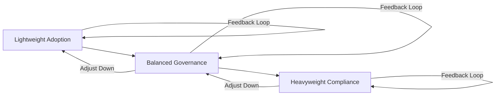

### Maturity Levels and Adoption Paths in Cornerstone

In the context of multi-disciplinary product development, the successful deployment of any governance framework is fundamentally contingent upon organisational maturity, team capability, and operational constraints. Cornerstone accommodates this diversity not only by providing three calibrated governance variants—Lightweight, Balanced, and Heavyweight—but also by articulating a spectrum of maturity levels that inform how and when to evolve governance models. Understanding these maturity gradients and the associated adoption trajectories is critical for organisations seeking resilient, context-sensitive workflows without undermining delivery velocity or compliance assurance.

#### Organisational Maturity: Foundations and Dimensions

Organisational maturity, as operationalised in Cornerstone, encapsulates more than simply process rigour. It reflects the collective capability to execute, adapt, and sustain artefact-centric governance as complexity and compliance demands evolve. Classic maturity frameworks—such as CMMI (Capability Maturity Model Integration) and ISO 15504 (SPICE)—focus on process institutionalisation, but often lack explicit provisions for artefact traceability, toolchain integration, or policy-as-code ideals central to Cornerstone. In contrast, Cornerstone’s conception of maturity is twofold: it recognises the degree to which teams internalise disciplined, auditable workflows, and the extent to which policies, artefacts, and automation are truly integrated across disciplines.

In practice, a nascent organisation may possess strong technical talent but minimal process discipline—manifesting as fragmented repositories, undocumented technical decisions, and ad hoc reviews. As such teams progress, they begin to formalise artefact provenance, introduce lightweight automation, and incrementally encode governance as policy. Organisational learning, not process prescription, is the engine that drives this evolution. Maturity, then, is measured not merely by compliance or documentation volume, but by the reliable, adaptive flow of traceable artefacts from ideation to validation.

#### Adoption Trajectories: From Lightweight to Heavyweight

Cornerstone explicitly supports staged adoption, recognising both the practical limitations of premature process escalation and the risks of protracted minimalism. Adoption is conceptualised as a trajectory—a path along which teams transition from informal, rapid practices to more disciplined, codified governance in response to growth in scale, complexity, and compliance obligation.

The Lightweight variant serves as the entry point. Operationalised in small, mission-focused teams or greenfield prototypes, it maximises learning velocity by minimising required controls. Artefact management is opportunistic, with short feedback loops and automation tuned for developer autonomy. As architectural decisions solidify and product scope expands, traceability demands naturally increase. At this inflection, teams graduate toward the Balanced variant, layering in explicit work-in-progress management, artefact traceability between requirements, simulation, and code, and the beginnings of formal code and document reviews. Pipeline orchestration matures from simple automated builds to parameterised, multi-stage CI/CD—with policy enforcement gating critical transitions.

Ultimately, when regulatory exposure or mission criticality intensifies—such as entry into IEC 62304, ISO 26262, or DO-178C governed domains—teams must transition to Heavyweight governance. Here, every artefact change is catalogued; segregation of duties, cryptographic artefact control, and immutable audit trails become non-negotiable. The progression is neither strictly linear nor irreversible; Cornerstone provides for judicious escalation and de-escalation, enabling teams to adjust governance in lockstep with actual product and risk evolution.

The following diagram represents the staged progression through Cornerstone maturity levels, with explicit feedback and adaptation at each transition:

This cyclical adaptation, rather than a one-way ratchet, ensures that governance rigor is proportional to real-world need—avoiding the pathologies of both premature bureaucracy and overextended informality.

#### Integration Points and Organisational Implications

Cornerstone’s maturity path is reflected not only in process documentation but in the architecture of organisational toolchains, decision authority, and workflow accountability. In the Lightweight phase, the engineering organisation often operates as a flat structure: individuals or small groups own end-to-end artefact lifecycles, and the cost of lightweight error is accepted as the price of speed. In the Balanced state, responsibility is distributed—a product owner formalises work item triage, and technical leads own traceability for their modules, bringing a more federated control model. By the Heavyweight stage, artefact management is institutionalised; roles and responsibilities are granularly delineated, and cross-functional review boards govern decisions with explicit segregation.

These transitions are not without friction. Tool and process change incur transitional learning costs; embedding policy-as-code and automated traceability often exposes legacy toolchain limitations. Moreover, social inertia—hesitance to relinquish informal control or to adopt formal review gates—must be actively managed. These realities underscore the necessity of change management strategies that align technical evolution with stakeholder education and clear communication of the rationale for governance escalation.

#### Engineering Trade-offs and Failure Modes

In engineering practice, the ability to modulate governance parameters across maturity levels is critical to risk management. A team operating too long in a Lightweight mode may accumulate technical and compliance debt, resulting in brittle products that are difficult to certify, maintain, or scale. Conversely, premature migration to Heavyweight controls can stifle innovation, fragment team ownership, and impede developer productivity, especially where artefact stratification or review overhead is disproportionate to risk. Cornerstone's policy-as-code foundation makes governance escalation auditable and reversible, offering “feature toggles” for process rigor that can be tuned via parameterised policies.

Nonetheless, transitions remain complex. Artefact schema inconsistencies, binary management gaps, or poor simulation test coverage may surface only when stricter traceability is imposed. Effective adoption paths therefore include policy-driven migration plans—automated data migration, pipeline refactoring, and retrospective artefact capture enable smooth handoff between maturity states. Moreover, each transition should be accompanied by outcome-focused retrospectives, measuring not only process adherence but actual delivery performance, defect rate, and operational agility.

#### Assumptions, Constraints, and Sustainable Adaptation

The Cornerstone maturity model presupposes both a baseline organisational competence—capable of maintaining source control, embracing automation, and sustaining continuous learning—and a willingness to invest in process evolution. Not all organisations or product domains will traverse the full spectrum; some may find a stable equilibrium at the Balanced level, particularly in non-regulated or moderately complex environments. The sustainability of governance escalation is firmly rooted in the doctrine of “appropriate discipline”—each policy increment must demonstrably reduce risk or increase value, justified by traceable evidence.

From an engineering lifecycle perspective, this adaptive model aligns with product-phase gates (concept, alpha, beta, release, sustainment) and external audit or market entry milestones. Feedback-driven policy adaptation—expressed through metrics embedded in CI/CD artefacts and simulation coverage reports—ensures that governance burden remains proportionate and justifiable. This architectural philosophy preserves both engineering flow and compliance posture, enabling organisations to respond pragmatically to evolving product and market realities.

#### Conclusion

In sum, Cornerstone’s maturity-centric adoption philosophy rejects static, one-size-fits-all governance. Instead, it provides a principled, feedback-driven route from informal agility to disciplined, audit-ready delivery, tailored to the architectural, organisational, and regulatory realities engineers confront. Sustainable delivery is achieved not by maximising process, but by calibrating governance—through artefact-centric, policy-driven adaptation—to the unique context and trajectory of each engineering organisation.