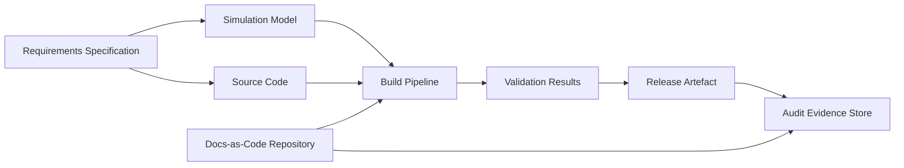

# Pathways to Adoption: Assessment, Pilot, and Incremental Integration

The transition to the Cornerstone framework is not a binary switch but a measured journey, one that must respect the unique context, constraints, and maturity of each organization. For teams seeking to operationalize artefact-centric governance, the initial phases—assessment, pilot project selection, and incremental adoption—are decisive in shaping how the framework integrates with existing processes, toolchains, and mindsets. This section details these stages, examining not only the mechanics but also the architectural, organizational, and workflow considerations that underlie a successful adoption trajectory.

---

## Contextual Assessment: Diagnosing Readiness and Setting the Baseline

Effective adoption begins with a thorough contextual assessment, in which an organization candidly evaluates its current practices, artefact flows, governance mechanisms, and maturity against the foundational requirements of Cornerstone. This diagnostic phase serves to calibrate expectations, identify initial gaps, and inform the selection of pilot domains most receptive to change.

### Organizational and Technical Baseline

A successful assessment traverses technical, organizational, and cultural dimensions. On the technical plane, teams must inventory their artefact management sophistication. This includes examining how requirements, code, simulation models, and supporting documentation are versioned, linked, and integrated within CI/CD pipelines. Organizationally, the distribution of authority—whether decisions are centralized (as in regulated environments) or more autonomous and federated (as in startup contexts)—will influence governance parameterization. The culture of continuous improvement, as evidenced by established feedback mechanisms and investment in automation, becomes a critical enabler.

A practical assessment should consider the following axes:

- **Artefact Visibility and Traceability**: To what extent are generated artefacts independently discoverable, version-controlled, and traceably linked to requirements, validation evidence, and simulation outputs?
- **Policy Maturity**: Does the organization define, automate, and enforce policies—governing controls, reviews, and segregation of duties—using code and automation?
- **Lifecycle Automation**: Are build, simulation, integration, and release pipelines automated, reliably reproducible, and capable of expressing compliance or evidentiary requirements as artefacts themselves?
- **Integration Infrastructure**: Is there existing support for cross-domain artefacts (e.g., integrating simulation models or hardware descriptors with software pipelines)?
- **Governance Footprint**: What is the prevailing level of process formality, and how closely does it align with realized risk, compliance obligations, or product complexity?
- **Change Tolerance**: How resilient is the organization to changes in workflow, artefact management expectations, or formalization of previously informal processes?

It is common for organizations to exhibit non-uniform maturity across domains. For example, a team may have strong version control and automation in software, yet lack repeatability in simulation or requirements traceability for hardware. This multidimensional maturity necessitates a targeted, domain-specific approach to adoption.

### Gap Analysis and Adaptation Targets

A rigorous assessment does not merely catalog current-state artefacts and processes, but explicitly highlights where existing friction, risk, or lost value aligns with aspects Cornerstone is designed to strengthen. For instance, a chronic inability to reproduce simulation results, or persistent defects due to weak requirements traceability, qualify as motivating pain points. These should become focal objectives for the pilot phase.

The outcome of assessment is a set of adaptation targets: concrete, organization-specific goals that range from establishing basic Docs-as-Code practices, through multi-domain artefact integration, to policy automation aligned with organizational governance needs. This deliberate targeting ensures that adoption efforts are anchored in practical value rather than abstract compliance or performative process adoption.

---

## Pilot Project Selection and Definition

Adoption at organizational scale is rarely effective if attempted wholesale, particularly where established systems or high-stakes product lines are involved. Instead, targeted pilots serve as risk-mitigated microcosms, grounding the Cornerstone framework in real engineering work while containing failure modes and allowing for rapid iteration.

### Characteristics of a Viable Pilot

The selection of an appropriate pilot project involves balancing several considerations:

- **Scope and Complexity**: The pilot should be sufficiently scoped to expose cross-domain artefact flows (e.g., including at least code, documentation, and a simulation or validation artefact), but manageable enough to complete within the constraints of available resources.
- **Representative Constraints**: Ideally, the pilot embodies common constraints of broader organizational delivery—such as regulatory requirements, typical toolchains, or cross-functional collaboration patterns.
- **Stakeholder Engagement**: The pilot should elicit active participation from engineering, quality, and leadership stakeholders, ensuring that adaptations are validated by actual users rather than imposed externally.
- **Value Visibility**: The pilot’s outputs (for instance, a reproducible hardware-software integration artefact flow or automated compliance report) should visibly demonstrate the enhanced traceability, auditability, or efficiency enabled by Cornerstone’s principles.

Misaligned pilots—such as those limited to proof-of-concept hackathons without organizational consequence, or excessively complex products with high inertia—tend to either mask structural weaknesses or entrench resistance to subsequent scale-up.

### Designing the Pilot Artefact Lifecycle

Within the pilot, the full artefact lifecycle—creation, review, modification, versioning, and linkage—must be deliberately mapped. For example, introducing controlled Docs-as-Code requires defining not only how requirements or simulation scripts are stored, but how they flow through reviews, are integrated with build pipelines, and are packaged as immutable, evidence-grade artefacts.

Mermaid diagram: Pilot artefact flow in a typical multi-domain mini-project.

This diagram illustrates the interconnectedness of requirements, simulation, code, and documentation as they converge in pipeline-driven flows, culminating in auditable, release-grade artefacts. In practice, explicit workflow definitions—including review and sign-off points—provide the architectural backbone for the pilot.

### Tooling and Integration Realities

Selection of tooling is not arbitrary; it must reflect both the technical affordances required to instantiate artefact-centric flows and the pragmatic realities of migration. Frequent integration points include:

- Transitioning requirements and test documentation to Markdown or AsciiDoc in version control.
- Integrating simulation tools—such as SPICE, MATLAB, or FEA—so their models and results are versioned as first-class citizens alongside code.
- Connecting CI/CD engines to orchestrate the entire artefact chain, with pipeline policies enforcing reviews, approval gates, lineage capture, and evidence collection.
- Implementing traceability matrices (automatically or semi-automatically generated) linking requirements, code changes, simulation results, and test evidence.

Resistance often emerges at this junction, arising from entrenched toolchains or perceived disruptions to developer productivity. Addressing this requires incrementalism: legacy tools can coexist with early Docs-as-Code practices via adapters or interim synchronization, while traceability mechanisms can be overlaid non-invasively before becoming mandatory.

---

## Incremental Adoption and Integration Patterns

Following pilot validation, the focus shifts to scaling adoption in a manner that preserves delivery cadence, sustains organizational learning, and incrementally absorbs the policy and infrastructure changes necessitated by artefact-centric governance. This stage is as much about sociotechnical engineering as it is about technical process reformation.

### Modularizing Adoption: Cross-Domain and Depth-First Strategies

Incremental integration can proceed along two principal dimensions: *cross-domain* (expanding horizontally across engineering disciplines) or *depth-first* (intensifying governance rigor within a single domain or artefact type before branching out).

A cross-domain strategy initially rolls out lightweight artefact-centric practices across multiple domains (e.g., software, electronics, mechanics), enabling organization-wide exposure and fostering shared vocabulary and process. This approach aids in driving convergence—building a common, traceable artefact culture—while minimizing the risk that domain siloes will entrench incompatible practices.

Alternatively, a depth-first approach consolidates maturity within a specific artefact set (such as code and associated verification artefacts), incrementally adding rigor—e.g., from basic version control, through policy-driven reviews, to formal trace matrix automation. This approach ensures that high-impact improvements are fully internalized within one area before lessons and tooling are extended elsewhere.

In practice, most organizations blend these patterns, guided by the location of the most critical value or risk, as surfaced in the initial assessment. This modular adoption scaffolds learning, enables phased investment, and reduces the shock of wide-ranging process transformation.

### Governance Escalation and Policy-as-Code Realization

Cornerstone’s parameterized, context-driven governance model is realized by encoding control policies as versioned, auditable artefacts—policy-as-code—that can be incrementally tightened or loosened in response to feedback and scaling demands. In incremental adoption, this mechanism is essential for aligning process change with real-world risk and organizational readiness.

For example, an initial phase may require only automated traceability checks for code and documentation, with simulation artefact integration remaining manual. As maturity and comfort increase, policies can be adjusted to enforce stricter approval gates, cross-domain trace validation, or cryptographic artefact provenance.

This flexibility is particularly vital for organizations subject to changing compliance or quality standards, as it allows governance escalation (or de-escalation) to be conducted with auditability and minimal process disruption.

### Integration with Existing Flows and Legacy Artefacts

Practically, Cornerstone adoption rarely occurs on a greenfield. Existing artefact repositories, software and simulation toolchains, and partially automated processes must be integrated—or at least not undermined—during the transition. Bridging strategies include:

- **Artefact Wrapping:** Encapsulating legacy artefacts and datasets within new traceability or Docs-as-Code containers.
- **Automation Gateways:** Creating adapters or orchestrations to synchronize artefact generation from legacy toolchains with new CI/CD pipelines or audit stores.
- **Migration Staging:** Running parallel flows—legacy and Cornerstone—until confidence and coverage justify consolidation.

Consolidating existing artefacts and piecemeal, tool-specific compliance evidence into unified, audit-ready artefact stores is a significant but crucial step. The experience gained during the pilot generally surfaces practical patterns for artefact registration, migration, and versioning that can be codified as policy and adopted organization-wide.

### Measuring Success and Realigning

The transition to Cornerstone places heavy emphasis on continuous measurement and adaptation. Success is not defined solely by process adoption, but by measurable improvements in artefact visibility, defect escape rate, flow efficiency, and the overhead of compliance or traceability activities. These metrics, often generated alongside artefact flows within CI/CD pipelines, provide essential feedback for tuning governance rigor and for reinforcing adoption by evidencing realized benefits.

---

## Organizational and Architectural Considerations

The architectural implications of adopting Cornerstone, even incrementally, are non-trivial. Artefact-centric governance mandates architectural investment in uniform artefact and evidence stores, secure traceability mechanisms, and CI/CD extensibility. For organizations with mature DevOps practices, these may represent evolutionary, rather than revolutionary, steps. However, for teams with fragmented or loosely integrated toolchains, early effort is required to establish a harmonized artefact and automation backbone.

Organizationally, Cornerstone adoption can challenge established norms, prompting shifts in decision authority (e.g., codifying policy escalation via version control), expanding the definition of “delivery done” to encompass not only working products but also verifiable evidence artefacts, and demanding tighter collaboration across disciplinary boundaries. The degree of change—and resistance—scales with organization size and the historical siloing of engineering domains.

Buy-in at both technical and leadership levels is critical; the governance escalation mechanisms built into Cornerstone provide a negotiating ground between those seeking agility and those charged with delivering compliance or risk management. By making governance explicit, parameterized, and evidence-driven, Cornerstone turns what is often an implicit power struggle into a transparent, auditable process of policy calibration.

---

## Failure Patterns and Mitigation

Several recurrent failure patterns can threaten smooth adoption. Too narrow a pilot scope can result in “invisible value”, undermining buy-in for broader change. Conversely, attempting to retrofit the heaviest governance onto nascent or informal domains typically triggers resistance, process fatigue, and parallel shadow systems. Other pitfalls include attempting to automate policy enforcement in the absence of baseline artefact hygiene, under-investing in architectural integration, or conflating compliance evidence with delivery outcomes.

The most effective antidotes are aligning scope and ambition to current organizational capability, staging governance escalation via policy-as-code, and foregrounding artefact flows that are immediately valuable to stakeholders. Crucially, organizations must factor in continuous learning: feedback from early integrations should propagate rapidly into policy and tooling adjustments, rather than being codified prematurely as rigid process.

---

## Conclusion: Sustained, Context-Driven Transformation

Adopting the Cornerstone framework is a journey of iterative selection, diagnosis, and adaptation—one that must reflect both the technical and organizational realities of the adopting team. By rooting assessment in actual artefact flows and piloting within a bounded, representative scope, organizations minimize risk and maximize learning. Incremental, modular expansion—guided by policy-as-code and evidence-driven feedback—ensures that adoption remains aligned with evolving product, regulatory, and operational demands.

The net result is neither a “big bang” transformation nor piecemeal, disconnected improvement, but a context-calibrated, artefact-centric evolution of engineering practice. Teams equipped to manage this progression are well positioned to realize sustainable, auditable, and resilient delivery—core tenets of the Cornerstone philosophy.