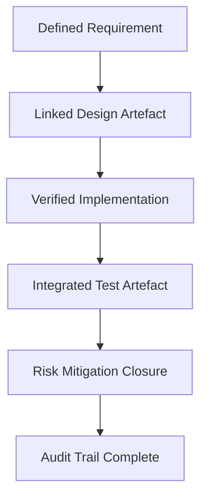

### Outcome-Based Metrics and the Pitfall of Vanity Metrics

#### Introduction: From Output to Outcome

In engineering organizations, the measurement of progress and value is persistent and unavoidable; it shapes how teams prioritize, reflect, and improve. However, the choice of what is measured—and how—is not neutral. In traditional frameworks, especially those rooted in manufacturing heritage or transactional project management, the focus tends to converge on *output metrics*: quantifiable counts of things built, delivered, or processed. Output metrics—such as lines of code written, number of features shipped, test cases executed, or user stories closed—are intuitively appealing for their concreteness and ease of aggregation.

Yet, in complex, integrated product development—where software, firmware, hardware, and mechanical engineering meet—output metrics often provide a dangerously incomplete or even misleading picture. They may become divorced from the actual impact created for users, the risk mitigated for the organization, or the learning achieved through iteration. Most critically, output metrics can incentivize peripheral work and ceremonial “progress,” fostering a culture where visible activity is mistaken for meaningful delivery.

Recognition of this disconnect underpins the shift to *outcome-based metrics* in the Cornerstone framework. Outcome metrics seek not to tally surface-level achievements, but to anchor measurement in the proximate results that matter for product fitness, business impact, user satisfaction, compliance robustness, and sustainable engineering flow. This section explores the distinction between output and outcome metrics, the traps of vanity metrics, and the engineering realities of rigorous, outcome-driven measurement within a hybrid delivery paradigm.

#### The Anatomy and Limitations of Output Metrics

Output metrics, while attractive for their apparent objectivity, are fundamentally volumetric: they measure the frequency and velocity of discrete engineering activities or artefact changes. Examples include sprint velocity in software, the number of hardware prototypes completed, story points delivered, or defects found per test cycle. These metrics often underpin performance reporting in legacy organizations and underpin the status dashboards of many project management tools.

The limitations of output metrics become evident when examined critically. For one, raw counts rarely capture the complexity, risk, or value differential between tasks. Closing ten trivial software tickets or producing five redundant hardware samples will inflate output numbers without improving the actual solution or advancing toward project goals. This mechanistic focus on throughput can distort team priorities—pushing for “more” at the expense of “better.”

Furthermore, output metrics are prone to manipulation, even unintentionally. If story points completed per sprint are celebrated in isolation, teams may split tasks arbitrarily or inflate story sizing, optimizing for appearance rather than substance. Likewise, a focus on “commits merged” can incentivize small, inconsequential changes or discourage necessary refactoring, as these may be less visible in superficial tallies.

In multidisciplinary product development, this problem is magnified by the heterogeneity of artefact types, toolchains, and feedback timescales. Output metrics in firmware, for instance, may not correlate with meaningful progress in hardware enablement, regulatory clearance, or integration readiness. The metric’s surface uniformity becomes actively harmful when it obscures domain-appropriate pacing, risk reduction, or indispensable knowledge work.

#### Outcome Metrics: Anchoring Measurement in Value

Outcome metrics, by contrast, begin with the end in mind. They attempt to quantify the change brought about by engineering effort—whether it is realized as user-facing capability, measurable improvement to a critical function, de-risking of a compliance item, or stepwise achievement in technical feasibility. The emphasis is not on what is produced, but on the difference it makes to the product, the organization, and the ultimate stakeholders.

Outcome-based measurement often demands more sophisticated instrumentation and intentional measurement design. Instead of counting features released, an outcome metric might capture the percentage of target users successfully adopting a new capability within a defined window, or the reduction in latent safety risk evidenced by closed verification gaps. In a hardware context, the metric may relate to quantified improvement in power efficiency, production yield, or reliability demonstrated in field returns. On the engineering process side, outcome metrics might address the lead time from requirement definition to verified integration across domains, or the fidelity of traceability from architectural decision to deployed solution.

A hallmark of robust outcome metrics is their relationship to organizational and product objectives. Effective outcome metrics are meaningfully aligned to Key Results (as in OKR frameworks), customer-centric Goals, or risk mitigations that have quantifiable acceptance criteria. This alignment ensures measurement remains a servant of value, not an end in itself.

#### The Nature and Consequences of Vanity Metrics

Inside this landscape emerges the particular hazard of *vanity metrics*. Vanity metrics are numbers that look impressive in isolation—often trending upward, easily visualized, and suitable for executive presentation—but fail to convey substantive progress or actionable insight. They are typically a subclass of output metrics, though not all output metrics are necessarily vain. Examples include total downloads (without context for activation or retention), raw git commit counts, total defect counts (without severity or escape rate), or cumulative backlog size.

Vanity metrics are characterized by their susceptibility to inflation, their inattention to value attribution, and their inability to inform critical engineering decisions. While they can impart a reassuring sensation of growth or impact, they often wish away uncomfortable realities: a chart showing ever-increasing test executions reveals nothing about test coverage quality or defect detection efficiency. Equally, emphasizing backlog burn-down graphs disguises the complexity concealed in deferred or reprioritized requirements.

The organizational consequences of vanity metrics include misaligned incentives, status theatre, and, in severe cases, technical debt accrual and declining morale. Teams may expend considerable effort gaming the numbers, or conversely, become disengaged when it is clear that what is being measured is irrelevant to their substantive work.

#### Artifact-Centric Outcome Metrics in the Cornerstone Framework

Cornerstone’s artefact-centric philosophy provides a natural foundation for constructing outcome metrics that retain auditability, facilitate traceability, and align methodologically with hybrid delivery. In practice, artefact histories are interrogated not merely for quantitative events, but for the achievement of explicit lifecycle states, requirements validation, or risk burn-down.

A practical example is the use of traceability matrices as sources of outcome data. Rather than reporting the number of requirements defined, Cornerstone-aligned teams track the proportion of requirements that are demonstrably linked (via artefact history and policy-as-code) to verified test artefacts, risk mitigations, or acceptance review outcomes. Similarly, the velocity with which cross-domain architectural decisions propagate to integrated simulation, physical build, and system verification artefacts can be surfaced as a direct measure of delivery flow and organizational learning.

The following diagram expresses this relationship in a simplified artefact-centric outcome measurement flow, using Mermaid syntax.

In this representation, measurable progression is determined not by the accumulation of artefacts or activities alone, but by the successful completion and linkages of states traversed in the delivery chain. Each transition denotes a potential outcome metric (e.g., “percentage of requirements validated by traceable test artefacts,” or “number of mitigated risks with supporting implementation evidence”).

Cornerstone’s policy-driven governance permits the programmatic definition, capture, and monitoring of such metrics. Policy-as-code rules can specify what constitutes closure for requirements, risks, or features and automate the reporting of outcome-aligned events. This reinforces not only measurement discipline, but also the quality of underlying artefact relationships.

#### Mechanisms and Trade-Offs in Practice

Engineering organizations seeking to implement outcome metrics within Cornerstone confront several practical trade-offs. Robust outcome metrics typically demand richer instrumentation of artefact lifecycles, coordinated domain modelling, and investment in tools that span software, hardware, and non-code artefact stores. This introduces overhead: the need to maintain and update linkage between requirements, code, simulations, and physical artefacts is non-trivial, especially as team scale and delivery pace increase.

Another practical reality is the question of lag: outcome realization often trails the completion of constituent engineering tasks. For example, measuring field reliability improvements requires operational data from shipped products, which may only become available after significant lead times. This challenge can be partially addressed by using leading indicators—such as the closure rate of high-risk failure modes during Phase Gate reviews—as proxies, but organizations must remain vigilant against recasting these as new forms of vanity metric.

A further constraint is the calibration of measurement granularity. Overly granular outcome metrics risk duplicating the metrics bloat associated with output focus, whereas excessively coarse-grained outcome metrics may mask important domain-specific risks or integration challenges. The art lies in establishing a *metrics taxonomy* that aligns with Cornerstone’s governance footprint: outcome measurement should scale its rigor and fidelity in step with product criticality, regulatory exposure, and organizational maturity.

#### Integration and Organizational Considerations

The adoption of outcome metrics seldom occurs in isolation. It demands integration with the wider artefact lifecycle management infrastructure—encompassing requirement management tools, CI/CD orchestrators, test management systems, and policy governance workflows. Architectural alignment is needed between artefact stores for software, hardware, and documentation, such that cross-domain traceability is not only possible but reliably auditable.

This integration, while essential, creates technical and organizational dependencies. Unified metrics require consistent artefact identifiers, shared policy vocabularies, and agreed definitions of lifecycle state across domains—each a potential point of friction in federated or siloed organizations. In legacy settings, the migration to outcome-centric metrics may expose gaps in historical data or limitations in tooling extensibility, necessitating phased roll-out and incremental harmonization.

Organizationally, the move to outcome-based measurement must be underpinned by leadership behaviors and reward systems that celebrate sustainable impact over mere activity. Peer review mechanisms, blame-free retrospectives, and transparent metrics dashboards—aligned to real product value rather than intermediary outputs—are important enablers. It is not just the adoption of outcome metrics themselves, but the scaffolding of continuous learning and improvement around them that drives enduring capability uplift.

Failure to address these realities risks metric “cargo cults,” where outcome terminology is adopted superficially but reporting habits and incentive structures remain unchanged, perpetuating the same dysfunctions under a new label.

#### Constraints, Variations, and Failure Modes

Applying outcome metrics is not a panacea, and Cornerstone recognizes that certain workflows and regimes pose particular challenges. In R&D-intensive or exploratory programs, for example, actionable outcomes may remain latent for protracted periods, and the primary artefact of value may be organizational learning or risk burn-down, rather than conventional deliverables. Here, outcome measurement may rely more heavily on well-structured learning objectives, experiment closure, or validated assumptions.

In regulated or safety-critical regimes, outcome metrics are tightly constrained by prescriptive standards (e.g., ISO 26262 for automotive, IEC 62304 for medical software, or ASME Y14.100 for mechanical drawings), which may define mandatory artefact states and traceability requirements. The Cornerstone framework accommodates these constraints by parameterizing metrics policies, ensuring compliance evidence is balanced with lean, value-aligned reporting.

Failure modes emerge if organizations regress toward measuring only what is easy to count, or invert outcome metrics into high-frequency output surrogates (“outcomes per sprint”), sacrificing fidelity for tractability. Another common pitfall is conflating partial progress (e.g., prototypes built but not validated) with true outcomes, which demands vigilance in metric definition and artefact-state modelling.

#### Practical Estimation Patterns for Outcome Metrics

Rigorous estimation of outcome metrics, particularly in hybrid delivery, demands an understanding of both engineering process maturity and artefact availability. Early in a program or when integrating new domains, organizations should expect higher uncertainty and variance in outcome attainment rates. Estimation patterns such as *lead time to validated outcome*, *risk exposure duration*, or *requirements coverage latency* become more predictive as artefact flows stabilize and metrics feedback closes the loop between intent and realization.

Cornerstone supports the incremental adoption of estimation patterns, leveraging artefact-centric visibility. For instance, teams may estimate the *probability of outcome closure per iteration* based on historical rates of requirements validated through traceable CI/CD and review events, supplementing with qualitative adjustment factors for new technical domains or risk profiles.

These patterns are inherently evolutionary: metrics models are revised as actual outcome attainment is observed, artefact traceability matures, and organizational learning accelerates. This evolutionary approach guards against the fossilization of irrelevant metrics and supports ongoing calibration of the governance footprint to organizational realities.

#### Summary: Towards Actionable, Value-Aligned Measurement

The transition from output to outcome metrics is not a matter of semantics, but a structural recalibration of what is measured, how it is measured, and—critically—why it is measured. In the Cornerstone framework, this shift aligns engineering motivation, artefact management, and policy governance around the actual creation of value—be it user benefit, risk repression, or system maturity.

By eschewing vanity metrics and resisting the seduction of easy counts, organizations ensure that their measurement systems reinforce, rather than subvert, the intent of hybrid product delivery. Artefact-centric outcome metrics, rigorously defined and adaptively calibrated, provide the basis for auditable, sustainable, and cumulative progress. The complexity of multi-disciplinary engineering mandates no less, demanding that measurement practices are as intentional and integrative as the products they seek to advance.